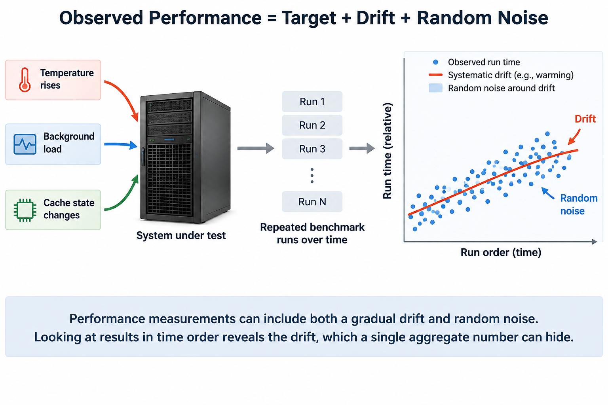
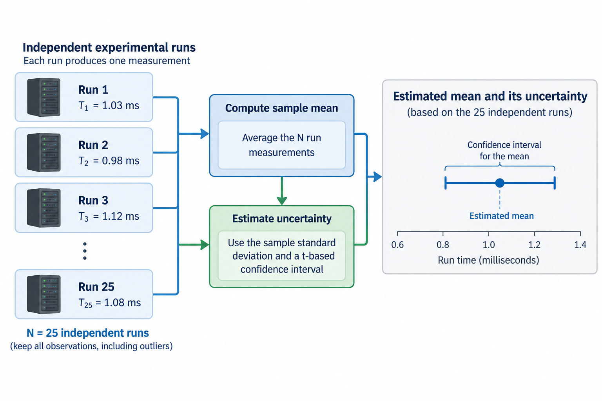
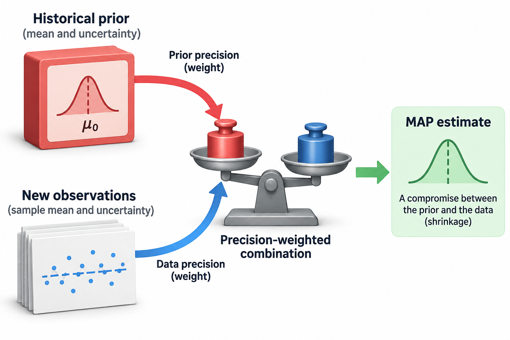

## Overview

A performance experiment compares execution of useful work under defined conditions, and it is not just a stopwatch around a function: if the candidate processes fewer tokens, skips synchronization, or starts with a different cache state, any 1 of those 3 changes can make its smaller duration answer a different question than the baseline.

Reproducibility starts by defining the measured quantity and the population of runs it represents, and statistical analysis then describes uncertainty in that quantity, but it cannot fix an incomparable workload or an invalid timing boundary. Hardware and software controls stay part of the method.

We will connect practical benchmarking to 3 statistical tools: estimators, paired comparisons, and uncertainty. Numerical examples are illustrative. The simplified probability models are tools for reasoning, not guarantees that real timing noise follows a particular distribution.

## Deep dive

### 1. Define the result the experiment is supposed to estimate

Specify 4 things: useful work, input distribution, output requirements, and timing boundaries. A latency experiment measures time for a defined operation or request population, while a throughput experiment measures completed useful work per interval, and these 2 quantities can move in different directions when batching or concurrency changes.

Write down an explicit estimand such as mean steady-state step time for a fixed sequence distribution, or p99 client-observed first-token latency at a fixed offered load. Naming the statistic and population stops a favorable number from quietly replacing the original objective.

Preserve correctness and numerical behavior. A reduced-precision candidate can be valuable, but it changes the method unless its required output contract still holds, and a different batch size can change training semantics as well as execution efficiency. Report these changes instead of calling every comparison implementation-only.

For useful throughput, define the numerator, because completed optimizer updates, accepted output objects, and generated tokens are 3 different populations, and a cancelled generation burns compute without necessarily producing accepted work. The benchmark should count the population that matters for the service or training objective.

### 2. Separate startup from steady-state execution

Early iterations can differ for 5 reasons: compilation, allocation, communicator setup, registration, and first-use caches. If startup matters, measure it explicitly, and if the question concerns a long-running steady state, warm up the same execution path and exclude both startup time and startup work consistently.

Do not pick warmup as a fixed arbitrary iteration count without checking stability, since dynamic shapes can compile new paths later and thermal behavior can drift over sustained work. Record what warmup exercised and how you chose the measurement interval.

Cold and warm measurements are both useful, but keep them separate: a candidate can improve steady-state execution while making startup much slower, a short-lived workload may prefer the opposite tradeoff, and mixing both populations into 1 unexplained average hides that decision.

Warmup also needs comparable inputs and placement, because warming a small shape and measuring a larger one can leave compilation or allocation inside the measured interval, and changing device or CPU affinity between warmup and measurement can change locality and cache behavior.

### 3. Time asynchronous work at its actual completion boundary

GPU and distributed operations can run asynchronously from the host. Timing only the function return may capture posting, not completion. Use supported timing and synchronization methods that fit the operation and execution context.

A simplified host observation can be written as

$$
T_{\mathrm{observed}}=T_{\mathrm{posting}}+T_{\mathrm{included\ completion}}+T_{\mathrm{other\ included\ work}}.
$$

The terms depend on the measurement boundary, and 2 numbers can both be valid while including different work: an event-based device duration and a synchronized host duration. Document what each means instead of treating disagreement as a tool error.

Do not add unrelated global synchronization just because it makes timing simple, since it can destroy overlap and pull in other work, while skipping the necessary boundary has the opposite problem and undercounts the operation. Check the timer against the intended dependency timeline.

For distributed execution, keep rank context and define which of 3 durations you report: local, maximum across ranks, or client-visible. Averaging local durations can hide the participant that sets group completion. The statistic must match the workload's synchronization semantics.

### 4. Use a model of drift as well as random noise

A useful conceptual timing model is

$$
T_i=\mu+d_i+\varepsilon_i,
$$

where mu is the target location parameter, d_i systematic drift or state effects, and epsilon_i residual variation. Repeating a benchmark many times does not necessarily remove d_i. Thermal changes, background load, cache state, and power policy are 4 sources of correlated patterns.

Look at observations in time order, because any of 3 shapes, a gradual trend, a periodic stall, or a switch between modes, needs different analysis than independent noise, and an aggregate standard deviation alone can hide these patterns and create false confidence.

Randomize or interleave baseline and candidate runs where practical. Keep the order and state information so pairing can be reconstructed. If all baseline runs happen during a cool quiet interval and all candidate runs happen later, a difference can reflect drift rather than the change.

Control the environment enough to answer the question, and record the variability you cannot remove. A highly isolated microbenchmark and a production-load experiment represent different populations. Neither is automatically better; the right choice follows the intended deployment outcome.

### 5. Derive the mean estimator and its uncertainty

Under an illustrative independent normal-noise model with common mean mu and variance sigma squared, the sample mean is the maximum likelihood estimator of mu:

$$
\widehat\mu_{\mathrm{MLE}}=\overline T=\frac{1}{N}\sum_iT_i.
$$

With unknown variance, a conventional mean confidence interval uses the sample standard deviation s and a Student-t critical value:

$$
\overline T\ \pm\ t_{N-1,1-\alpha/2}\,s/\sqrt N.
$$

Its meaning and reliability depend on the sampling assumptions. Thousands of correlated iterations within 1 run do not automatically give the same evidence as thousands of independent runs. Cluster observations by the actual independent experimental unit when that model fits.

For an illustrative s=0.2 milliseconds and N=25 independent observations, the estimated standard error is 0.04 milliseconds. That calculation describes mean uncertainty under the assumptions, not a prediction interval for an individual future run and not uncertainty in p99.

Keep 3 things next to the interval: sample count, run structure, and raw observations. Keep outliers with their run context; do not delete them just because they make the candidate look worse. A genuine system stall may be part of the deployment population being measured. If distributions are skewed, multimodal, or driven by outliers, pick a method that fits that population and check sensitivity. Statistics should reveal uncertainty, not hide measurement problems behind a formula.

### 6. Understand MAP shrinkage before using historical priors

Suppose the same simplified model has known noise variance sigma squared and a normal prior for mu with center mu_0 and variance tau squared. The posterior-mode estimate is

$$
\widehat\mu_{\mathrm{MAP}}=\frac{N\overline T/\sigma^2+\mu_0/\tau^2}{N/\sigma^2+1/\tau^2}.
$$

The formula weights new observations and prior information by precision: with a weak prior it approaches the sample mean, and with a strong prior and little data it stays closer to the historical center. This is a precise model of shrinkage, not a general reason to trust old benchmark results.

A prior from another hardware configuration or workload can bias the estimate toward an irrelevant population. State where the prior came from and test sensitivity. A historical baseline is useful context, but it cannot replace a controlled comparison after a real deployment change.

For an illustrative mean of 9.8 milliseconds from 25 observations, noise standard deviation 0.2 milliseconds, prior center 10 milliseconds, and prior standard deviation 0.1 milliseconds, the MAP estimate is about 9.828 milliseconds. The shift toward 10 comes from the stated prior precision. If the historical center describes a different workload, that shift is not a performance fact about the new workload. Comparing estimates under weaker and stronger priors makes this dependence visible.

Do not present a MAP point estimate as a complete uncertainty analysis. The posterior distribution and model assumptions matter. For regression decisions, keep the practical minimum effect and false-alarm policy explicit whether the analysis is frequentist or Bayesian.

### 7. Pair comparisons when the environment permits it

For paired baseline and candidate times B_i and C_i under comparable conditions, define a log-speedup observation

$$
x_i=\log(B_i/C_i),\qquad\widehat S_{\mathrm{geometric}}=\exp\left(\frac{1}{N}\sum_ix_i\right).
$$

This estimates a geometric summary of paired ratios. It is not generally identical to the ratio of arithmetic mean times. Choose the summary that answers the intended question and name it clearly.

Pairing can reduce variation shared by both observations, but it depends on comparable state. A candidate that warms caches for the following baseline can create an order effect. Alternate or randomize order where practical, and check the result for sensitivity.

For an illustrative pair of 10 and 9 milliseconds, speedup is about 1.11. Do not collapse several pairs with different background conditions without keeping their structure. A confidence interval on the paired log observations can be transformed back when its assumptions hold.

### 8. Keep tail and throughput experiments distinct

Tail latency needs enough observations from the relevant request population and a measurement method that keeps stalls. Averaging per-run p99 values does not reconstruct the combined p99. Aggregate compatible distributions or raw observations before estimating the fleet quantile.

Throughput needs a stable definition of 3 things: offered load, admission, and completion. A saturated benchmark can show maximum useful capacity, while a fixed-load experiment shows latency at a chosen operating point, and a candidate can raise capacity yet worsen latency if the test also changes admitted concurrency.

Measure queueing and termination outcomes when benchmarking a service. Rejecting more work can improve admitted-request latency while cutting accepted throughput. Count all 5 categories so the comparison stays interpretable: offered, admitted, rejected, cancelled, and completed requests.

Do not extrapolate a kernel speedup directly to a service. The unchanged components and exposed fraction limit the end-to-end benefit, and queueing can add nonlinear effects. Use the microbenchmark to explain a mechanism and the workload experiment to show its practical result.

### 9. Define a decision threshold before interpreting the result

A statistically detectable difference can be too small to matter in practice. Set a practical minimum improvement or allowed regression tied to the objective. Weigh 3 costs: uncertainty, measurement cost, and the cost of a wrong decision.

For an illustrative 1% apparent improvement with ordinary 3% run variation, the result may need more controlled evidence. A large repeatable improvement across representative shapes, on the other hand, can justify action without an elaborate campaign.

Add measurements to resolve real uncertainty; do not keep testing until a favorable result appears. Keep unsuccessful and ambiguous comparisons in the record. Selective reporting can make ordinary noise look like reliable optimization.

Check neighboring outcomes before adopting a change. A throughput improvement can raise any of 3 other costs: memory use, startup cost, or latency tails. The needed checks follow the actual change and deployment objective, not a generic exhaustive checklist.

### 10. Publish enough detail to reproduce useful work

Record 2 facts first: the exact experiment date and duration. Then record inputs or their generating distribution, model and software versions, hardware, placement, controls, timer, warmup, repetitions, correctness criteria, raw observations, and analysis method. Keep the candidate and baseline configurations explicit.

A useful report separates 3 layers: assumed models, observed measurements, and derived summaries. Readers should be able to reconstruct the numerator, denominator, and timing boundaries. That is worth more than a speedup with unexplained decimal precision.

## Conclusion

Reproducible performance engineering joins execution control to statistical reasoning, and the method has 5 steps: define comparable useful work, time it at the correct boundary, check for drift, estimate uncertainty, and verify the deployment outcome. MLE, MAP, and intervals become meaningful only after the experiment itself answers the right question.

### Sources

- [PyTorch benchmarking utilities](https://docs.pytorch.org/docs/stable/benchmark_utils.html).
- [NIST confidence limits for the mean](https://www.itl.nist.gov/div898/handbook/eda/section3/eda352.htm).
- [PyTorch CUDA execution and synchronization notes](https://docs.pytorch.org/docs/stable/notes/cuda.html).
