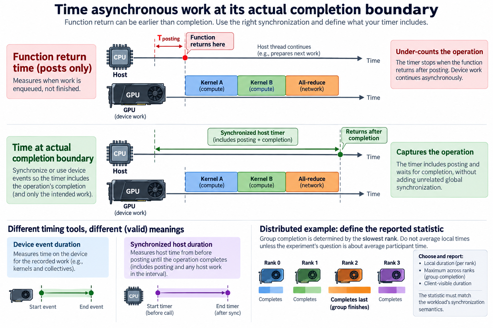

A performance experiment compares execution of useful work under defined conditions. It is not simply a stopwatch around a function. If the candidate processes fewer tokens, omits synchronization, or begins with a different cache state, its smaller duration may answer a different question from the baseline.

Reproducibility starts by defining the measured quantity and the population of runs it represents. Statistical analysis then describes uncertainty in that quantity. It cannot repair an incomparable workload or an invalid timing boundary. Hardware and software controls remain part of the method.

We will connect practical benchmarking to estimators, paired comparisons, and uncertainty. Numerical examples are illustrative. The simplified probability models are tools for reasoning, not guarantees that real timing noise follows a particular distribution.

## 1. Define the result the experiment is supposed to estimate

*Overview of the article’s core mechanism. The following sections explain the objects, relationships, equations, assumptions, and worked examples shown here.*

Specify useful work, input distribution, output requirements, and timing boundaries. A latency experiment measures time for a defined operation or request population. A throughput experiment measures completed useful work per interval. These quantities can move in different directions when batching or concurrency changes.

Write an explicit estimand such as mean steady-state step time for a fixed sequence distribution, or p99 client-observed first-token latency at a fixed offered load. Naming the statistic and population prevents a favorable number from silently replacing the original objective.

Preserve correctness and numerical behavior. A reduced-precision candidate can be valuable, but it changes the method unless its required output contract remains satisfied. A different batch size can alter training semantics as well as execution efficiency. Report these changes instead of labeling every comparison implementation-only.

For useful throughput, define the numerator. Completed optimizer updates, accepted output objects, and generated tokens are different populations. A cancelled generation consumes compute without necessarily producing accepted work. The benchmark should count the population relevant to the service or training objective.

## 2. Separate startup from steady-state execution

Compilation, allocation, communicator setup, registration, and first-use caches can make early iterations different. If startup matters, measure it explicitly. If the question concerns a long-running steady state, warm up the same execution path and exclude both startup time and startup work consistently.

Do not choose warmup solely by a fixed arbitrary iteration count without observing stability. Dynamic shapes can compile new paths later, and thermal behavior can drift over sustained work. Record what warmup exercised and how the measurement interval was selected.

Cold and warm measurements are both useful but should remain separate. A candidate can improve steady-state execution while making startup much slower. A short-lived workload may prefer the opposite tradeoff. Combining both populations into one unexplained average hides that decision.

Warmup also needs comparable inputs and placement. Warming a small shape and measuring a larger one can leave compilation or allocation inside the measured interval. Changing device or CPU affinity between warmup and measurement can change locality and cache behavior.

## 3. Time asynchronous work at its actual completion boundary

GPU and distributed operations can be asynchronous with respect to the host. Measuring only function-return time may capture posting rather than completion. Use supported timing and synchronization methods appropriate to the operation and execution context.

A simplified host observation can be written as

$$
T_{\mathrm{observed}}=T_{\mathrm{posting}}+T_{\mathrm{included\ completion}}+T_{\mathrm{other\ included\ work}}.
$$

The terms depend on the measurement boundary. An event-based device duration and a synchronized host duration can both be valid while including different work. Document their meaning rather than treating disagreement as automatically a tool error.

Avoid adding unrelated global synchronization merely because it makes timing simple. It can destroy overlap and include other work. Conversely, omitting the necessary boundary can undercount the operation. Verify the timer against the intended dependency timeline.

For distributed execution, preserve rank context and define whether the reported duration is local, maximum across ranks, or client-visible. Averaging local durations can hide the participant that determines group completion. The statistic must match the workload's synchronization semantics.

## 4. Use a model of drift as well as random noise

A useful conceptual timing model is

$$
T_i=\mu+d_i+\varepsilon_i,
$$

where mu is the target location parameter, d_i systematic drift or state effects, and epsilon_i residual variation. Repeating a benchmark many times does not necessarily eliminate d_i. Thermal changes, background load, cache state, and power policy can create correlated patterns.

Inspect observations in time order. A gradual trend, periodic stall, or transition between modes calls for different analysis from independent noise. An aggregate standard deviation alone can conceal these patterns and produce unjustified confidence.

Randomize or interleave baseline and candidate runs where practical. Preserve the order and state information so pairing can be reconstructed. If all baseline measurements occur during a cool quiet interval and all candidate measurements occur later, a difference can reflect drift rather than the change.

Control the environment sufficiently to answer the question, while recording unavoidable variability. A highly isolated microbenchmark and a production-load experiment represent different populations. Neither is automatically superior; the correct choice follows the intended deployment outcome.

## 5. Derive the mean estimator and its uncertainty

Under an illustrative independent normal-noise model with common mean mu and variance sigma squared, the sample mean is the maximum likelihood estimator of mu:

$$
\widehat\mu_{\mathrm{MLE}}=\overline T=\frac{1}{N}\sum_iT_i.
$$

With unknown variance, a conventional mean confidence interval uses the sample standard deviation s and a Student-t critical value:

$$
\overline T\ \pm\ t_{N-1,1-\alpha/2}\,s/\sqrt N.
$$

Its interpretation and reliability depend on the sampling assumptions. Thousands of correlated iterations within one run do not automatically provide the same evidence as thousands of independent runs. Cluster observations by the actual independent experimental unit when that is the appropriate model.

For an illustrative s=0.2 milliseconds and N=25 independent observations, the estimated standard error is 0.04 milliseconds. That calculation describes mean uncertainty under the assumptions, not a prediction interval for an individual future run and not uncertainty in p99.

Keep sample count, run structure, and raw observations alongside the interval. Preserve outliers with their run context rather than deleting them solely because they make the candidate look worse. A genuine system stall may be part of the deployment population being measured. If distributions are skewed, multimodal, or affected by outliers, consider a method appropriate to that population and inspect sensitivity. Statistical machinery should reveal uncertainty rather than hide measurement problems behind a formula.

## 6. Understand MAP shrinkage before using historical priors

Suppose the same simplified model has known noise variance sigma squared and a normal prior for mu with center mu_0 and variance tau squared. The posterior-mode estimate is

$$
\widehat\mu_{\mathrm{MAP}}=\frac{N\overline T/\sigma^2+\mu_0/\tau^2}{N/\sigma^2+1/\tau^2}.
$$

The formula weights new observations and prior information by precision. With a weak prior, it approaches the sample mean. With a strong prior and little data, it remains closer to the historical center. This is a precise model of shrinkage, not a general justification for trusting old benchmark results.

A prior from another hardware configuration or workload can bias the estimate toward an irrelevant population. State the prior's origin and test sensitivity. A historical baseline is useful context, but it cannot replace a controlled comparison after a meaningful deployment change.

For an illustrative mean of 9.8 milliseconds from 25 observations, noise standard deviation 0.2 milliseconds, prior center 10 milliseconds, and prior standard deviation 0.1 milliseconds, the MAP estimate is about 9.828 milliseconds. The shift toward 10 comes from the stated prior precision. If the historical center describes a different workload, that shift is not a performance fact about the new workload. Comparing estimates under weaker and stronger priors makes this dependence visible.

Do not present a MAP point estimate as if it were a complete uncertainty analysis. The posterior distribution and model assumptions matter. For regression decisions, the practical minimum effect and false-alarm policy should remain explicit regardless of whether the analysis is frequentist or Bayesian.

## 7. Pair comparisons when the environment permits it

For paired baseline and candidate times B_i and C_i under comparable conditions, define a log-speedup observation

$$
x_i=\log(B_i/C_i),\qquad\widehat S_{\mathrm{geometric}}=\exp\left(\frac{1}{N}\sum_ix_i\right).
$$

This estimates a geometric summary of paired ratios. It is not generally identical to the ratio of arithmetic mean times. Choose the summary that answers the intended question and name it clearly.

Pairing can reduce variation shared by both observations, but it depends on comparable state. A candidate that warms caches for the following baseline can create an order effect. Alternate or randomize order where practical and inspect the result for sensitivity.

For an illustrative pair of 10 and 9 milliseconds, speedup is about 1.11. Several pairs with different background conditions should not be collapsed without retaining their structure. A confidence interval on the paired log observations can be transformed back when its assumptions are appropriate.

## 8. Keep tail and throughput experiments distinct

Tail latency needs enough observations from the relevant request population and a measurement method that retains stalls. Averaging per-run p99 values does not reconstruct the combined p99. Aggregate compatible distributions or raw observations before estimating the fleet quantile.

Throughput requires a stable definition of offered load, admission, and completion. A saturated benchmark can reveal maximum useful capacity, while a fixed-load experiment reveals latency at a chosen operating point. A candidate can increase capacity yet worsen latency if the test also changes admitted concurrency.

Measure queueing and termination outcomes when benchmarking a service. Rejecting more work can improve admitted-request latency while reducing accepted throughput. Count offered, admitted, rejected, cancelled, and completed requests so the comparison remains interpretable.

Do not extrapolate a kernel speedup directly to a service. The unchanged components and exposed fraction limit the end-to-end benefit, and queueing can introduce additional nonlinear effects. Use the microbenchmark to explain a mechanism and the workload experiment to establish its practical result.

## 9. Define a decision threshold before interpreting the result

A statistically detectable difference can be too small to matter operationally. Set a practical minimum improvement or allowable regression relevant to the objective. Consider uncertainty, measurement cost, and consequences of a false decision.

For an illustrative 1% apparent improvement with ordinary 3% run variation, the result may need more controlled evidence. Conversely, a large repeatable improvement across representative shapes can justify action without an unnecessarily elaborate campaign.

Choose additional measurements based on unresolved uncertainty rather than repeatedly testing until a favorable result appears. Preserve unsuccessful and ambiguous comparisons as part of the record. Selective reporting can make ordinary noise look like reliable optimization.

Evaluate neighboring outcomes before adoption. A throughput improvement can increase memory use, startup cost, or latency tails. The required checks should follow the actual change and deployment objective rather than a generic exhaustive checklist.

## 10. Publish enough detail to reproduce useful work

Record the exact experiment date and duration. Record inputs or their generating distribution, model and software versions, hardware, placement, controls, timer, warmup, repetitions, correctness criteria, raw observations, and analysis method. Keep the candidate and baseline configurations explicit.

A useful report separates assumed models, observed measurements, and derived summaries. Readers should be able to reconstruct the numerator, denominator, and timing boundaries. That is more valuable than a speedup with unexplained decimal precision.

Reproducible performance engineering joins execution control to statistical reasoning. Define comparable useful work, time it at the correct boundary, inspect drift, estimate uncertainty, and verify the deployment outcome. MLE, MAP, and intervals become meaningful only after the experiment itself answers the right question.

## Sources

- [PyTorch benchmarking utilities](https://docs.pytorch.org/docs/stable/benchmark_utils.html).
- [NIST confidence limits for the mean](https://www.itl.nist.gov/div898/handbook/eda/section3/eda352.htm).
- [PyTorch CUDA execution and synchronization notes](https://docs.pytorch.org/docs/stable/notes/cuda.html).
