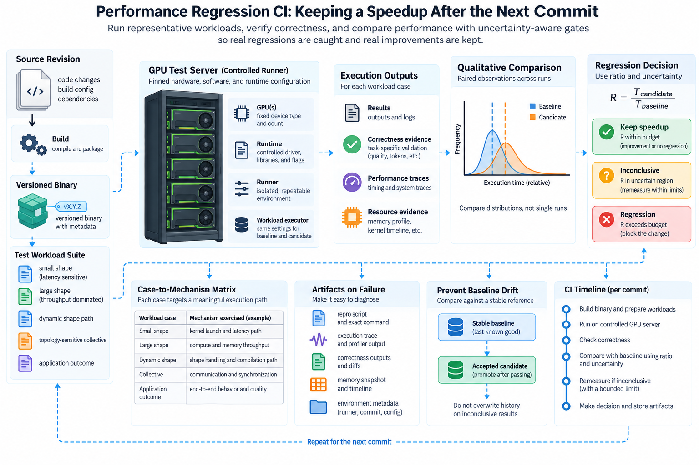
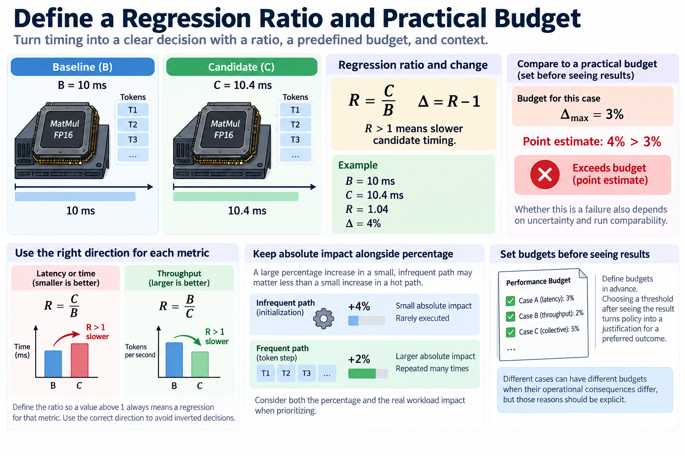
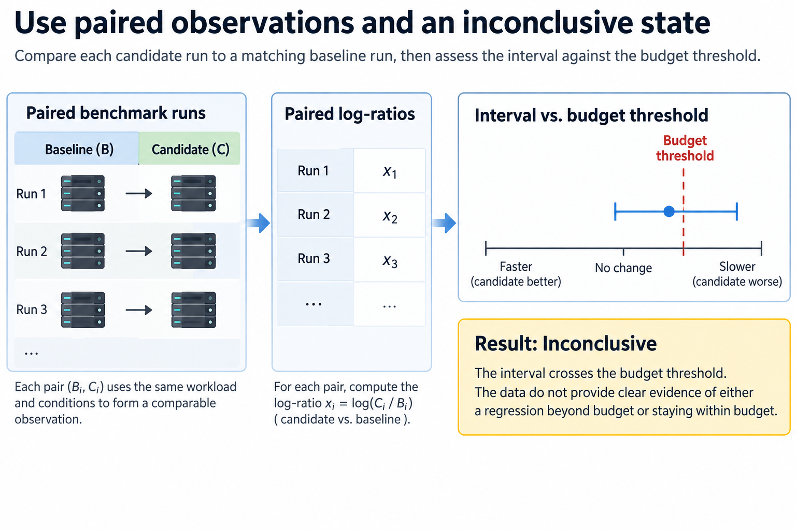
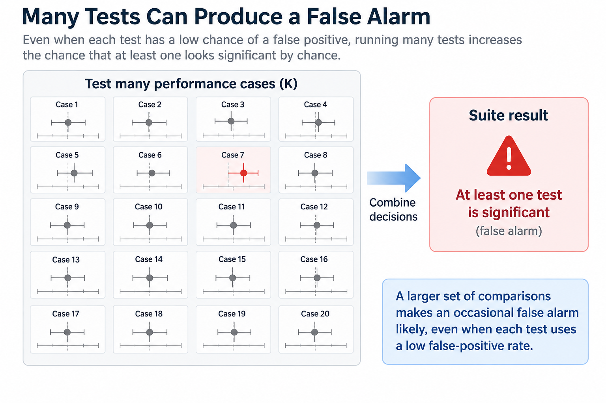
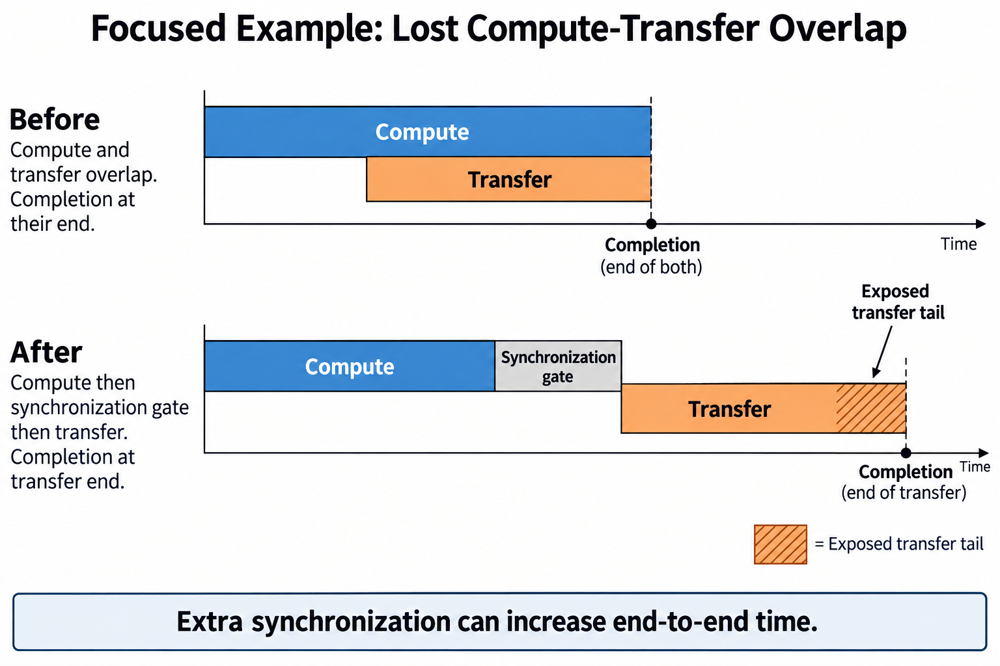

## Overview

A speedup is useful only if later changes keep it under the workload that mattered. Performance regression CI turns selected measurements into a recurring decision process. It can catch a changed kernel path, needless synchronization, compilation growth, or degraded communication before those changes become an unexplained production slowdown.

The challenge is that timing is noisy and hardware state changes. A gate that fails every harmless fluctuation gets ignored. A gate that accepts every uncertain comparison can miss real regressions. The fix starts with representative cases, controlled runners, and an explicit practical budget, then uses uncertainty to decide what the observations support.

We will derive ratio-based decisions, look at multiple comparisons and baseline drift, and design artifacts that lead from a failure to a diagnosis. Numerical examples are illustrative. The suite should follow the actual implementation and deployment risks, not mirror every line of code.

## Deep dive

### 1. Choose cases that represent meaningful execution paths

Start from known bottlenecks and important workload populations. A compact suite can include a latency-sensitive small shape, a throughput-dominated large shape, a dynamic-shape path, a topology-sensitive collective, and one useful application outcome where relevant.

Do not build cases just because they are easy to time. A benchmark that never exercises the changed code can stay green while the deployed path regresses. Record which mechanism each case is meant to expose and why that mechanism matters.

Preserve useful work and output requirements. A candidate that changes token count, precision, routing, or mask semantics needs its own correctness and quality checks. The performance gate compares valid executions of the intended workload, not arbitrary smaller durations.

Keep the suite proportional to the change. A broad expensive campaign may fit a new kernel family or hardware stack. A focused representative check can be enough for a narrow change. Extra tests should resolve real uncertainty, not duplicate the implementation.

### 2. Establish correctness before interpreting speed

Run the relevant correctness contract before ranking timing. Check output values and layouts with suitable tolerances. Include boundary conditions that exercise the mechanism: masks, uneven shapes, repeated buffer reuse, or distributed ownership where they apply.

A faster incorrect result should fail regardless of timing uncertainty. Performance analysis must not normalize away missing work or corrupted output. Keep correctness failure artifacts so the developer can reproduce the input and selected path.

For training, pair a micro-level numerical check with the update semantics the change affects. For serving, accepted output and termination behavior can matter beyond raw token generation. Use checks that fit the method; one scalar checksum does not prove every integration.

Record the baseline's correctness too. An old reference can itself have changed dependencies or unsupported behavior. The gate needs a known valid comparison, not just a historically fast executable whose meaning nobody understands anymore.

### 3. Control and identify the performance runner

Record hardware identity, driver and runtime versions, framework, compiler, communication stack, placement, and resource allocation. Keep the actual CPU and device masks. A runner label alone may not reveal a changed machine or software image.

Separate compilation and startup from steady-state timing unless the case measures them together on purpose. Warm up the same path and keep the cache policy. A candidate that starts cold and a baseline that reuses compiled state do not form a controlled comparison.

Check background load and sustained thermal behavior where they affect the case. Measuring through unknown contention can create both false failures and missed regressions. An unstable runner should report an explicit infrastructure or inconclusive outcome, not a confident code verdict.

Use supported timing and synchronization boundaries. Host posting duration can undercount asynchronous work, and needless global synchronization can destroy overlap. Keep the measurement method versioned with the case.

### 4. Define a regression ratio and practical budget

For comparable baseline time B and candidate time C, define

$$
R=C/B,\qquad\Delta=R-1.
$$

A value above 1 means the candidate is slower under this definition. The practical budget delta_max says how much regression the case can accept. A throughput metric needs its own direction and ratio definition so the gate does not invert the decision by accident.

For an illustrative B=10 milliseconds and C=10.4 milliseconds, R=1.04 and the time regression is 4%. If the practical budget is 3%, the point estimate exceeds it. Whether the evidence supports a failure still depends on uncertainty and run comparability.

Define budgets before you see a candidate. Picking a threshold after seeing the result turns policy into a justification for a preferred outcome. Different cases can have different budgets when their operational consequences differ, but state those reasons.

Keep absolute impact alongside percentage. A large percentage increase in a negligible path may matter less than a small increase in an operation that runs constantly. The application outcome stays the final context for priorities.

### 5. Use paired observations and an inconclusive state

When comparable pairing is feasible, let B_i and C_i be paired observations and define

$$
x_i=\log(C_i/B_i).
$$

Estimate a location and uncertainty interval [L,U] for the relevant paired log-ratio population with a suitable method. Under a simplified independent normal model, a mean interval can use the sample standard deviation and Student-t critical value.

For a time-regression budget delta_max, the corresponding log threshold is log(1 plus delta_max). If L exceeds that threshold, the observations support a regression beyond budget under the model. If U remains below it, they support staying within budget under the same assumptions. An interval crossing the threshold is inconclusive.

The distinction matters: failing to detect a regression is not the same as showing the candidate stays within budget. A noisy wide interval should not automatically become a confident pass.

Pairing and interval methods rely on valid experimental units. Many correlated iterations within one process are not necessarily independent runs. Keep the run structure and check order effects, drift, and outliers before trusting a narrow interval.

### 6. Bound remeasurement instead of testing until favorable

An inconclusive result can trigger a limited extra measurement under a predefined policy. The goal is to resolve uncertainty, not repeat the benchmark until noise produces a pass. Keep every attempted comparison and its run context.

Set a maximum measurement budget and a clear outcome when uncertainty remains. Depending on project policy, that can be manual investigation, infrastructure diagnosis, or a conservative gate decision. What matters is that the uncertainty stays visible.

For an illustrative interval from 1% to 5% regression with a 3% budget, more controlled independent observations may narrow the result. If the runner is drifting, adding iterations may not help. Fixing the experimental conditions beats raising the sample count blindly.

Record reversal checks where practical. Restoring the baseline and reproducing its earlier behavior supports attribution. If neither baseline nor candidate stays stable, the result does not justify blaming the code change alone.

### 7. Account for many simultaneous comparisons

A suite with many noisy cases can produce occasional false alarms even when every case's individual decision rule has a low false-positive rate. Under an illustrative independence model with per-case false-alarm probability alpha and K cases,

$$
P(\text{at least one false alarm})=1-(1-\alpha)^K.
$$

With alpha=0.05 and K=20, this probability is about 64.2%. Real cases can be correlated, so the calculation is an intuition, not a precise suite forecast. It explains why a naive collection of independent-looking significance tests gets noisy.

A policy can control the comparison family through a suitable method, practical thresholds, hierarchy, or a confirmation stage. The union bound supports using alpha divided by K as a conservative per-case allocation when that is the chosen design. No single correction fits every engineering workflow.

Keep detection sensitivity and operational cost in view. Overly conservative thresholds can hide small important regressions, and too much noise makes developers ignore the suite. Test the gate's behavior on known unchanged runs and known real regressions.

### 8. Prevent baseline updates from erasing cumulative drift

A baseline should name a known configuration and useful workload, not quietly become the latest result after every commit. Automatic replacement can normalize each small slowdown and hide a large cumulative change.

For repeated relative regressions r across K accepted changes, a simplified cumulative factor is

$$
R_{\mathrm{cumulative}}=(1+r)^K.
$$

Ten illustrative 1% increases produce about a 10.46% cumulative increase. Each may fall below a local threshold while the total becomes operationally meaningful. Keep a longer-term anchor or trend record alongside immediate comparisons.

Update baselines deliberately after a supported hardware or software transition, an intentional method change, or a reviewed new operating point. Keep the old record and explain what changed. A new baseline is a versioned decision, not a way to make a failing chart green.

If the workload changes, keep old and new populations distinct. A faster result for shorter sequences cannot replace the old long-sequence baseline without admitting that the measured work changed.

### 9. Make failure artifacts diagnostic

Store raw timing observations, case inputs or generators, output checks, software tuple, hardware identity, placement, warmup, selected paths, and the analysis result. A failed percentage alone forces developers to redo the whole investigation.

Include focused traces or profiles when they are needed to tell mechanisms apart, not for every ordinary passing run. A path-selection diagnostic can explain a kernel fallback. A timeline can show lost overlap. Match the artifact to the case's purpose.

Classify correctness failure, supported performance regression, inconclusive measurement, and runner failure separately. These outcomes have different next actions. Mixing them up produces needless code changes for infrastructure problems and hides real correctness issues behind timing noise.

A compact report can show baseline and candidate, the practical budget, interval, sample structure, observed path, and first useful diagnostic. A reader should be able to judge the conclusion without access to an operator's terminal history.

### 10. Verify that the gate detects the intended mechanism

Exercise the suite with known changes that really affect its cases: an added synchronization, a changed supported kernel path, or a controlled resource reduction where appropriate. Also run unchanged comparisons to observe false-alarm and inconclusive behavior.

Do not make the test suite mirror an implementation detail that has no user consequence. A meaningful gate connects its case to useful workload behavior and stays valid when an equally correct implementation changes internal structure.

For an illustrative synchronization regression, a timeline can show that transfers previously hidden behind computation now create an exposed tail. The gate should detect the representative application impact, and its artifact should point to the lost overlap. A separate tiny kernel case that never performs transfers would not verify that mechanism.

Maintain the cases after workload and architecture changes. A once-representative shape can become irrelevant, and a new path can escape coverage. Retire or revise cases based on the execution program instead of piling up benchmarks forever.

## Conclusion

Performance regression CI keeps useful improvements by making comparisons reproducible and decisions explicit. Correctness comes first, practical budgets define significance, uncertainty defines what the observations support, and artifacts identify the mechanism. A durable speedup is one that survives the next change under the same useful-work contract.

### Sources

- [PyTorch benchmark utilities](https://docs.pytorch.org/docs/stable/benchmark_utils.html).
- [NIST confidence limits for the mean](https://www.itl.nist.gov/div898/handbook/eda/section3/eda352.htm).
- [PyTorch profiler documentation](https://docs.pytorch.org/docs/stable/profiler.html).
