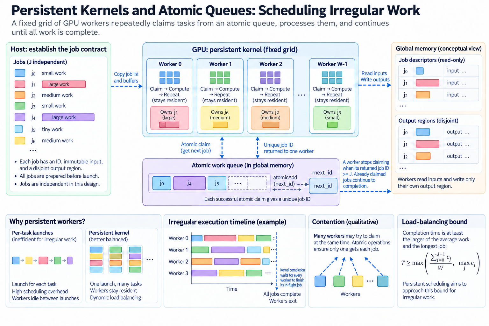
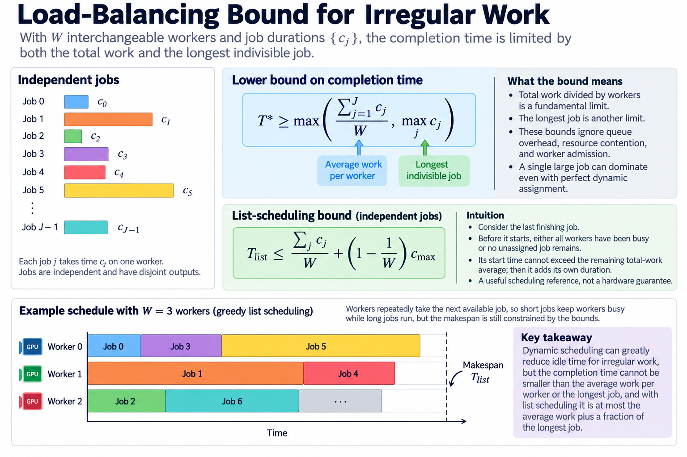
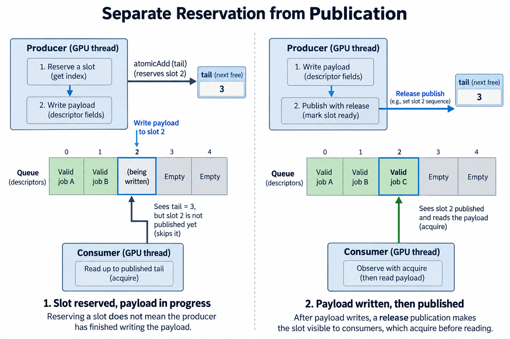
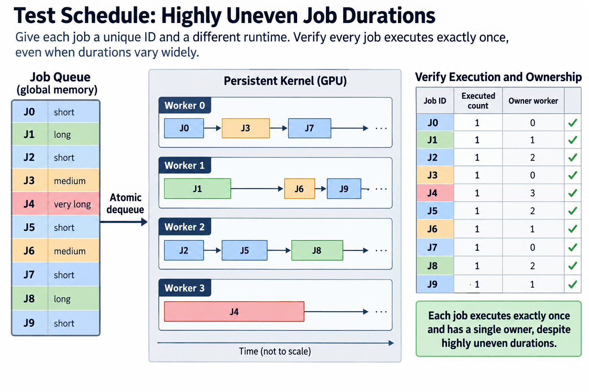
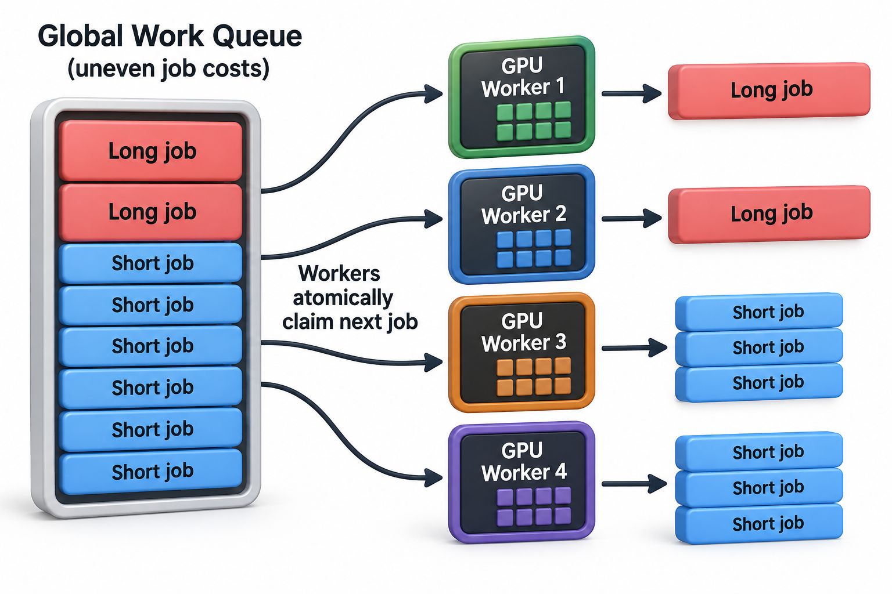

## Overview



Many GPU workloads contain jobs with unequal durations, and 3 cases show it: sparse rows have different lengths, graph vertices have different degrees, and variable-length sequences require different amounts of computation. A static assignment can then leave some workers idle while a few finish expensive jobs, so a persistent kernel instead keeps a bounded group of workers alive and lets them claim further work.

The attraction is reduced scheduling overhead and better balancing, while the responsibility is a correct runtime protocol inside the kernel: a persistent loop must allocate unique work, respect input and output ownership, avoid admission deadlocks, and decide when the entire computation is finished. An atomic counter solves only 1 part of that problem.

## Deep dive

### 1. Establish the job contract

Start with a fixed collection of J independent jobs, where each job has 3 attributes, an identifier, an immutable input description, and a disjoint output region, and independence means that a job does not wait for a result from another job in this first design. The host initializes the collection before launching workers, using the required stream ordering and buffer lifetimes.

A job can be assigned to 1 thread, 1 warp, or 1 block. This granularity determines synchronization within a worker. If a block owns a job, all threads must agree on the claimed identifier and finish the cooperative computation before that block claims another job. Letting individual threads independently fetch block-level jobs violates the ownership contract.

A workload with inter-job dependencies needs a richer protocol. Introduce it only after the independent case works. The queue's existence should not obscure the computation's dependency graph.

### 2. Derive the load-balancing bound



Let job j require processing time c_j on 1 idealized worker, and let there be W interchangeable workers. Total work divided by workers is a lower bound on completion time. The longest indivisible job is another lower bound:

$$
T^*\ge\max\left(\frac{\sum_{j=1}^{J}c_j}{W},\max_j c_j\right).
$$

These bounds ignore 3 things: queue overhead, resource contention, and worker admission. They are useful because they separate unavoidable work imbalance from an inefficient schedule. A large indivisible job can dominate even with perfect dynamic assignment.

For independent jobs under the classical greedy list-scheduling assumptions, the final completion time is bounded by average work plus a fraction of the longest job:

$$
T_{\mathrm{list}}\le\frac{\sum_j c_j}{W}+\left(1-\frac{1}{W}\right)c_{\max}.
$$

To understand the bound, consider the last finishing job: before it starts, 1 of 2 things was true, either all workers have been busy or no unassigned job remains, so its start time cannot exceed the remaining total-work average under the ideal assumptions, and then the final job adds its own duration. Actual GPU workers are not isolated processors, so treat this as a scheduling reference rather than a hardware guarantee.

### 3. Claim fixed jobs with tickets

For an immutable job array, an atomic fetch-and-add on a counter returns a unique old value, and a worker processes that index if it is less than J, otherwise it exits. Uniqueness follows from the atomic modification order of the counter, not from a non-atomic read followed by an increment, which is 2 separate operations.

The sketch below is pseudocode, not a complete CUDA implementation. A block worker must broadcast the ticket and synchronize its own threads around the cooperative operation.

```text
repeat:
    ticket = atomic_fetch_add(next_job, 1)
    if ticket >= number_of_jobs:
        exit
    process_immutable_job(ticket)
```

The counter width must accommodate the possible number of claims, including terminal claims from workers. Prevent wraparound rather than assuming it cannot occur. The output mapping must also ensure that different tickets do not write overlapping regions unless the algorithm deliberately uses a documented reduction or atomic update.

### 4. Separate reservation from publication



An immutable preinitialized array has a simple publication boundary: host initialization completes before workers read it. A dynamically produced job has a different boundary. Reserving a queue slot does not mean the producer has finished writing its payload. Publishing the tail counter too early can expose an uninitialized descriptor.

A general producer-consumer design needs 2 things: a release publication after payload writes, and a corresponding acquire observation before payload reads, both using the correct scope and the documented CUDA memory model. A per-slot generation or sequence value can distinguish available data from reserved storage. The exact implementation depends on the queue algorithm.

$$
\mathrm{payloadWrite}\prec\mathrm{releasePublish}
\prec\mathrm{acquireObserve}\prec\mathrm{payloadRead}.
$$

An atomic operation on 1 location does not automatically make every unrelated access safe. Decide which atomic object establishes each handoff, and which threads are within its scope. Host-device participation introduces additional requirements; a device-only queue and a concurrently updated host-device queue are 2 different designs.

### 5. Prove slot reuse

A bounded ring queue reuses physical slots. A consumer must finish reading a slot before a producer overwrites it with another generation. This is the reverse handoff, analogous to reuse of an asynchronous-copy buffer. A simple index modulo capacity loses generation identity unless another part of the protocol preserves it.

For capacity Q, logical ticket t and ticket t plus Q map to the same slot. Their payload lifetimes must not overlap incompatibly. Sequence counters require sufficient width and a justified wraparound policy. The classic stale-observation problem occurs when a slot appears unchanged even though it has passed through multiple uses.

Keep 4 states separate in the proof: reservation, publication, consumption, and release. A single head-and-tail illustration can explain occupancy, but it is not by itself a complete concurrent queue algorithm, so prefer a documented implementation when a complex multi-producer, multi-consumer queue is required.

### 6. Choose chunk size deliberately

Fetching 1 ticket per tiny job can make the counter a bottleneck. Claiming a chunk amortizes reservation overhead but reduces balancing flexibility. Let a claim cost h and let a chunk contain b jobs with mean compute cost c. An approximate fraction spent claiming is:

$$
\phi\approx\frac{h}{h+bc}.
$$

This assumes the claim cost does not itself grow with contention. In a real queue, contention can change h as worker count increases. Large chunks also increase the largest indivisible assignment seen by the scheduler, especially when job durations are uneven or correlated in array order.

Consider illustrative jobs taking 1 unit each and a claim costing 2 units. A 1-job chunk spends two-thirds of its local claim-plus-work interval on reservation, whereas a 16-job chunk spends about one-ninth. That arithmetic says nothing about the final imbalance. Test both queue cost and tail completion rather than optimizing the local fraction alone.

### 7. Respect admission and forward progress

A persistent kernel often launches a bounded worker population related to available resources, and 4 factors decide how many workers can be resident, registers, shared memory, block size, and architectural limits, so the launch count should come from the actual compiled resource use and documented occupancy information rather than from an assumed number of multiprocessors alone.

A dangerous design launches more blocks than can reside and makes resident blocks wait for work or signals that only unscheduled blocks can produce. The scheduler is not obliged to admit those producers while all resources are occupied by waiting consumers. This can deadlock even when the logical dependency graph appears acyclic.

Avoid requiring progress from a worker whose admission is not established. Cooperative launch and wider synchronization have specific support and launch constraints; they are not automatic properties of an ordinary kernel. Where possible, express global phases as separate kernels with a stream-order boundary before introducing an internal global wait.

### 8. Terminate the whole computation

For the fixed immutable array, a ticket beyond the last job tells that worker it has no further assignment. Other workers can still be processing valid tickets. Kernel completion establishes that all launched workers have returned; a host reading results earlier requires its own valid completion boundary.

For dynamically generated jobs, an empty queue is not enough, because a currently executing job can later enqueue children: termination requires 3 conditions, no pending jobs, no in-flight producers capable of creating work, and no unobserved publication. These conditions must be established atomically enough for the algorithm's proof, rather than sampled independently and assumed consistent.

One conceptual accounting identity is that outstanding work equals queued work plus executing work plus reserved unpublished work. A concrete implementation must define exactly when counters change and how a transition is observed. Increment child-work accounting before releasing the parent that created it, or otherwise prove that no false 0 can be seen between those actions.

### 9. Measure against a useful baseline

Compare persistent scheduling with a conventional kernel or a sequence of kernels performing the same logical jobs. Keep 4 things fixed: job ordering, precision, supported inputs, and output tolerance. Include queue initialization, descriptor construction, and launch overhead in an application measurement when those costs belong to the request.

Report the job-duration distribution and tail behavior, not only the mean. A benchmark containing equal jobs can hide the very imbalance persistent scheduling addresses. A benchmark with 1 huge indivisible job can expose the lower bound that dynamic scheduling cannot remove.

Inspect 4 signals: atomic traffic, queue contention, resource occupancy, and useful work per worker, since more workers can increase contention or reduce locality, and persistent scheduling can also occupy resources that another application kernel needs. Measure the surrounding workload when concurrency matters.

### 10. Test schedules that expose mistakes



Use distinct job identifiers and verify each required job executes exactly once. Test 0 jobs, fewer jobs than workers, nonmultiple chunk sizes, large ticket counts, and highly uneven durations. Validate output ownership separately from numerical tolerance.

For a dynamic queue, stress delayed producers, delayed consumers, repeated slot generations, and child creation near apparent emptiness. A host-side state-machine model can exercise accounting invariants, but it does not prove CUDA memory ordering. Device tests and the documented synchronization contract remain necessary.

Compute Sanitizer provides useful evidence within each tool's documented scope. It does not replace a queue proof or establish general lock-free forward progress. The protocol sketches here have not been executed on a GPU in this editing environment.

Persistent kernels are most convincing when the workload needs their scheduling flexibility and the protocol is small enough to explain. Define job ownership, prove both publication and reuse, establish admission assumptions, and then measure whether the reduction in overhead and imbalance exceeds the queue's cost.

### 11. Work through an uneven assignment



Consider 4 workers and 8 jobs with illustrative durations of 8, 8, 1, 1, 1, 1, 1, and 1 time units. A static contiguous assignment of 2 jobs per worker places the 2 expensive jobs on the first worker. Its 16-unit completion time dominates while the other workers each finish in 2 units. The total work is 22 units, so the average-work lower bound is 5.5, while the indivisible-job bound is 8.

A greedy ticket schedule can assign the 2 expensive jobs to different workers. The remaining workers claim the 6 short jobs while the expensive jobs continue, so under the idealized assumptions, completion can approach 8 units for this ordering. The queue overhead and shared hardware contention have been deliberately omitted; the example isolates the source of balancing improvement.

Now group the first 2 jobs into a single chunk. That chunk again contains 16 units of indivisible assigned work, even though the underlying jobs were separable. The chunking decision has recreated the static imbalance. This explains why batching queue reservations requires examining the distribution within chunks rather than only the average job cost.

## Conclusion

Changing the order can change the tail of greedy scheduling. Sorting jobs by a cost estimate may improve balance, but sorting costs time and the estimate can be wrong. It can also alter memory locality. Include the preprocessing cost in the comparison and evaluate whether the ordering remains helpful on representative inputs rather than only on this constructed 8-job example.

### Sources

- [CUDA advanced kernel programming and synchronization](https://docs.nvidia.com/cuda/cuda-programming-guide/03-advanced/advanced-kernel-programming.html).
- [CUDA programming guide](https://docs.nvidia.com/cuda/cuda-programming-guide/index.html).
- [Compute Sanitizer documentation](https://docs.nvidia.com/compute-sanitizer/ComputeSanitizer/index.html).
