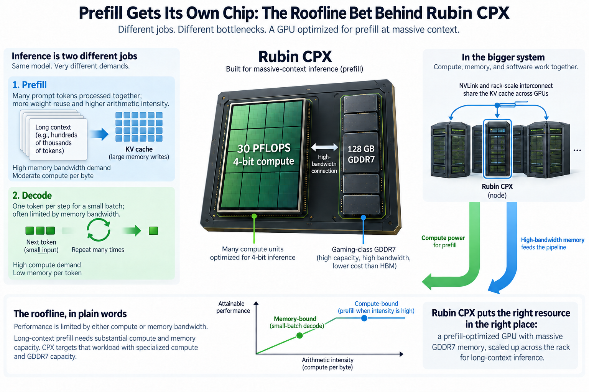
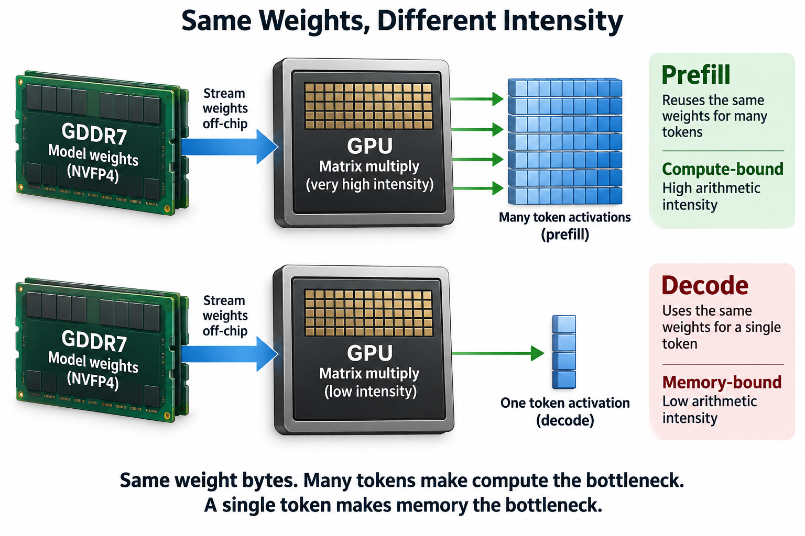
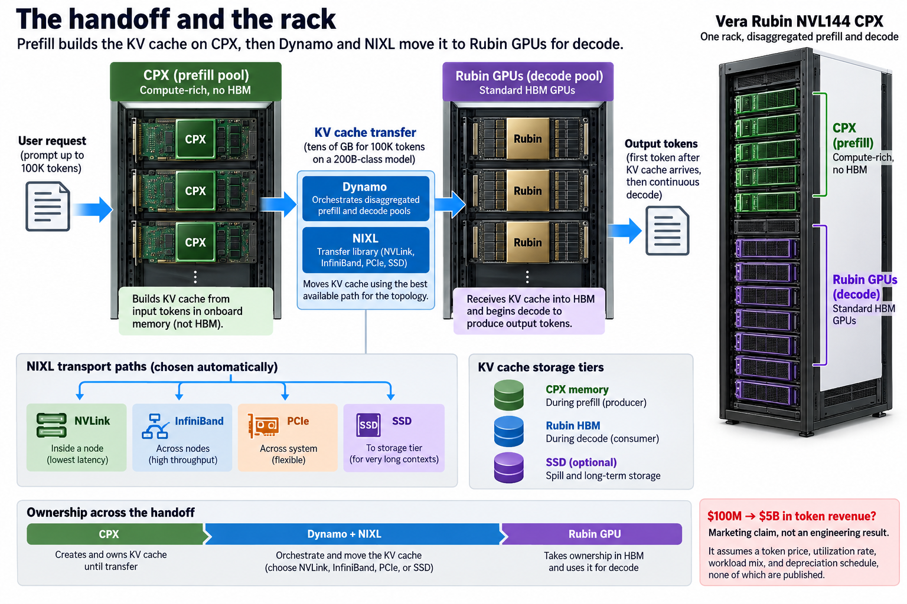
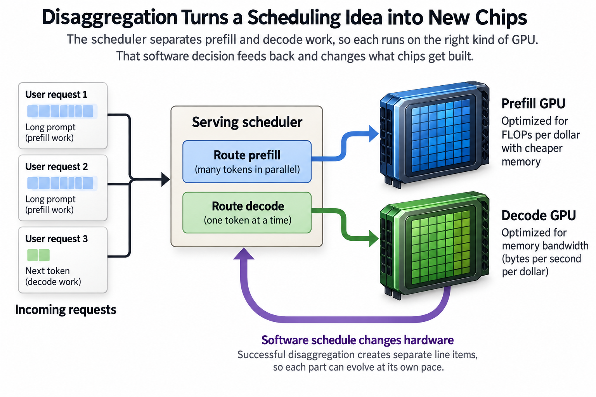

## Overview

30 petaflops of 4-bit compute, fed by gaming-class memory. That is Rubin CPX, the GPU NVIDIA announced for "massive-context inference". It carries 30 PFLOPS of NVFP4 next to 128 GB of GDDR7, the same memory family that ships on a $700 graphics card. Every serious datacenter GPU of the past 8 years has used HBM, the stacked memory whose price is a large slice of the entire board, so dropping it looks like corner-cutting, when it is actually one of the most legible pieces of hardware-software co-design in years. You can derive the whole decision from a single chart called the roofline. This article draws that chart with real numbers.

## Deep dive

### Inference is 2 different jobs wearing 1 trench coat

When an LLM answers you, the GPU does 2 phases of work that could hardly be less alike.

**Prefill** is the prompt-processing phase. The model ingests your entire input, whether that is 200 tokens of chat or 500,000 tokens of codebase. It builds up the *KV cache*, the stored key and value vectors that every later token will attend to. The key point: the model processes all input tokens at once, as 1 giant batch of matrix multiplications. Load a weight matrix from memory a single time and you get to use it against thousands of token vectors before moving on.

**Decode** is the generation phase. Tokens come out 1 at a time, because each new token depends on the one before it. To produce a single token, the GPU must stream *every* weight of the model, plus the growing KV cache, through the compute units. Each loaded byte does almost no work before being discarded. Then it does the whole thing again for the next token.

Same model, same silicon, opposite bottlenecks. Prefill is limited by how fast you can multiply. Decode is limited by how fast you can read memory. The serving world figured this out in 2024. The DistServe paper showed that colocating the 2 phases on 1 GPU lets prefill bursts inflate decode latency between tokens by 2 to 30 times. Within about 18 months, prefill/decode *disaggregation*, running the phases on separate GPU pools, became the default in vLLM, SGLang, TensorRT-LLM, and NVIDIA's Dynamo. In MLPerf v5.1, NVIDIA's first official disaggregated submission delivered roughly 1.5x the throughput of the colocated setup on the same hardware.

Rubin CPX is what happens when that software insight jumps the boundary into silicon. If prefill runs on its own pool of chips anyway, why should those chips carry memory sized for decode?

### The roofline, in plain words

The roofline model, introduced by Williams, Waterman, and Patterson in 2009, answers 1 question. For a given piece of code on a given machine, is the ceiling set by compute or by memory bandwidth?

You need 2 numbers: the first belongs to the workload, **arithmetic intensity**, the number of floating-point operations performed per byte moved from memory, and the second belongs to the machine, its peak compute (FLOP/s) divided by its memory bandwidth (bytes/s), often called the **ridge point**, also measured in FLOPs per byte.

The rule is 1 comparison. If your workload's arithmetic intensity is below the machine's ridge point, you are memory-bound. The compute units idle while bytes trickle in, and attainable performance equals bandwidth times intensity. If intensity is above the ridge point, you are compute-bound: memory keeps up fine, and you hit the FLOP/s ceiling. Plotted on log-log axes, this gives a slanted line that flattens into a roof, hence the name.

The strategic question for a chip architect is then: where do prefill and decode land relative to the ridge point, and what does moving the ridge point cost?

### A worked example you can check by hand

Let's put real numbers on it. Rubin CPX pairs 30 PFLOPS of dense NVFP4 compute with roughly 2.1 TB/s of GDDR7 bandwidth. The bandwidth figure is from The Next Platform's analysis; NVIDIA's release gives compute and capacity.

**Ridge point.** 30 × 10¹⁵ FLOP/s ÷ 2.1 × 10¹² B/s ≈ **14,300 FLOPs per byte**. Any workload doing fewer than ~14,300 operations per loaded byte leaves this chip's compute idle.

**Prefill's intensity.** In NVFP4, a weight occupies 0.5 bytes. A matrix multiply that pushes T tokens through P parameters costs 2·P·T FLOPs while loading 0.5·P bytes of weights, so the intensity is 2·P·T ÷ 0.5·P = **4T FLOPs per byte**. For a 32,768-token prompt that is about 131,000 FLOPs per byte, 9 times past the ridge point. Prefill saturates the compute roof even on GDDR7. Note what that means. Swapping in HBM with 5 or 10 times the bandwidth would change prefill throughput by approximately nothing, because bandwidth was never the binding constraint. Every HBM dollar spent on a prefill chip buys 0 prefill tokens.

**Decode's intensity.** Generate 1 token for one user and T = 1: intensity ≈ 4 FLOPs per byte, more than 3 thousand times below the ridge. Attainable compute is 2.1 TB/s × 4 = **8.4 TFLOPS, about 0.03% of the chip's 30 PFLOPS**. Concretely, a 200B-parameter model in NVFP4 is 100 GB of weights. Streaming them once takes 100 ÷ 2.1 ≈ 48 ms, capping single-stream decode near 21 tokens/s. The same model on an HBM4 part at ~22 TB/s (Glenn Lockwood's community-tracked figure for Rubin R200; unofficial) streams in 4.5 ms, roughly 220 tokens/s. For decode, HBM buys you a full 10x. That is the asymmetry in 1 sentence: **HBM is 10x for decode and 0x for prefill.**

**The threshold.** Setting 4T equal to 14,300 gives T ≈ 3,600. On CPX, any prefill batch beyond about 3,600 tokens is compute-bound. NVIDIA is pitching this chip at million-token contexts, 2 to 3 orders of magnitude past the crossover. Long context makes the case even stronger, because attention FLOPs grow with the *square* of sequence length while the weight bytes stay fixed. The longer the prompt, the more absurdly compute-bound prefill becomes.

So the design writes itself. Keep the compute (in fact, The Next Platform reports the CPX die is a single Rubin compute chiplet clocked about 20% higher). Replace the memory with something cheap, dense, and merely adequate. GDDR7 at 128 GB holds the weights and the in-flight KV cache with room to spare, and 2.1 TB/s is plenty when your intensity is 131,000.

### Correct the roofline for scale metadata

For $$P$$ weights, $$T$$ prompt rows, effective weight storage $$s$$ bytes per parameter, and additional activation/cache traffic $$D_a$$, a weight-reuse model gives

$$
I\approx\frac{2PT}{Ps+D_a},\qquad T_*\approx\frac{Cs}{2\beta}\quad(D_a\approx0).
$$

Here compute rate $$C$$ is useful operations per second and bandwidth $$\beta$$ is bytes per second on the same execution path, and the earlier 4-bit payload estimate uses 0.5 bytes per weight, but including an 8-bit scale per 16 weights instead gives 0.5625 bytes, so with 30 peta-operations per second and 2.1 terabytes per second the ideal crossing rises from about 3,571 to about 4,018 prompt rows.

Even that corrected crossing omits activations, attention history, staging, and shape inefficiency: a 200B model's 4-bit payload already takes 100 GB, and scale bytes raise it to 112.5 GB before runtime state, so a 128 GB device does not automatically have room for arbitrary long contexts, and chunking or parallel placement can become necessary.

The specialization favors reuse-rich prefill without making memory bandwidth irrelevant, so benchmark the actual format, prompt distribution, and handoff: compared with buying the same expensive memory system for both phases, the design reallocates cost toward a different balance point, while accepting tighter capacity and communication constraints.

### Going deeper: the handoff and the rack

Disaggregation only works if the KV cache built during prefill reaches the decode GPU quickly. That handoff is real machinery, not hand-waving. For a 200B-class model, a 100K-token context can mean tens of gigabytes of KV state that must move from CPX memory to an HBM Rubin GPU before the first output token. This is why NVIDIA ships Dynamo and NIXL alongside the silicon. Dynamo is the serving layer that orchestrates disaggregated pools, and NIXL is a transfer library that abstracts NVLink, InfiniBand, PCIe, and SSD paths. The KV cache has quietly become a first-class infrastructure object with its own transport layer and its own storage tiers.

At rack scale, NVIDIA packages the split as the Vera Rubin NVL144 CPX: standard HBM Rubin GPUs for decode plus CPX chips for prefill in 1 system, and NVIDIA claims 8 exaflops of NVFP4 and 7.5x the AI performance of a GB300 NVL72 rack, though you should treat both numbers as vendor claims until MLPerf-style submissions exist, because the comparison spans different workload mixes and precisions. The Next Platform frames the economics more sharply. The CPX add-in delivers a claimed ~6x on long-context throughput for about 2.25x added compute cost, precisely because the added compute skips the most expensive component on a modern accelerator. HBM can account for on the order of half the bill of materials of a high-end datacenter GPU, and it is supply-constrained. Every stack not soldered onto a prefill chip is a stack available for a decode chip that actually needs it.

1 number from the launch deserves explicit labeling: NVIDIA's claim that $100M of CPX capex can generate "$5B in token revenue." That figure is pure marketing: it assumes a token price, a utilization rate, a workload mix, and a depreciation schedule, none of which NVIDIA publishes, and it should never be quoted as an engineering result. The roofline argument stands on its own; the revenue projection does not.

### Common misconceptions

**"GDDR7 means it's a cut-down budget chip."** The opposite. The compute die is a full Rubin chiplet running at higher clocks than the flagship, per The Next Platform's reporting. Calling CPX "cheap" because of its memory is like calling a drag racer cheap because it lacks a trailer hitch: the part was deleted because the workload cannot use it, not to hit a price point, and the design center is maximum FLOPs per dollar for a workload that sits on the compute roof.

**"Prefill is always compute-bound, so this works for any traffic."** Not quite. The worked example gives the honest boundary: on CPX the crossover sits near 3,600 tokens per batch. A chatbot serving short prompts with small batches can absolutely leave prefill memory-bound, and it gains little from this chip. CPX is aimed at the regime NVIDIA names in the announcement, million-token software and video workloads, where quadratic attention makes prefill overwhelmingly compute-dominated. The bet is that this regime is where inference demand is heading, not that it is where all inference lives today.

**"Disaggregation is a new NVIDIA invention that requires CPX."** Backwards on both counts. Disaggregation was proven in software first. DistServe published in 2024, and the technique was the default across vLLM, SGLang, Mooncake, and in-house stacks at DeepSeek and Meta well before CPX existed. It also runs fine on homogeneous GPUs: MLPerf v5.1's ~1.5x disaggregated result used identical Blackwell parts for both phases. CPX does not enable disaggregation. It *assumes* it, then optimizes the silicon for one side of a split the software already made.

### The bigger picture: the schedule rewrote the SKU list

The deepest thing about Rubin CPX is the direction of causality. For decades, hardware shipped and software adapted. Here a scheduling idea, published in an academic paper, became the default serving architecture in a year and a half. Then it reached back across the hardware-software boundary and changed what chips get built. That is the co-design flywheel running at product-line scale.

It also completes a picture from earlier in this series. In [Blackwell to Rubin memory math](/blog/blackwell-to-rubin-memory-math/) we saw that HBM bandwidth, not capacity, is the scarce resource that defines each GPU generation, with capacity flat at 288 GB while bandwidth roughly triples. CPX is the corollary: if bandwidth is the precious thing, stop spending it on workloads that cannot use it. The interference numbers that motivated disaggregation in the first place are a [goodput story](/blog/goodput-vs-utilization/). A colocated GPU can show beautiful utilization while prefill bursts wreck the per-token latency that users actually experience. The reason prefill and decode diverge at all traces back to the [attention mechanism](/blog/attention-in-plain-words/) and the [transformer's structure](/blog/transformer-architecture-in-one-picture/). There is 1 weight matrix, used against many tokens in parallel during prefill and 1 token at a time during decode. And turning a roofline sketch into a purchasing decision for heterogeneous racks is exactly the kind of judgment that [ML performance engineers](/blog/what-does-an-ml-performance-engineer-do/) get paid for.

Expect the split to deepen. Once prefill and decode are separate line items, each can evolve at its own pace: prefill parts chasing FLOPs per dollar on cheap memory, decode parts chasing bytes per second per dollar on whatever HBM5 becomes. The trench coat is off.

## Conclusion

- Prefill and decode sit on opposite sides of the roofline: a 32K-token prefill runs at ~131,000 FLOPs/byte, far above CPX's ~14,300 ridge point, while batch-1 decode runs at ~4 FLOPs/byte and can use only ~0.03% of the chip's compute. HBM is worth 10x to decode and roughly nothing to prefill.
- Rubin CPX (30 PF NVFP4, 128 GB GDDR7 at ~2.1 TB/s) is prefill/decode disaggregation reaching silicon. The software split proved out in serving stacks first, and the chip simply deletes the HBM that prefill cannot exploit.
- Rack-level claims (8 EF, 7.5x GB300 NVL72) and especially the "$5B revenue per $100M capex" figure are vendor marketing without published methodology. The roofline arithmetic is the part you can verify yourself.

### Sources

- NVIDIA, "NVIDIA Unveils Rubin CPX: A New Class of GPU Designed for Massive-Context Inference": https://nvidianews.nvidia.com/news/nvidia-unveils-rubin-cpx-a-new-class-of-gpu-designed-for-massive-context-inference
- The Next Platform, "Nvidia Disaggregates Long Context Inference To Drive Bang For The Buck": https://www.nextplatform.com/compute/2025/09/11/nvidia-disaggregates-long-context-inference-to-drive-bang-for-the-buck/1642017
- DistServe team, "DistServe: 18 Months Later" (retrospective on prefill/decode disaggregation): https://haoailab.com/blogs/distserve-retro/
- NVIDIA, "NVIDIA Blackwell Ultra Sets New Inference Records in MLPerf Debut" (disaggregated serving at ~1.5x): https://developer.nvidia.com/blog/nvidia-blackwell-ultra-sets-new-inference-records-in-mlperf-debut/
- Glenn Lockwood, community-tracked Rubin R200 specifications (unofficial): https://www.glennklockwood.com/garden/processors/r200
- Williams, Waterman, and Patterson, "Roofline: An Insightful Visual Performance Model for Multicore Architectures," Communications of the ACM, 2009.

*Part of the [Efficient AI & Co-Design](/series/efficient-ai/) learning path. Browse its published articles by topic.*
