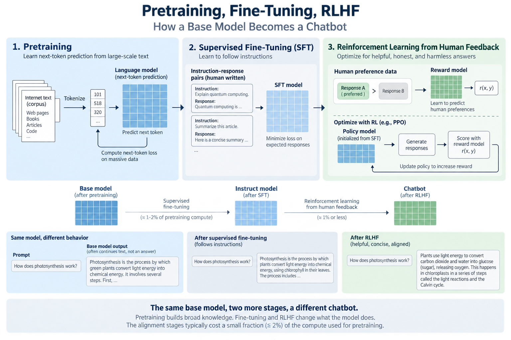
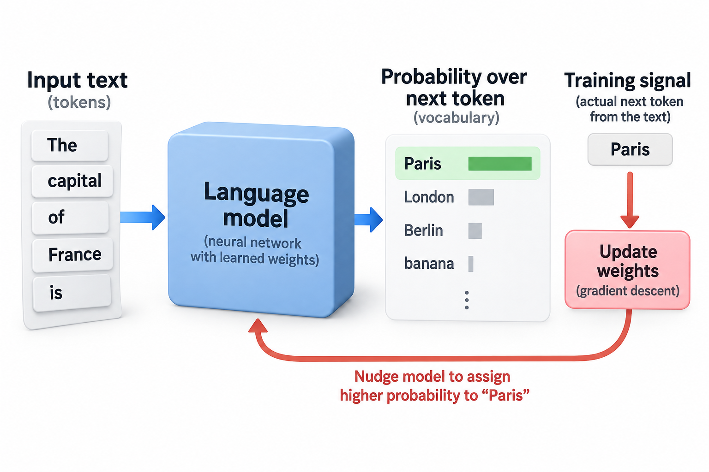
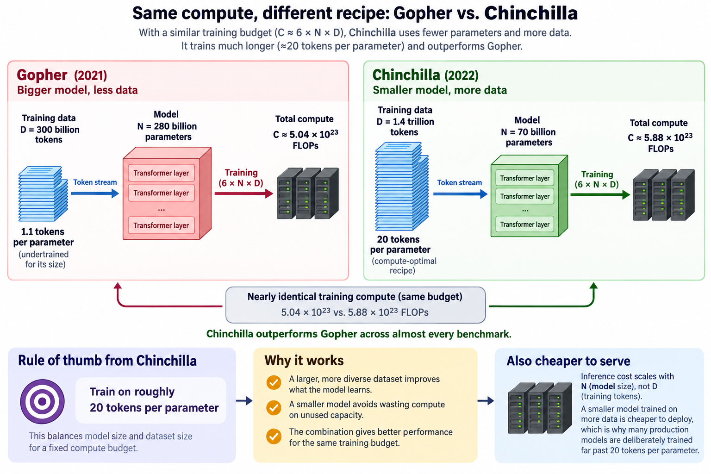
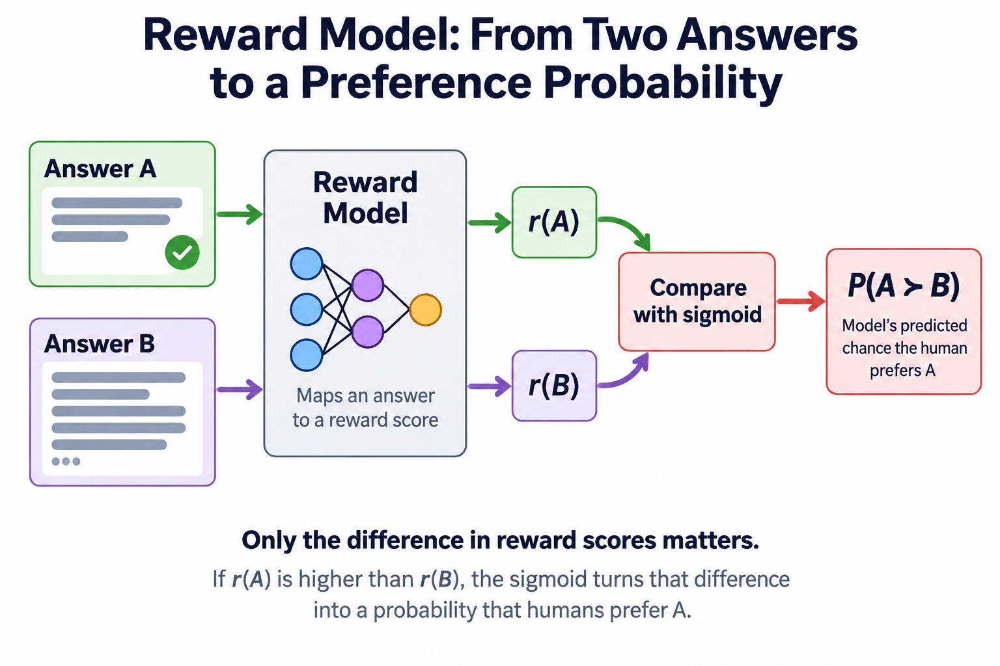

## Overview

In early 2022, OpenAI put 2 of its models in front of human judges. 1 had 175 billion parameters. The other had 1.3 billion, about 134 times fewer. The judges preferred the small model's answers. That result, from the InstructGPT paper, is the cleanest evidence we have that a chatbot is not just a big language model. It is a big language model that went through 2 more stages of training, and those stages change what the model *does* far more than what it *knows*.

This article walks through the full lifecycle: pretraining, supervised fine-tuning, and reinforcement learning from human feedback (RLHF). By the end you should be able to explain why the base model underneath ChatGPT would happily answer your question with 3 more questions, and why fixing that costs less than 2% of the compute that built the model in the first place.

## Deep dive

### Stage 1: pretraining, the expensive part

Pretraining is a single, simple task repeated at absurd scale: given a stretch of text, predict the next token. A token is a chunk of text, usually a word piece of 3 to 4 characters on average in English. The model reads "The capital of France is" and assigns a probability to every token in its vocabulary. Training then nudges the weights so that "Paris" gets more probability and "banana" gets less. That nudging is ordinary gradient descent, the same mechanism covered in [How Models Learn](/blog/how-models-learn/), applied trillions of times.

2 things make this humble objective powerful. First, the training set is a huge slice of the public internet plus books and code, so predicting the next token well forces the model to absorb grammar, facts, reasoning patterns, and style. You cannot reliably complete "the mass of an electron in kilograms is 9.109 ×" without storing physics. Second, the objective is self-supervised: the labels are just the text itself, shifted by 1 position. Nobody has to annotate anything, which is what makes internet scale affordable.

The numbers are worth staring at. GPT-3 was trained on roughly 300 billion tokens and, per the paper, cost about 3,640 petaflop/s-days of compute. Modern frontier models train on tens of trillions of tokens. This stage runs for months on thousands of accelerators, and it is where essentially all of the model's knowledge and capability comes from.

What you get at the end is a **base model**, and here is the part people miss: a base model is not an assistant. It is a text-completion engine. Its entire worldview is "what token plausibly comes next in a document like this?" Ask it a question and it may answer, or it may continue with more questions, because on the internet a list of questions is often followed by more questions. It is a mirror of its training distribution, nothing more.

### The Chinchilla recipe: a worked example

Before moving on to fine-tuning, it is worth asking how you should spend a pretraining budget. For years the answer was "buy more parameters." Kaplan et al.'s 2020 scaling-law paper showed loss falls predictably as you scale compute, and the field read it as a license to grow models faster than datasets.

DeepMind's 2022 Chinchilla paper corrected the recipe, and you can check its logic with grade-school arithmetic. The standard approximation for the compute cost of training a dense transformer is:

**C ≈ 6 × N × D**

where N is the parameter count, D is the number of training tokens, and C is total floating-point operations. (The 6 comes from roughly 2 FLOPs per parameter for the forward pass and 4 for the backward pass, per token.)

Now compare 2 models trained with almost the same budget:

- **Gopher**: N = 280 billion parameters, D = 300 billion tokens.
  C ≈ 6 × (280 × 10⁹) × (300 × 10⁹) = **5.04 × 10²³ FLOPs**
- **Chinchilla**: N = 70 billion parameters, D = 1.4 trillion tokens.
  C ≈ 6 × (70 × 10⁹) × (1.4 × 10¹²) = **5.88 × 10²³ FLOPs**

Nearly identical compute, but Chinchilla shrank the model 4× and stretched the data 4.7×. It outperformed Gopher across almost every benchmark the authors tested. The rule of thumb that fell out of the paper: for a compute-optimal model, train on roughly **20 tokens per parameter**. Check it: 1.4 × 10¹² ÷ 70 × 10⁹ = 20. Gopher sat at 300 ÷ 280 ≈ 1.1 tokens per parameter, badly undertrained for its size.

There is a practical postscript: a smaller model trained on more data is also cheaper to *serve*, because inference cost scales with N, not D. That is why many production models today are deliberately trained far past 20 tokens per parameter. Compute-optimal is not the same as deployment-optimal.

### Stage 2: supervised fine-tuning

Supervised fine-tuning (SFT) is where the base model learns the *format* of being helpful. Human labelers write demonstrations: a prompt, followed by the answer a good assistant would give. The model is then trained on these examples with the exact same next-token objective as pretraining. Only the data changes.

The scale drops off a cliff. InstructGPT's SFT stage used on the order of 13,000 training prompts with written demonstrations. Against a pretraining corpus of 300 billion tokens, that is a rounding error, well under a millionth of the data. Yet it works, because SFT is not teaching the model English or facts. It is teaching it which corner of its already-learned distribution to live in: the corner where a question is followed by an answer, in a helpful register, at an appropriate length.

SFT alone gets you a decent instruction-follower. But it has a structural ceiling. The model can only imitate what labelers wrote, and labelers cannot write down everything they know about what makes 1 answer better than another. "Slightly too verbose," "technically true but misleading," "confident about something false": these judgments are easy to make in comparison and hard to specify in a demonstration. That gap is what stage 3 closes.

### Stage 3: RLHF, learning from preferences

Reinforcement learning from human feedback, as laid out in the InstructGPT paper, has 2 moving parts.

Part 1 is to train a reward model. Take a prompt, sample several answers from the SFT model, and have a human rank them from best to worst. Do this a lot (InstructGPT used comparisons drawn from about 33,000 prompts). Then train a separate network, the reward model, to predict those rankings. It reads a prompt-plus-answer and outputs a single number, higher meaning "a human would prefer this." The reward model is a compressed, queryable copy of human judgment. Where a person can rank maybe a few hundred answers a day, the reward model scores millions.

Part 2 is to optimize against it. Now treat text generation as a reinforcement-learning problem. The language model (the "policy") writes an answer, the reward model scores it, and an RL algorithm called PPO (proximal policy optimization) adjusts the policy's weights to make high-scoring answers more likely. There is also a leash: a KL penalty that punishes the policy for drifting too far from where the SFT model started. Without the leash, the policy finds degenerate text that scores well with the reward model but reads like nonsense, a failure mode called reward hacking.

Here is the striking part, and the reason this article's opening result is possible. Per the InstructGPT paper, fine-tuning the 175B model cost about 4.9 petaflop/s-days for SFT and about 60 for PPO. Pretraining GPT-3 cost 3,640. The entire alignment pipeline was under 2% of the pretraining bill, and it mattered more to users than a 100× increase in model size. Alignment changes behavior, not knowledge, and behavior is what people experience.

### Before and after: the same model, 2 personalities

The InstructGPT paper includes a comparison that has become the canonical demo. Prompt: *"Explain the moon landing to a 6 year old in a few sentences."*

**Base GPT-3** completes the document pattern it sees:

> "Explain the theory of gravity to a 6 year old. Explain the theory of relativity to a 6 year old in a few sentences. Explain the big bang to a 6 year old…"

It has seen worksheets full of writing prompts, so it generates more writing prompts. Statistically impeccable, practically useless.

InstructGPT, same underlying architecture, after SFT and RLHF:

> "People went to the moon, and they took pictures of what they saw, and sent them back to the earth so we could all see them."

Every fact needed for the good answer was already in the base model. The lifecycle's last 2 stages did not add moon-landing knowledge. They changed which of the model's many possible continuations gets selected. A base model is an actor who has read every script ever written. SFT and RLHF hand it a role.

### Going deeper: the math inside the reward model

1 level down, the reward model is trained with a loss borrowed from the 1950s. The Bradley-Terry model of pairwise comparisons is the same family of math behind chess Elo ratings. If answer A gets reward score r(A) and answer B gets r(B), the model's predicted probability that a human prefers A is:

**P(A ≻ B) = σ(r(A) − r(B))**

where σ is the sigmoid function, σ(x) = 1/(1 + e⁻ˣ). Try it with real numbers. Suppose the reward model scores a concise, correct answer at 2.0 and a rambling one at 0.5. Then P = σ(1.5) = 1/(1 + e⁻¹·⁵) ≈ **0.82**: an 82% chance the human prefers the first. Training minimizes the log loss of these predictions over all human-labeled pairs, so scores get pushed apart exactly when humans disagree with the model's current ranking. Only score *differences* matter, which is why reward values themselves are meaningless in isolation.

The PPO objective then maximizes, per response y to prompt x:

**r(x, y) − β · KL(policy ‖ SFT reference)**

The β coefficient sets the leash length. Small β lets the model chase reward aggressively (and hack it). Large β keeps it pinned to SFT behavior (and wastes the reward signal). Tuning that trade-off is a large part of the practical craft.

A 2023 development worth knowing: direct preference optimization (DPO) showed you can skip the explicit reward model and the RL loop entirely. Some algebra on the Bradley-Terry and KL-constrained objectives turns the whole thing into a single classification-style loss on preference pairs. Many current open-weight models use DPO or its descendants instead of PPO. The pipeline picture stays the same. The third stage just got simpler to run.

### A preference objective makes the tradeoff explicit

1 direct preference optimization objective compares a preferred answer $$y_w$$ with a rejected answer $$y_l$$ for prompt $$x$$:

$$
\mathcal L=-\log\sigma\!\left[\beta\left(\log\frac{\pi_\theta(y_w\mid x)}{\pi_{ref}(y_w\mid x)}-\log\frac{\pi_\theta(y_l\mid x)}{\pi_{ref}(y_l\mid x)}\right)\right].
$$

The policies assign sequence probabilities, the reference policy is fixed, and positive beta controls the preference margin's scale. If the trained policy assigns 0.4 and 0.2 while the reference assigns 0.3 to each, beta 0.1 gives margin 0.06931 and loss approximately 0.65909.

Compared with a pipeline that fits a reward model and runs reinforcement learning against it, this objective optimizes logged preference pairs directly under its modeling assumptions. It removes that explicit online reward-and-rollout loop, but depends on the coverage and reliability of the pairs. A lower preference loss does not establish factual accuracy or safety on unseen prompts.

SFT and preference training update weights and can teach information or behaviors represented in their data. Their usual compute budgets are smaller than pretraining, but that does not make new knowledge mathematically impossible. The useful distinction is the training signal and deployment objective, rather than an absolute boundary between learning capability and learning manners.

### Common misconceptions

"RLHF is what makes the model smart." No. Capability comes overwhelmingly from pretraining, and the compute split proves it: 3,640 petaflop/s-days for pretraining versus roughly 65 for the whole alignment pipeline in InstructGPT. RLHF selects and shapes behavior that pretraining already made possible. A base model can often solve the same problems. It just will not reliably choose to.

"Fine-tuning teaches the model new facts." Fine-tuning can teach facts represented in its data. The cited SFT run used about 13,000 demonstrations against 300 billion pretraining tokens, so its main measured role was behavioral adaptation rather than broad pretraining-scale coverage. If you need a model to know your company's product line, fine-tuning is usually the wrong tool. Retrieval (putting the facts in the prompt) is. Fine-tuning and retrieval solve different update and coverage problems. Evaluate freshness, reliability, and maintenance rather than imposing an absolute capability boundary.

"Bigger models are always better." The Chinchilla arithmetic above says otherwise: at fixed compute, a 70B model trained on 1.4T tokens beat a 280B model trained on 300B tokens. Parameter count alone tells you little without the token count next to it, and marketing pages that quote only 1 number are hiding half the story.

### Where this sits in the bigger picture

Everything in this article runs on machinery covered earlier in this series. The base model doing next-token prediction is the transformer from [The Transformer Architecture in 1 Picture](/blog/transformer-architecture-in-one-picture/), with the attention mechanism from [Attention in Plain Words](/blog/attention-in-plain-words/) deciding which earlier tokens inform each prediction. All 3 lifecycle stages, including the PPO step, ultimately update weights by gradient descent as described in [How Models Learn](/blog/how-models-learn/). And the reason the field obsesses over the 6ND formula is money. At 10²³-FLOP scale, the efficiency questions explored in [Goodput vs Utilization](/blog/goodput-vs-utilization/) decide whether a training run costs 1 fortune or several.

The lifecycle framing also explains the industry's structure. Only a handful of labs can afford stage 1, which is why "foundation model" is a business category. But stages 2 and 3 are within reach of far smaller teams, which is why an ecosystem of fine-tuned open-weight variants can bloom on top of a single released base model.

## Conclusion

- **Pretraining builds capability, and alignment steers it.** Next-token prediction over internet-scale text creates all the knowledge. SFT and RLHF, at under 2% of the compute, decide how it gets used, and users notice the steering more than the size.
- **Balance parameters against tokens.** Compute is roughly 6ND, and the Chinchilla result says a compute-optimal model wants about 20 tokens per parameter. A smaller model on more data can beat a giant on less.
- **Preferences beat demonstrations for the last mile.** Humans are better at ranking answers than writing perfect ones, and RLHF (or DPO) converts those rankings into behavior a demonstration set alone cannot pin down.

### Sources

- Rafailov et al., [Direct Preference Optimization](https://arxiv.org/abs/2305.18290), the original reference-policy preference objective.

- Brown et al., "Language Models are Few-Shot Learners" (GPT-3), 2020. https://arxiv.org/abs/2005.14165
- Kaplan et al., "Scaling Laws for Neural Language Models," 2020. https://arxiv.org/abs/2001.08361
- Hoffmann et al., "Training Compute-Optimal Large Language Models" (Chinchilla), 2022. https://arxiv.org/abs/2203.15556
- Ouyang et al., "Training language models to follow instructions with human feedback" (InstructGPT), 2022. https://arxiv.org/abs/2203.02155
- Rafailov et al., "Direct Preference Optimization: Your Language Model is Secretly a Reward Model," 2023. https://arxiv.org/abs/2305.18290
- Andrej Karpathy, "State of GPT," talk at Microsoft Build 2023.

*Part of the [LLM Foundations & Mathematics](/series/llm-basics/) learning path. Browse its published articles by topic.*
