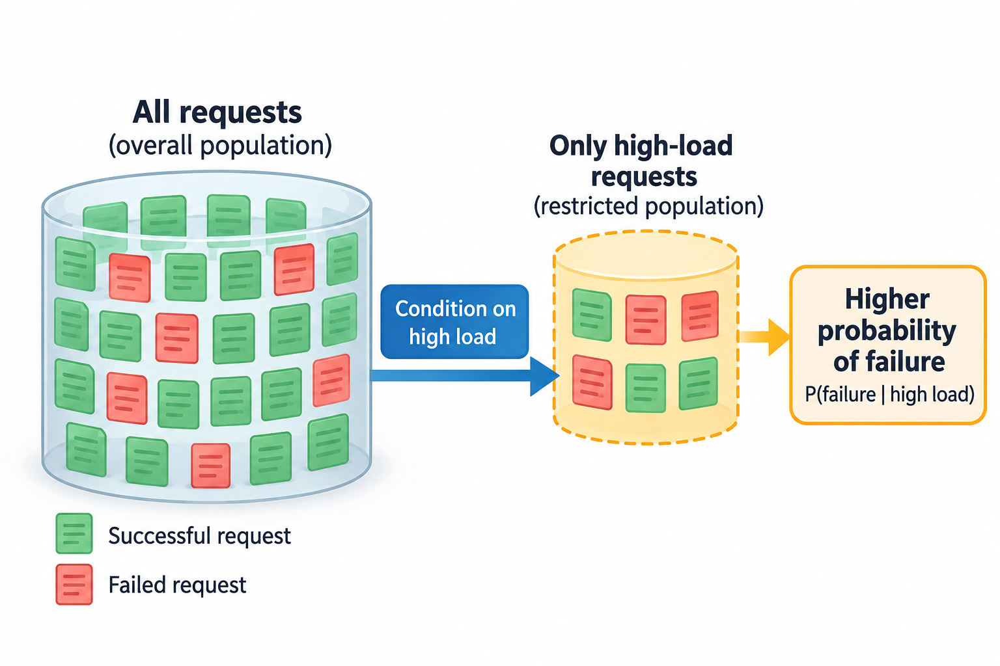
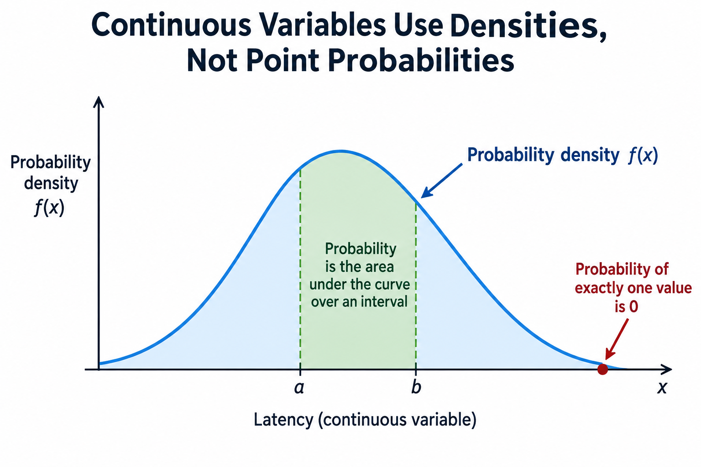

A model that assigns a 70% probability to an event has not observed 70 percent of that event. It has assigned a number to an uncertain outcome under a model. That distinction sits beneath classification, regression, and next-token prediction. Before deriving a training objective, we need to know what those numbers mean, what must sum to 1, and which assumptions connect 1 observation to another.

Probability provides a language for uncertainty. It does not automatically tell us whether a model is trustworthy, whether its assumptions fit the data, or whether a generated answer is true. This article builds the small set of concepts needed for the following articles on maximum likelihood estimation and maximum a posteriori estimation. Each equation is attached to an example you can calculate by hand.

## Events and random variables are different objects

An outcome is 1 possible result of an experiment. An event is a set of outcomes: for example, the event that a request succeeds. A probability measure assigns numbers between 0 and 1 to events, assigns 1 to the complete outcome space, and adds the probabilities of disjoint events. “Success” and “failure” are disjoint if our experiment permits exactly one of them.

A random variable is a numerical description of an outcome. Let Y equal 1 when a request succeeds and 0 when it fails. Y is not the probability; it is the value we may observe. A Bernoulli distribution with parameter theta assigns success probability theta and failure probability 1 minus theta:

$$
P(Y=1)=\theta,\qquad P(Y=0)=1-\theta,\qquad 0\leq\theta\leq1.
$$

The letter P denotes an event probability, while theta names a model parameter. If theta equals 0.7, a single trial still yields either 0 or 1. We use repeated observations to estimate theta later; the distribution describes what could occur if a candidate theta were correct.

For a classifier with several exclusive labels, a categorical distribution replaces the 2 Bernoulli outcomes. The probabilities must be nonnegative and sum to 1 across the allowed labels. A language model uses a categorical distribution across its token vocabulary at each position, conditioned on the prefix. The vocabulary may be large, but the normalization principle is the same.

*Original worked-example diagram illustrating probability normalization; no source figure is reproduced.*

## A worked distribution over 3 outcomes

Suppose the next event has 3 labels: success, timeout, and other failure. Our illustrative model assigns probabilities 0.7, 0.2, and 0.1. They sum to 1. The probability of any failure is 0.2 plus 0.1, or 0.3, because the 2 failure events are disjoint.

Define a cost random variable X that is 0 for success, 2 for timeout, and 5 for other failure. The expected cost is a probability-weighted average:

$$
E[X]=\sum_x xP(X=x)=0(0.7)+2(0.2)+5(0.1)=0.9.
$$

Expectation is not necessarily a possible outcome. A single event never costs 0.9 in this example. Over many representative independent trials, the average cost can approach that value under the law of large numbers. The expectation summarizes the distribution, not a fractional observation.

The most probable outcome is success, with cost 0. The expected cost is 0.9. Those answer different questions: what occurs most often, and what average cost the full distribution implies. Choosing an action solely from the most probable outcome can ignore rare but expensive failures. This is why uncertainty becomes useful only when connected to a decision or loss.

A practical classifier may choose the most probable label, while a decision system may minimize expected cost over available actions. If missing a serious failure costs much more than raising a false alarm, the decision threshold can differ from 0.5. The probabilities and the action rule are separate parts of the system.

## Variance describes spread around the expectation

Let mu denote E[X]. Variance is the expected squared deviation from that mean:

$$
\operatorname{Var}(X)=E[(X-\mu)^2]=E[X^2]-E[X]^2.
$$

For the cost example, E[X squared] equals 0 squared times 0.7 plus 2 squared times 0.2 plus 5 squared times 0.1, giving 3.3. Subtracting 0.9 squared gives variance 2.49. The standard deviation is the square root, approximately 1.58, in the same cost units as X.

Variance uses squared units, so standard deviation is often easier to interpret. Neither fully describes a distribution. 2 distributions can have the same mean and variance but different tail behavior. If a rare expensive outcome matters to the application, inspect its probability directly rather than reducing everything to 2 summary numbers.

For a Bernoulli random variable, E[Y] equals theta and variance equals theta times 1 minus theta. At theta equal to 0.7, the mean is 0.7 and variance is 0.21. Notice that theta is fixed in this model; the variance concerns random outcomes Y, not uncertainty about our estimate of theta. Parameter uncertainty requires another level of modeling.

If n independent Bernoulli trials share the same theta, the sample average has variance theta times 1 minus theta divided by n. More independent observations make the average more stable. If trials are correlated, that division is no longer generally correct: 10 requests during the same outage may provide less independent information than 10 requests across unrelated operating periods.

## Conditional probability introduces information

Conditional probability describes an event after restricting attention to another event known to have occurred. For events A and B with P(B) greater than 0:

$$
P(A\mid B)=\frac{P(A\cap B)}{P(B)}.
$$

The vertical bar means “given.” Let A be request failure and B be a high-load interval. P(A given B) may differ from the overall failure probability. The conditioning event changes the population being considered; it does not by itself establish that high load causes failure.

The product rule follows by rearranging this definition: P(A and B) equals P(A given B) times P(B). Repeated application gives the chain rule for a sequence. A language model factorizes the probability of a token sequence into probabilities of each token given the earlier tokens:

$$
p(x_1,\ldots,x_T)=\prod_{t=1}^{T}p(x_t\mid x_1,\ldots,x_{t-1}).
$$

Here x_t denotes a token at position t and T the sequence length. The chain rule itself does not assume independent tokens. Quite the opposite: each conditional term can depend on the entire prefix. Modeling language as independent vocabulary draws would discard that dependence.

A useful distinction is independence versus conditional independence. Independent events do not change one another's probabilities. Conditionally independent observations may become independent only after specifying a shared parameter or context. Many statistical models use conditional independence to simplify likelihoods; that is an assumption to inspect, not an automatic property of a dataset.

## Bayes' rule reverses the conditioning direction

Bayes' rule connects 2 conditional probabilities:

$$
P(A\mid B)=\frac{P(B\mid A)P(A)}{P(B)}.
$$

It does not say that P(A given B) equals P(B given A). Suppose 1 percent of intervals contain a particular incident. An alarm triggers in 90 percent of incident intervals and 5 percent of nonincident intervals. Let I denote incident and A denote alarm. Then P(A) equals 0.9 times 0.01 plus 0.05 times 0.99, or 0.0585.

The probability of an incident given an alarm is 0.009 divided by 0.0585, approximately 0.154. Despite a 90-percent detection rate, only about 15 percent of alarms correspond to this incident under these assumptions. The incident is rare and false alarms accumulate over the much larger nonincident population.

This is a base-rate example, not a claim about a real monitoring system. It shows why a conditional score needs the underlying population rate. The next article on [MAP estimation](/blog/map-estimation-and-priors/) applies the same identity to uncertain parameters: a prior distribution combines with the likelihood of observations to form a posterior.

*Original numerical Bayes-rule example. Rates are illustrative assumptions, not monitoring measurements.*

## Continuous variables use densities, not point probabilities

A latency value is naturally modeled as continuous, at least before measurement rounds it. A probability density f(x) describes how probability accumulates over intervals. The integral of the density over an interval gives its probability, and the integral over the full domain equals 1.

For a continuous distribution, the probability of exactly 1 real-number value is typically 0. That does not make observations impossible: measurements represent intervals or finite precision. A density value can also exceed 1 because it has units inverse to x. Only integrated probabilities must lie between 0 and 1.

A Gaussian distribution has mean mu and positive standard deviation sigma. Its density is:

$$
f(x)=\frac{1}{\sigma\sqrt{2\pi}}\exp\left(-\frac{(x-\mu)^2}{2\sigma^2}\right).
$$

The equation gives a bell-shaped model, not a universal law for data. Latencies are nonnegative and often skewed; a Gaussian may be unsuitable for their full distribution. Gaussian noise is nevertheless a useful regression assumption in some settings and leads to squared-error objectives, as derived in [maximum likelihood estimation](/blog/maximum-likelihood-estimation/).

Continuous expectations replace sums with integrals. The intuition remains a weighted average. When evaluating a model, keep track of whether a quantity is a mass, density, cumulative probability, or score. Calling all of them “confidence” creates confusion that normalization alone cannot resolve.

A probabilistic model becomes actionable after specifying losses. Suppose $$p$$ is the conditional probability of a costly failure, $$C_{FN}$$ the cost of missing it, and $$C_{FP}$$ the cost of a false alarm. With 0 loss for correct actions, expected loss of alarming is $$C_{FP}(1-p)$$, while ignoring it costs $$C_{FN}p$$. Alarm when

$$
p>\frac{C_{FP}}{C_{FP}+C_{FN}}.
$$

For a false alarm cost of 1 and missed-failure cost of 9, the threshold is 0.1. The Bayes-rule example's posterior of approximately 0.154 therefore supports alarming under those costs, even though an incident is not the most probable outcome. At equal costs the threshold becomes 0.5. Equality requires an explicitly chosen tie policy.

This method improves a majority-label baseline by minimizing modeled expected consequences rather than maximizing the frequency of correct labels. It assumes binary actions, the stated loss table, and probabilities calibrated for the deployment population. If prevalence changes, the earlier posterior calculation may change even when an alarm's detection behavior stays constant. Estimate probabilities on held-out representative data and assess decision losses separately from classification accuracy. A threshold tuned after repeatedly inspecting the test set can overstate performance. Uncertainty in costs and rates is reason to compare sensitivity scenarios, not to treat an uncalibrated softmax score as a guaranteed posterior.

## Going deeper: uncertainty about outcomes and parameters

Outcome uncertainty remains even when a model parameter is known. A coin with known theta equal to 0.5 still has an uncertain next result. Parameter uncertainty concerns not knowing theta because the observations are limited or the model is uncertain. These are different questions and can change differently as data arrives.

A point estimate such as MLE selects 1 parameter value. It can then predict uncertain outcomes using that fitted distribution. A Bayesian model instead places a distribution over parameters and averages predictions over its posterior when computing posterior predictive probabilities. MAP chooses a posterior mode and is still a point estimate; it does not automatically perform that averaging.

In machine learning, people often call irreducible observation variability aleatoric uncertainty and model or knowledge uncertainty epistemic uncertainty. Those terms are useful when the modeling assumptions make the separation meaningful. They are not 2 quantities a generic softmax vector reliably reveals. High token probability can coexist with factual error, missing evidence, or an unfamiliar input distribution.

For example, a language model can confidently predict a common continuation that states an incorrect fact. Its token distribution describes a modeled continuation, not a calibrated certificate that the proposition is true. Reliability evaluation needs task-specific observations and, where appropriate, access to verifiable evidence.

*Original conceptual comparison; these categories do not imply that a softmax score measures them all.*

## Common misconceptions and a usable checklist

“Expected value is the most likely result.” Our 3-outcome example has most likely cost 0 and expected cost 0.9. The mean includes the entire weighted distribution and need not be an observable result.

“A density above 1 is invalid.” A continuous density is not a point probability. Integrate it over a region to obtain a probability, and check units and normalization.

“Conditioning proves causation.” Failure can be associated with high load because both relate to another factor. Conditional probabilities summarize modeled dependence; causal claims require an appropriate design or additional assumptions.

Before using a probabilistic prediction, state the random variable, its possible values, the conditioning information, and the population represented by the data. Check normalization and distinguish a parameter estimate from an outcome probability. Then identify the decision loss: an accurate probability can support different actions when their costs differ.

## Takeaway

- Distributions assign probability mass or density; expectation and variance summarize different aspects of them.
- Conditional probability and the chain rule express dependence, while Bayes' rule updates conditioning using base rates.
- Outcome uncertainty, parameter uncertainty, and factual reliability require separate interpretation.

Continue to [MLE](/blog/maximum-likelihood-estimation/) to turn observations into an objective, then [MAP](/blog/map-estimation-and-priors/) to see how a prior changes that objective.

## Sources

- [Dive into Deep Learning: Probability and Statistics](https://d2l.ai/chapter_preliminaries/probability.html), probability rules, expectations, and sampling assumptions.
- [Dive into Deep Learning: Softmax Regression](https://d2l.ai/chapter_linear-classification/softmax-regression.html), categorical predictions and normalized class probabilities.
