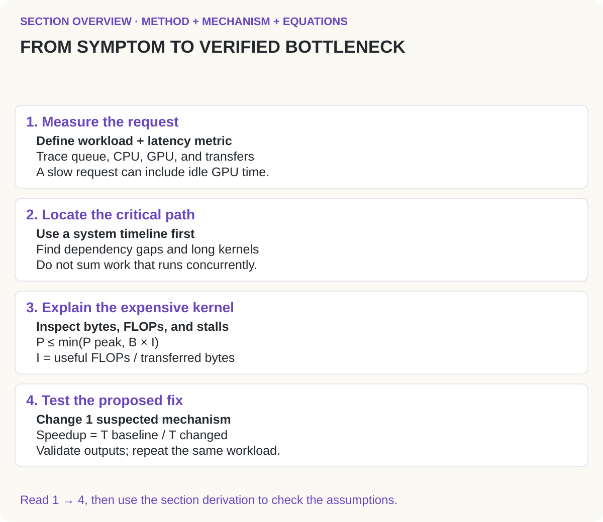
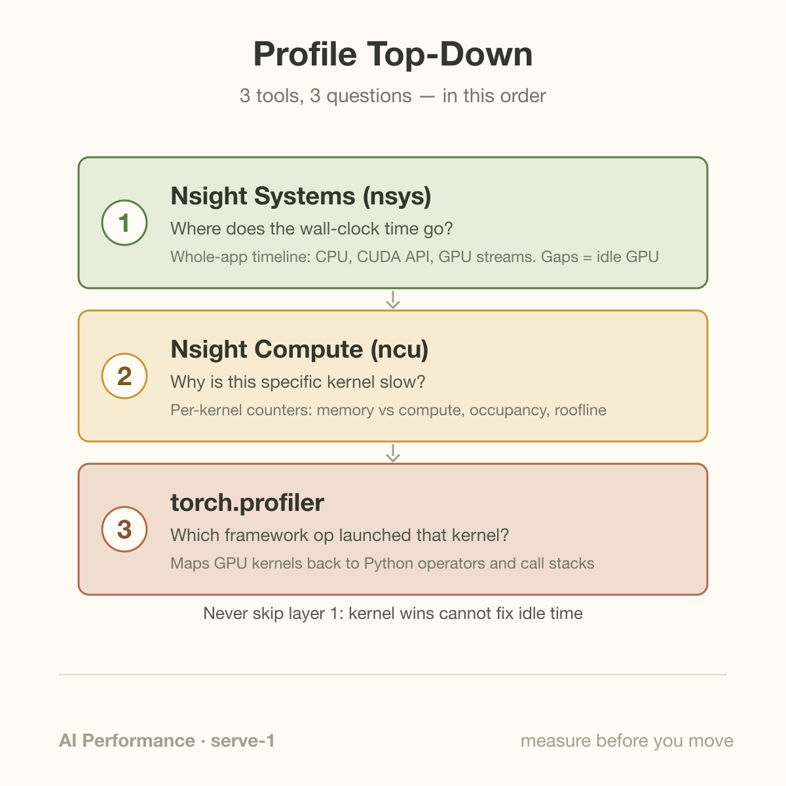
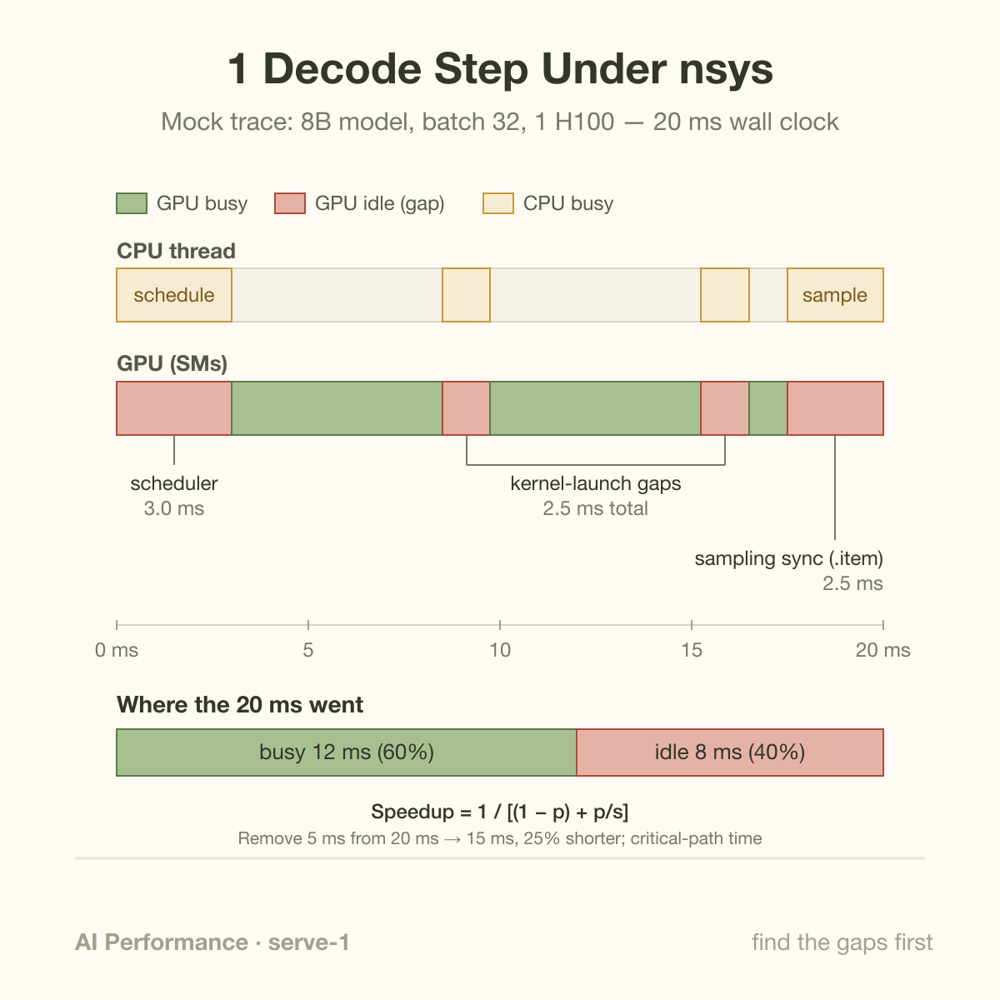

An H100 SXM can stream a 16 GB model through its compute units in roughly 5 milliseconds. Yet the first Nsight Systems trace of a typical homegrown inference server often shows the GPU doing nothing for 30 to 40 percent of wall-clock time. Not slow kernels. Nothing. Empty stretches on the timeline where the most expensive component in the rack waits for a Python thread to catch up.

This is why the first rule of performance engineering is boring and non-negotiable: never optimize what you haven't profiled. Intuition about where time goes in an LLM serving stack is wrong often enough that acting on it is a coin flip, and the expensive failure mode is real: engineers spend 3 weeks making a matmul 15% faster while the GPU idles 40% of every decode step. The matmul win moves end-to-end latency by a few percent. Closing the idle gap would have moved it by a third.

Profiling is how you find out which situation you're in. This article covers the workflow: which tool answers which question, in what order, and how to read the answer.

## 3 tools, 3 questions, 1 order

*Read 1 to 4 to connect the method, its mechanism, and the assumptions behind the equations. The section below develops the details.*

Profiling an inference stack is a top-down exercise with 3 layers, and the order matters more than the tools.

**Layer 1: the end-to-end timeline (Nsight Systems).** `nsys` records everything that happens on the machine over a window of time: CPU threads, CUDA API calls, kernel executions per GPU stream, memory copies, NCCL collectives. Its output is a timeline you scrub through, and the single most valuable thing on it is the *gaps*. When the GPU row is empty, the GPU is idle, and the cause is almost always above it on the timeline: a CPU thread doing Python work, a synchronization stall, a host-to-device copy nobody overlapped. You cannot see any of this from inside a kernel profiler, which is exactly why the timeline comes first.

**Layer 2: the kernel microscope (Nsight Compute).** Once the timeline shows the GPU genuinely busy and 1 kernel dominating, `ncu` replays that kernel in isolation and reports hardware counters: DRAM throughput, SM occupancy, warp stall reasons, achieved versus peak on the roofline. This is where you learn *why* a kernel is slow. It is a scalpel, and reaching for it before the timeline is how people polish kernels that were never the problem.

**Layer 3: framework attribution (torch.profiler).** `nsys` shows you a kernel named `ampere_bf16_s16816gemm_...` and leaves you to guess which of your model's 40 matmuls it was. `torch.profiler` closes that gap: it records at the PyTorch operator level, correlates each GPU kernel with the Python call stack that launched it, and exports a trace you can open in Perfetto or TensorBoard. When the question is "which line of my code caused this," this is the layer that answers it. NVTX ranges (`torch.cuda.nvtx.range_push`) do the same job manually and make `nsys` timelines dramatically easier to read: wrap prefill, decode, and sampling in named ranges and the trace annotates itself.

The order is the discipline. Timeline first, to find out whether the time is even on the GPU. Kernel counters second, only for kernels the timeline convicted. Framework attribution whenever you need to map either view back to code.

## A worked example: the 40% idle GPU

Here is a mock trace, simplified from a pattern that appears in real serving stacks constantly. The setup: an 8B-parameter model in BF16, batch of 32 decode requests, 1 H100. You measure 100 decode iterations and get 2.0 seconds of wall clock, so 20 ms per step, which is your observed TPOT. Then you open the `nsys` trace and sum the GPU busy time: 1.2 seconds. The GPU worked for 12 ms of every 20 ms step and sat idle for 8. 40 percent of your latency is not computation.

Zoom into 1 step and the 8 ms of idle time resolves into 3 distinct gaps, each with a different signature and a different fix.

**Gap 1: 3.0 ms of scheduler time at the start of the step.** Before any kernel launches, the CPU row shows the serving framework's Python code doing bookkeeping: picking which requests join the batch, building input tensors, updating KV-cache block tables. The GPU finished the previous step and has nothing to do until this completes. Signature: GPU row empty, 1 CPU thread pegged, no CUDA API calls in flight. Fix: overlap scheduling for step N+1 with GPU execution of step N, which is exactly what vLLM, SGLang, and TensorRT-LLM's runtimes do with their multi-step or overlapped schedulers.

**Gap 2: 2.5 ms of accumulated launch gaps between kernels.** A single decode step of a 32-layer transformer launches several hundred kernels: layernorms, QKV projections, attention, MLP matmuls, elementwise glue. Each launch costs the CPU a few microseconds of driver work. When kernels are short, which decode kernels are (a fused layernorm at batch 32 runs in tens of microseconds), the CPU cannot feed the GPU fast enough, and the timeline shows a picket fence: sliver of work, sliver of idle, repeated hundreds of times. 5 hundred launches at 5 microseconds of CPU cost each is 2.5 ms, and it only hides if launches run far enough ahead of execution. Signature: many short kernels with proportional gaps, CUDA API row dense with `cudaLaunchKernel`. Fix: CUDA graphs, which record the whole step once and replay it as a single launch.

**Gap 3: 2.5 ms of synchronization at the end of the step.** After the final logits, the framework copies data to the CPU to sample the next token, and somewhere in that path sits a `.item()` or a blocking `.cpu()` call. That call forces the CPU to stop and wait for the GPU, then the GPU waits for the CPU to finish sampling and launch the next step. Signature: a `cudaStreamSynchronize` or `cudaMemcpyAsync`-then-sync in the CUDA API row, GPU empty behind it. Fix: sample on the GPU, keep the token on the device, and only ship tokens to the CPU asynchronously for detokenization.

Now the arithmetic that makes profiling worth it. The 12 ms of GPU busy time is itself worth checking against a roofline floor: 16 GB of weights over the H100's ~3.35 TB/s of HBM bandwidth is about 4.8 ms per step just to read the weights once, plus KV-cache reads on top, so 12 ms is plausibly within a factor of 3 of the memory-bound floor. Meanwhile the 3 gaps are worth 8 ms and none of them require touching a kernel. Fix the sync and the launch gaps and the step drops toward 15 ms, a 25% TPOT reduction, before you have written a line of CUDA. Had you started at layer 2 with the biggest matmul, a 30% reduction in kernel duration on a kernel that is 40% of GPU time would have saved 1.4 ms of the 20: a 7% win, less than the 5 ms available from the identified gaps.

## Amdahl applies to critical-path fractions

If fraction $$p$$ of measured elapsed time is accelerated by factor $$s$$ while the remainder is unchanged, speedup is

$$
S=\frac1{(1-p)+p/s}.
$$

For the example's 60-percent GPU execution fraction, infinitely fast kernels leave 8 milliseconds and cap speedup at 2.5. Eliminating the 40-percent idle fraction instead leaves 12 milliseconds and gives 1.667. Removing only launch and sampling gaps saves 5 milliseconds, leaving 15 and giving 1.333. Each result follows the same 20-millisecond baseline.

This model assumes the durations are on 1 serial critical path. Do not sum overlapping kernels across streams and call that elapsed GPU time; use the union of execution intervals or analyze the dependency path. Overlapping CPU preparation can hide work without reducing its own duration, so a kernel's percentage of summed GPU work is not automatically its percentage of request latency.

Compared with choosing the visually largest kernel, this method ranks recoverable wall-clock time. Profile to identify dependencies, make 1 intervention, and measure unprofiled requests under the same workload. CUDA graphs can reduce launch overhead but restrict captured shapes and retain memory; asynchronous scheduling can hide bookkeeping but complicates buffer lifetime. The equation narrows the expected benefit before those engineering costs are paid.

## Going deeper: why gaps form at all

The mechanism underneath all 3 gaps is the same: CUDA's execution model is asynchronous. The CPU enqueues work into a stream and continues; the GPU consumes the queue at its own pace. This is a feature. It means a fast CPU can run *ahead*, stacking up enough queued kernels that the GPU never starves even while Python does bookkeeping. A healthy trace shows the CUDA API row (launches) leading the GPU row (execution) by several milliseconds.

Gaps form when that pipeline drains. 3 drains cover most cases. First, hard synchronization: any call that forces the CPU to wait (`.item()`, `.cpu()`, `torch.cuda.synchronize`, a blocking allocation) empties the queue, and the GPU finishes its backlog and stalls. Second, launch-bound execution: when kernels are shorter than launch cost, the queue never builds depth, so every hiccup on the CPU side reaches the GPU directly. Third, serialized dependencies across engines: a device-to-host copy on the same stream as compute, or work funneled through the default stream's implicit barriers, forces order where none was needed.

This is also why "profile end-to-end first" is not just tool etiquette. The visible symptom (idle GPU) and the root cause (a blocking call in Python, 3 frames up from the framework) live in different layers of the stack, and only a whole-system timeline shows both at once with a shared clock.

## Metrics that survive contact with production

Profiling tells you where time goes; metrics tell you whether users feel it. 2 habits keep the metrics honest.

Track TTFT and TPOT separately, at percentiles, never as a blended average. Time-to-first-token is dominated by prefill and queueing; time-per-output-token is dominated by decode. They fail independently: a long-prompt burst destroys TTFT while TPOT barely moves, and a batch-size spike does the reverse. Report each at p50, p95, and p99, because tail latency is where SLOs die: a p50 TTFT of 200 ms with a p99 of 4 s means 1 user in 1 hundred is staring at a blank screen, and the mean of 260 ms hides that user completely.

And treat per-GPU throughput as a component metric, not a system metric. A microbenchmark that shows 1 GPU sustaining 12,000 tokens/s says little about an 8-GPU server with tensor parallelism, a scheduler, and real traffic; MLPerf, the most carefully policed benchmark in the field, measures whole systems under a load generator precisely because per-accelerator numbers derived by division are not valid results under its own rules. If a single-GPU number and a production dashboard disagree, the dashboard is the measurement and the benchmark is a hypothesis.

## Common misconceptions

**"nvidia-smi says 95% utilization, so the GPU is busy."** GPU utilization in `nvidia-smi` measures the percentage of time during the sample period in which at least 1 kernel was executing, per NVIDIA's NVML documentation. It does not measure how fully that kernel occupies compute units. A decode loop with the picket-fence pattern above can report 90%+ utilization while the SMs do useful work a fraction of that time. Only a timeline, or SM-activity counters via DCGM, shows the difference.

**"Start by profiling the heaviest kernel, since kernels are where the time goes."** In the worked example, the heaviest kernels were already near the memory-bandwidth floor, and 40% of the step contained no kernels at all. Amdahl's law is unforgiving here: if the GPU is busy 60% of the time, infinite kernel speedup caps your end-to-end gain at 2.5x, while eliminating every idle gap would give 1.67x at 0 kernel effort. Kernel work is real and valuable, but it is layer 2 for a reason.

**"Our average latency is fine, so latency is fine."** Averages are the one statistic that no user ever experiences. Queueing under load makes latency distributions heavy-tailed, so p99 routinely sits 5 to 20x above p50, and the users in the tail are disproportionately the ones with long prompts, which often means your most engaged users. If a number is going into an SLO or a launch decision, it needs a percentile attached and a load level at which it was measured.

## Where this sits in the bigger picture

This article opens the serving chapter of the series, and it is deliberately about method rather than machinery, because every optimization the chapter covers begins with a trace. The gaps in the worked example each have their own deep dive: the implicit-barrier behavior behind sync stalls is the subject of [the default CUDA stream's hidden barrier](/blog/the-default-cuda-stream-hidden-barrier/), and the launch-gap fix gets a full treatment in [CUDA graphs: record once, replay forever](/blog/cuda-graphs-record-once-replay-forever/). The metric discipline connects upward too: the difference between a busy GPU and a useful 1 is the theme of [goodput vs. utilization](/blog/goodput-vs-utilization/), and if TTFT and TPOT are new vocabulary, the basics-series explainer on [TTFT and TPOT](/blog/ttft-and-tpot/) covers why 1 stream of tokens hides 2 different latencies.

The deeper point is cultural. The illustrative trace gives a 25% reduction from removing the 5 ms launch and synchronization gaps. Other workloads can have different limiting resources, so prioritize measured recoverable time rather than assuming a recurring percentage. The trace settles arguments that would otherwise run for weeks.

## Takeaway

- Profile top-down: Nsight Systems for the wall-clock timeline first, Nsight Compute only for kernels the timeline convicts, torch.profiler to map either back to code. Gaps in the GPU row are CPU and synchronization problems, and they are frequently worth more than any kernel fix.
- Do the arithmetic before choosing work: in the worked example, closing the 5 ms launch and synchronization gaps saved more time than the illustrated 1.4 ms kernel improvement, and the roofline floor showed the busy time was already close to honest.
- Report TTFT and TPOT separately at p50/p95/p99 under stated load, and treat per-GPU benchmark numbers as component metrics; whole-system measurement is the only number that predicts what users experience.

## Sources

- NVIDIA, *Nsight Systems User Guide* — https://docs.nvidia.com/nsight-systems/
- NVIDIA, *Nsight Compute Documentation* — https://docs.nvidia.com/nsight-compute/
- PyTorch, *torch.profiler documentation* — https://pytorch.org/docs/stable/profiler.html
- Reddi et al., "MLPerf Inference Benchmark" (2019) — https://arxiv.org/abs/1911.02549
- NVIDIA, *CUDA C++ Programming Guide* (asynchronous execution model) — https://docs.nvidia.com/cuda/cuda-c-programming-guide/
- vLLM documentation (profiling and performance) — https://docs.vllm.ai/

*Part of the [AI Infrastructure Foundations](/series/ai-performance/) learning path. Browse its published articles by topic.*
