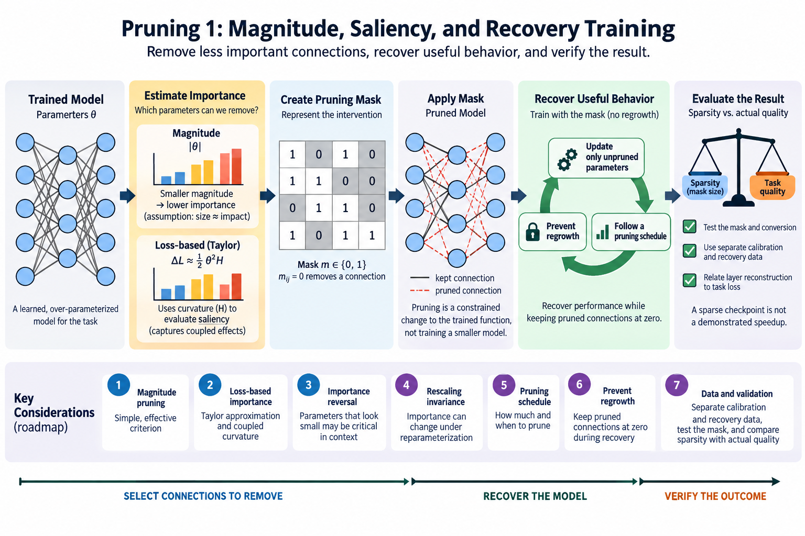
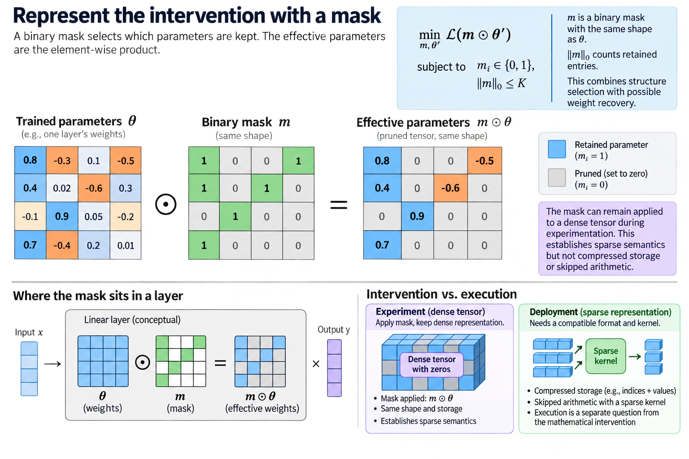
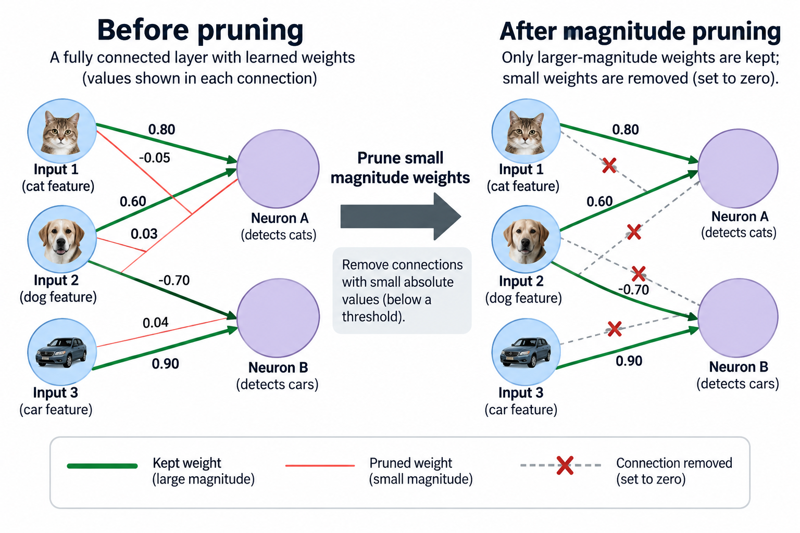
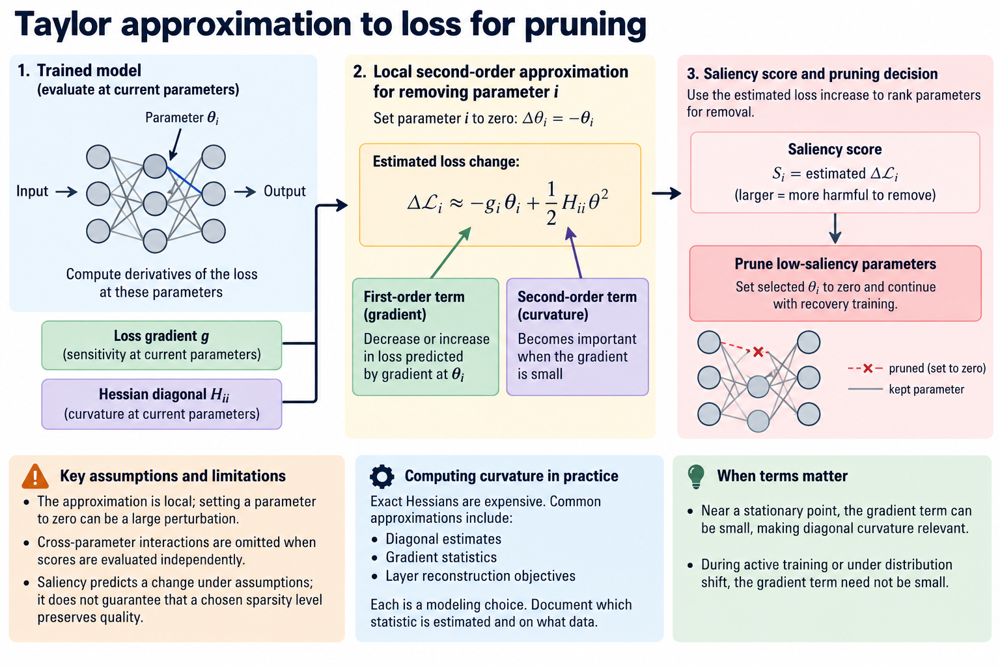
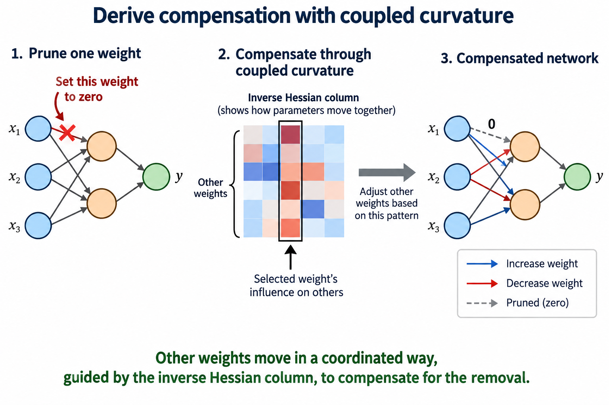
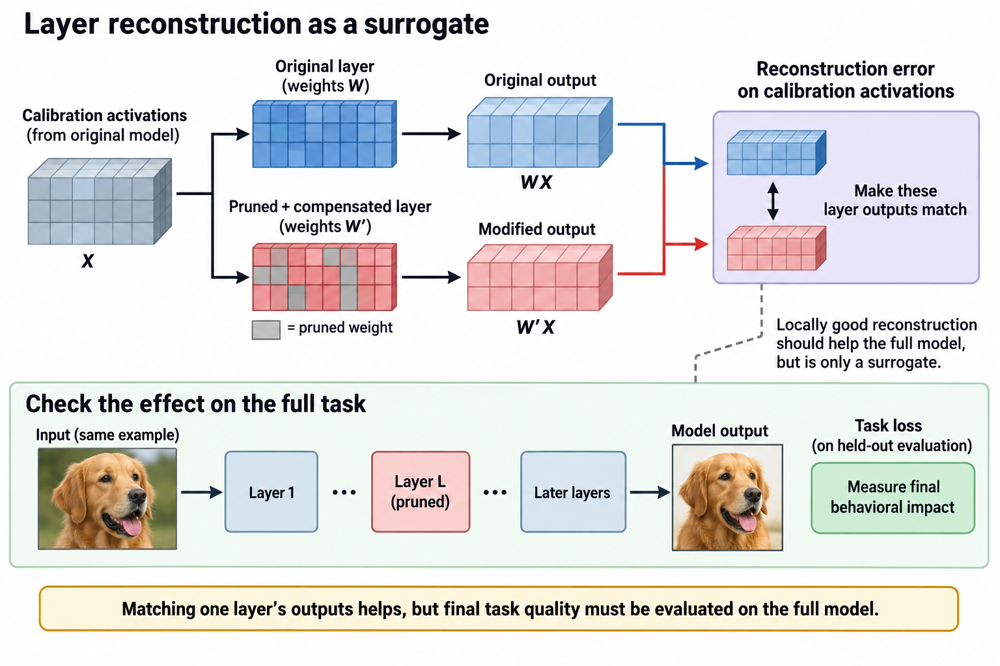

## Overview

Pruning removes selected connections or components from a learned network, and its appeal is straightforward, since a model can contain more parameters than a deployment needs for its task, but the 3 difficult questions are which parameters to remove, how to recover useful behavior, and whether the resulting representation actually executes more efficiently.

This article treats pruning as a constrained change to a trained function. It develops magnitude and loss-based importance criteria, explains their assumptions, and follows the recovery experiment. The next article addresses structured patterns and hardware execution, and separating the 2 questions keeps a sparse checkpoint from being mistaken for a demonstrated speedup.

*An original conceptual illustration. Numerical plots and examples are illustrative unless explicitly identified as measured evidence.*

## Deep dive

### 1. Represent the intervention with a mask

Let theta contain trained parameters and let m be a binary mask with the same logical shape. The effective parameters are their element-wise product. An illustrative pruning objective minimizes task loss under a nonzero budget:

$$
\min_{m,\theta'}\mathcal L(m\odot\theta')\quad\text{subject to}\quad
m_i\in\{0,1\},\ \|m\|_0\le K.
$$

The zero-norm notation counts retained entries rather than defining an ordinary vector norm, and the problem combines discrete structure selection with possible weight recovery, so solving it exactly is usually impractical for a large network, which is what motivates importance heuristics and approximate optimization.

A mask can remain applied to a dense tensor during experimentation. That gives you sparse semantics but neither of the 2 payoffs, compressed storage and skipped arithmetic. Deployment requires a compatible representation and kernel, so keep the mathematical intervention separate from its execution.

### 2. Explain magnitude pruning

Magnitude pruning retains parameters with larger absolute values under a chosen population. A threshold creates the mask; alternatively, a top-K rule retains a specified number. The original learning-connections paper uses 3 stages as a complete procedure: training, low-weight pruning, and retraining.

$$
m_i=\mathbf 1\{|\theta_i|\ge\tau\}.
$$

Small values can have small immediate effects in some settings, so magnitude is a cheap, useful signal. It is not a universal measure of importance. At least 4 other things affect what a weight contributes: input scale, normalization, parameterization, and downstream amplification.

Define whether the ranking is global, per layer, or per component. A global threshold can remove disproportionate structure from a layer whose numerical scale differs from the others, while a per-layer budget guards against that particular imbalance yet can retain unnecessary parameters in insensitive layers, so evaluate the allocation policy rather than treating its choice as harmless.

### 3. Use a Taylor approximation to loss

A loss-based saliency asks how removing a parameter changes the objective. If parameter i is set to zero, its perturbation is minus its current value. A local second-order Taylor expansion gives:

$$
\Delta\mathcal L_i\approx-g_i\theta_i+\frac12H_{ii}\theta_i^2.
$$

Here g is the loss gradient and H its Hessian at the evaluated parameters. Near a stationary point, the gradient term can be small, making diagonal curvature relevant. During active training or under distribution shift, that simplification need not hold.

The expansion is local, while setting a parameter to zero can be a large perturbation, and cross-parameter interactions drop out as soon as scores are evaluated independently, so saliency predicts a change under assumptions rather than proving that a selected sparsity level preserves quality.

Computing the exact Hessian is expensive. Approximate diagonals, gradient statistics, or layer reconstruction objectives reduce that cost but introduce another modeling choice. Document which statistic is estimated and on what data.

### 4. Derive compensation with coupled curvature

You can partly compensate for removing one weight by changing others. Under a quadratic loss model with positive-definite curvature, minimize perturbation cost while enforcing that the chosen coordinate becomes zero. A constrained solution uses a column of the inverse Hessian:

$$
\delta=-\frac{\theta_i}{(H^{-1})_{ii}}H^{-1}e_i,\qquad
\Delta\mathcal L_{\mathrm{quadratic}}=\frac{\theta_i^2}{2(H^{-1})_{ii}}.
$$

The unit vector e_i selects the coordinate. The perturbation's i-th entry equals minus theta_i, satisfying the constraint. Other entries distribute compensating changes according to the coupled curvature in the inverse Hessian, which is why independently zeroing weights can differ from an error-compensated method.

Singular or indefinite curvature needs additional treatment. A practical approximation can add damping or use a reconstruction objective with more convenient structure. This equation is a derivation of the quadratic model, not a claim that every pruning method computes a full model Hessian.

### 5. Work through an importance reversal

Consider 2 scalar weights with magnitudes 0.1 and 1.0. Suppose the first coordinate has diagonal curvature 1,000 and the second has curvature 1 under the local stationary approximation. Their estimated removal costs are 5 and 0.5 respectively.

Magnitude ranking would remove the 0.1 weight first, while the curvature model prefers removing the 1.0 weight, and the hypothetical example does not prove that curvature always wins: it shows that weight magnitude and sensitivity can disagree because the surrounding function amplifies perturbations differently.

Now introduce a nonzero gradient. The first-order term can change both rankings again, and a saliency measured on 1 batch can be noisy, so estimate it on representative data and then test the actual pruned model: use the approximation to pick an intervention, and use validation to establish the resulting behavior.

### 6. Examine rescaling invariance

In a compatible positively homogeneous network, 1 layer's weights can be scaled by a positive factor while the next layer's weights are inversely scaled, preserving the overall function. Magnitudes then change even though the model's predictions do not.

For an illustrative ReLU pair, scaling the first linear map by c and the second by 1 divided by c preserves the composed function under the stated bias and activation conditions, yet a naive global magnitude ranking can still change, which is a parameterization problem rather than evidence that every magnitude method is useless.

Normalization, biases, and architectural details can alter the simple invariance. Use the example to question an importance statistic's assumptions, not to claim all networks have identical symmetries. Layer-aware or activation-aware methods can address some issues, but require their own evaluation.

### 7. Choose the pruning schedule

The 3 schedules differ in cost, quality, and final structure: one-shot pruning removes a selected fraction at once, iterative pruning alternates smaller removals with recovery, and gradual pruning changes the budget during training.

Large one-shot perturbations can exceed the regime in which local saliency is informative. Iteration can update importance after the function changes, but it spends more training or calibration work. The appropriate schedule depends on task tolerance and available recovery resources.

Keep the total recovery budget in comparisons, because a method that gets much more retraining is not a controlled comparison of its selection rule alone. Record 5 details: removed fraction, iterations, data, optimizer, and the final execution representation. A sparse result should be reproducible as an artifact rather than reconstructed from an ambiguous description.

### 8. Prevent unintended regrowth

Applying a mask in the forward computation does not automatically describe optimizer behavior. Momentum, weight decay, and stored gradients, 3 separate mechanisms, can affect masked parameters unless the implementation handles them consistently. Define whether zeros remain fixed or whether regrowth is part of the method.

For fixed-mask recovery, verify the effective weights stay zero and the intended parameter population receives updates. Optimizer state may still occupy memory for masked dense entries. That matters to training-memory claims even when inference semantics are sparse.

A deployment artifact can physically remove structure or store only retained values. Such conversion should preserve the learned function under the supported sparse semantics. Compare the converted artifact with the masked reference before measuring speed.

### 9. Distinguish calibration and recovery data

Keep the 3 data roles separate: calibration data estimates importance or reconstruction error, recovery data updates the remaining parameters, and held-out evaluation estimates task behavior after the choices are made. Reusing the final test set to tune sparsity weakens the reported quality evidence.

Data distribution matters. A mask chosen on common examples can damage a rare but important subgroup. Evaluate task slices and shift scenarios appropriate to the application. A small average loss increase does not guarantee every required behavior survives.

Use reproducible sampling and retain preprocessing settings. If importance estimates vary substantially across calibration samples, report that variation or choose a more stable procedure. The mask is a learned decision conditioned on data, not an intrinsic truth about which connections are unnecessary everywhere.

### 10. Compare sparsity with actual quality

Sweep a small set of budgets and report task metrics with uncertainty. Compare against the original checkpoint under the same input and inference settings, and include 2 further columns: recovery cost and any changed numerical representation.

A useful curve plots quality against retained fraction. A deployment curve should additionally plot measured latency or memory, since retained fraction may not translate directly. These curves can reveal an insensitive region followed by sharp degradation, but the location is task- and model-dependent.

Do not infer acceptable sparsity from a result on another architecture. Sensitivity changes with 4 things: layer widths, normalization, routing, and training history. Use primary-paper experiments within their stated setup and measure the actual intended checkpoint.

### 11. Separate pruning from training a smaller model

A pruned trained model and a newly trained smaller model are different procedures. They can have similar parameter counts but different structures, initialization, and training cost. Comparing them can be useful if the complete resource budget is explicit.

Recovery preserves some learned weights, training from scratch spends another optimization path, and distillation adds teacher supervision, so do not fold any of the 3 into a pruning speed or quality claim without identifying its contribution.

For an infrastructure decision, compare feasible artifacts and their acquisition cost. An expensive compression procedure can still be worthwhile for many repeated inferences, while a rarely used model may not amortize that work. The experiment should connect preparation cost with deployment frequency.

### 12. Test the mask and conversion

Give a small matrix distinguishable entries, apply a known mask, and compare outputs with an explicit zeroed reference. Verify 3 things: retained counts, axis conventions, and supported bias behavior. Test mask application after serialization and loading.

For fixed-mask recovery, check that masked contributions remain zero through optimizer steps. For physical conversion, validate the output association and any surrounding dimension changes. Structural tests complement task evaluation; neither replaces the other.

No model-weight execution or GPU benchmark was performed for this article. Its numerical examples illustrate saliency assumptions. The practical sequence has 5 steps: define a budget, select structure with a documented statistic, recover within an explicit training budget, validate quality, and then measure the deployed sparse representation.

### 13. Relate layer reconstruction to task loss

A scalable pruning procedure can minimize the difference between a layer's original and modified outputs on calibration activations. For linear output WX, the reconstruction objective is the squared norm of the difference between WX and the pruned matrix applied to X. This gives a convenient quadratic structure and avoids calculating the Hessian for the complete language-model task.

The convenience is also a limitation. Matching 1 layer's calibration outputs is a surrogate for preserving the final task behavior, while later nonlinearities, residual interactions, and shifts in the activation distribution after earlier layers are pruned can all weaken that relationship, and a sequence of locally good approximations can still accumulate error.

A practical procedure should state whether it recalibrates later layers using the already modified network or keeps original activations. Those choices change which distribution the reconstruction objective sees. Do not treat either as a trivial implementation detail when comparing results.

For a tiny example, retain the original activations and explicitly calculate the reconstruction error before and after compensation. Then compare the complete model's output under the same inputs. This separates a mistaken quadratic solver from a limitation of the surrogate objective. Use held-out task evaluation after selecting the policy, since the calibration objective itself cannot establish final quality.

## Conclusion

This connection explains why second-order one-shot methods like SparseGPT can be computationally practical while still needing behavioral evidence, since their innovation lies partly in choosing a tractable local problem and solving it efficiently, and the deployment review must preserve both the mathematical approximation and its measured consequences.

### Sources

- [Learning both Weights and Connections for Efficient Neural Networks](https://arxiv.org/abs/1506.02626).
- [SparseGPT: Massive Language Models Can Be Accurately Pruned in One-Shot](https://arxiv.org/abs/2301.00774).
