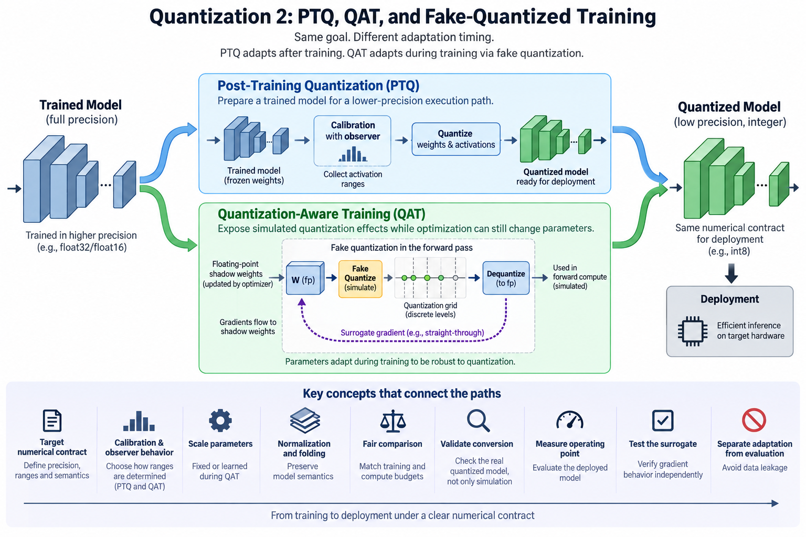
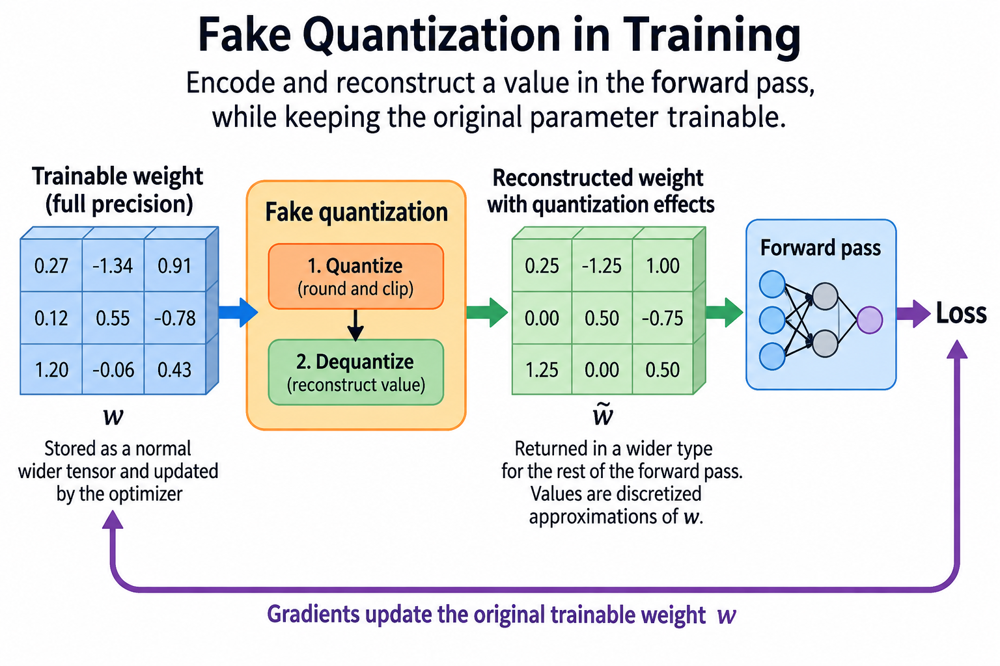
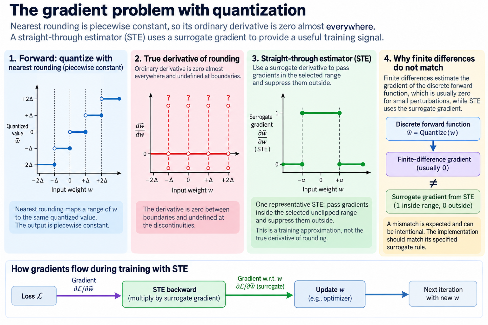
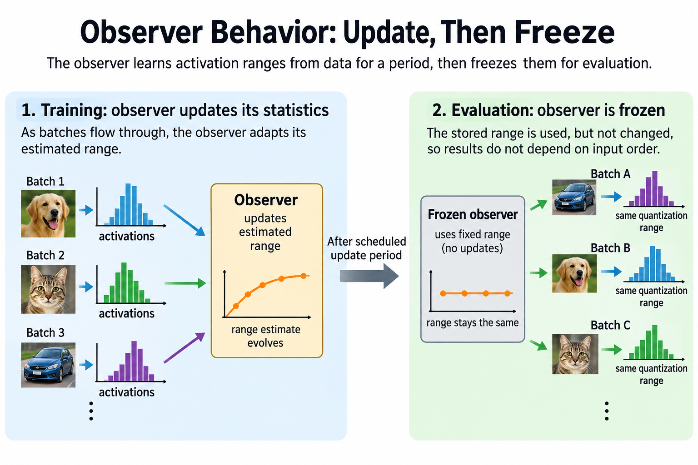

## Overview

Post-training quantization prepares a trained model for a lower-precision execution path. Quantization-aware training shows the model simulated quantization effects while the optimizer can still change parameters. The real difference between the 2 paths is when and how the model adapts to its numerical constraints, not which format name ends up on the final artifact.

This article walks through the forward and backward computation of fake quantization, then connects training choices to deployment conversion. The overview image contrasts the 2 preparation paths and shows a quantization grid inside the QAT forward pass, where a wider-precision shadow parameter can receive a surrogate gradient even though the deployed value will occupy a discrete code.

*An original conceptual illustration. Numerical plots and examples are illustrative unless explicitly identified as measured evidence.*

## Deep dive

### 1. Define the target numerical contract

Start with the supported inference backend, since 5 of its properties decide what the training simulation should represent: code intervals, scale granularity, zero-point rules, accumulation precision, and requantization behavior. A QAT setup that simulates an unsupported policy may produce a model that must be converted into a different numerical function.

The contract also says which tensors get quantized. The 3 options behave differently: weight-only inference, quantized weights and activations, and quantized cache state. Some layers can stay in another precision where the backend or the quality requirement needs it.

Record these decisions before picking a preparation method. Good training quality does not prove kernel support, and kernel support does not prove the trained model tolerates its numerical path. Validate both.

### 2. Explain the PTQ path

PTQ starts from a trained checkpoint. It applies calibration, transformations, or error-compensated weight preparation without ordinary full-model retraining under the target quantizer. Methods differ on 3 counts: whether they use data, whether they reconstruct layer outputs, and whether they optimize auxiliary transformations.

A representative PTQ layer objective compares original and quantized output on calibration activations:

$$
\widehat W=\arg\min_{W'\in\mathcal Q}\|WX-W'X\|_F^2.
$$

The feasible set describes the supported quantized representation. The equation does not mean every PTQ method solves this exact optimization, and it is just 1 useful example of adapting numerical preparation to the observed layer behavior.

Calibration cost and data requirements belong in the method comparison, because a result labeled post-training can still involve heavy reconstruction or parameter-search work, so report the actual procedure: PTQ is not always the same as rounding every weight on its own.

### 3. Define fake quantization

Fake quantization encodes and reconstructs a value during the training forward pass, usually returning it in a wider tensor type for the surrounding computation. The output carries quantization effects even though training storage is not necessarily packed low precision.

$$
\widetilde w=s\left[\operatorname{clip}\left(\operatorname{round}(w/s)+z,q_{\min},q_{\max}\right)-z\right].
$$

The wider parameter w can stay trainable. The forward pass uses its reconstructed value, so the loss sees a discretized approximation. Activation fake quantizers do the same to request-dependent values under their chosen granularity.

Fake quantization does not by itself cut training memory or speed up matrix arithmetic, since it is a simulation and optimization device and deployment conversion is what later creates the packed representation and the supported kernels, so keep the 2 claims separate: training memory and inference memory.

### 4. Explain the gradient problem

Nearest rounding is piecewise constant in its input. Its ordinary derivative is zero almost everywhere and undefined at boundaries. Use that derivative directly and no useful gradient flows through the quantizer in most regions.

A straight-through estimator substitutes a surrogate derivative. One common choice passes gradients inside the selected range and suppresses them outside it:

$$
\frac{\partial\widetilde w}{\partial w}\approx\mathbf 1\{w\text{ lies in the selected unclipped range}\}.
$$

This is not the true derivative of rounding. It is a training approximation that gives the optimizer a useful signal. Variants handle clipping, scales, and boundaries differently, so name the actual surrogate: STE is not 1 universally defined function.

The distinction matters when checking gradients. Finite differences of the discrete forward function will not generally agree with a surrogate gradient. That disagreement can be intentional. The implementation should still match its specified surrogate rule.

### 5. Work through a shadow-weight update

Take an illustrative scale of 0.25 and a trainable weight 0.62. Its fake-quantized forward value is 0.5 under nearest rounding. Suppose the surrogate loss gradient with respect to the shadow weight is minus 0.4 and the learning rate is 0.1. The shadow value increases to 0.66.

The reconstructed forward value then becomes 0.75 because the shadow parameter crossed a code boundary. Before crossing, several small shadow updates can leave the forward code unchanged. Optimization moves in the continuous shadow space while the loss sees discrete jumps.

This example does not prove convergence or reproduce a specific backend. It explains why QAT can adapt parameters despite zero ordinary rounding derivatives. At least 4 further choices shape the actual trajectory: momentum, weight decay, scale updates, and the remaining hyperparameters. Keep those choices in the training record.

### 6. Choose calibration and observer behavior

Observers estimate the ranges or statistics the quantizers use, early training values can be distributed differently from later ones, so changing observer state changes the numerical path, and an implementation can update statistics for a period and then freeze them on a documented schedule.

An exponential moving average illustrates one range-statistic update:

$$
a_t=(1-\mu)a_{t-1}+\mu\widehat a_t.
$$

The coefficient trades responsiveness against smoothing. This equation is a statistical mechanism, not a prescribed QAT schedule. Minima, maxima, histograms, and other estimators need their actual definitions.

If observers keep adapting during evaluation, measurements can depend on input order. Define evaluation and freezing behavior explicitly. A loaded artifact should not silently change its scale policy because a benchmark walks through samples in a different order.

### 7. Consider learned scale parameters

Some QAT methods train the scale or clipping parameters instead of fixing them from an observer. That changes the optimization problem: range and resolution become 2 trainable tradeoffs. Their gradients also need a documented approximation through the discrete code assignments.

A scale that shrinks too far increases saturation; a large scale loses resolution. Learning does not remove that tension. Constraints, initialization, gradient normalization, and regularization are 4 settings that all influence the result.

When comparing learned-scale approaches, use the actual method's equations and training evidence. A generic fake-quantized graph does not prove that every scale parameter receives a meaningful gradient. Inspect the graph and the optimizer's parameter population as part of correctness review.

### 8. Preserve normalization and folding semantics

Deployment can fold compatible normalization parameters into weights or fuse operations. That changes 2 things: which values get quantized and what their ranges are. QAT should model the relevant converted computation under its supported workflow.

A mismatch between simulated and folded weights can lose quality after conversion even when training evaluation looked good, bias units and scale placement matter too, and the numerical contract should describe the final computation rather than the convenient training graph.

Residual and branching interfaces need compatible scale handling. An integer addition can require aligned scales or a supported rescaling step. Do not assume 2 fake-quantized branches can be added in deployment without accounting for their representation.

### 9. Compare preparation budgets fairly

PTQ is attractive when retraining resources or task data are limited. QAT can adapt the learned function to lower precision, but it spends optimization work and can need suitable data, and neither of the 2 wins everywhere across formats, models, and budgets.

Report 5 items: calibration samples, training steps, parameter population, optimizer state, and the hardware used during preparation. If QAT uses more data and compute, a fair quality comparison covers the complete preparation procedures, not one isolated numerical trick.

Also include how often the artifact will be deployed. Extra training can pay off for a repeatedly served artifact but is hard to amortize for a short-lived checkpoint. Preparation cost belongs beside inference savings in the efficiency decision.

### 10. Distinguish QAT from quantized pretraining

Adapting a pretrained checkpoint under fake quantization is not the same as training a model from initialization with low-precision arithmetic. Quantized pretraining moves activations, gradients, and optimizer updates through a long training trajectory.

A frozen quantized base with trainable adapters is yet another procedure. QLoRA uses quantization to shrink base-weight residency while training low-rank updates. Do not describe it as updating all packed base weights through ordinary QAT.

The series has separate articles for adapters and QLoRA, and the training-format article covers low-precision training. Cross-link these methods without mixing up their parameter and numerical contracts.

### 11. Validate conversion, not only simulation

Compare the trained fake-quantized model with its converted inference artifact on small controlled tensors and held-out task data. Inspect 5 things: packed values, scale association, zero points, bias, and supported fallback layers.

A simulated forward pass can use wider arithmetic that hides overflow or scale-correction mistakes in the deployed path, while small floating-point differences can be expected under an allowed accumulation change, so define the intended tolerance and test the important boundary cases.

Use 5 kinds of input: negative values, zeros, endpoints, outliers, and partial quantization groups. Distinct channel patterns expose wrong scale axes. Structural tests prove the encoding correct; task evaluation proves the numerical approximation is still useful.

### 12. Measure the deployed operating point

Record 6 fields: checkpoint, preparation method, format, backend, shapes, and workload. Measure packed bytes, peak allocation, prefill or forward duration, and the relevant generation or output latency. Warm up the actual converted kernels.

Do not infer inference speed from the training simulation. A QAT model can have good quality and no efficient target kernel. A PTQ model can be fast under 1 backend and slow under another with decoding overhead or unsupported shapes.

No device benchmark was performed for this article. Its examples explain preparation and optimization. A complete result requires the converted artifact to meet the task quality contract and show useful deployment savings under the intended workload.

### 13. Test the surrogate independently

For a tiny fake quantizer, compare its forward output with explicit encode-and-reconstruct calculations. Then test its backward rule against the documented surrogate, not against ordinary finite differences through rounding. These are separate obligations.

Check values inside and outside clipping and near code boundaries. Verify observer freezing and scale parameter updates under the declared schedule. Optimizer state should apply to the intended shadow parameters or learned quantizer parameters.

Finally, rerun the conversion comparison after changing the backend or quantizer configuration. QAT is easiest to understand as a deliberate mismatch between a discrete forward function and a useful training surrogate, followed by a strict deployment-contract check, and keeping that distinction makes the method and its limits concrete.

### 14. Separate adaptation from evaluation leakage

QAT adjusts the model with training data, while PTQ commonly picks numerical parameters with calibration data. In the 2 cases alike, the final task evaluation must stay independent of the choices being tuned. Pick a bit width or training schedule from the final benchmark often enough and that benchmark becomes preparation data.

A clean experiment reserves 3 populations from the task's available data: training, calibration or validation, and final evaluation. State the split and any overlap the method requires. When data is scarce, report the limitation instead of presenting a repeatedly tuned score as independent evidence.

When preparation seeds or calibration samples materially change the result, measure across several of them, because surrogate-gradient training can follow different trajectories and 1 favorable run may not represent the method's typical quality, so the comparison should carry uncertainty rather than average performance alone.

This separation also helps diagnosis. Good simulation quality with failed conversion quality points to a numerical-contract mismatch, both failing on held-out data while training quality stays high points to adaptation or distribution issues, and quality passing with latency flat points to backend execution. The 3 patterns need different fixes, so do not collapse them into one claim that quantization succeeded or failed.

## Conclusion

A useful artifact therefore includes 5 records: training settings, calibration policy, converted representation, independent evaluation, and measured execution. Together they cover the complete preparation-to-deployment path. The STE is 1 part of that path, not a substitute for evidence that the final model meets the application requirements.

### Sources

- [Quantization and Training of Neural Networks for Efficient Integer-Arithmetic-Only Inference](https://arxiv.org/abs/1712.05877).
- [Learned Step Size Quantization](https://arxiv.org/abs/1902.08153).
- [LLM-QAT: Data-Free Quantization Aware Training for Large Language Models](https://arxiv.org/abs/2305.17888).
