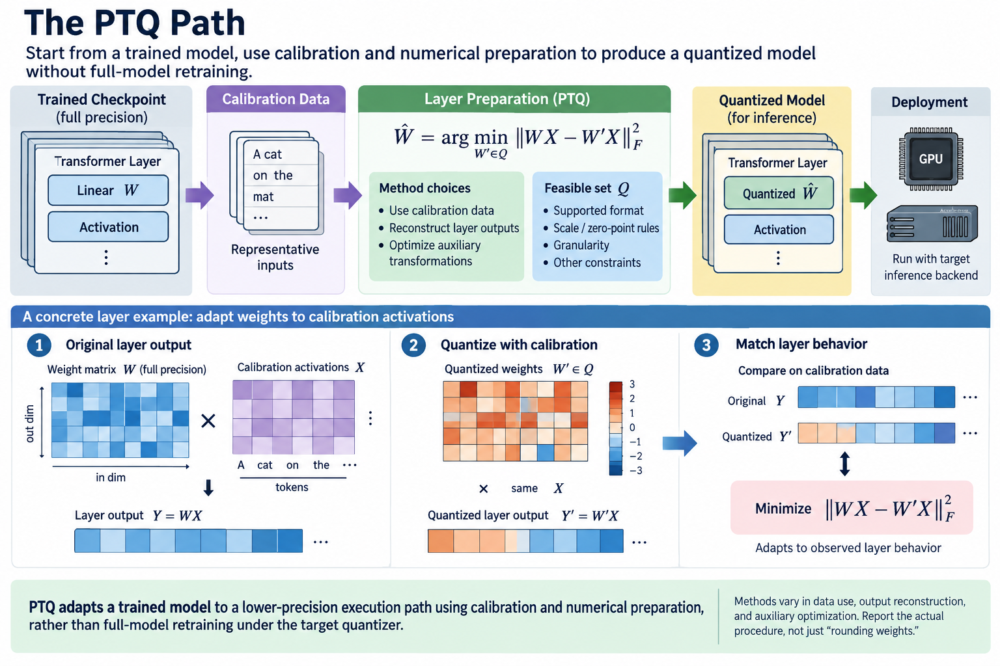
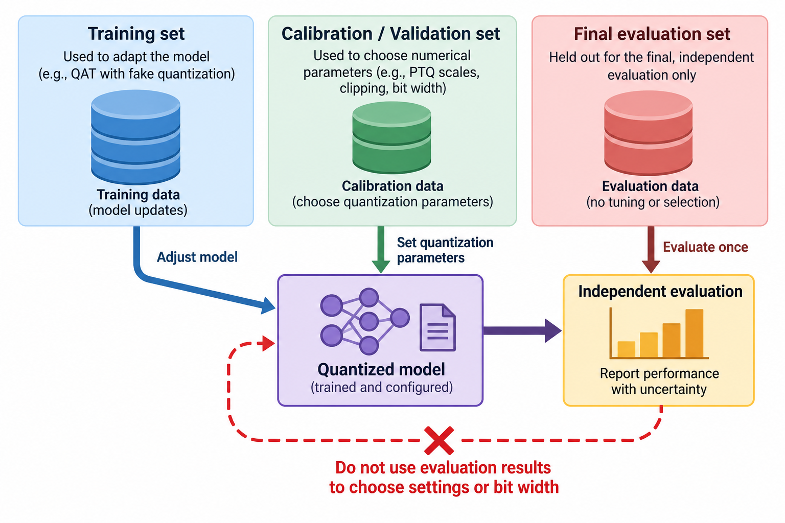

Post-training quantization prepares a trained model for a lower-precision execution path. Quantization-aware training exposes simulated quantization effects while optimization can still change parameters. The distinction is about when and how the model adapts to numerical constraints, not simply about which format name appears on the final artifact.

This article follows the forward and backward computation of fake quantization, then connects training choices to deployment conversion. The overview image contrasts the two preparation paths and shows a quantization grid inside the QAT forward pass. A wider-precision shadow parameter can receive a surrogate gradient even though the deployed value will occupy a discrete code.

*An original conceptual illustration. Numerical plots and examples are illustrative unless explicitly identified as measured evidence.*

## 1. Define the target numerical contract

Start with the supported inference backend. Its code intervals, scale granularity, zero-point rules, accumulation precision, and requantization behavior determine what the training simulation should represent. A QAT configuration simulating an unsupported policy may produce a model requiring conversion into another numerical function.

The contract also specifies which tensors are quantized. Weight-only inference, quantized weights and activations, and quantized cache state have different effects. Some layers can remain in another precision where the backend or quality requirement needs it.

Record these decisions before selecting a preparation method. Training quality cannot establish kernel support, and kernel support cannot establish that the trained model tolerates its numerical path. Both parts must be validated.

## 2. Explain the PTQ path

PTQ begins with a trained checkpoint and applies calibration, transformations, or error-compensated weight preparation without ordinary full-model retraining under the target quantizer. Methods differ in whether they use data, reconstruct layer outputs, or optimize auxiliary transformations.

A representative PTQ layer objective compares original and quantized output on calibration activations:

$$
\widehat W=\arg\min_{W'\in\mathcal Q}\|WX-W'X\|_F^2.
$$

The feasible set describes the supported quantized representation. The equation does not imply that every PTQ method solves this exact optimization. It provides a useful example of adapting numerical preparation to the observed layer behavior.

Calibration cost and data requirements belong in the method comparison. A result described as post-training can still involve substantial reconstruction or parameter-search work. Report the actual procedure rather than interpreting PTQ as always equivalent to rounding every weight independently.

## 3. Define fake quantization

Fake quantization encodes and reconstructs a value during the training forward pass, usually returning it in a wider tensor type for the surrounding computation. The output contains quantization effects even though storage during training is not necessarily packed low precision.

$$
\widetilde w=s\left[\operatorname{clip}\left(\operatorname{round}(w/s)+z,q_{\min},q_{\max}\right)-z\right].
$$

The wider parameter w can remain trainable. The forward operation uses its reconstructed value, so the loss sees a discretized approximation. Activation fake quantizers similarly affect request-dependent values under their selected granularity.

Fake quantization does not by itself reduce training allocation or accelerate matrix arithmetic. It is a simulation and optimization device. Deployment conversion later creates the packed representation and supported kernels. Keep training-memory and inference-memory claims separate.

## 4. Explain the gradient problem

Nearest rounding is piecewise constant with respect to its input. Its ordinary derivative is zero almost everywhere and undefined at boundaries. Using that derivative directly would prevent useful gradient updates through the quantizer in most regions.

A straight-through estimator substitutes a surrogate derivative. One representative choice passes gradients inside the selected range and suppresses them outside it:

$$
\frac{\partial\widetilde w}{\partial w}\approx\mathbf 1\{w\text{ lies in the selected unclipped range}\}.
$$

This is not the true derivative of rounding. It is a training approximation intended to provide useful optimization signal. Variants handle clipping, scales, and boundaries differently. State the actual surrogate rather than treating STE as one universally defined function.

The distinction matters when checking gradients. Finite differences of the discrete forward function will not generally agree with a surrogate gradient. A disagreement there can be intentional; the implementation should still match its specified surrogate rule.

## 5. Work through a shadow-weight update

Take an illustrative scale of 0.25 and a trainable weight 0.62. Its fake-quantized forward value is 0.5 under nearest rounding. Suppose the surrogate loss gradient with respect to the shadow weight is minus 0.4 and the learning rate is 0.1. The shadow value increases to 0.66.

The reconstructed forward value then becomes 0.75 because the shadow parameter crossed a code boundary. Before crossing, several small shadow updates can leave the forward code unchanged. Optimization acts in the continuous shadow space while the loss experiences discrete transitions.

This example does not establish convergence or reproduce a specific backend. It explains why QAT can adapt parameters despite zero ordinary rounding derivatives. Momentum, weight decay, scale updates, and other parameters influence the actual trajectory. The training record should preserve those choices.

## 6. Choose calibration and observer behavior

Observers estimate ranges or statistics used by quantizers. Early training values can have different distributions from later values, so changing observer state changes the numerical path. An implementation can update statistics for a period and then freeze them under a documented schedule.

An exponential moving average illustrates one range-statistic update:

$$
a_t=(1-\mu)a_{t-1}+\mu\widehat a_t.
$$

The coefficient trades responsiveness against smoothing. This equation represents a statistical mechanism, not a prescribed QAT schedule. Minima, maxima, histograms, and other estimators require their actual definitions.

If observers keep adapting while evaluating, measurements can depend on input order. Define evaluation and freezing behavior explicitly. A loaded artifact should not silently change its scale policy because a benchmark traverses samples in another order.

## 7. Consider learned scale parameters

Some QAT methods optimize scale or clipping parameters rather than fixing them from an observer. That changes the optimization problem because range and resolution become trainable tradeoffs. Their gradients also require a documented approximation through discrete code assignments.

A scale that becomes too small can increase saturation; a large scale can lose resolution. Learning does not remove that tension. Constraints, initialization, gradient normalization, and regularization can influence the result.

Use the actual method's equations and training evidence when comparing learned-scale approaches. A generic fake-quantized graph does not establish that all scale parameters receive meaningful gradients. Inspect the graph and optimizer parameter population as part of correctness review.

## 8. Preserve normalization and folding semantics

Deployment can fold compatible normalization parameters into weights or otherwise fuse operations. That changes the values to be quantized and their ranges. QAT should model the relevant converted computation under its supported workflow.

A mismatch between simulated and folded weights can produce quality loss after conversion even if training evaluation looked good. Bias units and scale placement also matter. The numerical contract should describe the final computation rather than only the convenient training graph.

Architecture-specific residual and branching interfaces need compatible scale handling. An integer addition can require aligned scales or a supported rescaling step. Do not assume two fake-quantized branches can be added in deployment without accounting for their representation.

## 9. Compare preparation budgets fairly

PTQ can be attractive when retraining resources or task data are limited. QAT can adapt the learned function to lower precision but spends optimization work and can require suitable data. Neither universally dominates across formats, models, and budgets.

Report calibration samples, training steps, parameter population, optimizer state, and hardware used during preparation. If QAT uses more data and compute, a quality comparison evaluates complete preparation procedures rather than one isolated numerical trick.

Also include the expected deployment frequency. Additional training can be worthwhile for a repeatedly served artifact but difficult to amortize for a short-lived checkpoint. Preparation cost belongs beside inference savings in the efficiency decision.

## 10. Distinguish QAT from quantized pretraining

Adapting a pretrained checkpoint under fake quantization is different from training a model from initialization with low-precision arithmetic. Quantized pretraining involves moving activations, gradients, and optimizer updates over a long training trajectory.

A frozen quantized base with trainable adapters is another distinct procedure. QLoRA uses quantization to reduce base-weight residency while training low-rank updates. It should not be described as updating all packed base weights through ordinary QAT.

The series contains separate articles for adapters and QLoRA, while the existing training-format article addresses low-precision training. Cross-link these methods without conflating their parameter and numerical contracts.

## 11. Validate conversion, not only simulation

Compare the trained fake-quantized model with its converted inference artifact on small controlled tensors and held-out task data. Inspect packed values, scale association, zero points, bias, and supported fallback layers.

A simulated forward pass can use wider arithmetic that hides overflow or scale-correction mistakes in the deployed path. Conversely, small floating-point differences can be expected under an allowed accumulation change. Define the intended tolerance and test important boundary cases.

Use negative values, zeros, endpoints, outliers, and partial quantization groups. Distinct channel patterns expose wrong scale axes. Structural tests establish encoding correctness, while task evaluation establishes that the resulting numerical approximation remains useful.

## 12. Measure the deployed operating point

Record checkpoint, preparation method, format, backend, shapes, and workload. Measure packed bytes, peak allocation, prefill or forward duration, and relevant generation or output latency. Warm up the actual converted kernels.

Do not infer inference speed from the training simulation. A QAT model can have good quality but lack an efficient target kernel. A PTQ model can be efficient under one backend and slower under another with decoding overhead or unsupported shapes.

No device benchmark was performed for this article. Its examples explain preparation and optimization. A complete result requires the converted artifact to satisfy the task quality contract and demonstrate useful deployment savings under the intended workload.

## 13. Test the surrogate independently

For a tiny fake quantizer, compare its forward output with explicit encode-and-reconstruct calculations. Then test its backward rule against the documented surrogate rather than ordinary finite differences through rounding. These are separate obligations.

Check values inside and outside clipping and near code boundaries. Verify observer freezing and scale parameter updates under the declared schedule. Optimizer state should apply to the intended shadow parameters or learned quantizer parameters.

Finally rerun conversion comparison after changing backend or quantizer configuration. QAT is most understandable as a deliberate mismatch between a discrete forward function and a useful training surrogate, followed by a strict deployment-contract check. Preserving that distinction makes the method and its limitations concrete.

## 14. Separate adaptation from evaluation leakage

QAT adjusts the model using training data, while PTQ commonly selects numerical parameters using calibration data. In both cases, the final task evaluation should remain independent of the choices being tuned. Repeatedly selecting a bit width or training schedule from the final benchmark turns that benchmark into preparation data.

A clean experiment can reserve a training population, a calibration or validation population, and a final evaluation population under the task's available data. State the split and any overlap required by the method. When data is scarce, report the limitation rather than presenting a repeatedly tuned score as independent evidence.

Measure changes across several preparation seeds or calibration samples when they materially influence the result. Surrogate-gradient training can follow different trajectories, and a single favorable run may not represent the method's typical quality. The comparison should preserve uncertainty as well as average performance.

This separation also improves diagnosis. If simulation quality is good but conversion quality fails, inspect numerical-contract mismatch. If both fail on held-out data while training quality remains high, investigate adaptation or distribution issues. If quality passes but latency does not improve, inspect backend execution. These patterns require different remedies and should not be collapsed into one claim that quantization succeeded or failed.

A useful artifact therefore includes training settings, calibration policy, converted representation, independent evaluation, and measured execution. Together they establish the complete preparation-to-deployment path. The STE is one part of that path, not a substitute for evidence that the final model meets the application requirements.

## Sources

- [Quantization and Training of Neural Networks for Efficient Integer-Arithmetic-Only Inference](https://arxiv.org/abs/1712.05877).
- [Learned Step Size Quantization](https://arxiv.org/abs/1902.08153).
- [LLM-QAT: Data-Free Quantization Aware Training for Large Language Models](https://arxiv.org/abs/2305.17888).
