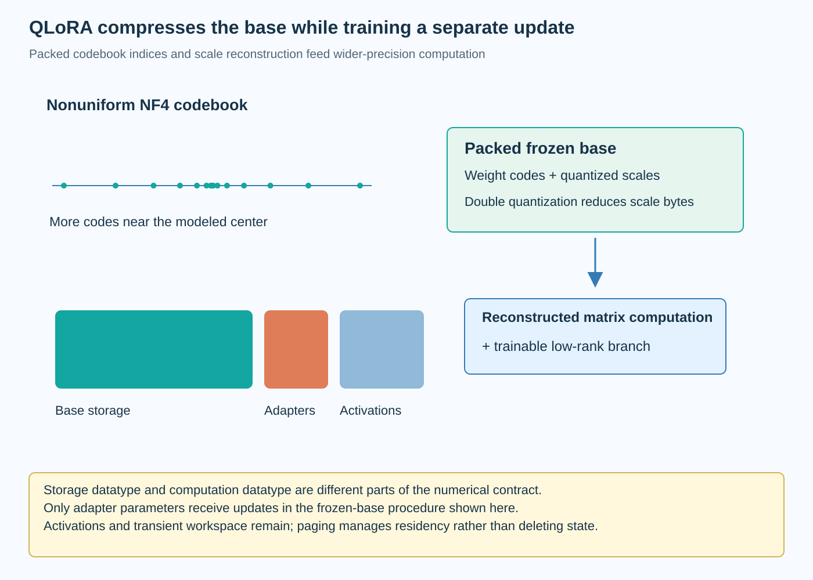

QLoRA combines a frozen quantized base with trainable low-rank adapters. It reduces the storage required by the pretrained weights while retaining a wider computation path for adaptation. The method also addresses quantization-constant overhead and transient optimizer-memory pressure. These mechanisms affect different terms in the training resource model.

The phrase 4-bit finetuning can hide that separation. The base weights are stored in a low-bit representation, but the original QLoRA setup does not update every packed base value as an ordinary 4-bit trainable parameter. This article derives the numerical interface and explains what must be counted, validated, and exported.

*An original conceptual illustration. Numerical plots and examples are illustrative unless explicitly identified as measured evidence.*

## 1. Separate base storage and adaptation

Let Q(W_0) denote the packed quantized base and D its dequantization operator. Low-rank factors A and B add a trainable update to the reconstructed base mapping.

$$
y=\left[D(Q(W_0))+sBA\right]x.
$$

The base representation is fixed during the adapter-training procedure considered here. A and B receive optimizer updates. The scalar s follows the chosen adapter convention and must accompany the artifact.

The original paper uses a low-bit storage datatype and usually BFloat16 computation. Other implementations can use different supported paths. Report actual storage and compute formats rather than describing the whole training graph with one nominal bit width.

## 2. Explain nonuniform code values

Uniform affine quantization spaces reconstructed values evenly over a range. NormalFloat uses a nonuniform set of representable values motivated by a normal-distribution model for weights. More resolution is placed where that modeled distribution carries more probability.

Let Phi inverse denote the standard normal quantile function. Quantile-derived values motivate the codebook construction, with normalization and special handling to represent zero in the actual NF4 datatype.

$$
v_i\propto\Phi^{-1}(u_i),\qquad 0<u_i<1.
$$

This schematic equation explains the distributional idea rather than reproducing the exact codebook algorithm. The primary paper specifies the construction and values. A 4-bit code selects one of 16 representable entries; it is not a conventional floating-point value with arbitrary exponent and mantissa fields.

## 3. Keep the distribution assumption visible

A normal-inspired codebook is useful when the normalized weight population resembles the assumed distribution. Actual tensors can have outliers, skew, or different local structure. Block normalization also changes the distribution presented to the codebook.

The paper's optimality language belongs to its stated distributional criterion. It should not be expanded into a universal guarantee of minimum task loss or minimum reconstruction error for every possible tensor. Quantizer design and downstream model quality are different objectives.

Inspect actual block ranges and held-out behavior. Compare supported codebooks under a controlled representation and training recipe when the choice matters. A numerical datatype's theoretical motivation is evidence for a design, while deployment suitability still needs checkpoint-specific evaluation.

## 4. Define blockwise reconstruction

A block of weights shares a scale c under a chosen grouping policy. Each packed code k_i selects a codebook value v_k. Reconstruction multiplies that value by the block scale.

$$
\widehat w_i=c\,v_{k_i},\qquad k_i\in\{0,\ldots,15\}.
$$

The scale, group size, axis, and padding policy form part of the format. Two artifacts both called NF4 can still be incompatible if their packing or scale conventions differ.

Include zero-range and partial-block handling in a tiny correctness test. Compare the packed reconstruction with a direct reference using known values. This tests the numerical interface before the student-training or task-quality question is investigated.

## 5. Count quantization constants

Scales are not free. If each block of g weights stores one 32-bit scale, the scale overhead is 32 divided by g bits per weight, before other metadata.

$$
b_{\mathrm{effective}}=4+\frac{32}{g}.
$$

At an illustrative block size of 64, that totals 4.5 bits per weight. A simple 4-bit payload estimate would miss an extra 0.5 bits per value in this format.

The exact artifact can include other constants, unquantized tensors, and padding. Report serialized and resident bytes separately. Neither is established by nominal payload alone, and peak training allocation includes additional state beyond the packed checkpoint.

## 6. Derive double-quantization overhead

Double quantization compresses the first-level quantization constants. In the paper's discussed setup, the first-level scale uses an 8-bit representation, with another 32-bit constant shared across 256 such values.

$$
b_{\mathrm{scale}}\approx\frac8{64}+\frac{32}{64\cdot256}\approx0.127\ \text{bits per weight}.
$$

This reduces the described scale overhead from 0.5 bits per weight by approximately 0.373 bits. These are representation-accounting figures from the specified group sizes, not a measured universal checkpoint compression ratio.

The second quantization introduces another approximation and requires its own constants and reconstruction policy. The paper also centers scale values before that step. Preserve those details when checking an implementation rather than treating double quantization as simply deleting scale storage.

## 7. Work through a storage estimate

For an illustrative tensor containing one billion quantized values, a pure 4-bit payload occupies 500 million bytes. First-level 32-bit scales at group size 64 add 62.5 million bytes.

Using the discussed double-quantization scale accounting instead adds approximately 15.87 million bytes, before padding and other representation fields. The resulting total is approximately 515.87 million bytes for this restricted example.

These decimal byte counts do not describe a full language model or its runtime allocation. Embeddings, other retained tensors, adapters, activations, workspace, and optimizer state can change the total substantially. State the units and the included categories so that a storage example is not mistaken for a capacity benchmark.

## 8. Propagate gradients through the fixed base

Although the base is frozen, its mapping can still be needed to propagate gradients to earlier trainable components. For a linear layer with output derivative g_y, the input derivative depends on the effective matrix transpose.

$$
g_x=\left[D(Q(W_0))+sBA\right]^\top g_y.
$$

No optimizer update to the packed base follows merely because it participates in this derivative. Freeze status governs parameter updates; the numerical mapping still contributes to forward and backward computation.

This explains why frozen does not mean computationally absent. Dequantization and matrix execution remain part of training. Confirm that base gradients and optimizer slots are not retained unnecessarily, while preserving the required input-gradient path for adapted earlier layers.

## 9. Keep activation memory in the model

Adapter state can be small while long-sequence activations dominate training memory. Quantizing base storage does not remove the need to store or recompute inputs used by backward operations.

Checkpointing changes that tradeoff by recomputing selected activations. Batch size, sequence length, attention execution, and checkpoint granularity all influence peak allocation. The correct capacity question therefore includes more than base bytes and trainable parameters.

Measure the intended workload and inspect allocation by category where possible. A reported model size and rank are insufficient to reproduce a peak-memory result. Include numerical formats, optimizer policy, and workspace behavior in the training configuration.

## 10. Explain paged optimizer state

The original QLoRA work uses paged optimizers to manage transient memory pressure through a supported unified-memory mechanism. Optimizer pages can move between host and device memory as required.

Paging does not eliminate the state or make transfers free. It changes where the state resides and how pressure is handled. Transfer behavior depends on the workload, memory availability, device, and software stack.

Distinguish a configuration that normally fits from one that repeatedly incurs migration during every update. Report host-memory use and preparation time when paging affects the resource budget. The paper's stated experiments should not be generalized into a guarantee that paging has no performance cost under every operating condition.

## 11. Select adapters and baselines consistently

The number and placement of adapters materially affect the trainable update space. The QLoRA paper discusses adapter placement and baseline tuning as important experimental choices under its studied configurations.

A comparison with fewer adapted modules can confound numerical base precision with capacity. Document all selected matrices, ranks, scale conventions, and any additional trained tensors. Match the intended adaptation task and evaluation setup.

Compare with a wider-precision adapter baseline and, when appropriate, a well-tuned full-adaptation baseline. The purpose is to identify what the compressed base changes under fair evidence, rather than attributing every difference to one datatype while the training recipe also changes.

## 12. Evaluate the reconstructed base first

Before adapter training, compare the quantized-base reference with the original checkpoint. This reveals the initial numerical change that adaptation must work with. Track task quality as well as diagnostic reconstruction error where useful.

Adapter learning can compensate for some effects without restoring every behavior. An improvement on one adaptation task does not establish unchanged capability elsewhere. Evaluate relevant held-out slices, including contexts and tasks important to the deployment.

Keep preprocessing, prompts, decoding, and quality implementation fixed. A comparison with different generation budgets can obscure the effect of base quantization. No adaptation run or GPU measurement was performed for this article; the examples are numerical accounting and mechanism explanations.

## 13. Choose an export representation

One deployment option keeps the quantized base and separate adapters. Another reconstructs the base, adds the update, and writes a new representation. If that representation is quantized again, it introduces a new numerical approximation.

$$
W_{\mathrm{export}}=Q_{\mathrm{new}}\!\left(D(Q(W_0))+sBA\right).
$$

The export operator is not generally equivalent to leaving the original packed base plus a separate adapter branch. Requantization changes code assignments and scales, so evaluate the exported checkpoint independently.

Store the original base revision and all adapter metadata. Verify that the serving backend supports the chosen combination. A training library successfully loading the artifact does not establish compatibility or efficient execution in a different inference backend.

## 14. Relate the method to deployment objectives

QLoRA chiefly addresses adaptation resource requirements through compressed frozen storage, small trainable updates, and memory-pressure management. Inference savings depend on what is eventually exported and which kernels execute it.

A student trained with QLoRA can be served in a wider representation, or its low-bit base can remain part of inference. Those are different deployments. Report the actual path rather than inferring latency from the training method's name.

The complete explanation therefore separates codebook design, scale overhead, gradient computation, adapter state, paging, and export. That makes the innovation understandable and gives an engineer a concrete list of resource terms to measure for the intended task.

## 15. Verify the layered reconstruction contract

Double quantization creates 2 reconstruction stages: recover the first-level scale values, then use them to reconstruct weight values from their codes. A swapped grouping axis or incorrect centering constant can corrupt the result even when the 4-bit payload decodes correctly.

Use small known blocks to verify both stages separately. Include a partial final block and scales with distinct magnitudes. Then compare a tiny adapted linear mapping with a direct reconstructed reference, preserving orientation and the adapter scale.

Numerical agreement establishes implementation correctness within the chosen tolerance. It does not establish that the normal-inspired codebook suits every weight population or that the exported student retains all required behavior. Held-out evaluation and complete resource measurement answer those additional questions.

Maintain the packed base identity, codebook convention, group sizes, compute precision, adapter settings, and export policy together. This metadata is what turns a compact parameter file into a reproducible adaptation artifact.

## 16. Separate persistent and transient allocations

Persistent packed weights and adapter optimizer state remain allocated across many training steps. Temporary reconstructed tiles, attention workspace, and intermediate activations can have shorter lifetimes. Their overlap determines the peak, so adding every individual maximum can overestimate memory while ignoring overlap can underestimate it.

Inspect the actual allocation timeline when a job fails only on particular sequence lengths. A rare long batch can create pressure absent from the average workload. Record the maximum tested case and the paging or checkpoint behavior used to handle it. This makes a capacity claim specific to an operating envelope rather than an unsupported assertion that a checkpoint always fits.

## Sources

- [QLoRA: Efficient Finetuning of Quantized LLMs](https://arxiv.org/abs/2305.14314).
- [LoRA: Low-Rank Adaptation of Large Language Models](https://arxiv.org/abs/2106.09685).
- [NVIDIA CUDA Unified Memory documentation](https://docs.nvidia.com/cuda/cuda-c-programming-guide/index.html).
