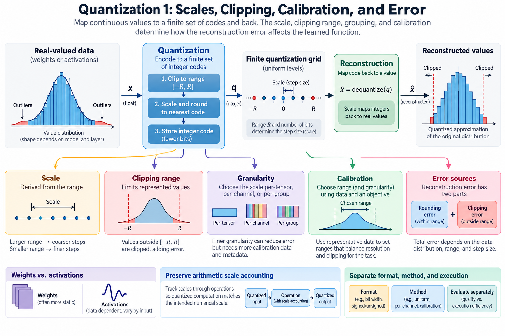
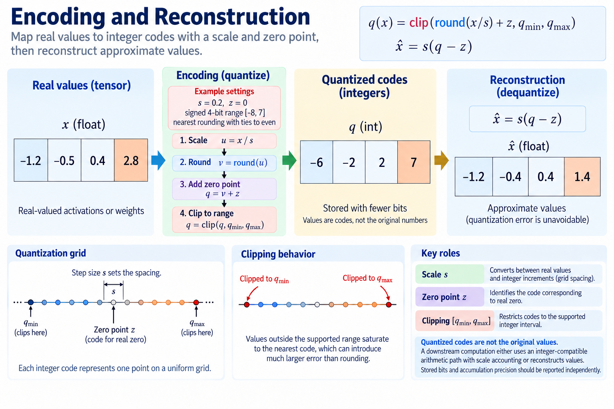
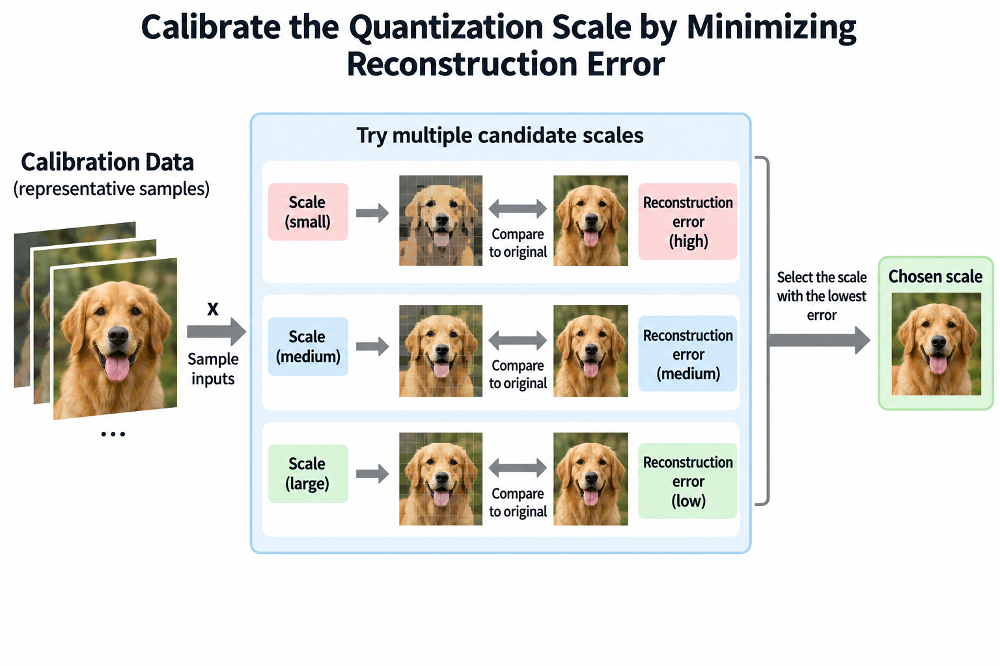
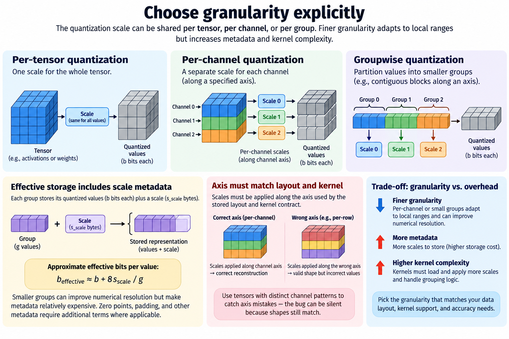
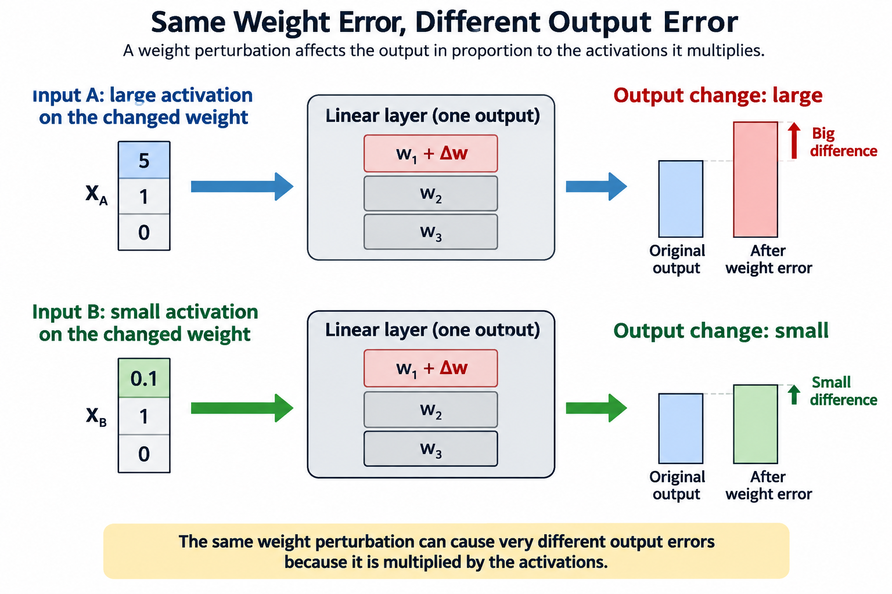
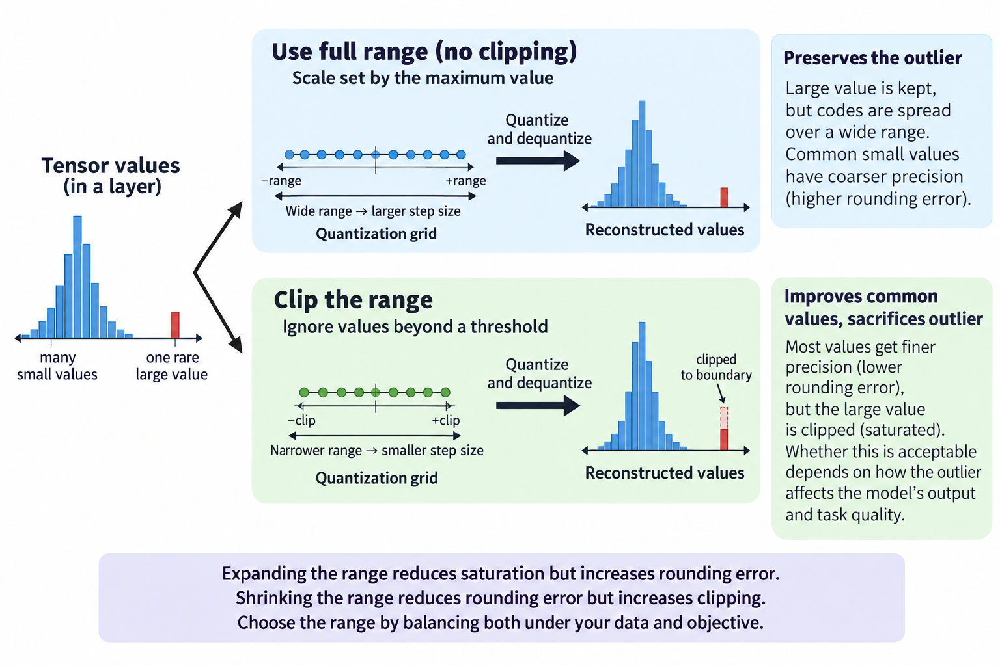

## Overview

Quantization stores numbers as a small set of codes plus a rule for turning codes back into values. Fewer bits mean less storage and less traffic, but the reconstruction introduces error, and 4 choices decide how that error interacts with the learned function: the scale, the clipping range, the grouping, and the calibration data.

This article covers uniform quantization first and leaves specialized methods for later. Picture a value distribution laid over a finite grid: shrink the range and you get finer steps near the common values but clip the outliers, expand it and you keep the outliers while every step gets coarser, and that tension is most of what calibration is about.

*An original conceptual illustration. Numerical plots and examples are illustrative unless explicitly identified as measured evidence.*

## Deep dive

### 1. Define encoding and reconstruction

In an affine integer quantizer, the scale s converts between real values and integer steps. The zero point z is the code that represents real zero. Clipping keeps codes inside the supported integer interval.

$$
q(x)=\operatorname{clip}\left(\operatorname{round}(x/s)+z,q_{\min},q_{\max}\right),\qquad
\widehat x=s(q-z).
$$

The equation describes a family of quantizers, not one, because 4 details live in the actual implementation: the rounding mode, the signed interval, saturation, and the handling of nonfinite values. To reproduce a quantizer, keep those details. Not every integer cast is the same quantization.

Quantized codes are not the original values. Downstream compute takes 1 of 2 routes: an integer path that tracks the scales, or reconstruction in another precision, so report stored bits and accumulation precision separately.

### 2. Derive scale from a range

If the chosen real interval runs from a to b and the integer codes run from q_min to q_max, a common affine scale is the real width divided by the integer width. Where the policy requires it, the zero point aligns real zero with an allowed code.

$$
s=\frac{b-a}{q_{\max}-q_{\min}}.
$$

The interval must not collapse to a point, or the code needs an explicit fallback, and rounding or clipping the zero point can change which endpoints are represented exactly, while symmetric signed quantizers often set the zero point to zero and derive the scale from the largest absolute endpoint under their actual signed-code convention.

A signed b-bit format does not always have symmetric integer endpoints around zero. Some policies leave 1 code unused to keep the range symmetric. State the convention before comparing scales or errors across implementations.

### 3. Separate rounding error and clipping error

Inside the range, nearest rounding is off by at most half a step. Outside the range, clipping can be off by much more, so treat the 2 regions separately.

$$
|x-\widehat x|\le\frac{s}{2}\quad\text{for the unsaturated nearest-rounding region}.
$$

The familiar mean squared error estimate of s squared divided by 12 assumes a roughly uniform rounding residue and no clipping. Real activations often break those assumptions: mass concentrates, tails are heavy, and values correlate.

Use the estimate to reason about resolution rather than to predict task quality without evidence, because a few clipped values can matter a lot when they feed sensitive projections and average element-wise error hides that effect completely.

### 4. Work through a small grid

Take a hypothetical symmetric grid with scale 0.25 and allowed codes from minus 4 through 4. The reconstructed interval runs from minus 1 to 1. A value of 0.62 rounds to code 2 and reconstructs as 0.5. A value of 0.88 rounds to code 4 and reconstructs as 1.0.

A value of 1.7 saturates at the largest code and reconstructs as 1.0, an error of 0.7. That error is far larger than the half-step rounding bound because the value sits outside the range. The small code set here is for illustration, not a claim about a standard packed format.

Now double the scale to 0.5 and keep the codes fixed. The interval widens, so the outlier saturates less, but the step gets coarser for the common small values. Calibration picks between these competing errors under a stated objective.

### 5. Formulate calibration as an optimization

Sample calibration values from a representative distribution. The 2 objectives differ: one picks the range or scale that minimizes reconstruction error on the sample, while the other measures the change in a layer's output instead of the change in its inputs or weights.

$$
\widehat s=\arg\min_s\frac1N\sum_{i=1}^{N}\left(x_i-\widehat x_i(s)\right)^2.
$$

The objective depends on the data and can jump when code assignments change, so in practice you search over a supported set of scales or clipping thresholds and then validate the chosen policy on data you did not tune on.

Reconstruction error is a stand-in. It can preserve a layer's behavior and still miss a direction the task cares about. Task quality and numerical correctness stay separate checks, and low reconstruction error does not make 2 quantizers behave the same.

### 6. Interpret statistical assumptions

A calibration histogram estimates the distribution seen during preparation. How useful it is depends on 3 things: sample size, preprocessing, and how well it matches deployment inputs. A maximum-range estimator reacts to rare observed extremes. Percentile clipping deliberately drops some tail mass.

You can also fit a distribution's parameters and derive a clipping rule from the fit. MLE uses the observed-data likelihood; MAP adds an explicit prior. Neither guarantees the chosen distribution family fits actual activations.

For heavy-tailed or multimodal data, a convenient Gaussian model can underestimate rare values. Look at the empirical tails and held-out reconstruction; do not trust a parametric estimate alone. Distribution shift can break calibration even when the encoding implementation stays correct.

### 7. Choose granularity explicitly

Per-tensor quantization uses 1 scale for a whole tensor, per-channel quantization assigns scales along a specified axis, and groupwise quantization partitions values into smaller groups, so finer granularity adapts to local ranges while adding metadata and kernel complexity.

If each group contains g values, each payload uses b bits, and each scale uses s_scale bytes, a simple effective storage model is:

$$
b_{\mathrm{effective}}\approx b+\frac{8s_{\mathrm{scale}}}{g}.
$$

Zero points, padding, and other metadata add more terms where they apply. The formula shows why nominal payload bits understate total storage. Small groups improve numerical resolution but make the metadata relatively expensive.

The grouping axis must match the stored layout and kernel contract. Apply scales to the wrong axis and the tensor shapes still work, but the reconstructed values are wrong. Distinct channel patterns make that bug easier to detect.

### 8. Distinguish weights and activations

Weights are fixed at inference time, so preparation and packing cost is paid once. Activations depend on the request input, so their ranges move. A policy that works for weights does not automatically work for activations.

The 2 activation policies differ: static quantization uses parameters from calibration, while dynamic quantization estimates them during execution within a supported scope and so adapts to the current values at the price of range estimation and scaling.

KV state and recurrent state add reuse and accumulation behavior of their own. Treat quantizing them as a separate numerical change and evaluate it separately. A weight-only memory claim says nothing about cache reduction or long-context behavior.

### 9. Analyze projection sensitivity

For a linear layer, a weight perturbation delta W changes the output by delta W times X. So the activation distribution matters to weight error. Coordinates that often carry large or important activations amplify particular quantization changes.

$$
\Delta Y=\Delta W X,\qquad
\|\Delta Y\|_F\le\|\Delta W\|_2\|X\|_F.
$$

The norm bound can be loose and says nothing about full-network quality, yet it still explains why minimizing raw weight error is not the same as minimizing output error. GPTQ, AWQ, and SmoothQuant each use that relationship; later articles in this series cover them.

For a tiny example, quantize 1 weight direction, hold another fixed, and compare outputs under 2 activation populations. Equal weight error can give unequal output error. Sensitivity comes from the surrounding data and the learned function, not the weight error alone.

### 10. Preserve arithmetic scale accounting

Integer matrix products accumulate code products in a wider type, then reconstruct the result with the operand scales. Nonzero zero points add correction terms. Bias and requantization must use compatible units.

A kernel built for symmetric weights and activations does not automatically handle an arbitrary affine quantizer. Read 4 parts of its contract: the supported scale layout, the grouping, the accumulator range, and the output policy. Overflow or a wrong zero-point correction can swamp any intended rounding error.

Compare the integer or packed path against an explicit reconstruction reference on small, nontrivial tensors. Test 5 cases: negative values, zeros, endpoints, partial groups, and bias. That proves the implementation correct before you evaluate task quality or speed.

### 11. Separate format and method

INT4, FP8, and FP4 are representation families. GPTQ, AWQ, and SmoothQuant are methods for preparing or transforming values under particular designs. QAT is a training approach that lets the optimizer see quantization effects.

A method can be adapted to another supported representation, but check its objective and implementation when you do. Equal nominal bit counts do not mean equal dynamic range, error, or kernel support, so report the 2 things together: the format and the preparation method.

When quoting a provider benchmark, keep the 4 conditions it applies to: the checkpoint, the precision, the calibration, and the backend. A reported quality result is not a guarantee for every model that shares the acronym. Read the primary method papers and measure the actual artifact.

### 12. Evaluate quality and execution separately

Measure 5 quantities: held-out reconstruction, task quality, packed weight bytes, peak allocation, and phase-specific runtime. A quantized artifact can fit in memory without running faster, if decoding overhead or unsupported shapes dominate.

Keep the baseline and quantized workloads identical unless you state a policy change. Warm up the intended kernels, and count preparation cost in cold-start or amortization analysis. Record fallback paths when the backend runs unsupported layers at another precision.

No model execution or GPU benchmark was performed for this article. The calculations explain numerical representation. Deployment evidence needs the actual encoding, kernels, checkpoint, and input population to meet both quality and resource requirements.

### 13. Test calibration under shift

Build held-out populations that vary 3 properties: magnitude, tails, and important subgroups within the task's supported inputs. Compare saturation frequency and output error against the preparation population. A small average calibration error can hide extra clipping after shift.

Separate encoding bugs from policy mismatches. A wrong scale association produces systematic reconstruction errors even on calibration values. A correctly applied but badly chosen range fails on unseen tails instead. The fixes differ.

Store 4 records with the artifact: the calibration sample definition, the range policy, the grouping, and the format. Revisit them when the model, preprocessing, or workload changes. Quantization is a numerical contract backed by representative evidence, not a bit-width label that guarantees efficiency forever.

### 14. Decompose the clipping tradeoff

For a symmetric range, expected error splits into a central rounding part and a tail clipping part. Widen the range and the step grows for a fixed number of codes while fewer values saturate, shrink it and the reverse happens, so the optimum balances the 2 parts under the actual distribution and the chosen objective.

Picture a population with many small values and 1 rare large value. A maximum-based scale keeps that large value but spreads the few codes over a wide interval, while a clipped scale serves the common values better and deliberately sacrifices the outlier, and whether the trade is acceptable depends on how the outlier influences the model rather than on how often it appears.

This is why percentile clipping is a policy, not a proof. It assumes that dropping a chosen tail is a useful trade, output reconstruction can weight directions differently, and task evaluation can expose effects that average element error misses, so compare these objectives explicitly when choosing a range.

## Conclusion

As an experiment, sweep the supported clipping thresholds and record 4 curves: central error, saturation error, layer-output error, and final task quality. Keep the held-out population independent of the threshold choice, because the curves show which surrogate tracks the task and where it stops doing so, which is what makes calibration reviewable and connects the quantization grid to the deployed model's behavior.

### Sources

- [Quantization and Training of Neural Networks for Efficient Integer-Arithmetic-Only Inference](https://arxiv.org/abs/1712.05877).
- [GPTQ](https://arxiv.org/abs/2210.17323).
- [SmoothQuant](https://arxiv.org/abs/2211.10438).
