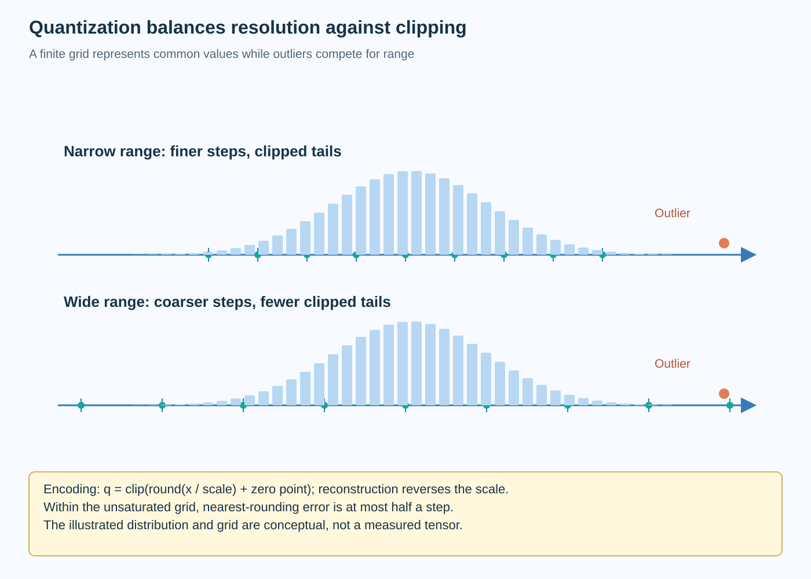

Quantization represents numerical values using a restricted set of codes and a rule for reconstruction. Fewer bits can reduce storage and traffic, but the reconstruction introduces error. The scale, clipping range, grouping, and calibration data determine how that error interacts with the learned function.

This article develops uniform quantization before discussing specialized methods. Its central image is a value distribution laid over a finite quantization grid: shrinking the range increases resolution near common values but clips outliers, while expanding the range preserves outliers at the cost of coarser steps. That tension explains much of calibration.

*An original conceptual illustration. Numerical plots and examples are illustrative unless explicitly identified as measured evidence.*

## 1. Define encoding and reconstruction

For an affine integer quantizer, scale s converts between real values and integer increments, and zero point z identifies the code corresponding to real zero. Clipping restricts codes to the supported integer interval.

$$
q(x)=\operatorname{clip}\left(\operatorname{round}(x/s)+z,q_{\min},q_{\max}\right),\qquad
\widehat x=s(q-z).
$$

The equation specifies a family of quantizers. Rounding mode, signed interval, saturation, and treatment of nonfinite values belong to the actual implementation. A reproduction must preserve them rather than treating every integer cast as an equivalent quantization operation.

Quantized codes are not the original values. A downstream computation either uses an integer-compatible arithmetic path with scale accounting or reconstructs values for another precision. Stored bits and accumulation precision should therefore be reported independently.

## 2. Derive scale from a range

If the selected real interval runs from a to b and integer codes run from q_min to q_max, a representative affine scale is the real width divided by integer width. Zero-point selection aligns real zero with an allowed code where the policy requires it.

$$
s=\frac{b-a}{q_{\max}-q_{\min}}.
$$

The interval must be nondegenerate or have an explicit fallback. Rounding and clipping the zero point can change exactly represented endpoints. Symmetric signed quantizers often choose zero point zero and derive scale from the largest absolute endpoint, using their actual signed-code convention.

A signed b-bit representation is not always symmetric around zero in its available integer endpoints. Some policies leave one code unused to preserve a symmetric range. State the convention before comparing scales or errors across implementations.

## 3. Separate rounding error and clipping error

Within an unsaturated uniform grid, nearest rounding has absolute error bounded by half a step. Outside the selected range, clipping can introduce much larger error. The two regions have different behavior.

$$
|x-\widehat x|\le\frac{s}{2}\quad\text{for the unsaturated nearest-rounding region}.
$$

The familiar mean squared error estimate of s squared divided by 12 assumes an approximately uniform rounding residue and no clipping. Real neural activations can have concentrated mass, heavy tails, and correlations that violate those assumptions.

Use the estimate to understand resolution, not to predict final task quality without evidence. A few clipped values can matter disproportionately when they participate in sensitive projections. Average element-wise error alone can conceal that effect.

## 4. Work through a small grid

Consider a hypothetical symmetric grid with scale 0.25 and allowed codes from minus 4 through 4. The reconstructed interval runs from minus 1 to 1. A value of 0.62 rounds to code 2 and reconstructs as 0.5, while 0.88 rounds to code 4 and reconstructs as 1.0.

A value of 1.7 saturates at the largest code and reconstructs as 1.0, producing error 0.7. That clipping error exceeds the half-step rounding bound because the value is outside the selected range. The example's limited code set is illustrative rather than a claim about a standard packed format.

Now double the scale while keeping codes fixed. The interval expands, reducing saturation for the outlier, but the step becomes coarser for common small values. Calibration chooses among these competing errors under a defined objective.

## 5. Formulate calibration as an optimization

Let calibration values be sampled from a representative distribution. One objective selects the range or scale minimizing empirical reconstruction error. Another measures the difference in a layer's output rather than its individual input or weight values.

$$
\widehat s=\arg\min_s\frac1N\sum_{i=1}^{N}\left(x_i-\widehat x_i(s)\right)^2.
$$

The objective is data-dependent and can be discontinuous because code assignments change. A practical implementation can search a supported set of scales or clipping thresholds. The selected policy should be validated on data not used to tune it.

Reconstruction error is a surrogate. It can help preserve a layer's behavior while missing a task-sensitive direction. Task quality and numerical correctness remain separate evaluation requirements. The calibration procedure does not make every low-error quantizer behaviorally equivalent.

## 6. Interpret statistical assumptions

A calibration histogram estimates the distribution seen during preparation. Its usefulness depends on sample size, preprocessing, and similarity to deployment inputs. A maximum-range estimator is sensitive to rare observed extremes, while percentile clipping deliberately excludes some tail mass.

A likelihood-based model can estimate a distribution's parameters and then derive a clipping rule. MLE uses the observed-data likelihood; MAP adds an explicit prior. Neither guarantees the chosen distribution family fits actual activations.

For a heavy-tailed or multimodal population, a convenient Gaussian model can underestimate rare values. Inspect empirical tails and held-out reconstruction rather than relying on a parametric estimate alone. Distribution shift can invalidate calibration even when the encoding implementation remains correct.

## 7. Choose granularity explicitly

Per-tensor quantization uses one scale for a whole tensor. Per-channel quantization assigns scales along a specified axis. Groupwise quantization partitions values into smaller groups. Finer granularity can adapt to local ranges while increasing metadata and kernel complexity.

If each group contains g values, each payload uses b bits, and each scale uses s_scale bytes, a simple effective storage model is:

$$
b_{\mathrm{effective}}\approx b+\frac{8s_{\mathrm{scale}}}{g}.
$$

Zero points, padding, and additional metadata require more terms where applicable. The formula explains why nominal payload bits understate total storage. Small groups can improve numerical resolution but make metadata relatively expensive.

The grouping axis must match the stored layout and kernel contract. Applying scales to the wrong axis can produce valid tensor shapes with incorrect reconstructed values. Distinct channel patterns make that bug easier to detect.

## 8. Distinguish weights and activations

Weights are fixed learned tensors during inference, allowing preparation and packing to be amortized. Activations depend on request inputs, so their ranges can vary dynamically. A policy suitable for weights is not automatically suitable for activations.

Static activation quantization uses calibration-derived parameters. Dynamic quantization estimates parameters during execution under a supported scope. The latter can adapt to current values but adds range-estimation and scaling work.

KV state and recurrent state introduce further reuse and accumulation behavior. Quantizing them should be evaluated as a separate numerical change. A weight-only memory claim does not establish cache reduction or acceptable long-context behavior.

## 9. Analyze projection sensitivity

For a linear layer, perturbing weights by delta W changes output by delta W times X. The activation distribution therefore matters to weight error. Coordinates frequently carrying large or important activations can amplify particular quantization changes.

$$
\Delta Y=\Delta W X,\qquad
\|\Delta Y\|_F\le\|\Delta W\|_2\|X\|_F.
$$

The norm bound can be loose and does not describe full-network quality. It nevertheless explains why minimizing raw weight error differs from minimizing output reconstruction. GPTQ and activation-aware methods use that relationship in different ways, developed later in this series.

For a tiny example, quantize one weight direction while holding another fixed and compare outputs under two activation populations. Equal weight error can produce unequal output error. The surrounding data and learned function determine sensitivity.

## 10. Preserve arithmetic scale accounting

Integer matrix products can accumulate code products in a wider type and reconstruct their result using operand scales. Nonzero zero points introduce correction terms. Bias and requantization must use compatible units.

A kernel that handles symmetric weights and activations is not automatically compatible with an arbitrary affine quantizer. Read its supported scale layout, grouping, accumulator range, and output policy. Overflow or incorrect zero-point correction can dominate any intended rounding error.

Compare the integer or packed path with an explicit reconstruction reference on small nontrivial tensors. Test negative values, zeros, endpoints, partial groups, and bias. This establishes implementation correctness before evaluating task quality or speed.

## 11. Separate format and method

INT4, FP8, and FP4 describe representation families. GPTQ, AWQ, and SmoothQuant describe methods for preparing or transforming values under particular designs. QAT describes a training approach that exposes quantization effects to optimization.

A method can be adapted to another supported representation, but its objective and implementation need verification. Similar nominal bit counts do not imply identical dynamic range, error, or kernel support. Preserve both the format and preparation method in reports.

Provider benchmark claims should retain checkpoint, precision, calibration, and backend scope. A reported quality result is not a universal guarantee for every model using the same acronym. Use the primary method papers and measure the actual artifact.

## 12. Evaluate quality and execution separately

Measure held-out reconstruction, task quality, packed weight bytes, peak allocation, and phase-specific runtime. A quantized artifact can fit in memory without running faster if decoding overhead or unsupported shapes dominate.

Keep the baseline and quantized workload identical unless a changed operating policy is explicit. Warm up the intended kernels and include preparation cost in cold-start or amortization analysis. Record fallback paths if the backend executes unsupported layers at another precision.

No model execution or GPU benchmark was performed for this article. The calculations explain numerical representation. Deployment evidence requires the actual encoding, kernels, checkpoint, and input population to satisfy both quality and resource requirements.

## 13. Test calibration under shift

Create held-out populations with different magnitudes, tails, and important subgroups under the task's supported inputs. Compare saturation frequency and output error against the preparation population. A small average calibration error can hide increased clipping after shift.

Distinguish an encoding bug from a policy mismatch. Wrong scale association produces systematic reconstruction errors even on calibration values. A correctly applied but poorly chosen range can instead fail on unseen tails. The remedies differ.

Store the calibration sample definition, range policy, grouping, and format with the artifact. Revisit them after model, preprocessing, or workload changes. Quantization is best understood as a numerical contract backed by representative evidence, not a bit-width label that permanently guarantees efficiency.

## 14. Decompose the clipping tradeoff

For a symmetric selected range, expected error can be divided into a central rounding contribution and a tail clipping contribution. Expanding the range increases the step for a fixed number of codes but decreases the values subjected to saturation. Shrinking the range does the reverse. An optimum balances the two under the actual distribution and chosen objective.

A useful illustrative population contains many small values and one rare large value. A maximum-based scale preserves the large value but spreads the limited codes over a wide interval. A clipped scale can improve the common values while deliberately sacrificing the outlier. Whether that sacrifice is acceptable depends on how the outlier influences the model, not only on its frequency.

This explains why percentile clipping is a policy rather than a proof. It assumes that excluding a specified tail population is a useful tradeoff. Output reconstruction can weight directions differently, while task evaluation can expose consequences absent from average element error. Compare these objectives explicitly when choosing a range.

For an experiment, sweep supported clipping thresholds and record central error, saturation error, layer-output error, and final task quality. Keep the held-out population independent of threshold selection. The resulting curves reveal which surrogate tracks the task and where it stops doing so. This makes calibration reviewable and provides a principled bridge from the quantization grid to the deployed model's behavior.

## Sources

- [Quantization and Training of Neural Networks for Efficient Integer-Arithmetic-Only Inference](https://arxiv.org/abs/1712.05877).
- [GPTQ](https://arxiv.org/abs/2210.17323).
- [SmoothQuant](https://arxiv.org/abs/2211.10438).
