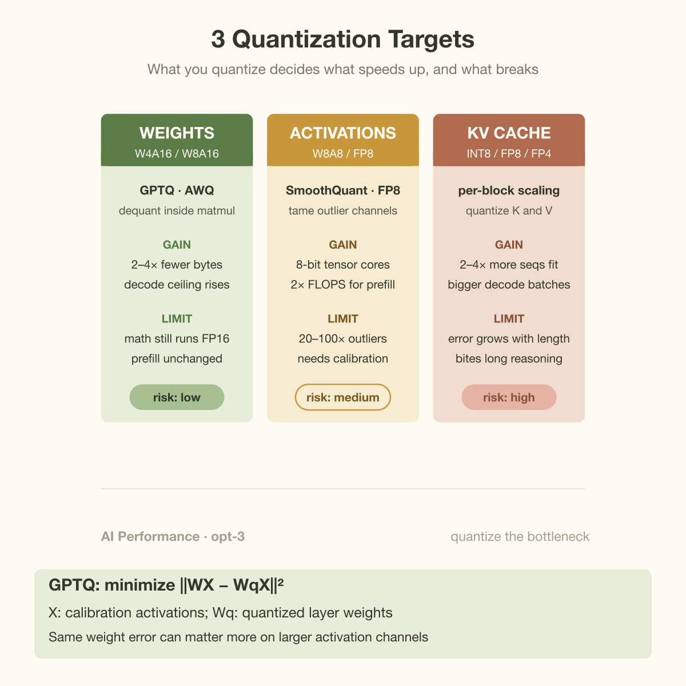
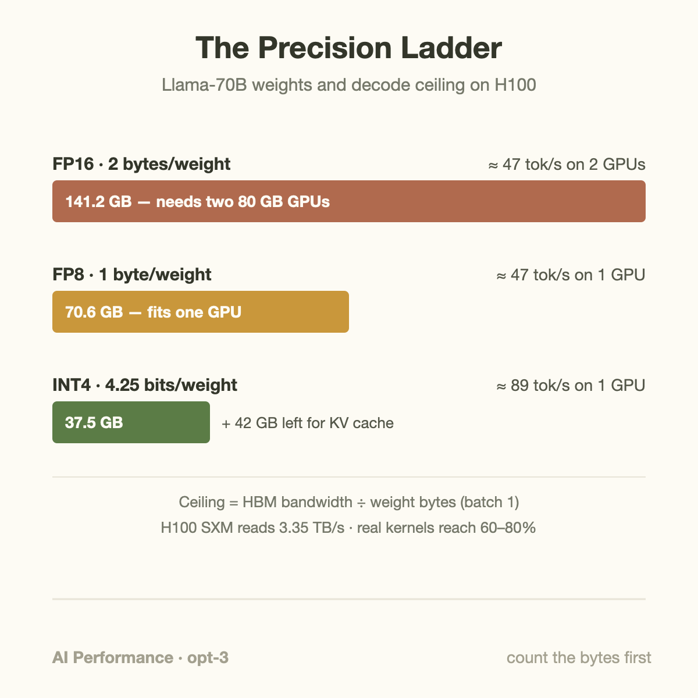

A 70-billion-parameter model in FP16 is 141 GB of weights, and at batch size 1 the GPU streams every 1 of those bytes out of HBM for each token it decodes. On an H100 SXM, which reads memory at 3.35 TB/s, that arithmetic tops out at about 24 tokens per second per GPU. Not because the tensor cores are slow. Because the weights are fat.

Quantization is the one optimization that attacks the numerator directly. Batching amortizes weight reads across requests, KV-cache tricks shrink the per-token state, speculative decoding gets more tokens per weight pass. Quantization just makes the weights smaller: FP16 to FP8 halves the bytes, FP8 to INT4 halves them again. In a memory-bound regime (which decode almost always is; see [compute-bound vs. memory-bound](/blog/compute-bound-vs-memory-bound/)), halving the bytes you must move doubles your theoretical speed. That is the gain. The loss is subtler, and it does not show up where most people look for it.

## The formats, and what a "bit" buys

A quick inventory, because the names hide real differences. FP16 and BF16 both spend 16 bits per number but split them differently: FP16 gives 10 bits to the mantissa (precision) and 5 to the exponent (range), BF16 gives 7 to the mantissa and 8 to the exponent. Training runs in BF16 almost universally because gradients need range, not precision; a gradient spike that overflows FP16's ±65,504 range just becomes `inf` and poisons the step. Inference has no gradients. Once training is done, the weights are frozen numbers in a well-behaved range, and you can re-encode them in whatever format moves fewest bytes. This is why "the model was trained in BF16" tells you nothing about what you should serve it in.

Below 16 bits, the menu splits into floating-point and integer families. FP8 comes in 2 flavors standardized by NVIDIA, Arm, and Intel (Micikevicius et al., 2022): E4M3 (4 exponent bits, 3 mantissa bits) for weights and activations, E5M2 for gradients. INT8 and INT4 have no exponent at all; they map a real-valued interval linearly onto 256 or 16 integer levels.

An integer format needs a decoder ring: a scale factor that says what 1 integer step is worth in real units, and optionally a 0-point for asymmetric ranges. Nobody stores 1 scale for a whole tensor, because a single outlier weight would stretch the interval and crush everything else into a few levels. Instead weights are quantized in groups, typically 128 consecutive values sharing 1 FP16 scale. That overhead is the fine print in "4-bit": with group size 128 and a 16-bit scale per group, you pay 4 + 16/128 = 4.125 bits per weight, and about 4.25 with a 0-point. Real, but small.

The more important taxonomy is *what* you quantize, because there are 3 separate targets:

- **Weight-only (W4A16, W8A16).** Weights live in HBM in 4 or 8 bits; the kernel dequantizes them to FP16 on the fly inside the matmul and the arithmetic runs at 16-bit. You save memory capacity and, crucially, memory bandwidth. This is GPTQ and AWQ territory, and it is where almost all open-source deployment starts.
- **Weight + activation (W8A8, FP8).** Both operands of the matmul are low-precision, so the tensor cores themselves run at 8-bit rates, doubling peak FLOPS. This is what helps *prefill*, which is compute-bound. It is also much harder, because activations are not frozen: they change every token, and a handful of channels in large transformers carry outlier values 20-100x larger than the rest (Dettmers et al. documented this in LLM.int8()). SmoothQuant's trick is to migrate that difficulty offline, rescaling channels so activations get flatter and weights absorb the variance.
- **KV cache.** The cache is read once per token per layer, and at long context or large batch it out-weighs the weights themselves. Quantizing it to INT8 or FP8 (increasingly INT4/FP4 for the key half) doubles or quadruples how many sequences fit, which shows up as batch size, which shows up as throughput.

## Calibration: why GPTQ and AWQ are not just rounding

Naive round-to-nearest works fine at 8-bit. At 4-bit it visibly hurts, and the interesting engineering is in the calibration step: a few 100 sample sequences run through the model, 1 layer at a time, to decide *how* to round.

GPTQ (Frantar et al., 2022) treats each layer as a least-squares problem: choose quantized weights that minimize the change in the layer's *output*, not the change in the weights themselves. It quantizes weights 1 column at a time and uses second-order information (the Hessian of the layer's reconstruction error, built from calibration activations) to update the not-yet-quantized columns, compensating for the error just introduced. The rounding mistakes still happen; they just get paid where the activations say they are cheap. A 175B model quantizes in about 4 GPU-hours.

AWQ (Lin et al., 2023) starts from an observation instead of an optimization: roughly 1% of weight channels do most of the work, identifiable by their activation magnitudes, not their weight magnitudes. Keeping that 1% in FP16 nearly closes the quality gap, but mixed formats make ugly kernels. So AWQ protects the salient channels arithmetically: scale them up before quantization, scale the activations down to compensate, and the important weights now occupy more of the integer grid. No backprop, no regression to the calibration set, and it travels better to instruction-tuned and multimodal models.

The practical difference for you: both give W4A16 checkpoints; GPTQ optimizes reconstruction harder, AWQ overfits calibration data less. Both are a 1-time offline cost.

## Worked example: 1 70B model, 3 precisions

Take Llama-3.1-70B, 70.6B parameters, served on H100 SXM (80 GB HBM3 at 3.35 TB/s, per NVIDIA's datasheet). Decode at batch size 1 must read every weight byte once per token, so the ceiling is bandwidth divided by weight bytes. Ignore the KV cache read for a moment; it only makes things worse for the fatter formats.

**FP16:** 70.6B × 2 bytes = 141.2 GB. It does not fit in 80 GB, so you shard across 2 GPUs (tensor parallel), which also aggregates bandwidth: 6.7 TB/s ÷ 141.2 GB ≈ **47 tok/s, on 2 GPUs**.

**FP8:** 70.6B × 1 byte = 70.6 GB. Fits on 1 GPU, barely, with a few GB left for KV cache. 3.35 TB/s ÷ 70.6 GB ≈ **47 tok/s, on 1 GPU**. Same speed, half the hardware. This is the quiet economic argument: FP8 didn't make the model faster per sequence here, it made it 2 times as cheap.

**INT4 (group 128):** 70.6B × 4.25 bits ÷ 8 = 37.5 GB. 3.35 TB/s ÷ 37.5 GB ≈ **89 tok/s on 1 GPU**, with 40+ GB free for KV cache, which means real batch sizes, which means the throughput story compounds.

These are ceilings; real kernels deliver maybe 60-80% of them, and per-token KV reads shave more as context grows. But the ratios survive contact with reality: every halving of weight bytes roughly halves per-token latency or halves the GPU count, and the ranking never changes. If you want to sanity-check the fit calculations themselves, the method is in [GPU memory math](/blog/gpu-memory-math-will-it-fit/).

## Going deeper: where the quality actually goes

The standard evidence that quantization is "free" is a perplexity table: WikiText-2 perplexity moves from 3.32 to 3.42 and everyone ships. The problem is that perplexity is an average over independent next-token predictions, and the failure mode of low-bit models is not average. It is *sequential*.

A quantized model is the original model plus a small, input-dependent error on every layer's output. On a single forward pass this perturbs logits slightly; occasionally it flips the argmax between 2 closely ranked tokens. In a 1-shot classification task, a rare flip costs you a fraction of a percent. In a 5,000-token chain-of-thought, the model conditions on its own outputs, so 1 flipped token in an intermediate calculation becomes ground truth for everything downstream. Errors do not average out along a reasoning chain; they propagate. Empirical studies of quantized reasoning models (e.g. Liu et al., "Quantization Hurts Reasoning?", 2025) find exactly this shape: near-0 degradation on short-form benchmarks at W8, while W4 configurations lose measurable accuracy on long math and code traces, with the gap widening as generation length grows, and KV-cache quantization biting harder than weight quantization at long context because its error scales with the sequence itself.

That asymmetry gives you a deployment heuristic. Chat, summarization, extraction, RAG over short answers: W4A16 is nearly always safe, and modern 4-bit formats with finer-grained scaling (the microscaling story in [NVFP4 vs. MXFP4](/blog/nvfp4-vs-mxfp4-the-4bit-format-war/)) keep shrinking the residual gap. Agentic loops, long chain-of-thought, competitive coding: measure at FP8 and W4 on *your* traces at *your* generation lengths before believing any leaderboard. The same distinction explains why quality-sensitive labs serve reasoning models in FP8 rather than INT4 even though the INT4 kernels are faster.

1 more mechanism worth having in your head: outliers are why the integer grid struggles. A linear quantizer spends its 16 levels uniformly across the observed range. Transformer activations (and to a lesser degree weights) are heavy-tailed, so a channel that occasionally hits 60 forces a step size that renders the typical value of 0.3 as 1 of a few coarse levels. Every serious method is some answer to this: GPTQ pays the error where the Hessian is flat, AWQ rescales the salient channels, SmoothQuant migrates variance from activations into weights, FP8 spends bits on an exponent so the grid is logarithmic, and NVFP4-style microscaling shrinks the group until each block gets a nearly private range.

Write the representation and calibration objective separately. A uniform quantizer with positive scale s, 0 point z, and integer limits q_min and q_max uses

$$
q=\operatorname{clip}\!\left(\operatorname{round}(w/s)+z,q_{\min},q_{\max}\right),\qquad
\widehat w=s(q-z).
$$

For w equal to 0.74, s equal to 0.5, and z equal to 0, rounding yields q equal to 1 and reconstructed weight 0.5, an error of minus 0.24. The impact depends on activations, not that coefficient error alone. GPTQ targets layer reconstruction on calibration activations X:

$$
\min_{\widehat W\in\mathcal Q}\|WX-\widehat WX\|_F^2,
\qquad H\approx2XX^\top.
$$

W is the original layer matrix, Q the permitted quantized matrices, and H the curvature approximation used for error compensation, commonly with damping for stability. AWQ instead chooses activation-informed channel scales: replacing W with W times diag(a) and X with diag(a) inverse times X preserves their unquantized product before rounding. The methods improve the proposal for which errors to tolerate; neither guarantees quality outside the calibration distribution. Evaluate rare formats, long contexts, and task decisions, then verify the fused kernel path on the deployment hardware.

## Common misconceptions

**"INT4 makes the math 4x faster."** Weight-only INT4 does not change the arithmetic rate at all; the tensor cores still multiply in FP16 after an on-the-fly dequantize. The speedup is bandwidth: fewer bytes per weight per token. That is why W4A16 does little for prefill (compute-bound) while nearly doubling decode over FP8, and why compute-format quantization (FP8, FP4 with hardware support) is a separate decision from storage-format quantization.

**"Perplexity was flat, so quality is preserved."** Flat perplexity certifies average next-token behavior on a corpus. It says nothing about error accumulation over a long, self-conditioned generation, which is exactly where 4-bit configurations fail first. If your workload is 3,000-token reasoning traces, benchmark 3,000-token reasoning traces.

**"We trained in BF16, so we should serve in BF16."** Training format and serving format solve different problems. BF16 exists to give gradients dynamic range during training; frozen inference weights do not need it, and post-training quantization to FP8 or INT4 is applied afterward precisely because the requirements diverge. The 2 worlds are converging from the other direction too, with training itself moving below 16-bit (see [Training in 4-bit](/blog/training-in-4-bit/)), but "serve what you trained in" was never the rule.

## The bigger picture

Quantization is the purest expression of the theme running through this whole series: modern inference is a bytes problem before it is a FLOPs problem. The [memory wall](/blog/the-memory-wall-latency-numbers/) means bandwidth grows slower than compute every generation, so the only durable way to get faster is to need fewer bytes. Hardware vendors have internalized this completely; each generation's headline FLOPS number is quoted at a lower precision than the last, because the datapath and the format now co-evolve. Meanwhile the technique stack layers cleanly: quantization shrinks the bytes per weight pass, batching amortizes each pass across more tokens, and if decode fundamentals are fuzzy, the [prefill/decode split](/blog/how-an-llm-generates-text/) is the right foundation to revisit.

The frontier is below 4 bits and beyond weights: FP4 KV caches, quantization-aware training that bakes the format in from the start, and block-scaled formats fighting over the last half-bit of overhead. But the accounting in this article does not change. Count the bytes, divide by bandwidth, and you know your ceiling before you launch a single kernel.

## Takeaway

- Decode is memory-bound, so weight bytes set the speed limit: FP16→FP8→INT4 halves the bytes each step, and a 70B model goes from 141 GB on 2 H100s to 37.5 GB and a ~2x higher per-GPU ceiling on 1.
- Weight-only quantization (GPTQ, AWQ) buys bandwidth and capacity but not arithmetic speed; weight+activation (FP8, SmoothQuant) buys tensor-core throughput for prefill; KV-cache quantization buys batch size. Pick per bottleneck, not by fashion.
- Quality loss is sequential, not average: flat perplexity can hide real accuracy drops on long reasoning chains, so evaluate low-bit configs at your actual generation lengths.

## Sources

- Frantar, Ashkboos, Hoefler, Alistarh — *GPTQ: Accurate Post-Training Quantization for Generative Pre-trained Transformers* (2022): https://arxiv.org/abs/2210.17323
- Lin et al. — *AWQ: Activation-aware Weight Quantization for LLM Compression and Acceleration* (2023): https://arxiv.org/abs/2306.00978
- Xiao et al. — *SmoothQuant: Accurate and Efficient Post-Training Quantization for Large Language Models* (2022): https://arxiv.org/abs/2211.10438
- Dettmers et al. — *LLM.int8(): 8-bit Matrix Multiplication for Transformers at Scale* (2022): https://arxiv.org/abs/2208.07339
- Micikevicius et al. — *FP8 Formats for Deep Learning* (2022): https://arxiv.org/abs/2209.05433
- NVIDIA H100 Tensor Core GPU specifications: https://www.nvidia.com/en-us/data-center/h100/

*Part of the [LLM Inference & Serving](/series/llm-serving/) learning path. Browse its Beginner, Intermediate, and Advanced topics and planned articles.*
