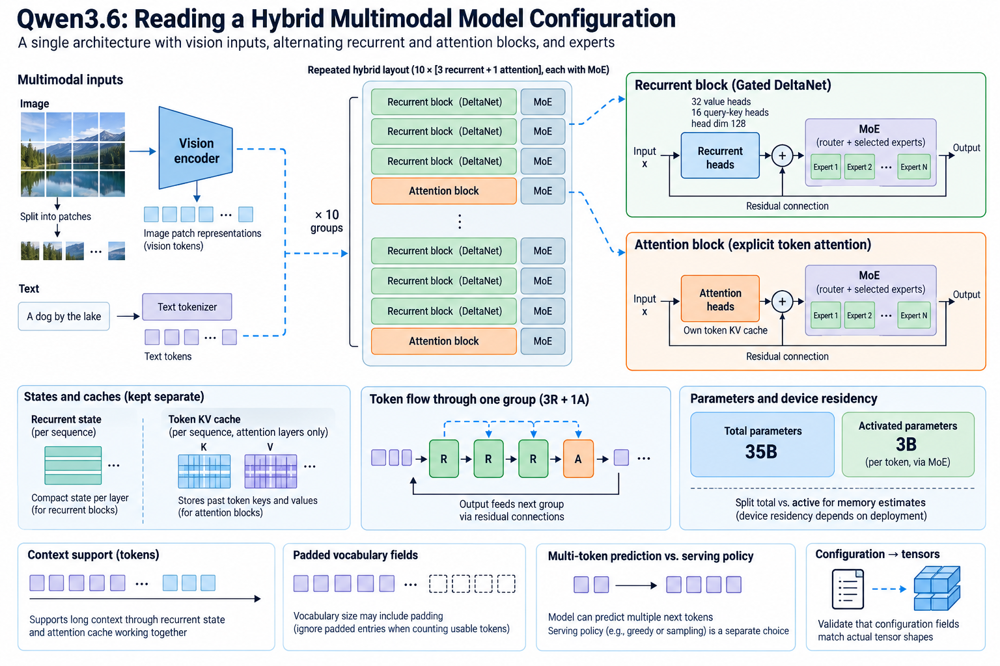
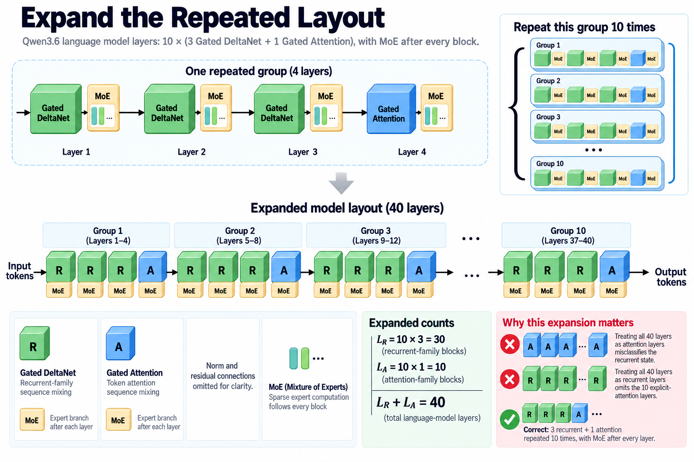

A modern model configuration is a compact architectural specification. Reading it carefully can prevent large errors in memory estimates and misleading explanations of active work. Qwen3.6-35B-A3B is a useful example because its published card combines recurrent-family layers, token-attention layers, sparse experts, and a vision encoder.

This article follows the official model card checked on September 13, 2026. The card reports 35 billion total parameters and 3 billion activated parameters, hidden width 2,048, and 40 language-model layers. Its component dimensions should be read directly rather than inferred from another Qwen release or from the total hidden width.

## 1. Expand the repeated layout

*Overview of the article’s core mechanism. The following sections explain the objects, relationships, equations, assumptions, and worked examples shown here.*

The card describes 10 repetitions of a group containing 3 Gated DeltaNet blocks and 1 Gated Attention block, with each sequence-mixing block followed by MoE. Expanding that expression gives 30 recurrent-family blocks, 10 attention-family blocks, and an expert branch associated with every listed layer.

$$
L_R=10\times3=30,\qquad L_A=10\times1=10,\qquad L_R+L_A=40.
$$

This simple check matters because applying a conventional attention-cache formula to all 40 layers would misclassify the recurrent state. Conversely, treating the entire model as constant-state recurrence would omit the 10 explicit-attention layers.

The ordering also matters for behavior. Attention blocks appear at particular depths among recurrent blocks rather than as a separate preprocessing stage. Their outputs influence subsequent recurrent and expert computation through the language model's residual structure.

## 2. Read recurrent heads separately

The Gated DeltaNet section lists 32 value heads, 16 query-key heads, and head dimension 128. Those counts imply grouping or sharing relationships that should be confirmed in the actual implementation. They do not justify assuming 32 independent query-key heads.

A recurrent matrix state's size depends on the actual mapping between key and value heads and on its key and value widths. The hybrid-state article derives a representative outer-product state, but a capacity audit should inspect the exported state tensors and any auxiliary history.

Do not infer the complete recurrent memory requirement from the nominal hidden width. Projected branches can have different aggregate widths, and state precision can differ from ordinary activations. Read each interface and add its allocated representation explicitly.

## 3. Read attention heads independently

The attention section lists 16 query heads, 2 key-value heads, head width 256, and rotary dimension 64. The grouped-query ratio is therefore 8 queries per KV head under an equal grouping design. The total query projection width is 4,096, not the residual hidden width of 2,048.

$$
H_Qd_h=16\times256=4096,\qquad
H_{KV}d_h=2\times256=512.
$$

A learned projection can map between these widths. Dividing hidden width by query count would yield the wrong head dimension for this release. The card explicitly supplies the dimension needed for the resource calculation.

Rotary dimension is another independent field. Only the specified positional subspace should be interpreted through that mechanism. A configuration reader should not silently apply full-head rotary behavior because another model family does so.

## 4. Derive the explicit cache component

Assume all 10 listed attention layers retain separate full-history keys and values, with B sequences, n tokens, and s bytes per element. Their simplified explicit-cache term is:

$$
M_A=2B\times10\times n\times2\times256\times s.
$$

This is conditional accounting, not a statement that every backend allocates exactly this amount. Window policy, quantization, padding, and other implementation details can change retained bytes. The equation makes the assumptions visible.

At 2 bytes per element, the term is 20,480 bytes per token for one sequence across those attention layers. Add recurrent state, auxiliary buffers, allocator overhead, and workspace separately. A text-only KV estimate is not the entire multimodal application's memory requirement.

## 5. Account for recurrent state

A representative recurrent-state estimate uses the product of key and value widths for each actual state head. The published head counts help identify what must be checked, but the precise state layout and sharing determine the multiplier.

$$
M_R=B\sum_{\ell\in\mathcal R}\operatorname{elements}(S_\ell)\,s_\ell.
$$

This general expression is intentionally safer than inventing a fixed matrix count from incomplete overview information. It can include distinct dtypes by layer. Auxiliary convolution history or other retained tensors must be added if the implementation uses them.

The recurrent term remains independent of processed sequence length under a bounded-state design, while the explicit attention term can grow. Their relative contribution changes with context and batch. Report both rather than one “cache size” that hides the composition.

## 6. Read the expert configuration

The card lists 256 experts, 8 routed experts activated per token, 1 shared expert, and expert intermediate width 512. The shared branch must be counted in active work. It should not be assumed to have identical parameterization or scaling to a routed branch without checking tensors.

For a representative gated MLP, 2 input projections and 1 output projection contribute leading weight terms proportional to hidden width times intermediate width. Multiply stored routed-expert weights by the actual collection, while selected arithmetic depends on the routed subset and shared branch.

The reported 3-billion active figure remains a release claim with its own counting definition. Manual component formulas can audit it, but attention, routers, embeddings, and any other nonsparse components belong in the complete count.

## 7. Separate total parameters and device residency

A small active count does not mean only those parameters occupy memory. The entire assigned expert collection may remain resident, distributed, or managed under a supported loading policy. Stored dtype and scale metadata change bytes per parameter.

For a deployment, list weight partitions by device and their representation. Add cache and workspace before deciding what fits. A statement about aggregate total parameters is not the same as a single-device memory estimate.

Expert dispatch can also introduce communication and grouping overhead. Small decode batches may activate many small expert groups, while prefill can provide larger groups. Parameter counts alone do not predict those efficiency differences.

## 8. Follow vision representations

The card identifies a causal language model with a vision encoder. Images are converted into representations that enter the language computation under the model's supported input protocol. Their count depends on preprocessing and image shape rather than only on the text tokenizer.

A multimodal request therefore needs image preprocessing, encoder work, projected visual embeddings, and language-model state. Include those costs in time to first token when they occur within the request boundary. A cached image representation can change the boundary, but its reuse needs an explicit validity contract.

Do not assume a generic patch size or image-token count from another model. The actual processor and release configuration determine the representation. The multimodal article develops the general accounting method without assigning undocumented values to this checkpoint.

## 9. Interpret context support correctly

The card reports native context length 262,144 and extensibility to 1,010,000 tokens. These are configuration and capability statements. They do not guarantee identical quality, latency, or memory usage at every supported length.

Context extension can involve positional or runtime settings whose exact policy must be recorded. A benchmark at the extended limit should state that setup. Useful retrieval across long contexts also requires behavioral evaluation, including distractors and distant dependencies.

Hybrid state can change scaling, but the 10 explicit-attention layers and sparse expert system remain relevant. Capacity and performance should be measured under the intended long-context workload rather than inferred from the maximum supported number alone.

## 10. Read padded vocabulary fields

The card lists padded token-embedding and output dimensions of 248,320. Padded dimensions can serve implementation alignment or other release requirements. They should not automatically be interpreted as the count of distinct ordinary textual tokens.

A weight audit uses actual stored matrix shapes. An application uses the compatible tokenizer and message processor. Those are related but different interfaces. Tied storage, if present in the implementation, changes how unique parameter residency should be counted.

Large embedding and output matrices are nonsparse components that can matter to capacity and output computation. They should not disappear from an estimate focused only on routed experts.

## 11. Separate multi-token prediction from serving policy

The card states that MTP was trained with multiple steps. That establishes a training component, not that every serving request automatically uses a particular speculative schedule. The backend and decoding configuration determine actual execution.

Speculative decoding can propose candidates and verify them with a target distribution under a documented acceptance procedure. Its speed depends on acceptance, draft cost, verification work, and batching. A trained multi-token component provides an opportunity, but not a universal latency guarantee.

State whether a benchmark uses that path. Comparing ordinary decode with speculative decode without identifying the policy attributes a system change to the architecture too broadly.

## 12. Validate configuration-to-tensor agreement

Check layer counts, branch types, head dimensions, expert indices, intermediate widths, and vocabulary shapes against the actual checkpoint configuration and tensors. A stale loader can recognize the family name while mishandling a revised layer layout.

A small inference comparison should cover prefill and cached extension, both layer families, and multimodal input when supported. Test state resets between sequences and position handoff. Numerical tolerance must reflect the actual precision path.

No weights were executed or GPU measurements performed for this article. The calculations are conditional accounting models based on the published card. A deployment still needs target-backend validation and workload measurements.

## 13. Build a reproducible capacity sheet

Record the release identifier, configuration revision, processor, backend, weight dtype, cache dtype, recurrent-state tensors, and context policy. Calculate each retained category independently. Add temporary prefill and vision workspace to the peak estimate.

Keep measured allocation beside theoretical bytes and explain discrepancies such as padding, reserved pools, or extra state. This makes the audit useful when a backend changes. A model name alone cannot explain why two implementations consume different memory.

The architectural lesson is to read the configuration as a composition of interfaces. Distinct recurrent and attention dimensions, expert selection, multimodal representation, and output shape all matter. Expanding that composition is the foundation for reliable AI-infrastructure planning.

## 14. Estimate concurrency from separate state terms

Suppose the deployment has a fixed available device-memory budget after assigning weights and mandatory runtime buffers. Each active request adds explicit-attention history, recurrent state, and request-specific metadata. A simple concurrency estimate divides the remaining budget by the per-request state only when the requests have comparable lengths and the workspace policy is understood.

Variable lengths require a distribution-aware estimate. A short request and a long request do not consume the same explicit-cache bytes, even though their recurrent state can have the same shape. Reserving every request's maximum continuation can be conservative, while incremental allocation can require eviction or admission controls. State which scheduler policy accompanies the estimate.

Multimodal requests introduce another distribution. Image representations can contribute many language positions and vision workspace can create a temporary peak. If image encoding is serialized or performed on another device, its capacity boundary differs from a fused single-device path. The capacity sheet should match the actual pipeline.

An informative experiment sweeps concurrency at several context buckets and records peak allocation, time to first token, decode latency, and failure or eviction behavior. The result can reveal whether weight bandwidth, explicit state, recurrent state, or expert communication limits the workload. It also prevents a theoretical cache reduction from being treated as an unconditional increase in useful throughput.

Finally preserve a margin for resumption, compilation, and temporary buffers under the deployment's documented behavior. The margin should come from measured variability rather than an unexplained percentage copied from another system. Architecture-aware accounting narrows the uncertainty; actual allocation and scheduling tests establish the practical operating region.

## 15. Keep component foundations separate from checkpoint claims

The configuration describes this checkpoint's components, while general theory explains the interfaces those components can use. For vision, [patch embeddings and position](/blog/vision-transformer-patches-position-cost/) provide a foundation for counting representations. For recurrence, [state-space execution](/blog/state-space-execution-scans-recurrence-hybrids/) explains why state size and full-sequence algorithms are separate questions.

Do not infer a checkpoint's exact operator or training objective from those foundations alone. Continue to use the official configuration and implementation for its disclosed structure. This distinction connects architecture education to a reproducible capacity sheet without attributing every general vision or recurrent method to one model card.

## Sources

- [Official Qwen3.6-35B-A3B model card](https://huggingface.co/Qwen/Qwen3.6-35B-A3B).
