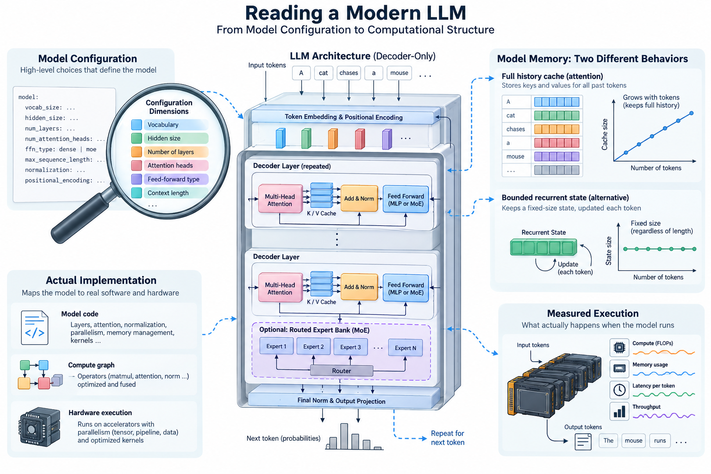
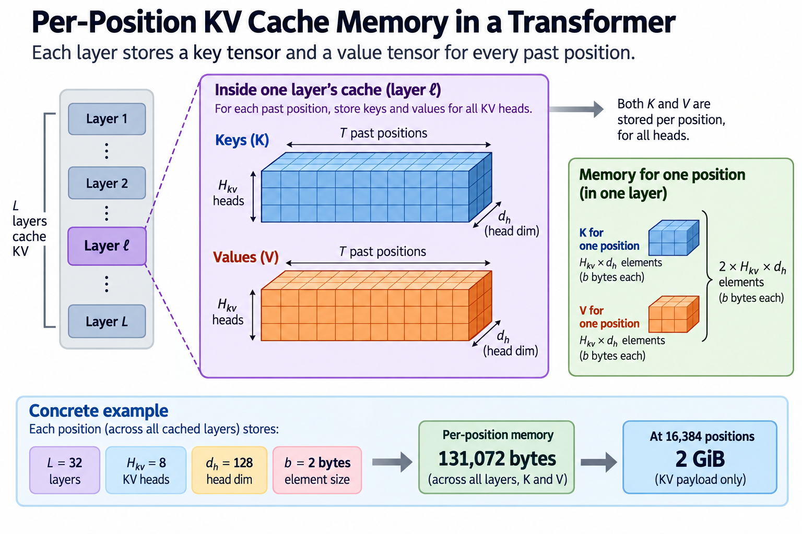
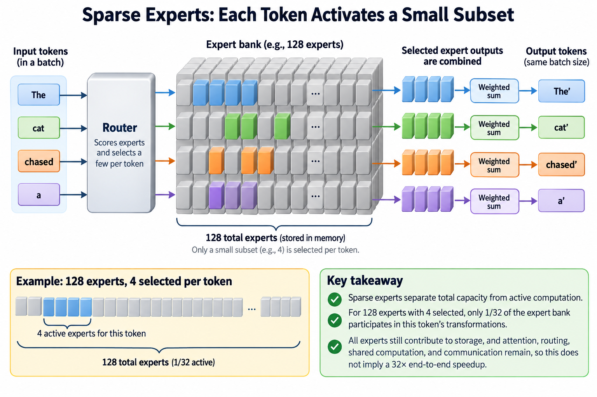

A model name is a poor architecture diagram. “35 billion parameters” tells you little about which weights each token uses, how attention state grows, or whether every layer performs the same operation. Those details matter when explaining an innovation, estimating memory, or comparing 2 released checkpoints. The reliable starting point is the evidence: an exact model configuration, its implementation, and the authors’ technical disclosure.

This article develops a practical reading method. We start with a deliberately simple decoder block, derive useful parameter and cache estimates, then identify where publicly documented modern models depart from that baseline. The model examples are a snapshot checked on September 12, 2026. They illustrate structural choices rather than establish a leaderboard. Subsequent articles in this series examine routing, attention variants, hybrid state, and individual models in greater depth. If the basic Transformer is unfamiliar, read [the introductory block explanation](/blog/transformer-architecture-in-one-picture/) first.

## Separate structure, learned weights, and serving policy

*Overview of the article’s core mechanism. The following sections explain the objects, relationships, equations, assumptions, and worked examples shown here.*

3 layers of description are easy to confuse. Architecture defines the operations and connections: layer types, widths, projections, routing, and state. A checkpoint supplies learned parameter values, often packaged with a particular numerical representation. Serving policy determines how requests are scheduled, batched, cached, or sampled. These layers interact, but changing a scheduler does not automatically change the underlying model architecture.

A useful reading record therefore names the checkpoint and records the evidence used for each claim. A configuration can establish a layer count. An implementation can establish how a mask is applied. A model card can describe the intended design and training procedure. None of those alone proves that a particular deployment attains a stated latency. Separate documented structural facts from your own estimates and from measured performance.

Also distinguish a moving repository branch from a reproducible snapshot. Save the downloaded configuration and record a commit or revision when available. If you only inspected a current model card, say that explicitly. “Latest” is a date-dependent selection criterion, not a substitute for identifying the model you actually analyzed.

## Read the residual stream before the individual operators

Let a prompt contain T token positions, and let d be the residual width. A simplified language model represents its hidden state as a matrix X with shape T by d. Each row is a position’s current representation. A common pre-normalized decoder block can be written as

$$
\begin{aligned} U&=X+A(N_1(X)),\\ Y&=U+F(N_2(U)). \end{aligned}
$$

Here N denotes normalization, A is causal attention, and F is a position-wise feed-forward transformation. Both sublayers return an output that fits the residual stream, so addition preserves its shape. This equation is a baseline, not a universal specification. Some models change normalization placement, use additional gates, replace feed-forward computation with experts, or interleave different sequence operators.

The reading method is to trace shapes through each operation. Find the input width, the operator’s internal dimensions, and the projection returning to the residual width. This prevents an especially common mistake: assuming an attention head dimension must equal residual width divided by head count. Released implementations can use an attention projection width different from the residual width.

## A baseline parameter estimate exposes its assumptions

For a simple dense block, assume the combined query, key, and value widths each equal d, and the attention output projection is also d by d. Ignoring biases and normalization parameters, those 4 matrices contain approximately 4 d squared parameters. A 2-matrix feed-forward layer with intermediate width rd contributes approximately 2 r d squared. Therefore

$$
P_{\mathrm{block}}\approx(4+2r)d^2.
$$

With r equal to 4, this becomes 12 d squared. A hypothetical width of 2,048 gives 50,331,648 parameters per block. 40 such blocks contain approximately 2.013 billion parameters before embeddings and other components. This is a checked accounting exercise, not an estimate for any named sparse model.

The estimate fails if its assumptions fail. Grouped-query attention changes key and value projection sizes. A gated feed-forward network usually has 3 principal matrices rather than 2. Expert layers replicate feed-forward weights. An untied vocabulary output matrix adds another large parameter term. Write down these deviations before using a familiar rule of thumb. Understanding why an estimate changes is more valuable than memorizing its coefficient.

## Attention mixes positions under an explicit information rule

In the conventional scaled dot-product baseline,

$$
\begin{aligned} Q&=XW_Q,\\ K&=XW_K,\\ V&=XW_V,\\ A(X)&=\operatorname{softmax}\!\left(\frac{QK^\top}{\sqrt{d_h}}+M\right)VW_O. \end{aligned}
$$

The equation is schematic for 1 head or appropriately assembled heads. The mask M permits a position to use itself and earlier positions while excluding future positions. The scale uses head dimension d_h. The learned projections decide which features are compared and which values are mixed; the mask decides which information is available.

The innovation in an attention variant may concern a different part of this computation. A method can reduce stored state, restrict compared positions, share intermediate results, or reorganize execution while preserving the mathematical answer. These are different changes. For example, reducing memory traffic for exact attention does not by itself mean the model attends to fewer positions.

Read the mask, head layout, positional treatment, and state representation separately. A single field named “attention” cannot establish all 4. This separation also makes limitations easier to explain: a local window restricts direct access, whereas sharing key and value heads changes the representation used for that access.

## Translate cache structure into a memory equation

For a conventional per-layer cache with L cached layers, H_kv key/value heads, head dimension d_h, and b bytes per element, the key and value payload for T positions is

$$
B_{\mathrm{KV}}=2LTH_{\mathrm{kv}}d_hb.
$$

The factor 2 counts keys and values. Assume 1 sequence, uniform dimensions, and stored dense tensors. With L equal to 32, 8 key/value heads, head dimension 128, and 2-byte elements, each position consumes 131,072 bytes. At 16,384 positions, the payload is exactly 2 GiB.

This excludes allocator overhead, metadata, padding, and other model state. Multiply by the actual number of independent cached sequences when estimating a batch. Prefix sharing or compression can change what is physically stored. Sliding-window layers may retain only a bounded recent segment. Hybrid recurrent layers maintain a different state altogether.

Consequently, applying this full-cache equation indiscriminately to every layer of a modern model can badly overestimate memory. The equation remains useful because its terms reveal what to inspect: which layers cache historical positions, what dimensions are stored, and whether sharing or quantization changes the byte count.

## Sparse experts separate total capacity from active computation

An expert layer has a collection of parameterized transformations and a router selecting a subset for each token. A simplified token output is

$$
y(x)=\sum_{e\in S(x)}g_e(x)F_e(x),
$$

where S is the selected expert set and g is the routing weight. This form does not specify every routing convention. Check whether weights normalize over all experts or only selected experts, whether there are shared experts, and what happens when capacity or load constraints intervene.

For a hypothetical bank of 128 equal-sized experts selecting 4 per token, only 1/32 of the expert bank participates in that token’s selected transformations. This does not imply a 32-fold end-to-end speedup. Attention, routing, shared computation, and communication remain. A batch may activate many different experts, and all resident expert weights still contribute to storage requirements.

The methodological question is therefore precise: does an innovation increase stored capacity without proportionally increasing selected arithmetic, and how does the implementation distribute that work? A headline parameter count cannot answer it. Report total parameters, the authors’ active-parameter convention, and the actual execution assumptions separately.

## A public sparse model makes the distinction concrete

OpenAI’s disclosed gpt-oss-120b architecture has approximately 116.8 billion total parameters and 5.1 billion active parameters per token under its counting convention. It uses 128 experts with 4 selected per token. The disclosure describes alternating local and dense attention, grouped-query attention, and an attention mechanism with an additional denominator term that can leave attention weight unassigned to tokens.

These facts show why the baseline equations require inspection. A conventional softmax over token scores has weights summing to 1 across those tokens. That is not a safe universal claim once the normalization includes an additional non-token term. Likewise, “every layer keeps the complete history” is incompatible with treating local and dense layers identically.

The important innovation story is conditional computation combined with specific attention choices. The useful comparison keeps quality and workload explicit and asks which resource each choice changes. The parameter ratio alone establishes neither quality nor serving cost. This series’ dedicated model article will examine the disclosed operators and counting conventions in detail.

## Hybrid configurations demand a layer-by-layer inventory

The released Qwen3.6-35B-A3B configuration inspected for this article declares 40 text layers, with repeated groups of 3 linear-attention layers and 1 full-attention layer. It separately specifies residual width, attention head dimensions, linear-state dimensions, and expert routing fields. Those separate fields are evidence that a uniform dense-block diagram is insufficient.

The reading procedure is to count each layer type, inspect its state update, and build a memory model for that type. Do not infer the recurrent state’s size by substituting its field names into a full KV-cache equation. Determine the tensors maintained by the implementation, their precision, and whether they depend on context length.

The potential benefit is a different balance between historical access and bounded state. The tradeoff is that bounded state and explicit token attention provide different mechanisms for retaining and retrieving information. A claimed advantage should be tested on relevant tasks rather than inferred from asymptotic notation alone. We will study this distinction in the hybrid-attention subtopic.

## Recent designs can change where attention state originates

DeepSeek’s public DeepSeek-V4.1-Flash disclosure describes a 40-layer causal encoder-decoder structure: 20 causal encoder layers followed by 20 decoder layers. The decoder’s global cache is projected from the final encoder representations rather than independently from each decoder layer’s own hidden states. The authors distinguish 8 billion activated parameters during prefill from 16 billion during decode.

This is a structural change, not simply a larger context limit. It changes the origin and reuse of state and makes a single active-parameter number insufficient to describe both phases. The mechanism should be analyzed by following which representations are produced during input processing and which components are used while generating outputs.

Its causal encoder should also not be confused with the bidirectional encoder in the original translation Transformer. Similar labels can describe different information constraints. Read the stated causal structure and implementation rather than importing an old diagram based on the word “encoder.” Claims about the design’s efficiency remain workload-dependent and require measured evidence beyond the architectural description.

## Finish with a testable architectural claim

A strong architecture explanation ends with a claim someone could evaluate. For example: sharing key/value heads reduces the conventional cache payload when other cache dimensions and precision are fixed. The equation predicts the reduction; a tensor inspection checks whether the implementation stores that payload; a serving experiment measures the actual effect on memory and throughput.

Keep those 3 conclusions separate. Lower state bytes need not mean proportionally lower latency, because another operator may dominate execution. Lower selected arithmetic need not mean a smaller checkpoint. A longer advertised context need not mean equally strong retrieval at every position. Each innovation changes a mechanism under assumptions, and those assumptions determine which practical result follows.

The recurring method is simple: identify exact evidence, trace shapes, classify layer types, write a resource equation, check a small example, and state what remains unmeasured. That approach lets us study modern models without relying on marketing labels or pretending that undisclosed internals are known.

## Sources

- [OpenAI, gpt-oss architecture and model details](https://deploymentsafety.openai.com/gpt-oss/a2): public architecture disclosure and parameter conventions.
- [Qwen3.6-35B-A3B released configuration](https://huggingface.co/Qwen/Qwen3.6-35B-A3B/blob/main/config.json): configuration inspected September 12, 2026; moving main branch, not a pinned checkpoint revision.
- [DeepSeek-V4.1-Flash official model card](https://huggingface.co/deepseek-ai/DeepSeek-V4.1-Flash): causal encoder-decoder and phase-specific active parameters, inspected September 12, 2026.
- [Vaswani et al., Attention Is All You Need](https://arxiv.org/abs/1706.03762): the conventional attention baseline.
- [Ainslie et al., GQA](https://arxiv.org/abs/2305.13245): grouped-query attention and its state tradeoff.
