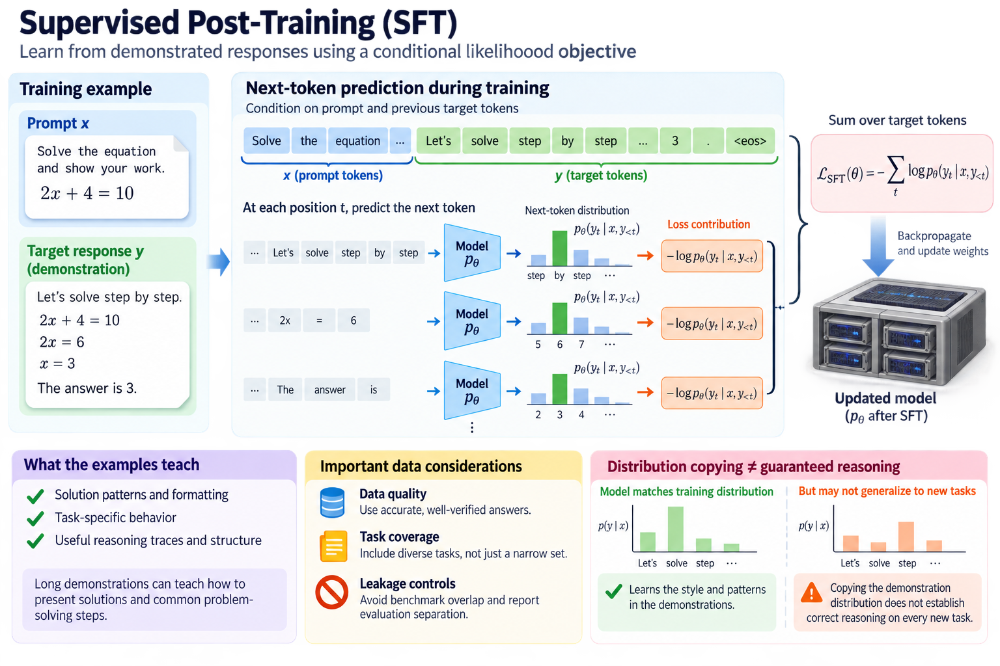
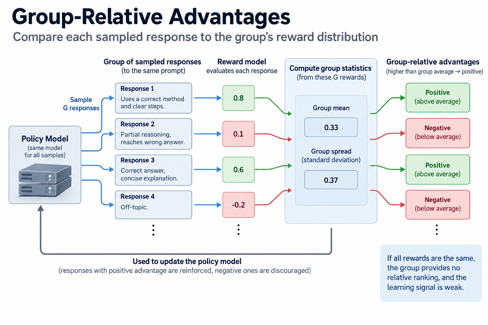
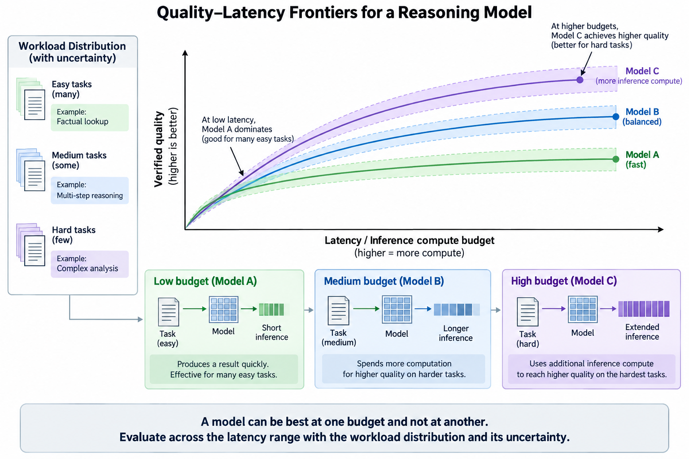
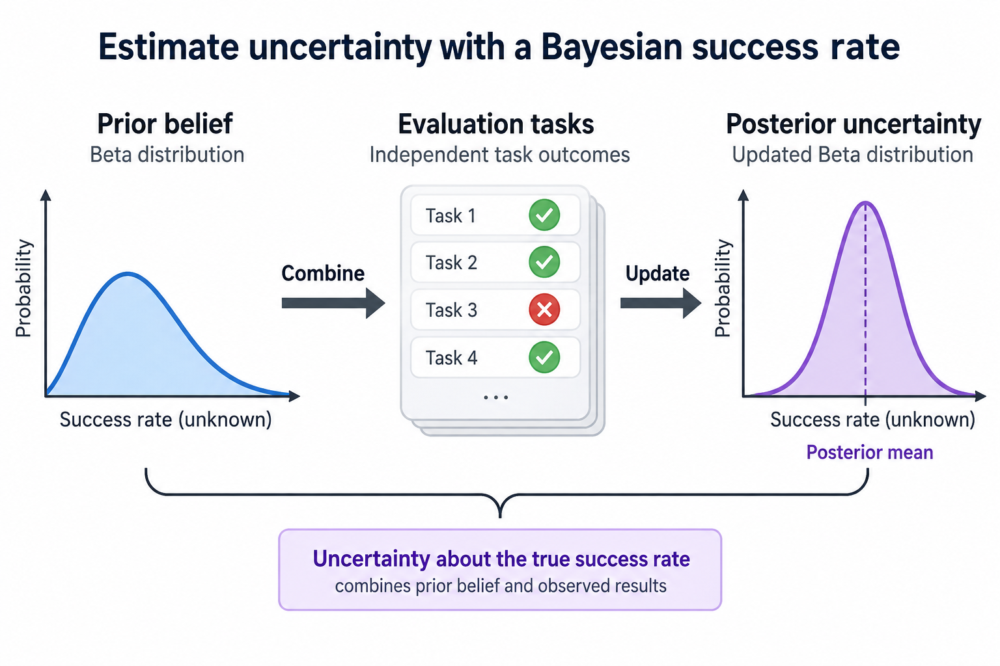
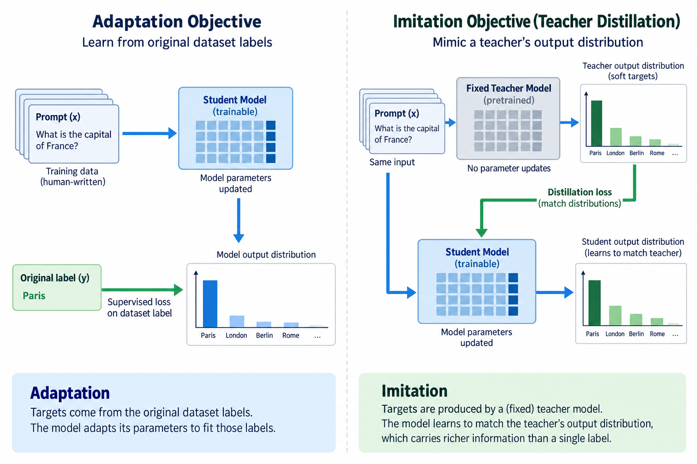

## Overview

A reasoning model can use a familiar Transformer or sparse expert network while exhibiting different problem-solving behavior after post-training. Its architectural structure, training objective, and inference policy are separate parts of the system. Calling all of them “reasoning architecture” makes it difficult to explain where an improvement comes from.

DeepSeek-R1's primary paper provides a concrete example of reasoning-oriented post-training. It describes reinforcement learning on a base model, a cold-start and later training pipeline for the released R1 system, and distillation into smaller models. Those experiments establish a particular method, not a universal description of every model marketed for reasoning.

## Deep dive

### 1. Separate structure and behavior

Architecture determines the computation graph: attention, recurrent state, expert functions, residual paths, and representations. Learned weights then determine the functions within that graph, and the inference policy determines how outputs are sampled, constrained, or searched, so 3 independent choices sit behind any reasoning result.

A model can improve reasoning benchmarks through changed weights and training while keeping the same basic network structure, and another system can improve final answers by sampling several candidates and selecting among them without changing weights, so both of these 2 routes require evidence about their actual mechanism.

Record the 3 ingredients separately: base checkpoint, post-training method, and inference budget. This gives an architecture comparison a clear boundary and prevents a quality difference caused by additional inference work from being attributed automatically to an attention design.

### 2. Derive supervised post-training

Supervised fine-tuning learns from target sequences under a conditional likelihood objective. If y is a demonstrated response to prompt x, a standard token-level loss is:

$$
\mathcal L_{\mathrm{SFT}}(\theta)=-\sum_{t}\log p_\theta(y_t\mid x,y_{<t}).
$$

The examples determine which behavior receives training signal, so long solution demonstrations can teach 2 things, formatting and problem-solving patterns, but copying their distribution does not establish correct reasoning on every new task.

3 things matter here: data quality, task coverage, and leakage controls, because a benchmark overlap can create apparent competence without the intended generalization, so report evaluation separation and use independently verified answers when possible.

The R1 paper distinguishes its cold-start examples from the reinforcement-learning-only R1-Zero experiment. Preserve that distinction rather than describing the complete released pipeline as containing no supervised training.

### 3. Introduce reward optimization

Reinforcement learning optimizes behavior using a reward signal for sampled outputs. A conceptual objective combines 2 terms, expected reward and a penalty for departing too far from a reference policy:

$$
J(\theta)=\mathbb E_{y\sim p_\theta(\cdot\mid x)}[R(x,y)]
-\beta D_{KL}(p_\theta\|p_{\mathrm{ref}}).
$$

This equation illustrates the tradeoff and is not the complete GRPO implementation, because actual objectives add 4 further pieces, sampling, importance ratios, clipping, and defined reward normalization, whose details affect optimization behavior.

A reward can assess final-answer correctness, format compliance, or other properties. A programmatically verifiable task provides another kind of evidence from an open-ended preference judgment. Neither of these 2 reward types is automatically reliable outside its defined domain.

### 4. Explain group-relative advantages

The R1 paper uses Group Relative Policy Optimization, estimating a baseline from a group of sampled responses rather than requiring a separate critic of comparable size. A representative normalized group advantage compares each reward with the group's mean and spread.

$$
A_i=\frac{r_i-\overline r}{\operatorname{std}(r_1,\ldots,r_G)+\epsilon}.
$$

The expression explains relative comparison. The R1 paper specifies the full optimization objective and its choices. Adding epsilon here illustrates numerical handling rather than claiming this exact formula is a release setting.

If every sample receives the same reward, the advantage numerator is 0 for every member and the group provides no relative ranking under this statistic, so reward diversity and task difficulty determine the available learning signal, and larger groups cost more sampling work without automatically solving a poorly designed reward.

### 5. Separate outcome and process supervision

The 2 kinds of supervision differ: outcome supervision evaluates the final result, while process supervision evaluates intermediate steps or another structured account of progress. A correct final answer can arise through an unreliable path, while a plausible-looking sequence can still end incorrectly.

A verifier for intermediate work needs a clear validity contract. It should not reward verbosity or superficial formatting as a substitute for correctness. For mathematical or programming tasks, independently checking equations or executing supported tests can provide useful evidence.

The model's generated explanation is an output artifact, not a guaranteed faithful measurement of its internal computation. Evaluate final correctness and externally checkable steps without treating a fluent narrative as proof of the underlying mechanism.

### 6. Understand inference-time computation

Additional inference work can take at least 4 forms: longer generated solutions, multiple independently sampled candidates, verifier-guided selection, or a structured search policy. These methods consume different resources and expose different parallelism.

Let a request use a base cost C_0, generate m candidates of lengths n_i, and spend verification cost V. A simple accounting model is:

$$
C\approx C_0+\sum_{i=1}^{m}n_i c_i+V.
$$

The per-token costs depend on context, batching, and backend. Parallel candidates can reduce wall-clock time relative to serial generation while consuming more total resources, so report both of those 2 budgets, duration and work, rather than treating them as one.

### 7. Work through multiple attempts

If independent candidates each succeed with probability p and an ideal oracle identifies a success, the chance of at least one success among m attempts is:

$$
P_{\mathrm{any}}=1-(1-p)^m.
$$

For an illustrative p of 0.2 and 4 attempts, the probability is about 0.59. This is not a model benchmark. It depends on independence and perfect selection, both of which can fail in practice.

Candidates from one model can share errors, and a verifier can select an incorrect answer even when a correct candidate exists, so a number like that 0.59 is an optimistic reference rather than the expected deployed accuracy: measure correlation and selection quality under the actual policy.

### 8. Distinguish pass-at-k and selected accuracy

A pass-at-k-style metric asks whether a candidate set contains a correct result under its defined evaluation procedure. Selected accuracy asks whether the system's chosen result is correct. These 2 metrics answer different questions.

A deployment needs a real selector or verifier, not an evaluation oracle. Report its cost and errors. If a benchmark uses hidden tests to identify a successful candidate, that test access should not be silently treated as available to a production application.

Also match the 2 budgets, tokens and candidates, across comparisons. A model given more attempts can show a higher set-success metric without being better on a single attempt. Budget-aware evaluation makes the improvement assessable.

### 9. Evaluate reward robustness

A learned policy can exploit weaknesses in a reward or verifier. Formatting tricks, incomplete checks, or task-specific shortcuts can raise reward without improving the intended behavior. This is a property of the optimization setup, not evidence that all reward training fails.

Use held-out tasks and independent checking procedures. Examine failure cases and the relationship between reward and actual correctness. A reward increase accompanied by unchanged external accuracy identifies a mismatch worth investigating.

For open-ended tasks, multiple evaluators or human review can provide complementary evidence, but their criteria and uncertainty should be stated. Do not replace an unclear correctness question with an unexplained aggregate score.

### 10. Connect reasoning length to infrastructure

Longer generated responses extend decode work and can keep request state resident longer. Multiple candidates can multiply cache or state requirements, depending on prefix sharing and branching implementation. Verifier models add weights and execution work.

A serving system should account for the complete policy: shared prefix, candidate continuation state, verification, and selection. Time to first token can differ from time to final verified answer. Interactive streaming and final-answer latency are separate user-facing properties.

Admission and cancellation policies matter when budgets vary by task. A difficult request consuming many candidates can affect unrelated requests. Measure workload-level tail latency and resource use, not only isolated task accuracy.

### 11. Read the R1 evidence within scope

The paper reports that reasoning-oriented reinforcement learning can produce improved behavior in its experiments, including the R1-Zero and R1 pipelines. It also discusses limitations and subsequent training choices. Use the original experiments for that specific evidence.

Do not infer that reinforcement learning created a new attention structure, or that every released reasoning model uses GRPO. Closed model providers may disclose limited training details. Missing disclosure should remain missing in an architecture comparison.

Distillation into smaller models changes another part of the system: training transfers behavior through generated examples or another objective. A distilled checkpoint can have a different architecture and capacity from its teacher while learning useful response patterns.

### 12. Validate a complete reasoning policy

Define tasks with independently checkable outcomes, a budget, and a selection procedure. Record accuracy, candidate count, generated tokens, verifier work, wall-clock time, and failure behavior. Repeat enough cases to quantify uncertainty.

Compare single-attempt and multi-attempt policies separately. Include tasks where candidates share common errors and where verification is imperfect. These cases stress the assumptions hidden in the ideal success formula.

No model execution or GPU benchmark was performed for this article. Its equations describe training and inference accounting. A production claim requires actual task evaluation and resource measurement under a reproducible policy.

### 13. Compare quality-latency frontiers

A useful system comparison plots verified quality against latency or another defined resource budget across several settings. A system can dominate at one budget and lose at another. One maximum-budget score does not describe the entire operating range.

Include uncertainty and the workload distribution. Easy tasks can need little additional work, while hard tasks may benefit from another candidate or longer computation. Adaptive budgets require their own policy and evaluation; they should not be assumed cost-free.

The practical lesson is to connect architecture, post-training, and inference work without collapsing them. The network supplies representational computation, training shapes its behavior, and the inference policy spends resources to produce a result. Verified evaluation establishes whether that composition is useful.

### 14. Estimate uncertainty rather than reporting one score

Suppose a defined policy succeeds on s of N independently sampled evaluation tasks from the target population. A Bernoulli likelihood treats the unknown success rate as a parameter. Its maximum-likelihood estimate is s divided by N. This estimate describes the evaluation population and policy; it is not a probability that every individual answer is correct.

$$
L(p)\propto p^s(1-p)^{N-s},\qquad\widehat p_{MLE}=\frac{s}{N}.
$$

A beta prior gives a beta posterior and makes the assumed prior contribution explicit. The posterior mean is the prior successes plus observed successes divided by the prior total plus the evaluation count. For small samples, that contribution can materially affect the estimate. A prior should be disclosed rather than used to make a result look more certain.

Task outcomes are not always independent. Several variants of one problem can share the same failure mechanism, and benchmark contamination can invalidate the intended population. Grouped evaluation and uncertainty estimates should reflect those relationships. Increasing the number of near-duplicate tasks does not provide the same evidence as broad independent coverage.

Calibration is another separate property. If a system supplies confidence estimates, compare them with empirical correctness over appropriate groups. High average accuracy does not guarantee reliable confidence on individual tasks. A verifier's confidence can also be miscalibrated even when its ranking improves selection.

For a useful report, give the task count, success definition, budget, uncertainty method, and population scope. Pair quality with measured resource use under the same policy. This makes a claimed reasoning improvement assessable and connects statistical theory to the infrastructure decision without reducing the model's behavior to one unsupported percentage.

For regression tracking, retain exact prompts, answer checks, and policy settings where publication permits. A changed verifier or token budget can alter results even when the checkpoint is unchanged. Versioning those components makes later comparisons reproducible.

### 15. Distinguish adaptation and imitation objectives

Supervised post-training can use original labels or teacher-produced targets, but those target populations carry different information. [Probability distillation](/blog/distillation-temperature-teacher-student/) derives the temperature-scaled KL objective, while [feature and sequence distillation](/blog/distillation-features-data-deployment/) explains alignment and target-selection bias.

## Conclusion

[LoRA](/blog/lora-low-rank-updates-memory/) and [QLoRA](/blog/qlora-quantized-base-adapter-numerics/) change trainable state and base representation rather than defining a reward or reasoning objective. Record the loss, data, parameterization, and inference policy separately. That distinction prevents reduced adaptation memory from being interpreted as reduced reasoning-token cost or an independently established task-quality improvement.

### Sources

- [DeepSeek-R1: Incentivizing Reasoning Capability in LLMs via Reinforcement Learning](https://arxiv.org/abs/2501.12948).
