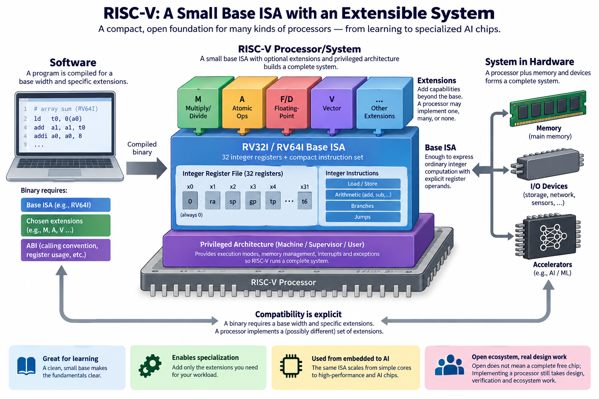
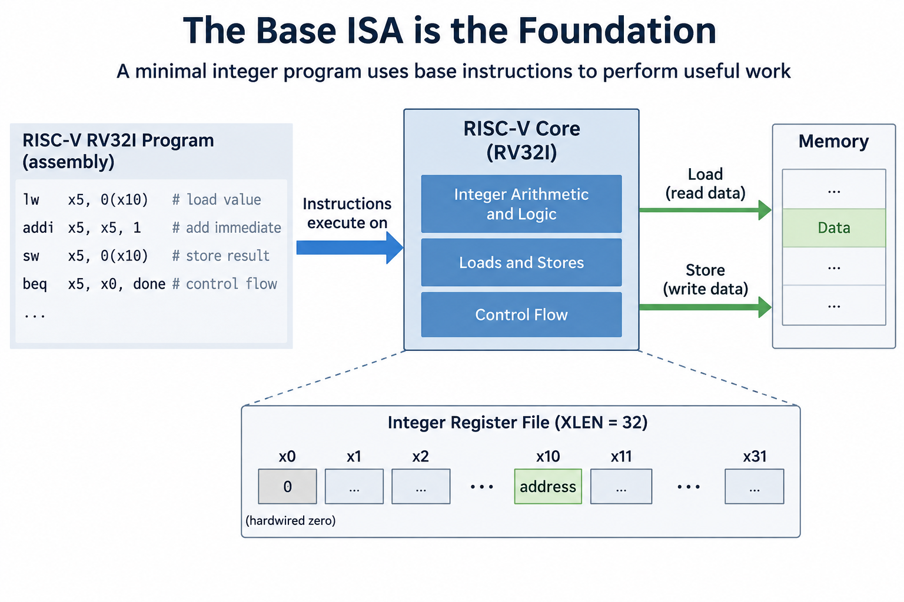
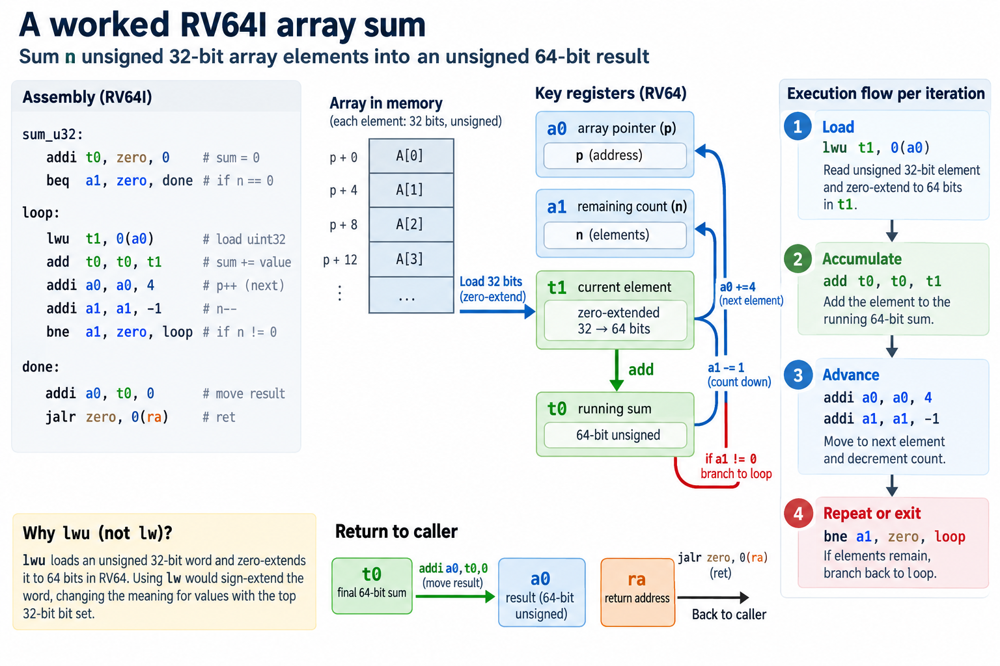
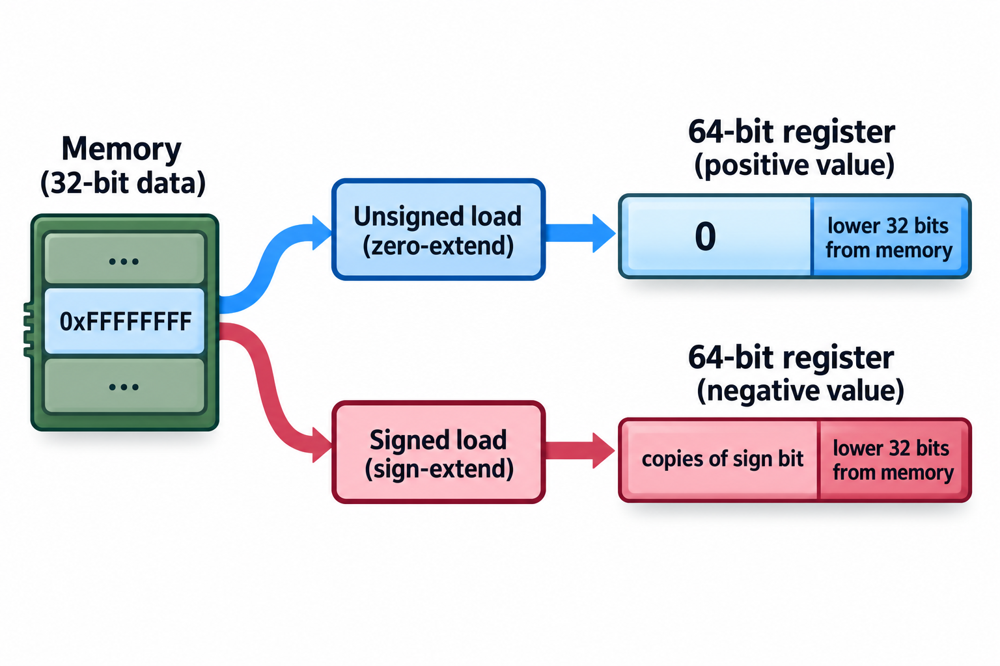
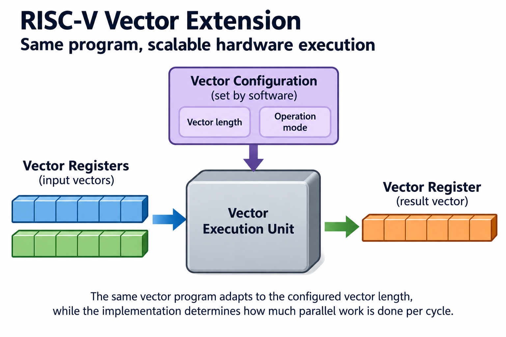

## Overview



32 integer register names and a compact base instruction set are enough to express ordinary integer computation in RISC-V. Register 0 always reads as 0; the other architectural registers hold program state. Around that base, extensions and privileged architecture build a much broader system.

That structure makes RISC-V useful for learning and for designing specialized processors. It also creates a compatibility question: which base width and extensions does a particular binary require, and which does a particular processor implement? “RISC-V” alone does not answer either question.

This article builds the programmer's model with an RV64I array sum. Read [the ISA contract](../instruction-sets-software-hardware-contract/) and [the AArch64 example](../arm-aarch64-registers-and-ecosystem/) first. We reuse the same computation so the differences stay concrete.

## Deep dive

### The base ISA is the foundation



RV32I and RV64I are base integer instruction sets with 32-bit and 64-bit integer register widths respectively. The width is commonly called XLEN. It describes architectural register width, not a promise that every operation or memory access uses that many bits.

The base includes integer arithmetic, logical operations, loads and stores, and control flow. A minimal integer program combines those operations to do more complicated work. Multiplication, floating point, vectors, and atomic operations are defined in extensions, not silently assumed in every RV64I implementation.

RISC-V's modular structure separates a small foundation from optional features. That helps implementations with different goals, but software must know its target. A binary that needs floating-point or vector instructions cannot run natively on a base RV32I or RV64I core.

The official unprivileged specifications define instruction semantics. Privileged specifications define the environment needed for protected operating systems and machine management. An instruction tutorial focused on user code covers only 1 part of the architecture.

### Registers and their assembly names

The base programmer's model includes `x0` through `x31`: `x0` is hardwired to 0 and discards writes, while the remaining registers hold software-visible integer state and a program counter supplies control-flow state.

Assemblers also use ABI names. `a0` through `a7` identify argument registers under the standard integer calling convention; `ra` is the return-address role; `sp` is the stack-pointer role; and `t` names identify temporary registers. These are names for architectural registers, not extra storage locations.

For example, `a0` corresponds to `x10`, `a1` to `x11`, and `ra` to `x1`. The ABI attaches conventions to those choices. The hardware adds the same register operands whether the programmer writes an ABI alias or an `x` name.

As with AArch64, a modern out-of-order implementation may have many more physical registers internally. RISC-V's visible count is the contract, not a count of every storage cell in the execution engine.

### Arithmetic uses explicit register operands

An instruction such as

```asm
add t0, t0, t1
```

adds 2 source register values and writes the low XLEN bits to the destination. Immediate forms include a small constant encoded in the instruction, such as `addi t0, t0, 5`.

Unlike AArch64, base arithmetic instructions do not set a condition-code register for later branches, so conditional branches compare their operands directly rather than consulting condition flags left by earlier arithmetic. This difference does not by itself determine branch prediction or execution speed.

The base immediate encoding has limits. A large constant may require several instructions, and assembler pseudoinstructions can expand accordingly. The text line `li` is convenient assembly syntax, not a guarantee of 1 machine instruction for every constant.

The instructions also distinguish signed and unsigned comparisons and loads. The bits in a register carry no inherent source-language type. The chosen operation decides how to interpret them.

### A worked RV64I array sum



Reuse the previous article's computation: sum `n` unsigned 32-bit array elements into an unsigned 64-bit result. Under the standard RV64 integer ABI, the pointer enters in `a0`, the count in `a1`, and the result returns in `a0`.

```asm
sum_u32:
    addi t0, zero, 0
    beq a1, zero, done
loop:
    lwu t1, 0(a0)
    add t0, t0, t1
    addi a0, a0, 4
    addi a1, a1, -1
    bne a1, zero, loop
done:
    addi a0, t0, 0
    jalr zero, 0(ra)
```

`lwu` loads an unsigned 32-bit word and zero-extends it to the 64-bit destination register. Using `lw` would sign-extend the loaded word in RV64, which changes the meaning for values with the top 32-bit bit set.

The final `jalr` transfers control through the return-address register while discarding its own link result by writing `0`. Assemblers commonly express this form as `ret`. Likewise, the first and final `addi` instructions can be written with convenient aliases. We show underlying forms to make the base operations explicit.

Assume valid readable normal memory for the array and the selected ABI. The function uses temporary and argument registers and calls nothing else, so this simple leaf example needs no stack frame.

### Trace the result and test signedness



With elements 3, 5, and 7 at `0x1000`, entry pointer is `a0 = 0x1000` and count is `a1 = 3`. After initialization, `t0 = 0`. The loop updates the sum to 3, then 8, then 15 while the pointer advances 4 bytes per iteration.

The count reaches 0 after the third element, and the return sequence puts 15 in `a0`. For a 0 count, the initial branch skips all memory loads and returns 0. This is the same architectural result as the AArch64 function even though register names and branch forms differ.

Now replace the first element with hexadecimal `ffffffff`. As an unsigned 32-bit integer, it is 4,294,967,295. `lwu` produces that positive 64-bit value. `lw` instead produces the 64-bit 2's-complement representation of minus 1. A sum using the wrong load instruction would fail the intended unsigned semantics.

This example teaches more than comparing mnemonic counts in isolation. It shows that operand width, extension behavior, and ABI roles are all part of a correct translation.


You can check signedness algebraically instead of inferring it from an assembly mnemonic. Let $$u$$ be the unsigned integer represented by the 32 loaded bits, with $$0\le u<2^{32}$$. On RV64 the numeric signed result of `LW` and the unsigned result of `LWU` are

$$
\operatorname{LW}(u)=\begin{cases}u&u<2^{31},\\u-2^{32}&u\ge2^{31},\end{cases}
\qquad \operatorname{LWU}(u)=u.
$$

The signed value is encoded in a 64-bit register by sign extension. For `0xffffffff`, $$u=4294967295$$: `LW` represents minus 1, whereas `LWU` represents 4294967295. Adding that loaded element to an accumulator of 2 therefore yields 1 or 4294967297, respectively, before any later overflow. Choosing the instruction is part of preserving the source language's intended type.

This shows the small-base method: make data width and extension behavior explicit, then build the algorithm from those guarantees. That is more predictable than assuming every load has the same numeric interpretation. Extensions can add vectorized versions that process multiple elements. A correct vector rewrite still needs matching element signedness, accumulator width, remainder handling, and overflow semantics. A compiler and ABI decide how the source program maps onto those features. An open ISA makes these rules inspectable; it does not make a vendor core's throughput or power consumption follow from this algebra. Keep correctness proofs and benchmark claims separate when evaluating an extension.

### Instruction size and compressed forms

The ordinary base instructions shown above have 32-bit encodings. 9 static instructions therefore occupy 36 bytes of instruction payload before alignment and surrounding object-file information. For a nonzero 3-element input, the source executes 2 setup instructions, 15 loop instructions, and 2 completion instructions: 19 dynamic instructions.

The compressed extension provides shorter encodings for selected operations and operand patterns, allowing an assembler targeting that extension to emit some 16-bit instructions where legal, with the exact encoding depending on the available form and registers rather than on a blanket rule that makes every instruction 16 bits.

Compressed code can cut instruction-fetch traffic and code footprint. The performance impact depends on instruction caches, front-end design, decoding, and the workload. A smaller binary is not automatically faster if data misses or arithmetic dependencies dominate its hot computation.

When comparing code size, specify target extensions and inspect actual assembled bytes. Counting assembly lines while ignoring pseudoinstruction expansion or compressed encodings is not a valid byte-count method.

### Extensions provide capabilities beyond the base



Extensions add different kinds of work to the base: the M extension adds integer multiplication and division, atomic extensions provide defined synchronization operations, floating-point extensions define particular numerical formats and operations, and the vector extension supplies a vector programming model with its own registers and configuration rules.

Those features are architectural contracts, not performance promises. 2 processors supporting the same vector extension can have different physical execution widths and throughput. A software loop can adapt to the permitted vector configuration, while the implementation decides how much parallel arithmetic finishes per cycle.

Extension names and versions matter. A short string copied from a product page is not a complete compatibility specification; check the architecture documentation and software target. Some features depend on others, and standardized profiles help describe coherent sets of requirements.

A custom instruction can add specialized behavior, but a binary using it needs the matching implementation or software support. Customization still needs a stable compiler, assembler, debugger, and library path.

### Going deeper: ISA, ABI, and profile

The ISA defines instructions, the ABI defines how separately compiled code passes values and preserves state, and a profile specifies a standardized collection of architectural features for a class of software target. Each solves a different compatibility problem.

For RV64, an ABI may specify 64-bit pointers and integer types while also deciding how floating-point arguments are passed, so matching the processor's floating-point instruction support is necessary but does not ensure that a caller and callee using different argument-passing conventions can cooperate correctly. The conventions still need agreement.

Profiles save broad software ecosystems from picking arbitrary feature combinations. They do not mean every historical or embedded RISC-V device supports the same profile. Name the profile and required versions for the target rather than assuming uniformity.

Operating-system support, executable format, and library availability add further requirements. A Linux-targeted RV64 executable does not become a bare-metal program just because both environments use the same integer instructions. Startup and system interfaces remain part of the deployment.

### Privileged architecture makes a system

A processor running a protected operating system needs more than user-level arithmetic. Privileged architecture defines execution modes, traps, interrupts, control/status registers, and address translation. Machine mode is the foundation; other modes and features serve different system goals under their specified requirements.

A bare-metal microcontroller and a server-class processor can therefore share the same broad ISA family yet expose very different environments, because the software that can run depends on their privilege features, memory management, devices, and boot paths as well as on the integer instructions that both processors understand.

Memory protection and virtual memory are not interchangeable concepts. A small system can use protection mechanisms without providing the same address-translation environment expected by a full operating system. Read the implemented system architecture, not just the unprivileged instruction list.

These distinctions matter for firmware and kernel work. An application developer may mostly see loads, stores, and calls, while platform software establishes the mappings and permissions that make them valid.

### Openness does not mean a complete free chip

RISC-V publishes an openly specified architecture under its applicable terms. Anyone can build a compatible implementation; the ISA is not a proprietary instruction contract tied to 1 core design. The specification is valuable, but it is not a finished RTL implementation or a manufacturing process.

A CPU design can be open or proprietary, but either way its designers still need to fund and carry out verification, physical design, fabrication, packaging, software enablement, and support. An open instruction set does not make those costs disappear.

Likewise, architectural openness does not guarantee that every extension is standardized or every binary is portable. A private custom instruction may be useful within a controlled system while limiting compatibility elsewhere. Distinguish the standardized contract from implementation-specific additions.

For the ASIC portion of this course, the useful connection is implementation freedom. Designers can build very different processors around a common instruction interface, then face the same verification and physical constraints as other silicon projects.

### This matters for AI chips

A RISC-V core can act as a controller inside an accelerator, handling command processing and system tasks. That role does not mean the accelerator's matrix engine runs ordinary scalar RISC-V instructions for every multiply. The device can have specialized execution machinery with its own software interface.

Vector instructions and custom accelerators can also support numerical workloads more directly, provided the available kernels, data movement, precision, and compiler support let the software use them effectively. Adding a multiply-like opcode alone does not solve memory bandwidth or parallel scheduling.

When evaluating an AI system, ask which part uses the ISA: host CPU, embedded controller, vector processor, or accelerator command path. Then compare that component's useful work and software support. The family label alone does not identify the bottleneck.

### Common misconceptions

**RISC-V is 1 identical processor.** It is an architecture family implemented by many designs. Base width, extensions, system features, and microarchitecture vary.

**Open ISA means free complete hardware.** The specification and a verified manufactured chip are different deliverables with different costs.

**A custom instruction is automatically portable.** It requires matching hardware and tools. Standardization and compatibility need deliberate design.

**RV64 makes every load 64 bits.** `lwu` in our function loads 4 bytes and extends them to the 64-bit register. Access width remains instruction-specific.

## Conclusion

Start with the base programmer's model, then name the extensions and environment needed by the software. The worked sum shows the same useful computation as AArch64 with different register and branch forms.

Continue with [the Arm, RISC-V, and x86-64 comparison](../arm-riscv-x86-comparing-without-myths/). The goal is to compare explicit contracts and actual implementations, not to rank family labels.

### Sources

- [RISC-V RV32I specification](https://docs.riscv.org/reference/isa/unpriv/rv32.html): programmer's model, encodings, integer operations, and branches.
- [RISC-V RV64I specification](https://docs.riscv.org/reference/isa/unpriv/rv64.html): 64-bit operations and load-extension rules.
- [RISC-V ELF psABI](https://riscv-non-isa.github.io/riscv-elf-psabi-doc/): register conventions and binary interfaces.
- [RISC-V specifications](https://docs.riscv.org/): extensions, privileged architecture, and standardized profiles.
