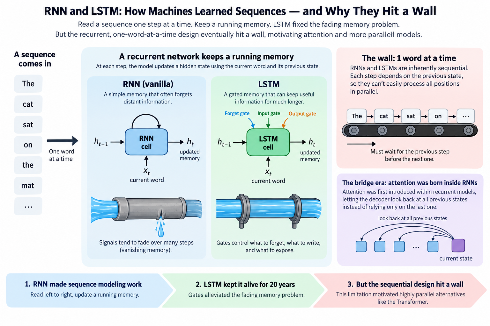
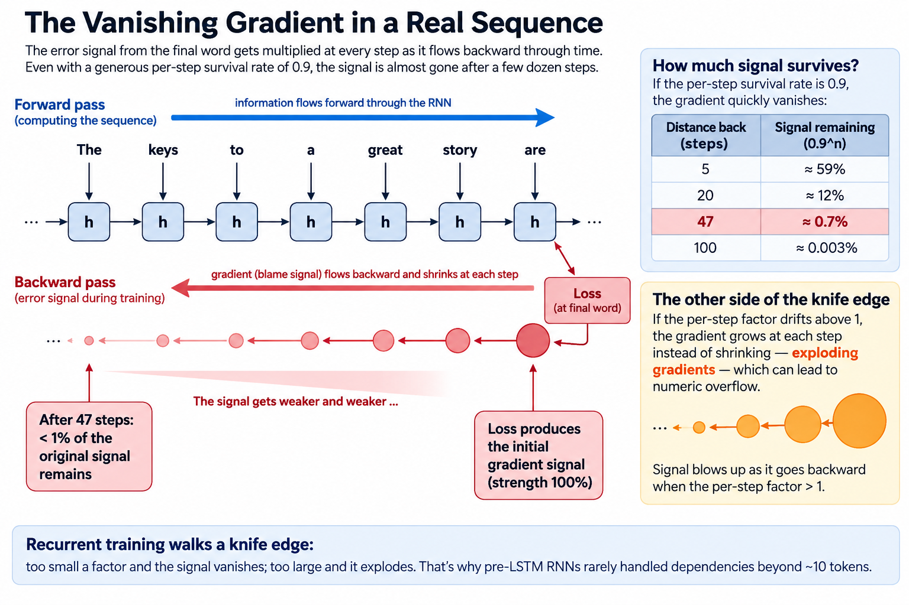
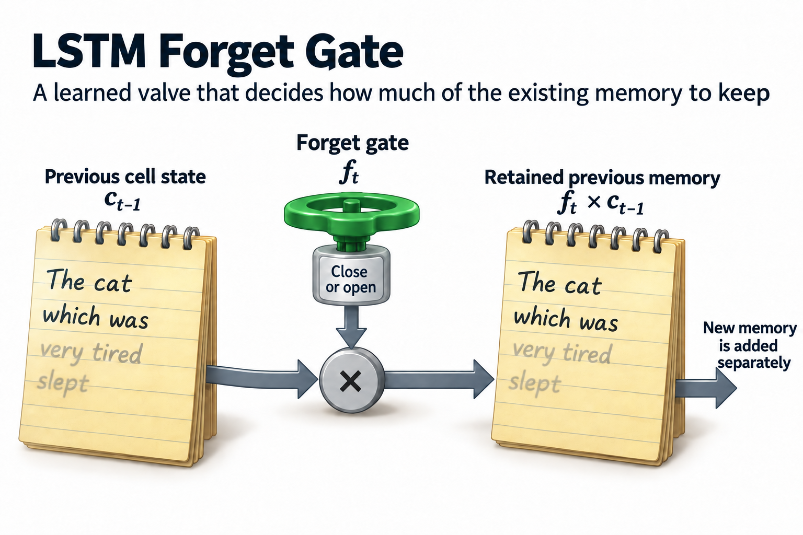
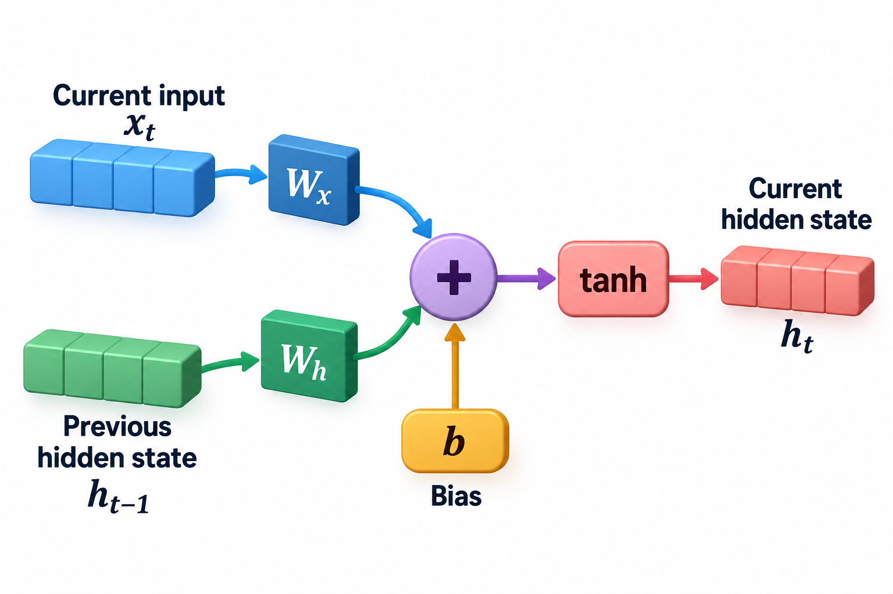

## Overview

Before 2017, the state of the art in machine translation read a sentence the same way you do: left to right, one word at a time, updating a running memory. Attention-based models later became prominent for large-scale translation and language modeling.

This article covers recurrent networks: the architecture that first made machines competent at language, the clever patch (LSTM) that kept it alive for 20 years, and the structural limitations that motivated highly parallel alternatives. Understanding these limitations is the setup for understanding why the Transformer looks the way it does.

## Deep dive

### Sequences need memory

[CNNs](/blog/cnn-how-machines-learned-to-see/) exploit the structure of images: local, repetitive patterns. Text has a different structure: it's a *sequence*, where meaning accumulates. "The keys to the cabinet **are** on the table": choosing *are* over *is* requires remembering "keys" from 5 words back.

The recurrent neural network (RNN) handles this with 1 elegant move: process tokens 1 at a time, and keep a **hidden state**, a vector of numbers acting as a running summary of everything read so far. Each step takes 2 inputs: the new word, and the summary. It produces an updated summary.

1 cell, 1 set of weights, reused at every time step: the same weight-sharing trick as a CNN's filter, applied across *time* instead of space.

### The fading memory problem

Now the flaw. That hidden state is the *only* channel connecting the past to the present. Information from word 3 reaches word 50 only by surviving 47 consecutive rewrites of the summary. During training, blame for a mistake at word 50 must flow backward through all 47 steps to reach word 3's weights.

At each backward step the gradient gets multiplied by roughly the same factors. Multiply 47 slightly-less-than-1 numbers together and you get effectively 0. This is the **vanishing gradient problem**: learning some long-range dependencies becomes difficult, because the teaching signal dies before it arrives.

The famous fix is the **LSTM** ([Hochreiter & Schmidhuber, 1997](https://www.bioinf.jku.at/publications/older/2604.pdf)): give the cell an express lane: a separate "cell state" that flows through mostly untouched, plus learned *gates* that decide what to write into it, what to erase, and what to read out. Think of it as upgrading a game of telephone with a shared notepad. LSTMs genuinely worked: they powered Google Translate's 2016 system and most speech recognition of that era.

### A worked example: watching the signal die

The vanishing gradient deserves numbers, because the brutality is in the arithmetic. During training, the blame signal flowing backward gets multiplied by a factor at every step. Call it the "survival rate" per hop. Suppose that factor is a healthy-sounding 0.9:

| distance back | signal remaining |
|---|---|
| 5 steps | 0.9⁵ ≈ 59% |
| 20 steps | 0.9²⁰ ≈ 12% |
| 47 steps | 0.9⁴⁷ ≈ **0.7%** |
| 100 steps | 0.9¹⁰⁰ ≈ 0.003% |

At 47 steps (our "keys … are" sentence stretched to paragraph length) the teaching signal arrives at word 3 carrying under 1 percent of its strength. The network *physically receives almost no instruction* about long-range structure, so learning that dependency can be difficult. And 0.9 is generous. The factor varies per step, and when it drifts above 1 you get the mirror-image disaster, **exploding gradients**, where the signal blows up into numeric overflow instead. Recurrent training walks a knife edge between fading and exploding, which is why pre-LSTM RNNs rarely handled dependencies beyond ~10 tokens.

### Going deeper: what the LSTM's gates actually do

The LSTM's fix is worth 1 level more detail, because "gates" sounds more mysterious than it is. A gate is just a learned valve: a small [weighted-sum-and-squash](/blog/what-is-a-neural-network/) whose output lands between 0 (closed) and 1 (open), multiplied against a signal. Each LSTM cell runs 3 of them, every step:

- **Forget gate**: how much of the notepad's current contents to erase (`keys` stays written; a finished subordinate clause can be wiped)
- **Input gate**: how much of the new word to write onto the notepad
- **Output gate**: how much of the notepad to reveal to this step's prediction

The notepad itself (the *cell state*) flows forward through mere multiplication and addition, with no repeated squashing, so a value written at step 3, with the forget gate open, can arrive at step 50 nearly intact. Gradients ride the same protected highway backward. That single design change took usable memory from ~10 tokens to hundreds, and it's why the LSTM, a 1997 invention, was still running Google Translate in 2016. The gates' weights, as always, are learned: the network figures out *what's worth remembering* from data.

The protected path becomes clearer as an equation. A standard gated cell updates its cell vector by

$$
c_t=f_t\odot c_{t-1}+i_t\odot\widetilde c_t,\qquad
\left.\frac{\partial c_t}{\partial c_{t-1}}\right|_{\mathrm{gates\ fixed}}=\operatorname{diag}(f_t).
$$

Here $$f_t$$ is the forget gate, $$i_t$$ the input gate, $$\widetilde c_t$$ proposed content, and $$\odot$$ componentwise multiplication. The displayed derivative isolates the direct cell-state path while holding gate outputs fixed; the full derivative also includes their dependence on earlier state. For a scalar constant forget factor 0.99 over 100 transitions, that direct-path multiplier is approximately 0.3660. At 0.9 it is approximately 0.00002656. Keeping the gate near 1 can therefore preserve a much larger signal without repeatedly multiplying by a squashing derivative.

This is the mechanism improved over a simple recurrent hidden-state update. It does not guarantee that optimization learns the right gate values, nor that the compressed state retains every detail. Independent sequences, batched matrix products, and work inside each transition still exploit GPU parallelism. The dependency is between successive states of the same ordinary recurrence. Evaluate state size, quality, and streaming latency alongside training throughput. Truncated backpropagation reduces the number of direct gradient transitions, trading training cost against long-range optimization signals even when hidden state continues across segments.

### Common misconceptions

"Transformers killed RNNs because RNNs were inaccurate." At short range, LSTMs were excellent. They held state-of-the-art in translation, speech, and handwriting for years. They lost on *scalability*: a Transformer soaks up 1,000 GPUs. An LSTM chokes on its own sequential chain. The kill was economic, not qualitative: an important pattern, because hardware fit decides architecture winners more often than accuracy does.

"The hidden state is like the model's database of the sentence." It's a fixed-size vector, typically a few 1000 numbers, no matter whether the input is 10 words or 10,000. Everything the model wants to remember must be *compressed* into that budget, which is exactly why long inputs degrade: it's lossy compression under pressure, not lookup.

"RNNs are gone." Their descendants are staging a comeback. Modern state-space models (Mamba and its hybrids) are recurrent at heart, with constant memory per step and no quadratic attention bill, and are being blended into production LLMs precisely because [attention's costs](/blog/attention-in-plain-words/) hurt at long context. The relay idea wasn't wrong. It was waiting for a formulation that trains in parallel.

### The wall: one word at a time

But the second flaw had no patch. An RNN, LSTM included, is **inherently sequential**: step 50 cannot begin until step 49 finishes, because its input *is* step 49's output.

Recall from [the CPU article's sibling series](/blog/what-a-cpu-actually-does/), and from everything this blog covers, that modern hardware wins by doing many things *at once*. A GPU offers tens of thousands of parallel lanes. An LSTM training on a 1,000-word document still parallelizes sequences and within-step matrix work, but cannot freely parallelize its recurrent state transitions: 1,000 steps, strictly in order. Just when the field learned (from [the scaling story](/blog/how-models-learn/)) that capability comes from training bigger models on more data, its best language architecture was one that **could not soak up parallel compute**.

By 2017, both flaws were biting at once: memory still degraded over long ranges despite the LSTM's notepad, and training couldn't scale across the hardware that was getting cheap. The field needed an architecture where every word could connect to every other word *directly* (no relay) and where all positions could be processed *simultaneously*.

That architecture is the next article. It's called attention.

### The bridge era: attention was born inside RNNs

1 historical beat usually gets skipped, and it makes the next article land better: **attention was invented as a patch for RNNs**, 3 years before it replaced them.

The setting was 2014 translation systems, which worked by having 1 LSTM squeeze the entire source sentence into a single fixed vector, and a second LSTM unfold the translation from it. That 1-vector bottleneck strangled long sentences. Imagine summarizing a 60-word German sentence into 1 fixed-size code, then translating from the summary alone. [Bahdanau, Cho, and Bengio's fix](https://arxiv.org/abs/1409.0473) was to let the translating LSTM *look back* at every source word at every step, weighting them by learned relevance: attention, in its original supporting role. Translation quality on long sentences jumped immediately.

For 3 years the field ran hybrids: recurrence for the backbone, attention for the long-range lookups. The 2017 insight was noticing which half was pulling the weight. If attention handles the relationships, what exactly is the recurrence *for*? Delete it, keep attention, and the sequential wall goes with it. The title "Attention Is All You Need" is literally a verdict on this question. Architecture history rarely moves in clean breaks. The revolution shipped as a bug-fix first.

### Write the recurrence and see the dependency

A simple recurrent layer computes

$$
h_t=\tanh(W_xx_t+W_hh_{t-1}+b).
$$

Here $$x_t$$ is the input vector at time t, $$h_t$$ is the hidden state, the 2 W matrices are learned weights, and b is a bias. The state at time t depends on the previous state, so ordinary evaluation follows the sequence. Multiple independent sequences and matrix operations inside a step can still be parallelized; recurrence does not mean the whole program runs on 1 scalar unit.

For a scalar illustrative recurrence with input 1, recurrent weight 0.5, input weight 1, 0 bias, and initial state 0, the first state is tanh(1), approximately 0.7616. The second is tanh(1+0.5×0.7616), approximately 0.8811. Even this toy computation cannot obtain the second state without the first.

During training, gradients connecting distant positions contain products of local derivatives. Repeated small factors can shrink a signal. Larger factors can amplify it. LSTM introduces an additive cell-state path controlled by gates, which can preserve gradients more effectively. It improves a mechanism rather than guaranteeing perfect memory for any sequence length.

Recurrent models did not disappear. They remain useful for streaming workloads and appear in newer state-space and hybrid designs. The relevant comparison is which dependencies and state representations fit a task and hardware budget, rather than declaring 1 architecture permanently dead.

### Match state to the streaming task

For an online sensor model, a fixed-size recurrent state can be an advantage: each new measurement updates a bounded vector rather than retaining every earlier activation for inference. Training through an entire sequence still has a separate memory cost because gradient computation may need intermediate states.

Truncated backpropagation limits how many time steps gradients traverse in 1 training segment. It can reduce training cost, but it also limits the direct optimization signal connecting distant positions. Carrying a hidden state across segments is not the same as propagating gradients across all those segments.

For a fair comparison with cached attention, specify state size, sequence length, batch size, and the exact task. An RNN's fixed-dimensional state compresses the history. A conventional attention cache keeps more token-specific state and grows with context. Neither representation guarantees that all relevant information is retained. The tradeoff is between state budget, access mechanism, trainability, and useful predictions under the deployment constraints.

## Conclusion

- RNNs read sequences with a running memory (hidden state): 1 cell, reused across time. It made machines competent at language for 2 decades.
- Flaw 1: long-range information and gradients fade over many steps (vanishing gradients). LSTM's gated express lane patched this well enough for translation-era systems.
- Flaw 2, the fatal one: strict state dependencies limit parallelism across time, so RNNs couldn't ride the scaling wave. The replacement had to connect all words directly, all at once.

A practical comparison should measure the complete task rather than only the recurrent cell. Hold the input representation, quality target, and evaluation split constant. Then report memory, latency, and accuracy separately. A compact streaming classifier and a general conversational model have different requirements, so a result on one does not establish superiority on the other. For streaming work, also test state resets and unusually long sequences. A system can look accurate on independent examples while drifting when hidden state carries across a continuous stream. Reset policy is therefore part of the model specification and its deployment contract.

### Sources

- [Dive into Deep Learning: Long Short-Term Memory](https://d2l.ai/chapter_recurrent-modern/lstm.html): gated additive cell-state update.

- Hochreiter & Schmidhuber (1997). ["Long Short-Term Memory"](https://www.bioinf.jku.at/publications/older/2604.pdf), *Neural Computation*
- Wu et al. (2016). ["Google's Neural Machine Translation System"](https://arxiv.org/abs/1609.08144) (peak production LSTM)
- Karpathy (2015). ["The Unreasonable Effectiveness of Recurrent Neural Networks"](https://karpathy.github.io/2015/05/21/rnn-effectiveness/) (the classic RNN explainer; the unrolled figure follows its standard presentation)

---

*Part of the [LLM Foundations & Mathematics](/series/llm-basics/) learning path. Browse its published articles by topic.*
