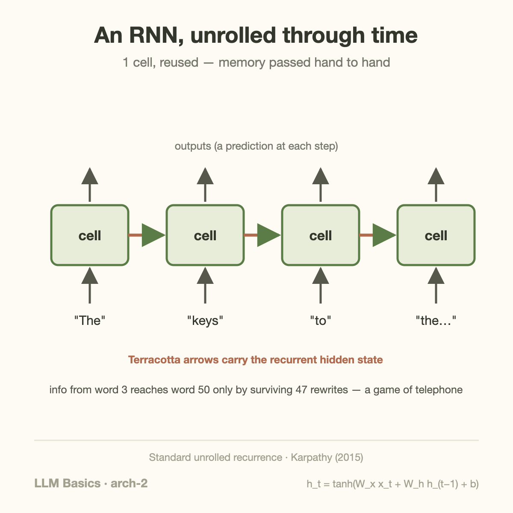
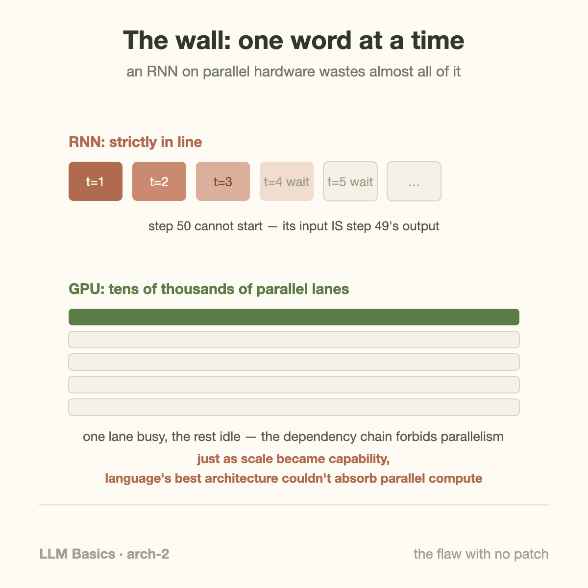

Before 2017, the state of the art in machine translation read a sentence the same way you do: left to right, one word at a time, updating a running memory. Then the field threw that entire design away — deliberately.

This article covers recurrent networks: the architecture that first made machines competent at language, the clever patch (LSTM) that kept it alive for twenty years, and the two structural flaws that eventually killed it. Understanding *why it died* is the setup for understanding why the Transformer looks the way it does.

## Sequences need memory

[CNNs](/blog/cnn-how-machines-learned-to-see/) exploit the structure of images: local, repetitive patterns. Text has a different structure — it's a *sequence*, where meaning accumulates. "The keys to the cabinet **are** on the table": choosing *are* over *is* requires remembering "keys" from five words back.

The recurrent neural network (RNN) handles this with one elegant move: process tokens one at a time, and keep a **hidden state** — a vector of numbers acting as a running summary of everything read so far. Each step takes two inputs: the new word, and the summary; it produces an updated summary.

One cell, one set of weights, reused at every time step — the same weight-sharing trick as a CNN's filter, applied across *time* instead of space.

## The fading memory problem

Now the flaw. That hidden state is the *only* channel connecting the past to the present. Information from word 3 reaches word 50 only by surviving 47 consecutive rewrites of the summary — and during training, blame for a mistake at word 50 must flow backward through all 47 steps to reach word 3's weights.

At each backward step the gradient gets multiplied by roughly the same factors; multiply 47 slightly-less-than-one numbers together and you get effectively zero. This is the **vanishing gradient problem**: the network structurally *cannot learn* long-range dependencies, because the teaching signal dies before it arrives.

The famous fix is the **LSTM** ([Hochreiter & Schmidhuber, 1997](https://www.bioinf.jku.at/publications/older/2604.pdf)): give the cell an express lane — a separate "cell state" that flows through mostly untouched, plus learned *gates* that decide what to write into it, what to erase, and what to read out. Think of it as upgrading a game of telephone with a shared notepad. LSTMs genuinely worked: they powered Google Translate's 2016 system and most speech recognition of that era.

## A worked example: watching the signal die

The vanishing gradient deserves numbers, because the brutality is in the arithmetic. During training, the blame signal flowing backward gets multiplied by a factor at every step — call it the "survival rate" per hop. Suppose that factor is a healthy-sounding 0.9:

| distance back | signal remaining |
|---|---|
| 5 steps | 0.9⁵ ≈ 59% |
| 20 steps | 0.9²⁰ ≈ 12% |
| 47 steps | 0.9⁴⁷ ≈ **0.7%** |
| 100 steps | 0.9¹⁰⁰ ≈ 0.003% |

At 47 steps — our "keys … are" sentence stretched to paragraph length — the teaching signal arrives at word 3 carrying under one percent of its strength. The network *physically receives almost no instruction* about long-range structure, so it never learns it. And 0.9 is generous; the factor varies per step, and when it drifts above 1 you get the mirror-image disaster, **exploding gradients**, where the signal blows up into numeric overflow instead. Recurrent training walks a knife edge between fading and exploding — which is why pre-LSTM RNNs rarely handled dependencies beyond ~10 tokens.

## Going deeper: what the LSTM's gates actually do

The LSTM's fix is worth one level more detail, because "gates" sounds more mysterious than it is. A gate is just a learned valve: a small [weighted-sum-and-squash](/blog/what-is-a-neural-network/) whose output lands between 0 (closed) and 1 (open), multiplied against a signal. Each LSTM cell runs three of them, every step:

- **Forget gate**: how much of the notepad's current contents to erase (`keys` stays written; a finished subordinate clause can be wiped)
- **Input gate**: how much of the new word to write onto the notepad
- **Output gate**: how much of the notepad to reveal to this step's prediction

The notepad itself (the *cell state*) flows forward through mere multiplication and addition — no repeated squashing — so a value written at step 3, with the forget gate open, can arrive at step 50 nearly intact. Gradients ride the same protected highway backward. That single design change took usable memory from ~10 tokens to hundreds, and it's why the LSTM — a 1997 invention — was still running Google Translate in 2016. The gates' weights, as always, are learned: the network figures out *what's worth remembering* from data.

## Common misconceptions

**"Transformers killed RNNs because RNNs were inaccurate."** At short range, LSTMs were excellent — they held state-of-the-art in translation, speech, and handwriting for years. They lost on *scalability*: a Transformer soaks up 1,000 GPUs; an LSTM chokes on its own sequential chain. The kill was economic, not qualitative — an important pattern, because hardware fit decides architecture winners more often than accuracy does.

**"The hidden state is like the model's database of the sentence."** It's a fixed-size vector — typically a few thousand numbers — no matter whether the input is 10 words or 10,000. Everything the model wants to remember must be *compressed* into that budget, which is exactly why long inputs degrade: it's lossy compression under pressure, not lookup.

**"RNNs are gone."** Their descendants are staging a comeback. Modern state-space models (Mamba and its hybrids) are recurrent at heart — constant memory per step, no quadratic attention bill — and are being blended into production LLMs precisely because [attention's costs](/blog/attention-in-plain-words/) hurt at long context. The relay idea wasn't wrong; it was waiting for a formulation that trains in parallel.

## The wall: one word at a time

But the second flaw had no patch. An RNN — LSTM included — is **inherently sequential**: step 50 cannot begin until step 49 finishes, because its input *is* step 49's output.

Recall from [the CPU article's sibling series](/blog/what-a-cpu-actually-does/) — and from everything this blog covers — that modern hardware wins by doing many things *at once*. A GPU offers tens of thousands of parallel lanes. An LSTM training on a 1,000-word document can use almost none of that: 1,000 steps, strictly in order. Just when the field learned (from [the scaling story](/blog/how-models-learn/)) that capability comes from training bigger models on more data, its best language architecture was one that **could not soak up parallel compute**.

By 2017, both flaws were biting at once: memory still degraded over long ranges despite the LSTM's notepad, and training couldn't scale across the hardware that was getting cheap. The field needed an architecture where every word could connect to every other word *directly* — no relay — and where all positions could be processed *simultaneously*.

That architecture is the next article. It's called attention.

## Takeaway

- RNNs read sequences with a running memory (hidden state) — one cell, reused across time. It made machines competent at language for two decades.
- Flaw one: long-range information and gradients fade over many steps (vanishing gradients); LSTM's gated express lane patched this well enough for translation-era systems.
- Flaw two, the fatal one: strict step-by-step processing can't use parallel hardware — so RNNs couldn't ride the scaling wave. The replacement had to connect all words directly, all at once.

## Sources

- Hochreiter & Schmidhuber (1997). ["Long Short-Term Memory"](https://www.bioinf.jku.at/publications/older/2604.pdf), *Neural Computation*
- Wu et al. (2016). ["Google's Neural Machine Translation System"](https://arxiv.org/abs/1609.08144) (peak production LSTM)
- Karpathy (2015). ["The Unreasonable Effectiveness of Recurrent Neural Networks"](https://karpathy.github.io/2015/05/21/rnn-effectiveness/) (the classic RNN explainer; the unrolled figure follows its standard presentation)

---

*Part of the **Fundamental of LLM** series. Previous: [CNN: how machines learned to see](/blog/cnn-how-machines-learned-to-see/). Next: attention in plain words.*
