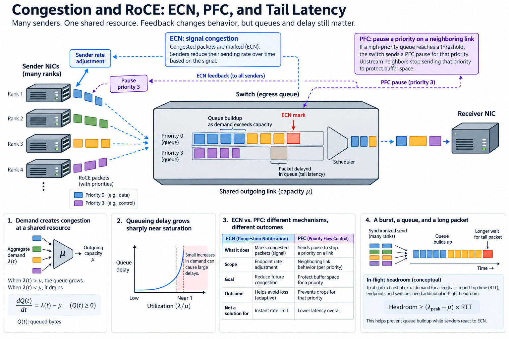
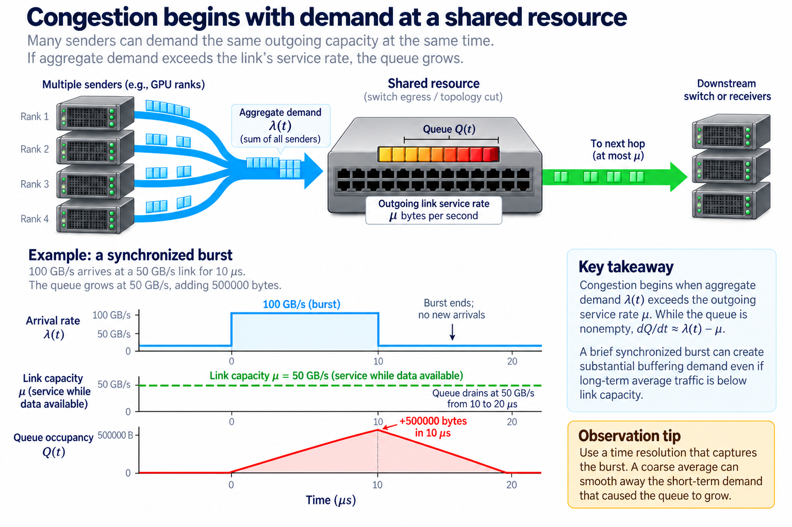
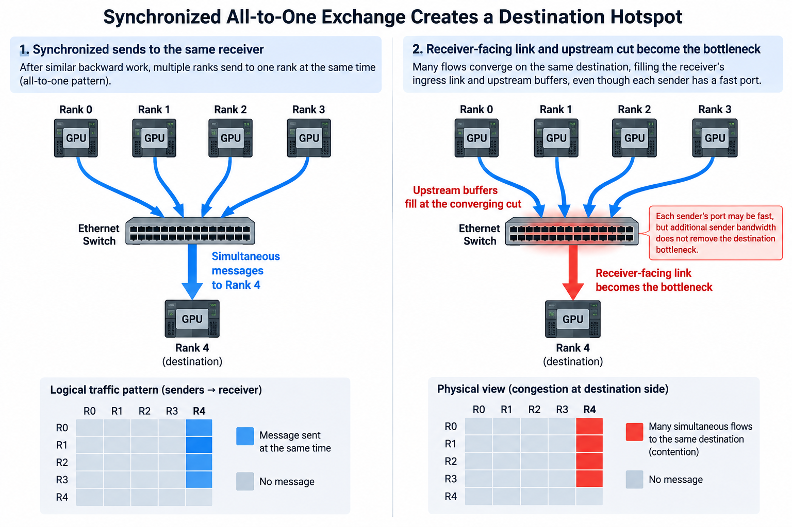
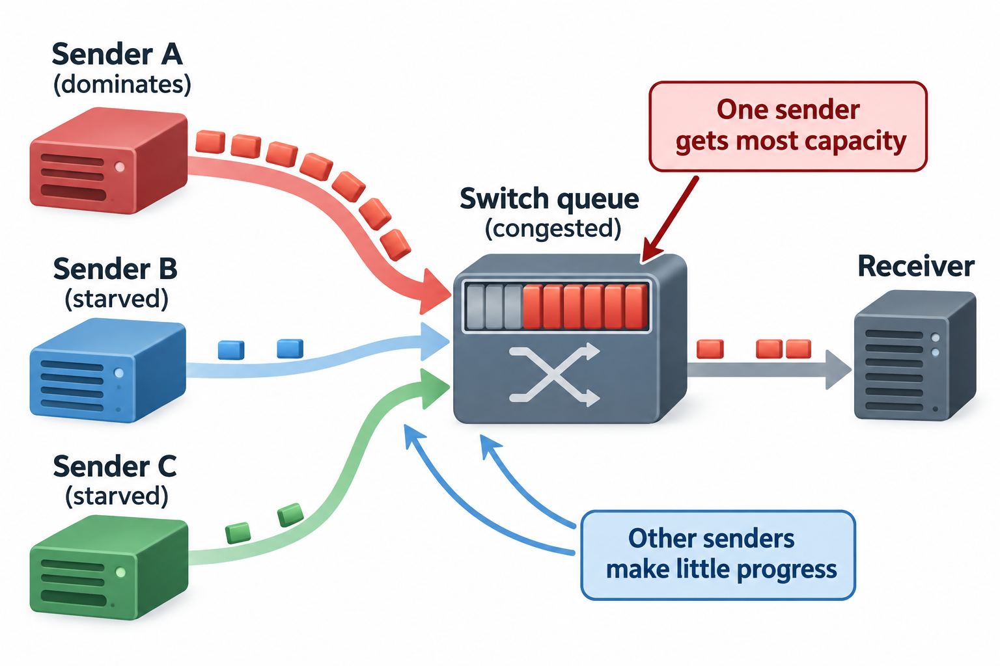

## Overview

A RoCE fabric can deliver high throughput in an isolated test and still suffer long distributed-job stalls when many ranks transmit together. The relevant difference is often congestion: several sources demand the same outgoing capacity, queues grow, and feedback takes time to change sending behavior. A synchronized collective can then wait for the slowest affected participant.

Explicit congestion notification and priority flow control address different parts of this problem. ECN signals congestion so endpoints can adjust sending rates. PFC pauses traffic in a selected priority on a neighboring link to protect buffer space. Do not treat either as a magic setting that turns an oversubscribed workload into unlimited capacity.

We will derive simple queue and headroom models, explain these mechanisms, and build a diagnostic method focused on useful distributed progress. Numerical examples are illustrative. Exact thresholds and configuration procedures are platform-specific and should follow the current supported deployment guidance.

## Deep dive

### 1. Congestion begins with demand at a shared resource

Consider an outgoing link or topology cut with service rate mu bytes per second. Let lambda(t) be aggregate incoming demand and Q(t) queued bytes. While the queue is nonempty, a simplified fluid model is

$$
\frac{dQ}{dt}\approx\lambda(t)-\mu.
$$

When demand exceeds capacity, the queue grows. When demand falls below capacity, it drains, subject to a lower bound of zero. This model omits packets, scheduling classes, and detailed hardware behavior, but it identifies the basic resource imbalance.

For an illustrative 100 GB/s arrival burst entering a 50 GB/s outgoing resource, the queue grows at 50 GB/s. Over 10 microseconds, that adds 500000 bytes. A brief synchronized burst can therefore create large buffering demand even if long-term average traffic is below link capacity.

Plot arrivals, queue occupancy, and outgoing traffic on compatible intervals. A coarse average can smooth away the burst that caused the pause or tail event. The observation method must resolve the relevant timescale well enough to support the hypothesis.

### 2. Queueing delay can grow sharply near saturation

A simple queue-delay estimate divides queued bytes by the available drain rate:

$$
T_{\mathrm{queue}}\approx Q/\mu.
$$

For Q=2 MB and mu=50 GB/s, the serialization-related wait is about 40 microseconds under the simplified model. Multiple congested hops and feedback interactions can add more delay. An application collective may amplify the effect by waiting for the last participant.

An idealized M/M/1 queue gives another intuition: mean time in the system is 1 divided by mu_requests minus lambda_requests under its stationary stochastic assumptions. Real RDMA bursts are not generally memoryless arrivals with exponential service, so this formula is not a direct predictor. Its useful lesson is that waiting grows nonlinearly as demand approaches capacity.

Do not replace mean time with p99 in Little's law or other mean-based relationships. Tail behavior needs its own observations and assumptions. For synchronized distributed traffic, inspect per-rank completion and burst alignment rather than expecting a generic queue formula to describe the entire job.

### 3. ECN provides a signal, not an instantaneous rate limit

A congested switch can mark eligible packets using ECN. The receiving endpoint observes congestion information and the transport's feedback mechanism informs the sender. The sender's congestion-control algorithm then adjusts its rate according to that algorithm's policy.

Several parts must align: packet classification, marking, endpoint support, feedback handling, and rate response. Marking packets alone does not produce effective control if the sender does not react as intended. Conversely, rate changes without observed marks may indicate another limiting mechanism.

DCQCN is a published congestion-control design for large-scale RDMA deployments. It combines congestion feedback with endpoint rate adaptation. Its existence does not mean every current RoCE stack uses identical equations, settings, or hardware implementation. Check the actual supported control mechanism on the deployed adapters.

Feedback has delay. During that interval, existing and newly issued bytes can continue reaching the congested resource. The switch needs enough buffer margin and an appropriate supported marking policy for the intended rates and paths. A threshold copied from another link speed or topology can change when control begins relative to queue growth.

### 4. Derive the in-flight headroom requirement

Let r be incoming byte rate that can continue after a control event and tau the relevant reaction interval. A first-order headroom estimate is

$$
H\gtrsim r\tau+H_{\mathrm{margin}}.
$$

The margin represents implementation-specific effects and additional in-flight traffic not captured by the simple product. The exact reaction interval depends on the mechanism: end-to-end feedback and neighboring-link pause do not have the same path or timing.

For an illustrative r=50 GB/s and tau=2 microseconds, the product is 100000 bytes. With tau=20 microseconds, it is 1 MB. The calculation shows why timing and link rate matter to buffer planning. It does not prescribe a switch threshold, because the hardware's buffer allocation and control semantics are more detailed.

Multiple senders can increase aggregate in-flight demand. Use the rate entering the protected resource, not automatically the speed of one port. Also account for the traffic class and physical boundary to which the supported threshold applies.

This estimate is a consistency check for a documented configuration. If observed bursts or feedback timing differ a lot from the assumptions, investigate the mismatch with the platform's supported diagnostics rather than experimenting with arbitrary low-level thresholds.

### 5. PFC changes neighboring-link behavior by priority

Priority flow control can pause a selected traffic priority on a link while other priorities continue according to the implementation and configuration. It protects against buffer exhaustion at that boundary, but its granularity is not necessarily one application flow.

Several unrelated flows sharing the paused priority can wait together. Congestion can propagate upstream as paused traffic blocks progress and buffers fill on preceding devices. This can create head-of-line effects and complex dependencies across the network.

PFC is therefore different from end-to-end congestion-rate control. Pauses address immediate buffer pressure at a local boundary, while a sender-rate mechanism attempts to reduce sustained offered demand. A deployment may use both under supported guidance, but measure them as distinct behaviors.

Observe pause duration and affected priorities, not just pause-event count. Many very short events and a few long pauses can have different application consequences. Correlate pauses with queue occupancy, traffic bursts, and collective tails to see whether the mechanism protects buffers while preserving progress.

### 6. Loss avoidance and low latency are different outcomes

A configuration can reduce packet drops while increasing waiting. Reliable transport retries can also hide packet loss from the application while adding delay. The service or training job ultimately cares about useful completion, not only whether bytes eventually arrive.

Track ECN marks, congestion notifications where available, pause behavior, drops, retries, and per-rank timing together. No single counter is a complete congestion diagnosis. High marking can mean active early control, while high sustained queues can mean the response is too weak or demand remains above capacity.

A low utilization reading does not rule out congestion. Sampling can miss bursts, traffic can be blocked upstream, or one shared path can limit a subset of ranks while other links remain idle. Inspect the relevant cut and direction rather than averaging the whole fabric.

For an illustrative collective with most ranks completing in 5 milliseconds and one rank completing in 20 milliseconds, the group can wait on the 20-millisecond result. A healthy mean across links does not explain that critical-path delay. Correlate the late rank's path with the congestion evidence.

### 7. Synchronized workloads stress different patterns

Gradient exchanges can align across ranks after similar backward work. Expert dispatch can create destination hotspots when routing is imbalanced. Pipeline boundaries can produce repeated activation bursts. These patterns can stress buffers differently from smooth independent traffic.

Keep the logical traffic matrix beside the physical topology. A balanced total byte count can still contain a concentrated destination or oversubscribed cut. Changing placement or communication scheduling can reduce the expensive-path demand without changing the model's mathematical result.

An all-to-all example makes this concrete. If several senders target the same receiver at the same time, receiver-facing capacity and upstream cuts may dominate even when each sender has a fast port. Adding sender bandwidth alone does not remove the destination bottleneck.

Reproduce the burst and concurrency pattern in controlled tests. A single pair transfer is useful for validating the path but cannot show fabric behavior under a multi-rank synchronized exchange. Keep message sizes and destinations fixed when comparing configuration or placement changes.

### 8. Build a layered congestion investigation

First verify transport selection and physical placement. Then identify which queues, priorities, ports, or cuts show correlated pressure. Compare isolated and concurrent transfers, and inspect the application's readiness and completion timeline.

Use controlled comparisons to distinguish a path problem from congestion. If one GPU-adapter pair is always slow even in isolation, investigate locality or registration first. If pairs are healthy but synchronized traffic degrades across a shared boundary, aggregate demand and control behavior become stronger hypotheses.

Capture a baseline and degraded window with the same counter definitions and workload labels. A counter reset, changed sampling rate, or different traffic population can imitate recovery. Record configuration and version changes on the same timeline.

For every proposed adjustment, state the expected mechanism: earlier rate response, reduced burst alignment, improved traffic placement, or restored endpoint classification. Then verify both the relevant control evidence and useful job timing. A change that reduces marks but increases tail latency has not automatically improved the workload.

### 9. Evaluate the deployment under realistic contention

Run representative multi-job or multi-tenant traffic when the production fabric shares capacity. Include bursty and asymmetric cases, not only balanced all-to-all. Observe whether queues recover after a burst or remain elevated as arrivals continue.

Inspect fairness across simultaneously contending senders as well as aggregate throughput. One sender receiving most available capacity can produce a healthy total rate while other ranks make little progress. Keep per-sender rates and completion distributions, and compare them with the intended traffic policy. Equal rates are not always the correct objective when classes have different entitlements, so make the fairness target explicit before ranking configurations.

Report useful throughput, collective tail distributions, and relevant congestion counters together. Keep any tradeoff explicit: one class may gain lower latency while another loses progress. Traffic classification and scheduling policy determine who shares the protected priority and capacity.

An illustrative before-and-after record can show that a placement change reduced traffic across one oversubscribed cut, lowered sustained queue occupancy, shortened pause duration, and improved the late-rank tail. Those linked observations support a mechanism. A lower pause count by itself would not support the same conclusion, because the system could instead be dropping more packets or admitting less work.

Maintain a supported configuration record with assumptions about speeds, paths, traffic classes, and endpoint behavior. Revisit it after link-rate, topology, or adapter changes. Headroom and feedback timing depend on the system that actually runs, not only on a configuration label.

## Conclusion

Congestion control connects offered demand to finite forwarding capacity through delayed feedback and buffering. ECN, endpoint response, and PFC contribute different mechanisms. Judge their success by stable useful progress and bounded tails, with counters that explain how the fabric handled the workload rather than just whether packets were eventually delivered.

### Sources

- [NVIDIA Cumulus Linux RoCE guidance](https://docs.nvidia.com/networking-ethernet-software/cumulus-linux-518/Layer-1-and-Switch-Ports/Quality-of-Service/RDMA-over-Converged-Ethernet-RoCE/).
- [Congestion Control for Large-Scale RDMA Deployments: DCQCN](https://www.microsoft.com/en-us/research/publication/congestion-control-for-large-scale-rdma-deployments/).
- [NCCL network troubleshooting](https://docs.nvidia.com/deeplearning/nccl/user-guide/docs/troubleshooting.html).
