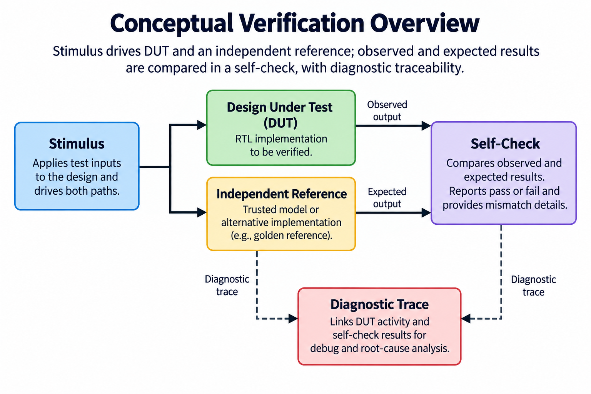
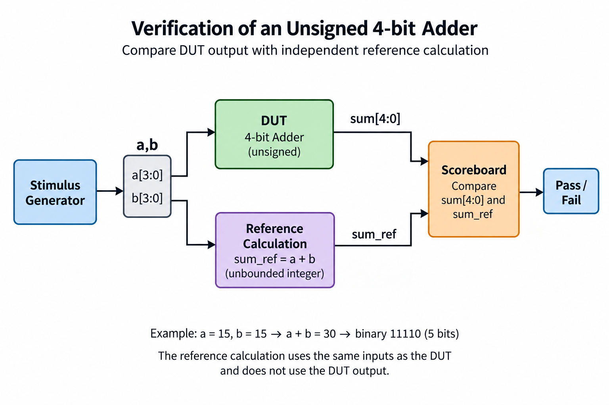
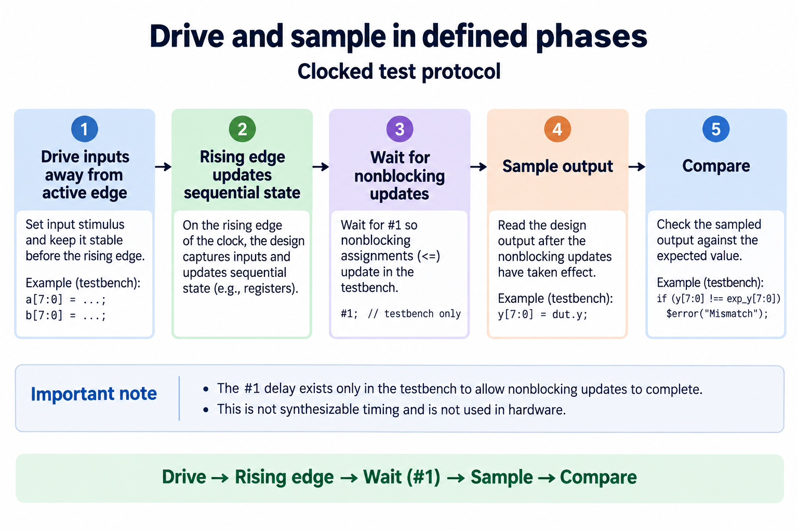
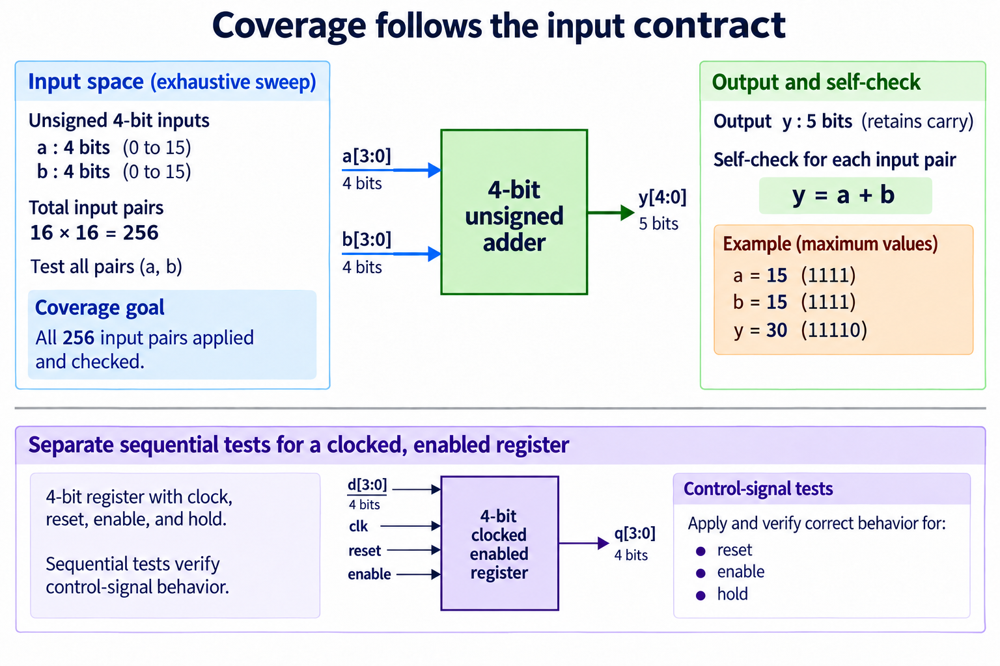
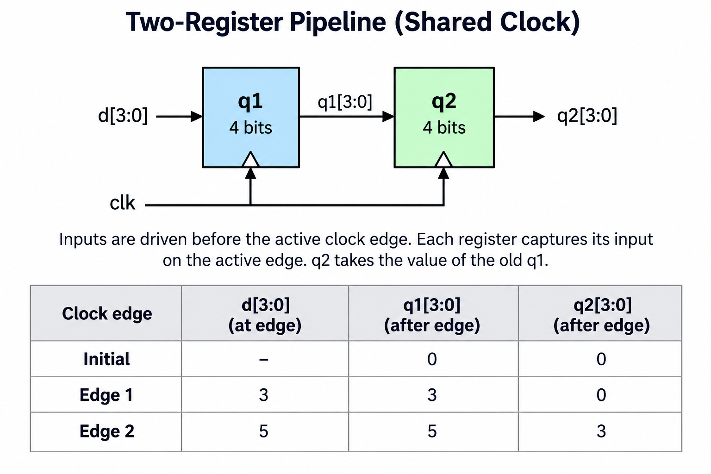

## Overview

RTL simulation asks whether a hardware description follows a defined behavioral contract under the events applied by a testbench. The overview connects stimulus, DUT, reference calculation, comparison, and diagnostic trace. Success means the specified checks passed; it does not follow merely from opening a waveform or finishing a compile command.

This lesson builds on the [SystemVerilog modules and state article](/blog/systemverilog-beginners-modules-signals-state/). The examples are the same small unsigned adder, multiplexer, 2-register pipeline, and enabled register. Reusing their contracts lets the discussion focus on verification: which cases are applied, when inputs are changed, when outputs are sampled, and how an incorrect expectation is diagnosed.

The [foundations lab](/labs/fpga-fundamentals/foundations-lab.zip) runs real Icarus compilation and simulation, alongside Python arithmetic checks. Its testbench reports comparison counts and fails on a mismatch. The supplied commands can be rerun independently. Device synthesis, routed timing, analog metastability, and programmed-board measurements are outside this evidence, even when every RTL check passes.

Begin with a written expected behavior before constructing stimulus. A reference needs the same external contract as the DUT but should avoid dependence on the DUT's internal calculation. Next specify the simulation phases used for driving and sampling. Finally choose cases that challenge widths, conditions, and state transitions. This sequence produces tests whose success has a clear meaning.

## Deep dive

### Keep the reference independent

The reference branch in the figure receives inputs from the stimulus, separately from the DUT. It calculates the expected result using the specification. The observed DUT output and expected reference output meet at the scoreboard. The scoreboard should identify a mismatch and terminate the test with a failure, rather than quietly displaying both values and leaving judgment to a viewer.

For the 4-bit unsigned adder, the reference can add the applied operand integers without first truncating the sum to 4 bits. The DUT output has 5 bits and should equal the full value from 0 through 30. If the reference incorrectly masks the sum to 4 bits, it can accept a DUT that discards carry. A reference is valuable because of its interpretation, not because it is written in a different file.

For the mux, the reference selects b when s is one and a otherwise. For a clocked pipeline, it maintains prior expected state independently. These models are deliberately simpler than the implementation: the reference does not reconstruct gate structure or derive its answer from the observed q values. A comparison against the DUT's own output is circular and cannot detect an incorrect result.

A useful diagnostic names the test and input case, then prints expected and observed outputs. For sequential logic, also include the edge number, reset and enable state, and prior expected state. These details let the reader recreate the failing transition. A message saying only test failed leaves avoidable uncertainty about the contract violation.

Test quality can be challenged with controlled mutations in a scratch copy. Narrow the adder output, reverse the mux selection, or make the second pipeline stage copy d directly. The appropriate self-check should fail. If it does not, inspect whether the cases reach that behavior and whether the reference repeats the same assumption. Remove the mutations before packaging the lab.

Reference independence has practical limits. A small hand-written integer model is easy to inspect; a large model may itself need tests. Use boundary calculations and a second simple derivation where feasible. For this course, all adder input pairs and all mux binary input combinations can be enumerated, and selected state traces can be worked by hand. Together these provide more meaningful evidence than a testbench that only waits for time to pass.

### Drive and sample in defined phases

The phase diagram separates driving inputs from the active sampling edge. A simple clocked testbench changes inputs away from the rising edge, waits for that edge, allows the scheduled nonblocking updates to occur, then reads the outputs. The ordering is essential: sampling before state updates can produce an apparent failure even when the DUT follows the intended transition rule.

In the supplied testbench, inputs are driven at a falling edge and the outputs are checked after a later rising edge with a small simulation delay. The delay exists to avoid reading before scheduled updates settle in this teaching setup. It is not a physical timing constraint or a claim about clock-to-Q delay on a device. The [Icarus documentation](https://steveicarus.github.io/iverilog/usage/simulation.html) explains simulation execution and supported behavior; the lab records the actual commands it uses.

Avoid having the DUT and testbench race to change and consume the same input at one active event. A testbench that drives d exactly when the DUT captures d may depend on scheduling details rather than a clear stimulus contract. More advanced SystemVerilog verification can use clocking blocks and explicit event regions. The beginner example first establishes an unambiguous drive-before-capture sequence.

Combinational tests need settling between input assignment and comparison as well. Their simulation delay allows the function to evaluate under the simulator's event model. It should not be interpreted as proof of maximum propagation delay after routing. A 0-delay RTL model can establish a stable Boolean result while hiding physical glitches and unequal path delays.

Reset belongs in this sequence. The enabled register uses synchronous active-high reset, so the testbench must assert reset before an active edge and sample after that edge. Expecting reset to change q immediately between edges would test a different asynchronous contract. Apply reset and enable together to verify priority, then release reset in the documented simulation phase.

When a failure occurs, first check whether the expectation refers to pre-edge or post-edge state. Then confirm which events changed the inputs and when the comparison ran. This method distinguishes a scheduling error in the testbench from a wrong state transition in the DUT. Both require correction, but changing the hardware to satisfy a racing test would conceal rather than solve the problem.

### Coverage follows the input contract

Coverage follows the declared input and transition domain. The unsigned adder has 16 possible values for a and 16 for b. Their Cartesian product contains 256 pairs. The test applies every pair and compares the 5-bit y with the full reference sum. The pair 15 plus 15 produces 30, or 11110, explicitly challenging the retained carry.

The 2-bit mux has 4 values for each data input and 2 select states, giving 32 binary combinations. This count comes from its interface, rather than from the number of lines in its RTL. Exhaustive enumeration is practical for these small combinational modules and gives a clear completeness claim over their binary input space.

Sequential coverage concerns transitions and histories as well as input combinations. The enabled register test includes reset, reset competing with enable, enabled load, and disabled hold while d changes. The pipeline test includes startup after reset and several consecutive input values. Enumerating only a single d pattern cannot reveal whether q2 incorrectly copies the current input instead of the preceding stage.

Coverage does not mean that every conceivable physical condition has been tested. The binary sweeps do not model analog timing, metastability, routing delay, or arbitrary X and Z behavior. The state tests exercise the listed transition contracts in RTL. Mark those boundaries so readers understand both the strength of exhaustive small-domain checking and the work needed for integration or physical implementation.

Boundary values are particularly useful when exhaustive enumeration becomes impossible. Include 0, one, maximum unsigned values, minimum and maximum signed values, and operands around representable limits. Add combinations that activate each decision branch and sequences that create conflicting control requests. Derive the expected value first; a boundary case without a checked output is just stimulus.

The lab keeps comparison counts visible and makes an omitted simulator a failure in the full verification command. This avoids accidentally reporting RTL success from Python-only checks. An environment lacking Icarus can run the arithmetic-only command, but that result is labeled separately. Record exactly which command ran and retain its exit status. A useful report connects the checks performed to the interface domain, rather than presenting a bare pass label.

### Waveforms explain a failed expectation

The table in the figure records post-edge pipeline values. Start after reset with q1 and q2 both 0. At the first test edge, d equal to 3 gives q1 equal to 3 and q2 equal to 0. At the second, d equal to 5 gives q1 equal to 5 and q2 equal to 3. This trace follows the old-state nonblocking rule from the SystemVerilog lesson.

A waveform helps explain this behavior by showing input changes and state updates together. The testbench can write a VCD file with the clock, reset, d, q1, and q2. Inspect where d was changed relative to each rising edge and whether the plotted values are pre-edge or post-edge. A compressed screenshot without event markers can make a correct 2-stage pipeline look like an accidental passthrough.

The scoreboard should encode the same trace independently. Save the old expected q1, update expected q1 from the applied d, then use the saved value for expected q2. If the reference instead updates q1 and immediately uses its new value for q2, it repeats a software-style ordering error. A hand-worked 2-edge table exposes that mistake before a long randomized run.

Waveforms are diagnostic evidence, not a substitute for self-checks. A viewer can overlook an incorrect value among many cycles. The testbench comparison pinpoints the first mismatch and supplies a cycle number that can be located in the trace. Conversely, a self-check with a bad reference can report a failure that the trace helps explain. Use the 2 tools together, with the written contract determining which behavior is correct.

Keep traces small enough to answer a specific question. For the pipeline, a few different inputs and the reset transition suffice to identify latency and old-state transfer. For the enabled register, focus on the reset-and-enable conflict and a hold interval. Capturing every internal signal for a large simulation can obscure the behavior a beginner is trying to understand.

The packaged lab generates its waveform during RTL execution, and the runner stores the transcript in its report. These artifacts can be inspected or regenerated by the reader. They establish event-level functional behavior under the applied cases. A physical signal trace from a board would be a different artifact with measurement conditions, clock sources, and interface setup that this release does not claim to provide.

## Conclusion

A useful RTL testbench combines an independent reference, defined driving and sampling phases, cases derived from the contract, and actionable failures. Exhaustive small input spaces make strong functional examples; clocked designs additionally require histories and priority tests. A waveform explains the first mismatch after the scoreboard identifies it.

Run the foundations lab rather than treating its code blocks as proof. Its full command requires the simulator and reports the actual arithmetic, mux, adder, and state checks. If only the arithmetic command is used, retain that narrower result. Neither transcript replaces device timing analysis or board operation.

Continue with [digital timing](/blog/digital-timing-setup-hold-latency-pipelining/) to understand setup, hold, skew, and pipelining. Those topics explain why a functionally correct edge-level model still needs physical evidence before it can be described as reliable hardware.

### Sources

- [Icarus Verilog getting started](https://steveicarus.github.io/iverilog/usage/getting_started.html)
- [Icarus Verilog simulation documentation](https://steveicarus.github.io/iverilog/usage/simulation.html)
- [SystemVerilog procedural simulation semantics](https://systemverilog.dev/3.html)
