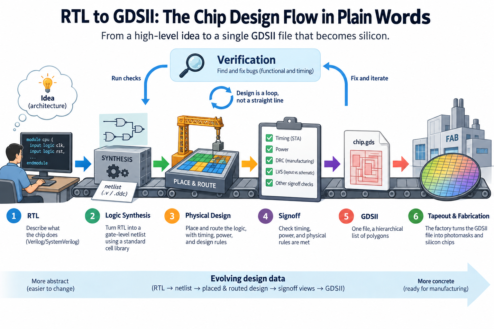
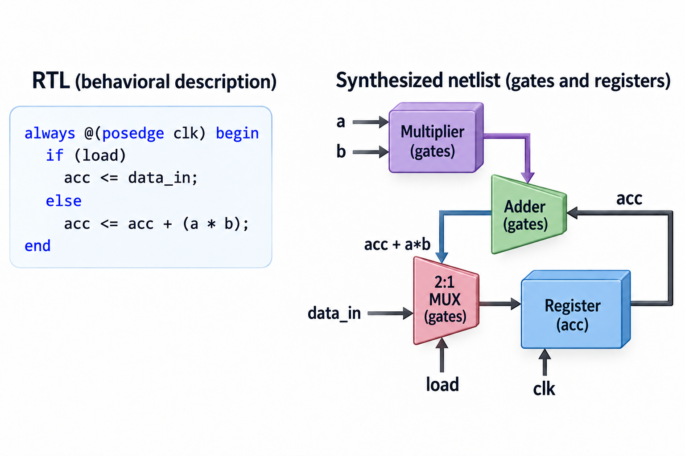
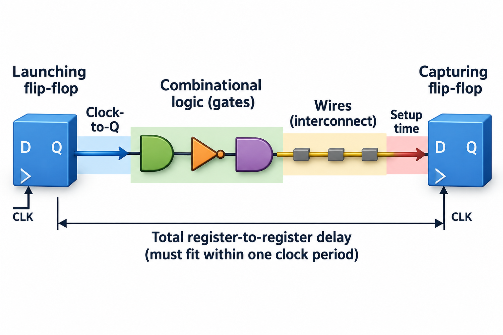
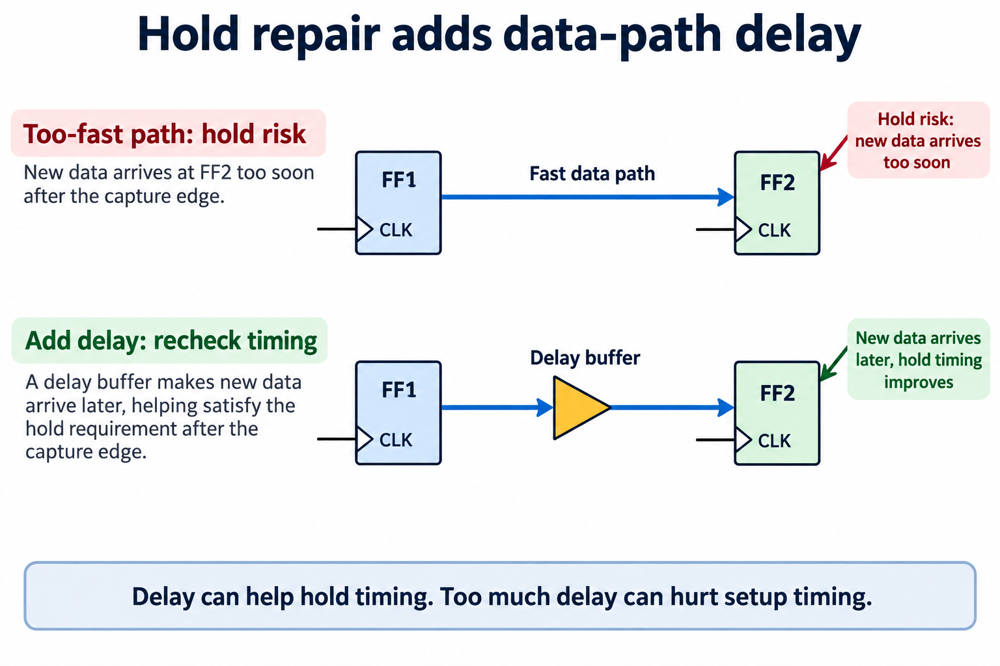

## Overview



Designing 1 leading-edge chip costs somewhere around half a billion dollars. The figure most often quoted comes from International Business Strategies (IBS), whose estimates put a full 5nm design effort near $540 million. That total counts architecture, logic design, verification, physical design, and the software that ships with the silicon, and you should treat the exact figure with care, because it is an analyst estimate that gets rounded differently in every press article, though the order of magnitude is not in dispute.

Here is the part I find genuinely funny. After all that money and 2 to 3 years of work, the entire project collapses into a single file, written in a binary format called GDSII that Calma introduced in 1978. That file, a giant hierarchical list of polygons, is what the factory turns into photomasks. Everything between the first line of Verilog and that file is called *the flow*, and this article walks through it in plain words.

## Deep dive

### The building analogy

A chip project maps surprisingly well onto constructing a building.

An architect first draws what the building should *do*: here is the lobby, here are the elevators, this floor is offices. No steel thicknesses, no rebar spacing. That is **RTL**, the behavioral description of the chip.

A structural engineer then converts intent into components with known properties: this wall becomes a steel frame of specific beams, chosen from a catalog with certified load ratings. That is **synthesis**, which maps behavior onto logic gates from a catalog called a standard-cell library.

Next come the construction documents: exact coordinates for every beam, every pipe routed so it doesn't collide with the ductwork. That is **place and route**, where every gate gets an (x, y) position and every wire gets a geometric path through the metal layers.

Then inspection. Before anyone pours concrete, a reviewer checks the plans against building codes and re-verifies the structural math. On a chip that step is **verification and signoff**, and it is where most of the budget actually goes.

Finally, the stamped permit set goes to the builder. That is **tapeout**: the GDSII file leaves the design team and goes to the mask shop.

### Stage by stage



**RTL** stands for register-transfer level. You describe the chip as registers (storage elements that update on a clock edge) plus the logic that computes each register's next value. In Verilog, a multiply-accumulate unit looks like this:

```verilog
always @(posedge clk) begin
  if (load) acc <= data_in;
  else      acc <= acc + (a * b);
end
```

Nothing here says *how* to multiply, because there is no adder topology, no gate and no wire in those 4 lines: all you have written down is behavior, namely that on every clock edge the accumulator either loads a fresh value or adds a product to what it already holds. A modern CPU core is a few hundred thousand to a few million lines of this. The pipeline machinery I described in [What a CPU Actually Does](/blog/what-a-cpu-actually-does/) exists, in real projects, as exactly this kind of code.

**Synthesis** is the job of a tool (Synopsys Design Compiler and Cadence Genus dominate commercially; Yosys is the open-source workhorse). The tool reads the RTL plus a standard-cell library and emits a *netlist*: a list of gate instances and the nets connecting them. A standard-cell library is the parts catalog for 1 specific factory process, holding a few 100 to a few 1000 pre-designed, pre-characterized little layouts, among them NAND2, NOR3, inverters in 10 drive strengths, flip-flops and full adders, and each cell arrives with measured data for delay as a function of load, for power and for area. The `a * b` above might become roughly 4,000 gates arranged as a Wallace-tree multiplier if you asked for speed, or a smaller, slower array multiplier if you asked for area. The tool makes that trade based on constraints you write, chiefly the clock period.

**Place and route** turns the netlist into geometry in 4 passes: floorplanning, where a human decides the die outline and where the RAM macros sit and where the power grid runs, then placement, where the tool assigns each of the millions of cells to a legal spot in neat rows, then clock-tree synthesis, where the tool builds a balanced tree of buffers because the clock must reach hundreds of thousands of flip-flops at very nearly the same instant, and finally routing, where every net gets drawn as actual metal across 10 to 20 metal layers without shorting anything. The output is no longer a program in any sense. It is a drawing.

**Timing closure** is the loop that eats the schedule, and it deserves its own numbers.

### A worked example: closing 1 path at 500 MHz



Take a target clock of 500 MHz. That gives every register-to-register path a budget of 2,000 picoseconds, and the arithmetic is simple enough to do on paper.

A signal's journey each cycle has 4 parts: the launching flip-flop takes some time to present its output after the clock edge (clock-to-Q), the signal then ripples through the logic gates, it spends further time on the wires between those gates, and it must arrive a little *before* the next clock edge, because the capturing flip-flop needs its input stable for a window called the setup time.

Suppose the worst path through our multiply-accumulate unit looks like this after synthesis:

| Component | Delay |
|---|---|
| Clock-to-Q of launching flop | 80 ps |
| 10 gate levels × 150 ps average | 1,500 ps |
| Wire delay (estimated) | 250 ps |
| Setup time of capturing flop | 60 ps |
| **Total** | **1,890 ps** |

Budget minus total: 2,000 − 1,890 = **+110 ps of slack**. Positive slack means the path passes. So far so good.

Then the design gets routed, and the tool extracts the *actual* resistance and capacitance of the real wires. The placer couldn't keep every cell on this path close together, so the measured wire delay comes back at 420 ps instead of the estimated 250. Redo the sum: 80 + 1,500 + 420 + 60 = 2,060 ps. Slack is now **−60 ps**. The path fails, and correct operation at 500 MHz is not guaranteed under the analyzed conditions.


Now you fix it, and every fix costs something: you can swap gates on the path for higher drive strength versions from the library, which run faster but come out bigger and more power-hungry, or restructure the logic to use 8 levels instead of 10, which saves 300 ps when the logic allows it, or nudge the placement so the cells sit closer, which helps this path and possibly hurts a neighbor. Or accept reality and ship at 485 MHz, since 1/2,060 ps ≈ 485 MHz. A real SoC has millions of paths, the tools fix nearly all of them automatically, and engineers spend months on the stubborn last few 100. That months-long endgame is what people mean by "timing closure."


A precise setup constraint exposes assumptions hidden in the delay bar. Let $$t_{cq}$$ be launch clock-to-Q, $$t_g$$ logic delay, $$t_w$$ extracted wire delay, $$t_s$$ capture setup time, $$u$$ clock uncertainty, and $$\Delta$$ capture-clock arrival minus launch-clock arrival. Setup slack is

$$
S=T+\Delta-u-(t_{cq}+t_g+t_w+t_s).
$$

All terms must use compatible units and the intended analysis corner. The earlier routed example assumes 0 skew and uncertainty. With $$T=2000$$ ps, $$\Delta=30$$ ps, and $$u=50$$ ps, its 2060 ps path has $$S=-80$$ ps rather than minus 60 ps. The frequency-only estimate is correspondingly optimistic unless those additional constraints are included.

Physical closure improves on a purely logical synthesis result by folding placement, parasitics, clock arrival, and variation into the optimization loop. After changing a driver or route, re-extract and re-analyze; a faster cell can present more capacitance to its predecessor. Pipelining can divide a long combinational path across cycles, but changes latency and may require corresponding control and state changes. So accept a local setup improvement only after checking functional equivalence, hold constraints, power, and neighboring paths. A negative setup slack means the timing requirement is not guaranteed at that corner, not that every manufactured chip necessarily fails every computation at the target frequency.

### Going deeper: why closure is a loop, not a step



The reason closure is hard is that the analysis keeps getting more honest as the design gets more physical.

Static timing analysis (STA) is the engine underneath. Instead of simulating the chip, STA computes the worst-case delay of every path from the library's characterized cell delays plus extracted wire parasitics. It does this not once but across *corners*, meaning combinations of process variation (fast or slow transistors, as manufactured), voltage (supply droops) and temperature, and a modern signoff run checks dozens of them, because a path can pass at −40 °C and fail at 125 °C, or the reverse.

And setup is only half the story. There is a mirror-image failure called a *hold violation*: a signal arriving too *fast*, racing through short logic and corrupting the capturing flop in the same cycle it was launched. Hold violations are nastier because you cannot fix them by lowering the clock frequency. The fix is inserting delay buffers, which is why fixing setup on 1 path can create hold problems on another, which is why the whole thing iterates.

Each iteration re-places, re-routes, re-extracts, and re-analyzes. On a large design 1 loop takes days of compute. This is the quiet reason chip schedules slip.

### Verification: where the money actually goes

Ask people outside the industry where chip-design effort goes and they guess the creative part, the design. Industry surveys say otherwise. The biennial Wilson Research Group functional verification study, published by Siemens EDA, has consistently found that verification consumes more than half of total project effort on typical ASIC projects, and it also reports that verification engineers now outnumber design engineers on many teams, and that only roughly a third of projects achieve working first silicon while the rest need at least 1 respin.

The economics explain the paranoia. A bug caught in simulation costs an engineer-afternoon, while the same bug caught after tapeout costs a new mask set, commonly estimated at advanced nodes in the tens of millions of dollars, plus roughly a quarter of calendar time while the fab manufactures the corrected chip. Software ships patches; silicon ships atoms.


So verification runs in parallel with everything above. Functional simulation executes the RTL against millions of test scenarios, with constrained-random generators inventing corner cases no human would write, formal verification mathematically proves properties like "this FIFO can never overflow" without simulating at all, and emulation loads the design into racks of FPGAs to run real software before silicon exists. And at the physical level, signoff checks the geometry itself. DRC (design-rule checking) confirms every polygon obeys the factory's rules, and LVS (layout-versus-schematic) confirms the drawn transistors still implement the verified netlist. Only when all of it is clean does anyone say the word tapeout.

### Tapeout, and the open-source path

Tapeout is an anticlimax by design. The GDSII file, or its newer and denser sibling OASIS, is uploaded to the foundry. Each drawing layer becomes a photomask, and the design team goes home to sleep for the first time in months. The name is a fossil: layouts once left the building on magnetic tape.

For decades the only way to experience this flow was to work at a company paying tens of thousands of dollars per seat for EDA licenses. That has changed. **OpenROAD**, a DARPA-funded open-source project, provides a complete automated RTL-to-GDSII flow with a stated goal of no-human-in-the-loop layout in 24 hours. Google and SkyWater opened the **SkyWater 130nm PDK** in 2020, the first fully open-source process design kit for a real commercial fab. And **Tiny Tapeout**, started by Matt Venn, packs hundreds of small designs from hobbyists and students onto shared shuttle wafers. An individual can put a real design on real silicon for a few 100 dollars. It is a 130nm process, decades behind the leading edge, but the flow you run is the same shape as the 1 behind a $540M chip.

### Common misconceptions

**"Synthesis is like compilation, so once the RTL is done the rest is push-button."** A compiler targets an instruction set that always behaves the same way, while synthesis and place-and-route target physics: a compile takes seconds and either works or doesn't, but physical design takes months, because timing, congestion and power push against each other, and the tools need human-written constraints and floorplans to converge at all. The RTL freeze is closer to the midpoint of a project than the end.

**"Engineers design chips transistor by transistor."** For digital logic, nobody has done this at scale in decades. Humans write RTL; tools choose, place, and wire billions of transistors packaged inside pre-designed standard cells. Hand-drawn (full-custom) layout survives only where it pays: SRAM bit cells, analog blocks, and the most extreme datapaths. A billion-transistor chip is designed by perhaps a few 100 people precisely because of this abstraction stack.

**"Tapeout means the chip is finished."** Tapeout means manufacturing *starts*. At an advanced node the wafers take roughly 3 months to move through hundreds of process steps. Then come packaging, bring-up on a lab bench, and characterization across voltage and temperature. If a logic bug surfaces in that lab, the team is buying new masks and waiting another quarter. This is why the verification section above is the longest 1 in this article.

### The bigger picture

This flow is the machinery beneath everything else in this series. The pipelines and branch predictors from [What a CPU Actually Does](/blog/what-a-cpu-actually-does/) all enter the world as RTL and survive only if they close timing. More than 1 clever microarchitecture idea has died at the hands of a wire that was too long. The economics run the other way, too. Because a respin costs millions and a node costs half a billion, companies only build custom silicon when the workload justifies it, which is exactly the calculus behind the AI accelerators in [Blackwell to Rubin memory math](/blog/blackwell-to-rubin-memory-math/). And once the silicon exists, its fixed choices, like clock targets and memory interfaces frozen years earlier at signoff, become the hard walls that an [ML performance engineer](/blog/what-does-an-ml-performance-engineer-do/) spends a career working within. Hardware is software with a 2-year compile time and no patches.

## Conclusion

- The flow is a chain of lowering steps: RTL describes behavior, synthesis maps it to cataloged gates, place-and-route gives every gate and wire real coordinates, and GDSII ships the resulting polygons to the mask shop.
- Timing closure is arithmetic you can do by hand (clock-to-Q + logic + wires + setup versus the clock period) repeated across millions of paths and dozens of corners. It is the loop that eats the schedule.
- Verification, not design, is the biggest line item: surveys put it at over half of project effort, because a bug that escapes to silicon costs a mask set and a quarter, not an afternoon.

### Sources

- The OpenROAD Project, open-source RTL-to-GDSII flow: https://theopenroadproject.org/
- Tiny Tapeout (Matt Venn), shared-shuttle tapeouts for individuals: https://tinytapeout.com/
- Zero to ASIC course, end-to-end open-source ASIC design training: https://zerotoasiccourse.com/
- SkyWater open-source 130nm PDK (Google/SkyWater): https://github.com/google/skywater-pdk
- Wilson Research Group / Siemens EDA, biennial Functional Verification Study (verification effort and first-silicon success statistics).
- International Business Strategies (IBS), per-node chip design cost estimates as reported in industry press; analyst figures, not audited costs.

*Part of the [Computer Architecture & ASIC](/series/comp-arch/) learning path. Browse its published articles by topic.*
