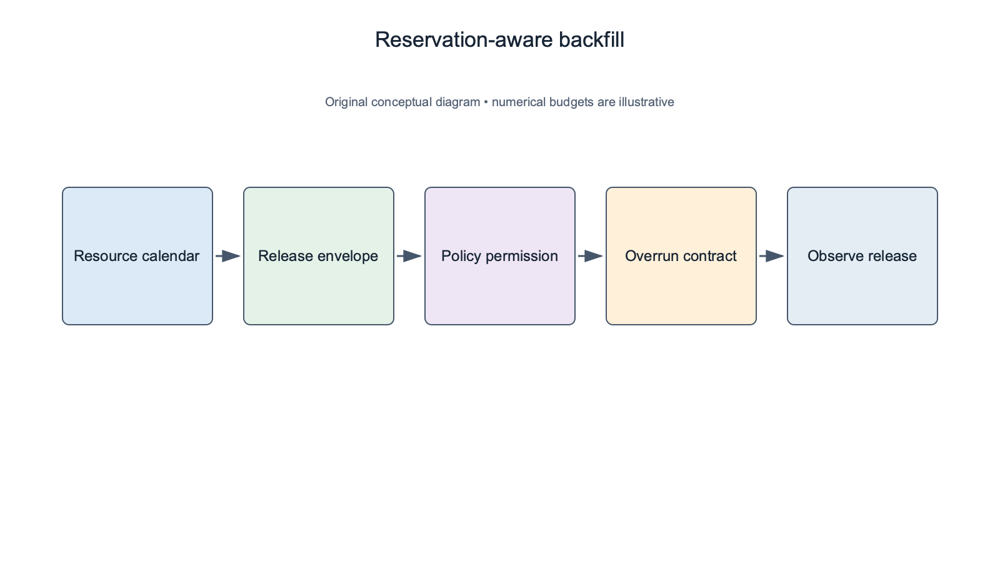
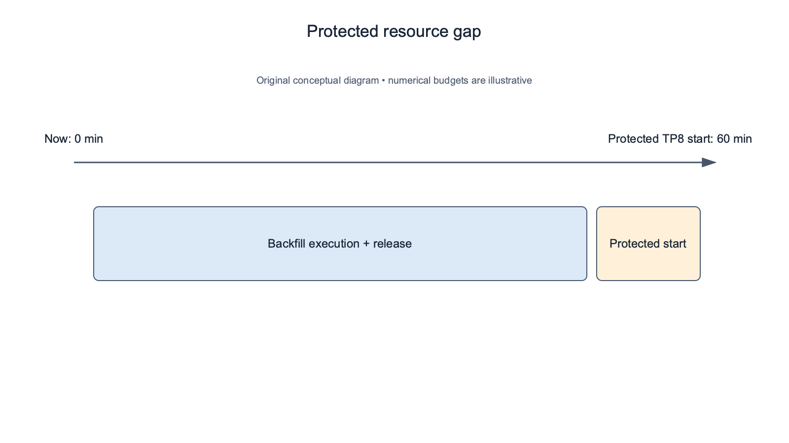
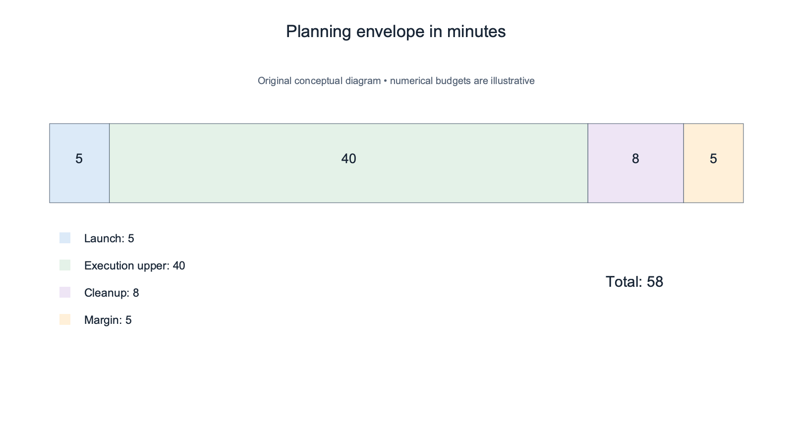
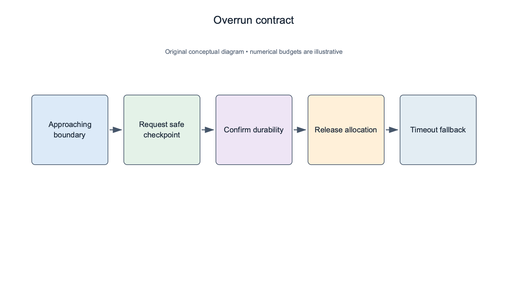

## Overview

Backfilling starts a lower-priority job in an idle resource gap without delaying protected higher-priority work; the opportunity is temporal: devices can be idle now while reserved for a larger job later; a scheduler needs both a legal placement and a defensible release-time bound before it uses that gap.

[Slurm’s scheduling documentation](https://slurm.schedmd.com/sched_config.html) describes backfill in these terms and notes its dependence on job time limits and expected completion. AI jobs add topology, checkpoint, and runtime uncertainty. A short job that overruns can consume the exact domain a reserved distributed job needs.

This article builds on queue replay in `sched-5` and calibrated estimates in `sched-6`. It separates prediction from the policy that handles overruns. The timeline examples are illustrative; they do not claim a measured utilization gain or a universal reservation-safety probability.

## Deep dive

### Construct a reservation-aware resource calendar

A backfill calendar records when resources become available and when protected work expects them; it must preserve physical shape as well as count; a reservation for one 8-GPU domain cannot be satisfied by 8 unrelated devices released across several nodes.

For an illustrative cluster, Domain A has 8 devices and a protected TP8 start at minute 60. Four devices are idle now; the other 4 release at minute 50. A 4-GPU backfill job can use the idle subset only if its placement, execution, and cleanup finish before the reservation needs the full domain.

The calendar should include running-job remainder, cleanup, admitted-but-not-running work, and maintenance exclusions. Application completion and allocation release can be different events. If a worker ends at minute 55 but its reservation clears at minute 63, a calendar based on logs alone can approve a backfill that blocks the protected start.

Policy defines what is protected; a conservative backfill policy can reserve starts for several queued jobs, while another policy may protect only selected jobs or horizons; state the scope rather than calling every idle-gap admission “safe.” The replay estimator must use the same reservation rules as the live allocator. Calendar updates need a snapshot version. New admissions and changed completion estimates can invalidate an earlier gap. Revalidate the reservation and device state at commitment; a valid fit computed before another job extends its allocation is no longer sufficient evidence.

### Compare a release envelope with the gap

A backfill test should use release time, including launch and cleanup. The mean runtime alone cannot protect a reservation. A calibrated upper bound can supply evidence, while the operator decides how much risk and margin the policy permits.

Consider an illustrative gap of 60 minutes. A job has a supported execution interval of 25–40 minutes, needs 5 minutes to launch, and reserves 8 minutes for cleanup. Its planning envelope is 53 minutes. With a declared 5-minute additional margin, it requires 58 minutes and fits the gap under those assumptions.

If the same job starts 10 minutes later, only 50 minutes remain; the earlier approval should not persist automatically; Recompute the envelope against the current boundary, because the launch delay consumed slack even though the workload and its estimated execution interval stayed unchanged.

A 90% interval is not a hard maximum. If the policy requires a strict bound, it needs an enforceable time limit, a supported checkpoint-and-stop path, or a different admission rule. `sched-6` explains why marginal statistical coverage does not become a per-reservation guarantee by changing the label on the upper endpoint. The scheduler should retain the chosen bound and margin separately. A model revision can change the estimate; an operator revision can change the risk policy. Combining them into one unexplained “safe runtime” makes it difficult to identify which assumption caused an overrun.

### Specify overrun behavior before admission

Backfill admission should include an overrun contract. The job and scheduler must agree on what happens when the protected boundary approaches. Possible actions include a denied extension, a supported checkpoint-and-stop, or termination under an explicit time limit. An estimate alone does not provide this behavior.

Checkpoint latency belongs in the stop budget; if an illustrative checkpoint takes 7 minutes and release takes 3, a job must begin stopping at least 10 minutes before the protected boundary, plus any declared uncertainty margin; waiting until the boundary to request a checkpoint cannot protect the reservation. An extension request should be evaluated against the current calendar. A gap may have grown because the protected job’s prerequisite is delayed, or it may have shrunk because another reservation became active. The extension decision should retain the new snapshot and policy result rather than rely on the original admission certificate. A checkpoint-and-stop capability must be tested for the workload and runtime. Some jobs can checkpoint only at specific boundaries, and a partially completed checkpoint may not be durable. The allocator should use the latest safe stop condition from the runtime rather than assume that any running process can pause immediately.

Enforced termination has a recovery cost. Count lost work, checkpoint age, reload, and occupied cleanup resources. A utilization gain that repeatedly discards useful training can reduce goodput. `sched-11` provides the interruption accounting that should appear in backfill evaluation.

### Rank backfill candidates by useful work and shape

Several jobs may fit one gap. The scheduler should apply the documented queue policy and compare the consequences of each legal candidate. A short duration is useful, but it does not establish value if launch dominates the gap or the job is likely to be interrupted before durable progress.

For an illustrative 45-minute gap, Job A needs 5 minutes to launch and 30 to execute, while Job B needs 20 to launch and 20 to execute; both can fit before cleanup under some margins; Job A makes 30 minutes of execution progress; B makes 20. The operator’s objective may favor A, subject to priority, ownership, and the value assigned to the work.

Topology consumption matters even inside a gap. A 4-GPU job split across 2 domains can prevent another legal backfill from using an intact group. Prefer a compact allocation when that preserves useful shapes under the chosen policy, and record when a faster path justifies the fragmentation cost. Fairness constraints remain active. Backfill should not become an undocumented bypass around tenant entitlement or starvation protection. A tenant with many short jobs can consume every gap while a larger class waits. Evaluate class-level wait and useful allocation, not only aggregate busy time. Search cost should be bounded. Scanning thousands of candidates can delay admissions and consume the gap being optimized. Cache supported profiles, prune obvious non-fits, and report the decision limit. The best candidate found under a bounded scan is different from a proven optimum over every queued layout.

### Evaluate reservation protection and waste

Backfill evaluation needs both benefits and violations. Report useful completed work in gaps, idle time avoided, protected starts delayed, lost work from interruption, and launch or cleanup overhead. A single utilization curve cannot distinguish productive gap use from repeated restart cycles.

For an illustrative trial with 100 protected reservations, 3 delayed starts is a 3% observed violation rate; the count needs its definition: delay caused by backfill, delay from unrelated infrastructure, or any start after the planned boundary; Attribution should preserve the event trace rather than infer cause from the final timestamp alone. Compare policies on the same workload scenarios. Replay the incumbent and proposed backfill rule with identical arrivals and sampled durations. This controls sampling noise and isolates policy effects. The result remains a simulation until an online trial confirms the operational assumptions.

Time-limit estimates should be audited by class. Short evaluations, checkpoint-heavy training, and opaque user jobs can have different overrun behavior. A margin calibrated on one class may waste capacity or underprotect another. Use the supported profiles and fallback rules from `sched-6`. The final admission record should identify the protected boundary, candidate release envelope, chosen margin, stop capability, extension policy, and fallback. After execution, append actual launch, progress, checkpoint, stop, and release events. That record makes an overrun review concrete rather than leaving “prediction error” as the explanation for every delayed reservation.

### Review an overrun without changing the original forecast

For the illustrative 60-minute gap, the admitted envelope was 58 minutes including launch, execution, cleanup, and margin. Suppose actual execution reaches 44 rather than the predicted upper 40. With 5 minutes of launch and 8 of cleanup, release occurs at 57 minutes and the protected start still survives. The interval missed, but the reservation did not fail.

Now suppose cleanup takes 14 minutes; Release occurs at 63, producing a 3-minute reservation delay; the review should retain both errors: execution exceeded its supported upper estimate by 4 minutes, and cleanup exceeded its reserved budget by 6. Calling the whole outcome a runtime-predictor failure would hide the release-path defect. The original forecast stays immutable. Append the actual events and the policy outcome rather than widening the stored bound after completion. Calibration needs the forecast that authorized admission, while operational review needs the complete sequence that determined release.

A stop-capable workload can produce another path. If policy begins checkpoint-and-stop at minute 45 with a supported 7-minute checkpoint and 3-minute release, the expected release is 55 before additional margin. If checkpoint durability is not confirmed by the timeout, the recorded fallback decides whether to abort, terminate under the contract, or defer protected work. This trace shows why overrun policy belongs in admission. The allocator cannot invent a safe stop path after a long-running job has already consumed the gap. Runtime capability, notice, and ownership permissions must exist before the favorable estimate becomes an action. Compare the policy's useful retained work with its protected-start outcomes. A very conservative margin can eliminate violations while rejecting nearly every gap; a permissive margin can improve occupancy while causing repeated recovery. The operator should see both curves by workload class and topology rather than receive one aggregate backfill success rate.

The release boundary should be tested under a delayed stop acknowledgment. In the illustrative reservation at minute 60, policy cannot count a checkpoint request at minute 45 as a completed checkpoint. It waits for durable-state confirmation and the subsequent release event. If acknowledgment arrives late, the timeout path uses the declared contract rather than assuming the remaining cleanup margin is still intact. This test should include the incoming reserved job's own readiness. A delayed checkpoint load can postpone its launch even when backfill releases on time. Preserve the backfill release and incoming launch prerequisites as separate events, because a final late-start timestamp alone cannot identify which side caused the delay. The distinction improves both calibration and policy review.

The backfill certificate should also retain the reservation owner and the exact resource shape protected. In the illustrative TP8 case, releasing 4 devices on each of 2 unrelated domains does not satisfy the promised island. The audit therefore checks both release time and physical feasibility at the boundary. A timely release with the wrong shape is a different failure from an overrun, and the policy should count it separately when evaluating protected starts.

## Conclusion

Backfill is a reservation-aware commitment on a resource calendar; Legal placement, supported release estimates, explicit margins, and enforceable overrun behavior must work together; a job that fits only in expectation can still block the topology promised to higher-priority work.

The next article examines preemption directly. It selects victim sets whose released resources form a usable allocation and prices the rollback and recovery that a simple count of freed GPUs leaves out.

### Sources

- [Slurm scheduling configuration: backfill and time limits](https://slurm.schedmd.com/sched_config.html)
- [Predicting batch queue job wait times for informed scheduling of urgent HPC workloads (2022)](https://arxiv.org/abs/2204.13543)
