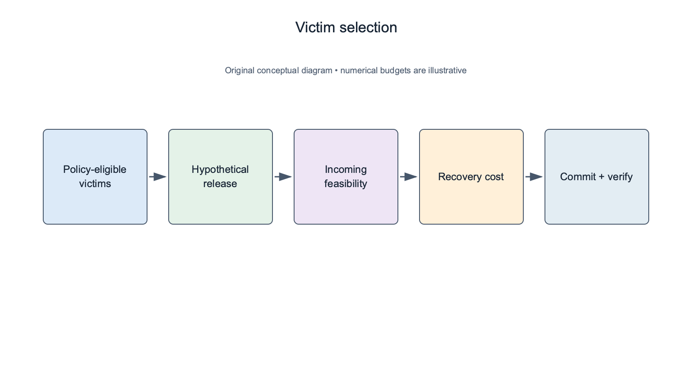
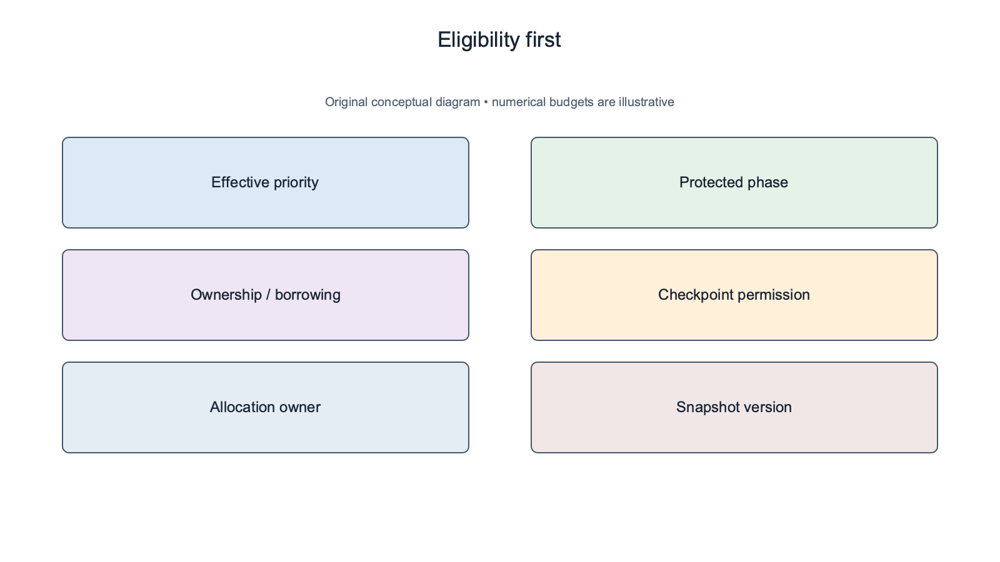
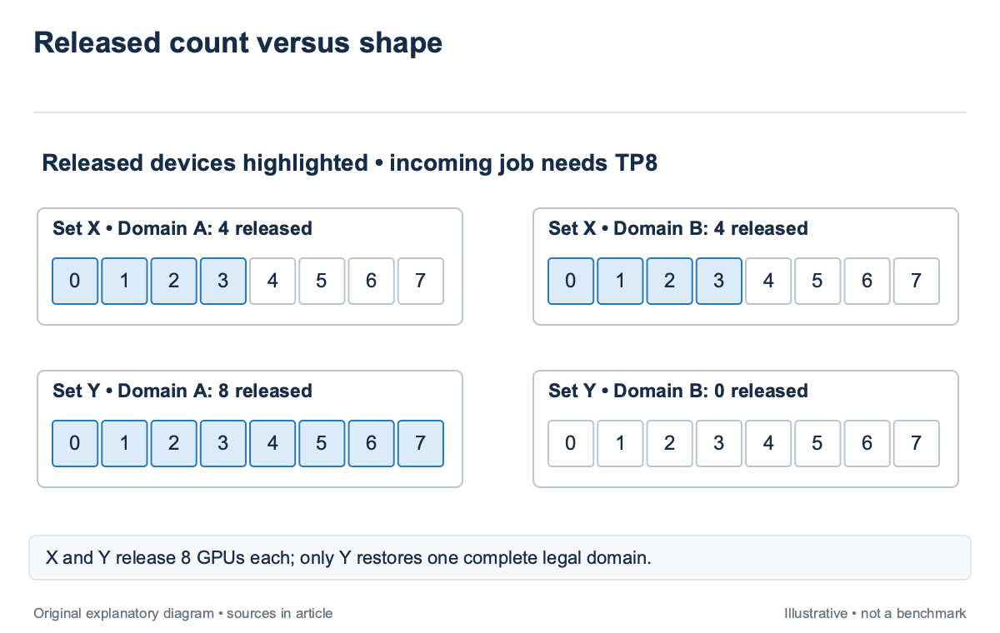
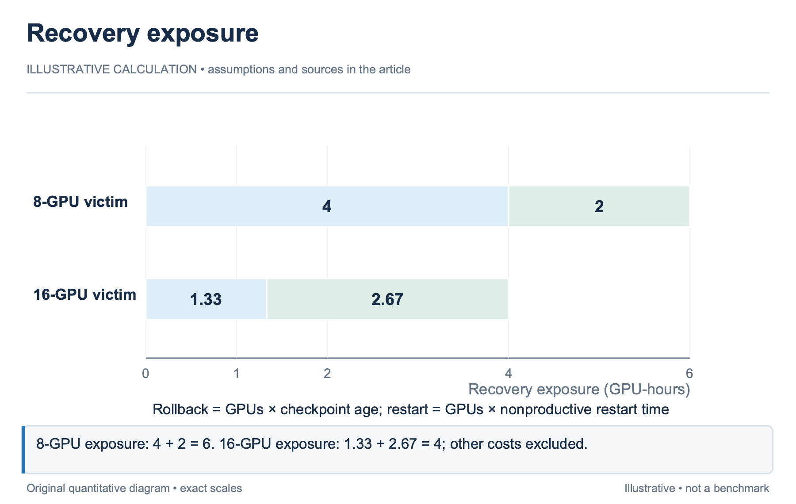
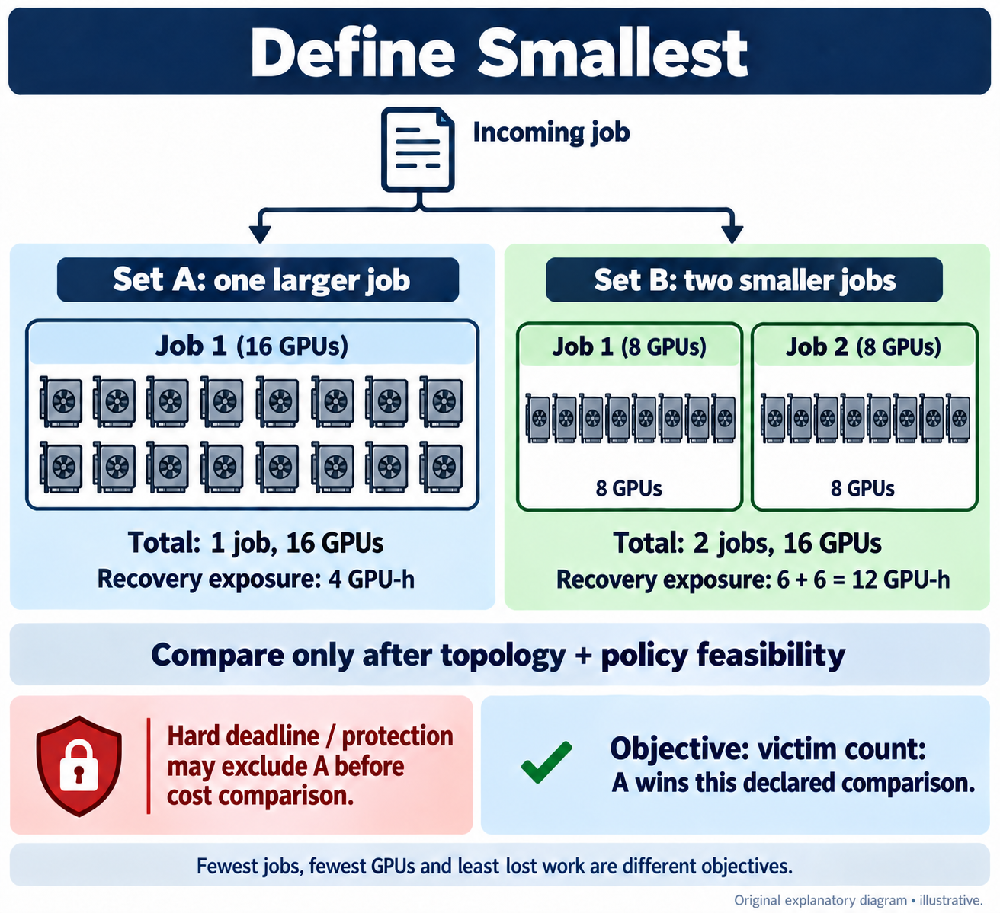
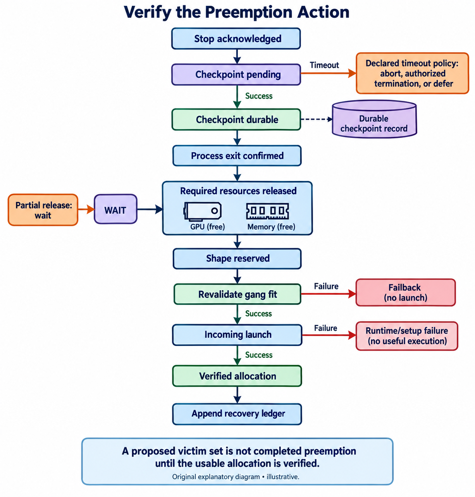

## Overview

Preemption should free a usable allocation, not merely enough devices; an incoming distributed job can require a particular topology, memory envelope, and coordinated launch; a victim set that releases 8 scattered GPUs may still leave it unschedulable while damaging several running jobs. Priority determines which work may displace other work. Victim selection determines how that displacement happens. Keep the policy permission separate from the cost model: a cheap interruption is irrelevant when the victim is protected, and a legal interruption can still be a poor choice when rollback and restart consume more useful work than the incoming job gains.

Topology-aware Preemptive Scheduling for Co-located LLM Workloads [\[1\]](https://arxiv.org/abs/2411.11560), published in 2024, studies topology-aware victim selection in simulation. This article uses its mechanism boundary without generalizing its reported improvement to arbitrary clusters. The examples are illustrative GPU-hour accounting, building on feasibility and layout in `sched-3` and `sched-9`.

## Deep dive

### Apply priority and protection before cost search

The scheduler first identifies allocations that policy permits it to interrupt. Effective priority, tenant entitlement, reservations, non-preemptible phases, and minimum run intervals can all affect eligibility. A victim list should retain the reason each allocation is eligible or protected.

Priority is not a complete fairness policy; a tenant with high-priority short jobs can repeatedly interrupt another tenant’s long training; the quota and borrowing rules in `sched-12` should define whether that displacement is permitted and how its cost is attributed. The victim selector should not invent those permissions from a runtime estimate.

For an illustrative queue, Job H has higher priority than Jobs A and B. A is inside a protected checkpoint phase, while B is preemptible. The search can consider B now and A only after the protected phase ends, if the policy allows it. Assigning A a low cost does not make it an eligible victim. Preemption scope should identify the distributed allocation owner. Interrupting one worker of a coordinated training job can force the entire job to recover. The cost model should use the affected allocation, not the pod count selected for deletion. A per-worker action can have cluster-wide consequences. Eligibility should be revalidated at commitment. A checkpoint phase or reservation can change while the selector searches. Record the snapshot and policy revision, then check the selected set again before issuing actions. A legal victim at search time may become protected before the stop request arrives.

### Dry-run the incoming job on each released shape

A candidate victim set defines a hypothetical cluster state after release. Run the incoming job’s complete feasibility checks on that state. This dry run should include memory, capabilities, communication groups, reservations, and coordinated launch conditions. Stop the search from rewarding a set that cannot admit the incoming job.

Consider an illustrative cluster with 2 8-device domains; Victim Set X frees 4 GPUs in each domain; Set Y frees all 8 in one domain; an incoming TP8 job requiring one intact domain can use Y but not X. Both sets free 8 devices, yet only one satisfies the topology requirement.

The 2024 topology-aware preemption paper addresses this distinction through topology-affinity-aware victim selection. Its evaluation is simulated, including a specific cluster and workload setup. The transferable claim is that victim topology can determine admission success; the paper’s measured hit-rate change remains tied to its evaluated baseline and scenarios. A dry run should also include release latency. Devices are not available when the stop request is sent. Checkpointing, process exit, cleanup, and reservation clearing can delay the incoming allocation. A predicted admission time should use those release events, not assume instantaneous resource recovery. Retain infeasibility reasons for rejected sets. If X fails because no intact domain exists, adding another scattered victim may still not help. A structured reason can guide the next search branch and explain why the selector interrupted a larger allocation instead of several apparently cheaper small jobs.

### Price rollback, restart, and stranded resources

Interruption cost includes work lost since the durable checkpoint and the resources consumed to stop and resume. Use GPU-hours when comparing allocations of different sizes, while retaining elapsed delay for deadline and queue objectives. These units answer different questions and should not be blended without declared weights.

For an illustrative 8-GPU victim with a checkpoint 30 minutes old, rollback exposure is 8×0.5=4 GPU-hours; if restart occupies those 8 devices for 15 minutes without useful progress, add 2 GPU-hours; the simplified exposure is 6 GPU-hours before any stop checkpoint, storage interference, or queue delay.

A 16-GPU victim with a checkpoint 5 minutes old loses 16×5/60≈1.33 GPU-hours. If its restart takes 10 minutes, add about 2.67, totaling 4. The larger job can have lower immediate recovery exposure. Device count alone is therefore an unreliable proxy for interruption damage. These calculations assume the entire allocation stops and that useful progress is absent during restart. A runtime with partial recovery or overlapping migration needs a different model. Record the supported recovery mechanism rather than assigning one constant restart cost to every distributed job.

Stranded resources also matter. If only part of a victim allocation is reusable by the incoming job, remaining devices can sit idle or fragment the queue. The cost model should include the new physical shape and its effect on other work. `sched-7` provides the queue-aware fragmentation boundary.

### Search for the smallest safe set under a defined objective

“Smallest” needs a definition; it can mean fewest jobs, fewest GPUs, least lost useful work, or lowest weighted recovery cost; these objectives can disagree. State the operator’s ordering before presenting a victim set as minimal.

For an illustrative incoming job, Set A interrupts one 16-GPU allocation with 4 GPU-hours of recovery exposure. Set B interrupts 2 8-GPU allocations with 6 GPU-hours each. A affects fewer jobs and has lower modeled exposure, provided both sets satisfy topology and policy. A different ownership or deadline rule can still prohibit A. A search can enumerate eligible sets, prune sets that cannot release the required shape, and score the feasible survivors. Larger clusters may need heuristics or a solver time budget. Report whether the result is a proven optimum in the formulation or the best legal candidate found before the deadline. Use a baseline fallback when estimates are unsupported. A documented rule might select the first legal compact victim set within a bounded priority class, or decline preemption until a checkpoint boundary. The fallback should retain the reason the model abstained. Missing cost data must not appear as zero exposure.

A dry-run result is a certificate for a snapshot, not a promise about future infrastructure. Reserve the selected released shape for the incoming job under the commitment protocol so another admission does not consume it between victim stop and launch. Otherwise successful victim selection can still lead to a failed admission race.

### Execute and verify the transition

The action sequence should retain stop acknowledgments, checkpoint durability, process exit, resource release, incoming reservation, and launch outcome; a preemption command is not completion; the allocator should advance only when the required state transition is confirmed or its timeout fallback applies.

For an illustrative timeout, suppose a victim fails to checkpoint within the allowed interval. Policy should specify whether to abort preemption, terminate under an authorized limit, or defer the incoming job. The selector’s favorable cost cannot decide this implicitly after the action has begun.

After launch, check that the incoming job obtained the predicted topology and passed runtime validation. A hit-rate metric should define what counts as a successful topology match and distinguish it from successful useful execution. A legal shape can still fail loading or communicator setup for reasons outside victim selection.

Evaluate preemption on useful work, incoming delay, victim recovery time, repeat interruptions, and fairness; a policy can improve urgent-job latency while increasing total lost training; the report should expose that tradeoff rather than claim success from the number of GPUs freed.

The decision certificate should retain eligible victims, protected exclusions, hypothetical placement results, cost terms, units, chosen set, and fallback. Observed rollback and restart then test the model. This closes the loop between priority policy, physical admission, and the actual cost imposed on displaced work.

### Compare victim count with retained-work loss

Return to the illustrative 16-GPU victim whose immediate recovery exposure totals 4 GPU-hours. Suppose its restart also delays a scheduled evaluation by 20 minutes, while a different feasible victim set costs 5 GPU-hours but leaves that evaluation untouched. A policy that minimizes only rollback chooses the first; a policy protecting the evaluation deadline may choose the second.

The selector should state that ordering; a weighted cost can compare recovery exposure and deadline delay in a declared decision scale, while a hard deadline constraint can exclude the first set; the 2 formulations are not interchangeable, and a favorable scalar cannot compensate for a hard protected condition.

The physical dry run should remain attached to both alternatives. If one set frees 8 scattered devices and the incoming TP8 job needs a full domain, that set is rejected before the cost comparison. It should not appear as a cheap runner-up whose only problem was a slightly worse score.

Checkpoint evidence also needs freshness. An illustrative checkpoint timestamp 5 minutes old is useful only if the checkpoint is durable and readable through the supported recovery path. A recent log message announcing checkpoint start does not establish that state. Use the runtime's completion acknowledgment and retain the checkpoint identity. Repeated interruption changes the horizon. A victim that is cheap once can make little retained progress if selected repeatedly before its next checkpoint. Track victim history and policy protections, then evaluate lost work over the trace. Per-decision cost alone can understate systematic damage to one class or tenant. The after-action audit should compare predicted and observed rollback, stop latency, release, incoming launch, and victim recovery. These events test different parts of the model. A topology-affinity hit can coexist with a failed checkpoint load, so admission success and useful execution should remain separate outcomes.

Partial resource release should be represented explicitly; In the illustrative TP8 admission, 7 released devices do not satisfy the eight-rank requirement; the scheduler should retain the incoming reservation while applying the declared timeout or abort path, and it should account for the idle released devices during that interval. Treating partial release as successful preemption overstates admission and understates stranded resource cost. The victim's recovery state also remains part of the ledger. If the incoming launch fails, policy may restore the victim or choose another fallback, but the original rollback has already happened. Record that loss even when the eventual allocation returns to its starting shape. A reversible resource assignment does not imply reversible useful work.

A victim-cost estimate should identify its observation window. In the illustrative recovery comparison, checkpoint age can change while the selector searches, and a completed checkpoint can reduce rollback exposure before commitment. Recompute the selected cost from the confirmed durable state while preserving the original search record. This update improves the action evidence without retroactively changing what earlier candidates were predicted to cost or hiding a stale snapshot.

## Conclusion

Safe victim selection begins with policy permission, dry-runs the incoming workload on the released physical shape, and prices the complete recovery path. Minimal device count is only one possible objective and can conflict with least useful-work loss.

The next article defines entitlement, borrowing, and fair share. Those rules determine which allocations are eligible to displace others; a technically feasible and inexpensive preemption remains invalid when it violates the cluster’s ownership contract.

### Sources

- [\[1\]](https://arxiv.org/abs/2411.11560) Topology-aware Preemptive Scheduling for Co-located LLM Workloads (2024)
- [\[2\]](https://arxiv.org/abs/2403.07648) Characterization of Large Language Model Development in the Datacenter (2024)
