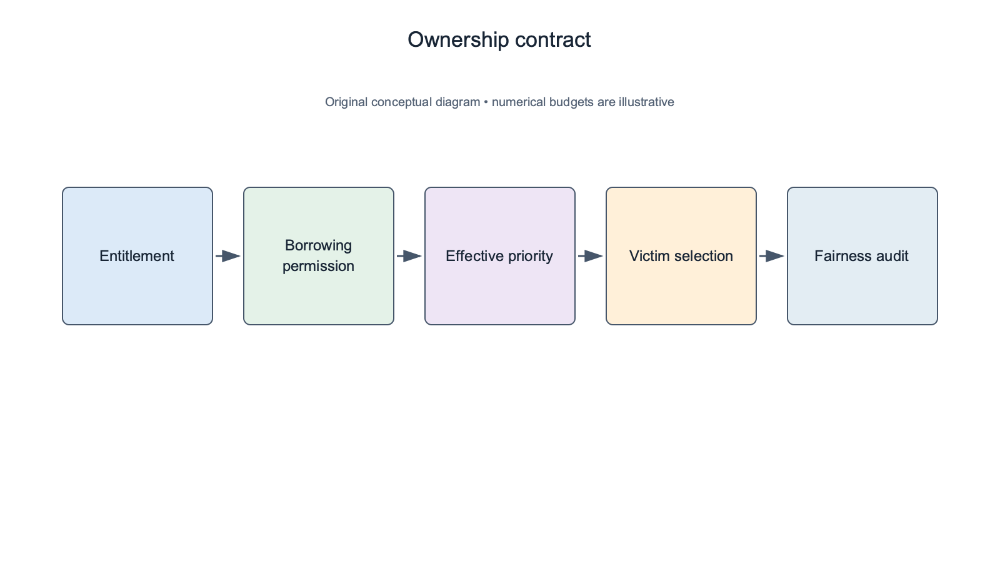
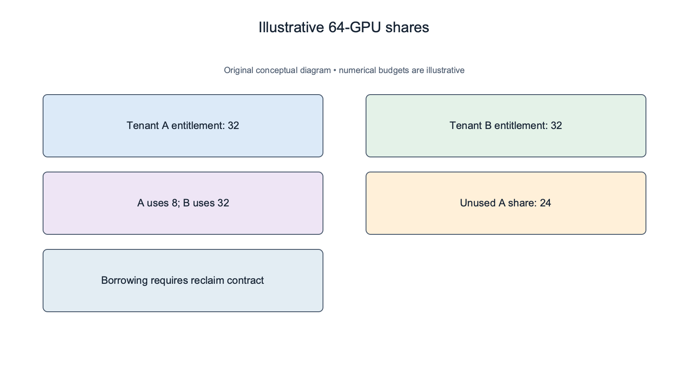
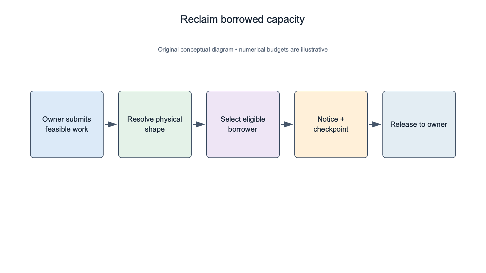
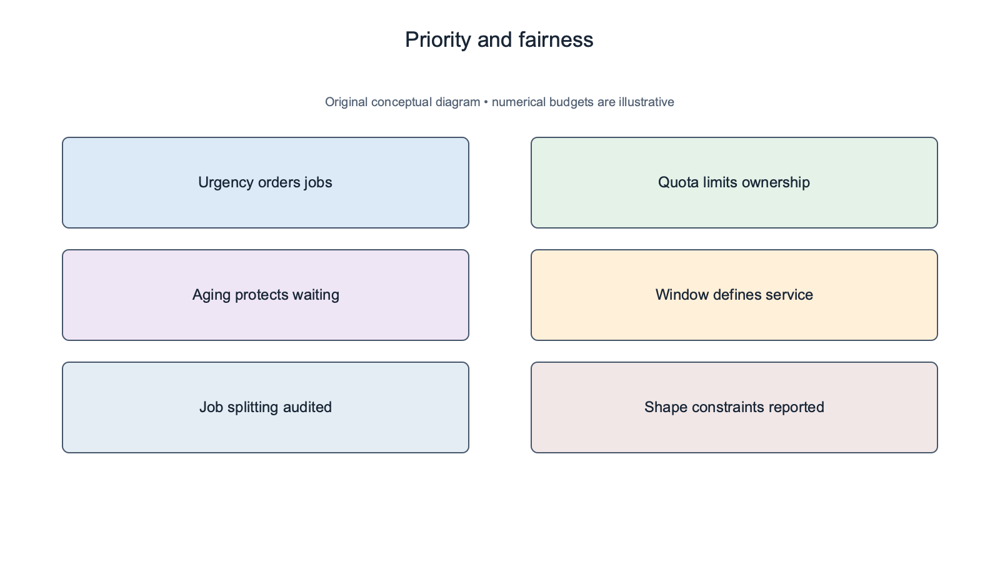
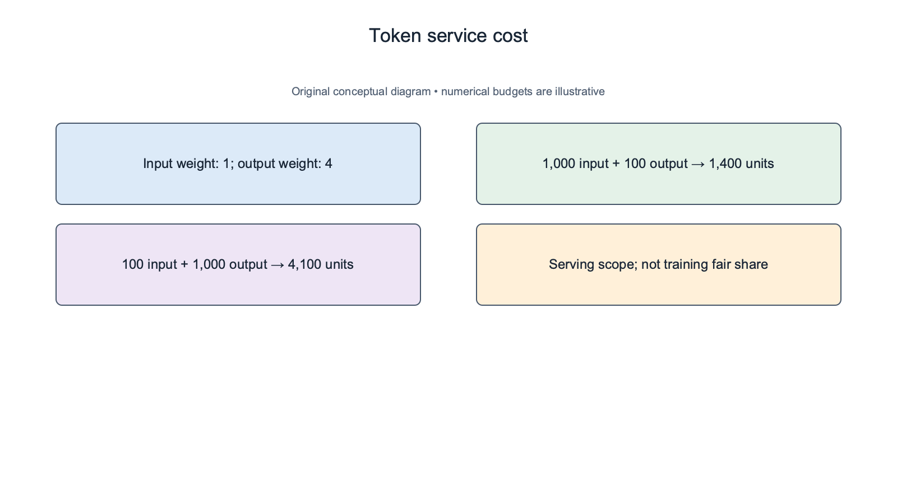

## Overview

A shared cluster needs an ownership contract as well as a placement algorithm; Quota states what a tenant may claim, borrowing states how idle entitlement can be used, priority orders eligible work, and fairness measures how service is distributed over time; these concepts interact, but none is a substitute for the others.

Training and serving also need different service measures. GPU-hours describe allocated resources; completed training progress describes useful work; token-denominated serving cost describes request processing. A token-fair serving policy does not automatically solve training fair share.

[Fairness in Serving Large Language Models](https://arxiv.org/abs/2401.00588), first posted in December 2023 and revised in 2024, introduces Virtual Token Counter for request-level serving fairness. This article preserves that scope and develops an illustrative cluster entitlement model around the queue and preemption mechanisms in `sched-10` and `sched-11`. The policy examples are declared operator rules rather than claims that the supplied papers establish one universal fair-share design.

## Deep dive

### Define entitlement independently of physical use

Entitlement is a policy claim on resources; it can be expressed as a guaranteed quantity, a weighted share, or another documented contract; physical allocation is what the tenant currently holds. The 2 differ when a tenant is idle, resources are under maintenance, or the available topology cannot satisfy a queued request.

For an illustrative 64-GPU cluster, Tenant A has an entitlement of 32 devices and Tenant B 32. If A uses 8 and B uses 32, there are 24 physically idle devices inside A’s unused share. A borrowing policy may allow B to use them, but ownership remains relevant when A submits new work.

Resource shape should be included when guarantees depend on topology or capability. A claim on 8 generic devices may not guarantee one intact 8-device domain. If the operator promises a particular shape, the allocator must preserve or recover it. Otherwise the quota report should distinguish quantity entitlement from topology availability. Quota accounting should identify the allocation unit and phase. Admitted jobs loading checkpoints can occupy entitlement before useful execution begins. Counting only running application time can permit over-admission during launch. The ownership record should follow the resource reservation that the scheduler actually commits. An entitlement policy also needs a time interpretation. A strict simultaneous cap differs from a long-run weighted share. The latter can permit temporary imbalance while compensating later. State the window, decay, or debt rule so the operator can reproduce why a tenant’s queued job received a particular effective priority.

### Make borrowing and reclamation explicit

Borrowing uses capacity that another tenant is not currently claiming; it improves utilization only when the reclaim contract is clear; record whether borrowed work is preemptible, how much notice it receives, which checkpoints it must support, and how ownership returns to the entitled tenant.

In the illustrative 64-GPU example, B can borrow 24 devices while A is idle. If A later requests 16 additional devices within its entitlement, the scheduler may reclaim 16 borrowed devices from B. Victim selection must still form a usable physical allocation and price rollback; the ownership permission does not remove the topology checks in `sched-11`. Reclamation should not imply instantaneous release. A notice interval, checkpoint boundary, and cleanup budget determine when A can actually launch. If the quota contract promises immediate availability, the operator needs enforceable limits or reserved headroom. Statistical runtime estimates alone cannot provide that promise.

A borrowing limit can reduce recovery exposure. For an illustrative policy, B may borrow at most 16 devices in one preemptible allocation rather than 24 spread across several long runs. This restriction sacrifices some idle capacity to simplify reclamation. Its value should be evaluated against useful work and entitlement wait rather than described as inherently fair.

Borrowing debt and interruption cost can be reported separately; Resource debt records how much entitlement a tenant consumed beyond its share; recovery exposure records useful work lost when that capacity is reclaimed; Mixing the 2 can hide the fact that one borrowing policy is inexpensive in resource accounting and costly in restart behavior.

### Keep priority from silently replacing fairness

Priority determines ordering among policy-eligible jobs. It can incorporate urgency, reservations, or fair-share state, but the meaning of each component should remain visible. A high-priority label should not become an undocumented exemption from quota or a license to repeatedly interrupt another tenant.

For an illustrative queue, A has a large low-priority training job and B submits a stream of urgent evaluations. A strict priority rule can keep B’s waits short while A rarely obtains an intact domain. If the operator wants starvation protection, it needs an aging, reservation, or minimum-service rule in addition to the priority labels.

Fairness requires a service measure and comparison window; a resource-share metric can count GPU-hours allocated relative to entitlement; a useful-work metric can count validated progress, but heterogeneous jobs make comparison harder. The operator should not claim that equal device-hours imply equal task value or equal completion delay.

Job splitting can manipulate naive measures. A tenant with one 16-GPU job and another with 16 single-GPU jobs should not receive different entitlement merely because the second has more queue entries, unless that is an intentional policy. Account at the tenant or declared ownership level before using per-job ordering. Topology can produce unavoidable short-term imbalance. A large job may wait for a whole domain while small jobs use fragments. Report that shape constraint alongside fairness outcomes. The scheduler can preserve a reservation for the larger job, but the policy should state how much small-job delay it accepts to do so.

### Preserve the scope of token fairness

Virtual Token Counter, or VTC, addresses request-level fairness in LLM serving. It uses a service-cost accounting model tied to input and output tokens and schedules clients according to virtual service state. This concerns the inference engine’s distribution of request processing, not tenant GPU entitlement for finite training jobs.

Token counts require weights when input and output processing have different costs; for an illustrative service model, charge 1 unit per input token and 4 per output token; a request with 1,000 input and 100 output tokens costs 1,400 units; a request with 100 input and 1,000 output costs 4,100. Equal request count would not equal service cost under this declared model. The weights are a model assumption, not a universal hardware fact. The serving runtime and workload determine whether they approximate processing cost adequately. Preserve the paper’s conditions when discussing its fairness result, and validate any local cost model before using it to compare clients. A cluster scheduler can use serving fairness as a constraint on a capacity profile. For example, the profiled service capacity may assume a particular client mix and VTC policy. The allocator then assigns resources to meet that profile. It should not retell engine-internal ordering as the cluster’s training fair-share mechanism.

Training fairness remains a separate design problem in the supplied research map. GPU-hours, slowdown relative to an isolated baseline, completion delay, and useful progress offer different perspectives. A series article should expose these alternatives and their limitations rather than fill the gap with token counters that measure a different form of service.

### Evaluate ownership outcomes and policy gaming

A quota evaluation should report allocation relative to entitlement, time spent borrowing, reclaim delay, and denied or delayed claims. These outcomes should be stratified by tenant and workload shape. Aggregate utilization can rise while one tenant’s guaranteed work waits longer.

For an illustrative 24-hour window, a 16-GPU entitlement corresponds to 384 GPU-hours of potential allocation; if a tenant receives 300 GPU-hours, the fraction is about 78.1%; this does not by itself prove under-service: the tenant may have been idle or unable to supply a feasible job. Report offered demand and feasible queued demand alongside allocation. Audit repeated preemption. A tenant can receive its nominal share while losing disproportionate useful work to interruption. Count rollback GPU-hours, restart time, and repeat victims. The borrowing policy should be evaluated with the recovery model rather than treating reclaimed devices as costless. Test adversarial submission patterns in replay. Job splitting, exaggerated time limits, priority inflation, and synchronized bursts can affect a naive policy. These tests are illustrative robustness scenarios unless they are observed in the production trace. Keep the distinction between measured behavior and stress testing explicit.

The decision record should expose entitlement state, borrowed quantity, reclaim permission, effective priority components, and the selected placement. An operator can then explain why physically idle devices were denied or why a borrowed allocation was interrupted. Transparent accounting is part of the policy’s operational value, even when the final fairness objective remains a choice.

### Explain a reclaim decision at tenant level

In the illustrative 64-GPU cluster, A has 32 devices of entitlement and currently uses 8. B uses its own 32 and borrows 16, leaving 8 idle. When A submits a feasible 16-GPU job, the allocator can combine 8 idle devices with 8 reclaimed borrowed devices only if the resulting topology satisfies the job. If those devices do not form a supported shape, the scheduler may need a different victim set or a reservation while another allocation releases. The entitlement permits the claim but does not change the physical graph. The report should show quantity available, shape unavailable, and expected reclaim path rather than imply that A was denied because its quota was exhausted.

A reclaim notice should identify B's borrowed allocation and recovery contract; if B requires 10 minutes to checkpoint and release, A's launch cannot be promised immediately under that path; the operator must either accept the notice interval, reserve headroom, or use another enforceable policy. The scheduler should not hide this time behind a quota counter that updates before resources actually release.

Tenant-level accounting prevents job splitting from changing entitlement. Whether B borrowed through one 16-GPU job or 16 single-GPU jobs, the borrowed quantity remains 16 under this declared policy. Victim cost and topology can differ, so allocation-unit details still matter after ownership is resolved. The fairness review should then examine offered feasible demand, allocation, reclaim wait, and lost useful work for both tenants over the selected window. A gets its entitled capacity eventually, while B may lose progress. Report those outcomes separately so a nominally correct ownership transfer does not conceal disproportionate interruption cost.

Fair-share reports should distinguish idle entitlement from unmet feasible demand. In the illustrative 24-hour window, a tenant receiving 300 of 384 possible GPU-hours may have submitted only 300 GPU-hours of legal work. The same allocation fraction can therefore describe full service or substantial under-service, depending on offered demand. Retain time spent with a feasible queued claim alongside the entitlement denominator. Topology-restricted demand should also be visible. A tenant can wait for an 8-device domain while smaller fragments remain idle or serve borrowers. The operator may choose to preserve the domain, reclaim another shape, or accept waiting under its contract. Report the chosen rule and its delay rather than reducing the outcome to a quota percentage.

## Conclusion

Quota, borrowing, priority, and fairness should be defined as separate policy layers with explicit units and time windows. Borrowed capacity needs a reclaim contract, and reclamation still requires topology-aware victim selection and recovery accounting.

Serving token fairness supplies a useful request-level mechanism within its scope; Training fair share requires a separate ownership and useful-work argument; the next article examines elastic use of spare capacity, where resize and harvesting decisions must honor the same entitlement and reclaim rules.

### Sources

- [Fairness in Serving Large Language Models (2023 preprint; revised 2024)](https://arxiv.org/abs/2401.00588)
- [Slurm scheduling configuration](https://slurm.schedmd.com/sched_config.html)
