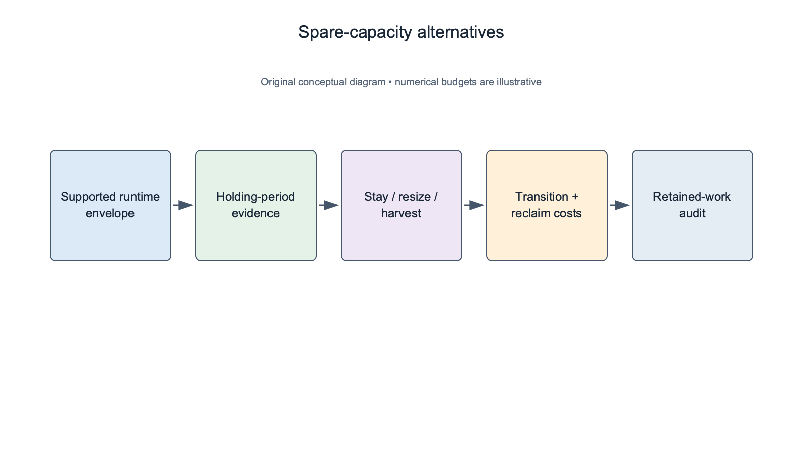
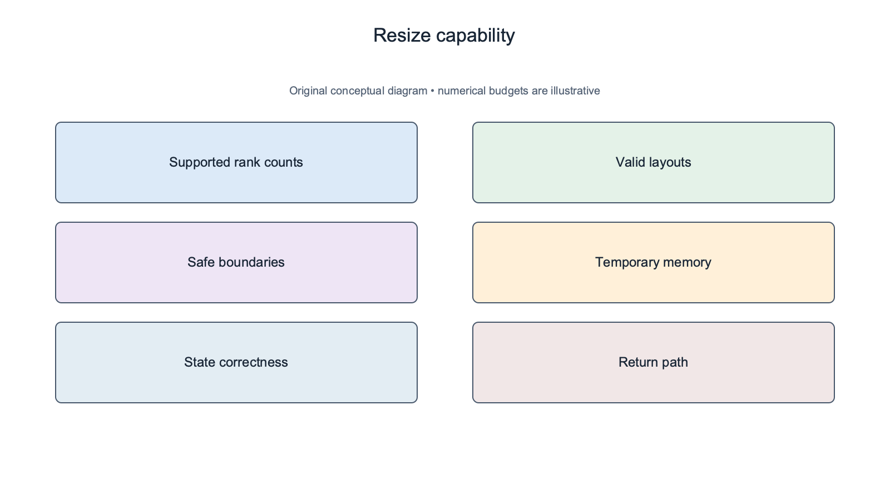
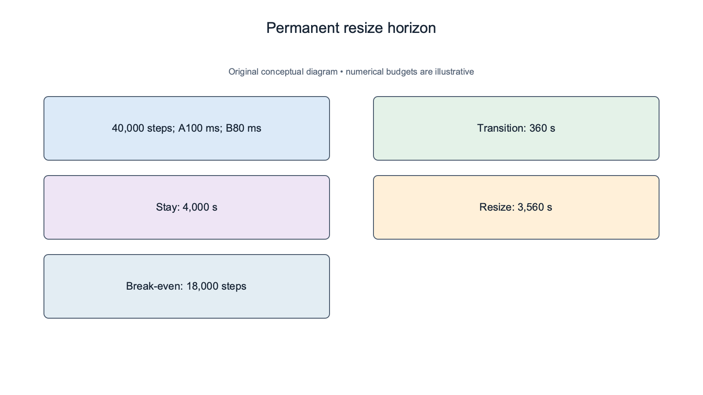
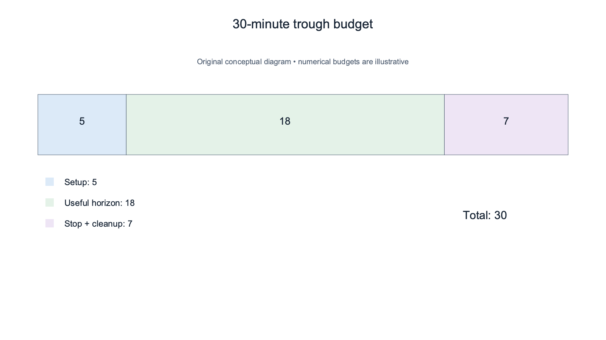
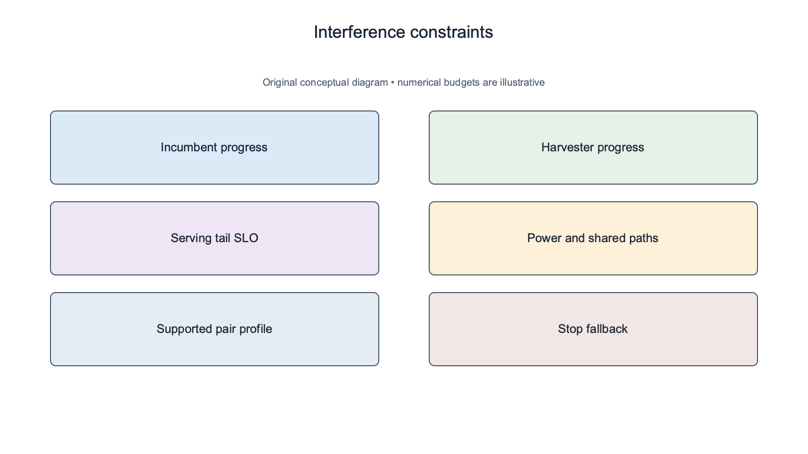
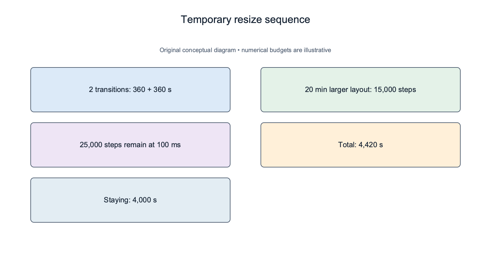

## Overview

Idle capacity is an opportunity, but consuming it can impose a transition or reclaim cost; an elastic training job may benefit from more devices after resharding; a serving workload may harvest a temporary trough while accepting bounded interruption. The scheduler can also wait when the expected useful work does not justify the risk.

Elasticity is a runtime capability and a policy decision. The runtime defines supported resize boundaries and state transitions; the scheduler decides when those transitions are worthwhile under queue, ownership, and uncertainty constraints. A favorable throughput estimate cannot create a missing resharding capability.

[ElasWave](https://arxiv.org/abs/2510.00606), introduced in 2025, studies elastic-native hybrid-parallel training, including communicator adaptation and state migration. This article uses those mechanism boundaries without transferring its reported recovery performance to other runtimes. The examples are illustrative horizon calculations, building on `sched-9` and the reclaim contract in `sched-12`.

## Deep dive

### Declare the resize envelope before allocation

An elastic request should state minimum and maximum sizes, supported layouts, safe resize points, and the memory and communication required during transition; it should also state whether global batch or optimizer semantics change; the scheduler needs those permissions before it treats additional devices as interchangeable progress capacity.

For an illustrative job, supported sizes might be 8 and 16 ranks with 2 validated layouts. A request for 12 ranks is not automatically legal. The runtime may lack that factorization or checkpoint mapping. Feasibility applies to the transition as well as the final steady state. ElasWave adapts affected communicators and migrates model state under its execution design. Its mechanism includes reusing intact connections and changing affected groups rather than rebuilding every group indiscriminately. A cluster allocator should consume a supported transition profile; it should not assume another runtime has the same behavior because both accept a new rank count. A transition can require extra temporary memory. State may exist at source and destination while migration proceeds, and activation or gradient handling must preserve training correctness. The admission envelope should include that peak. A final layout that fits can still be unreachable with the currently available transition resources.

Checkpoint state and progress must be consistent. If a resize changes partitioning, the runtime needs a safe mapping for parameters, optimizer state, and accumulated work. The scheduler should retain the checkpoint or transition identifier so a failure can recover to a known state rather than an ambiguous partially migrated allocation.

### Compare transition cost with the remaining horizon

A resize decision should compare total remaining completion time, not steady-state throughput alone; add transition delay, expected interference, and any recovery exposure to the new execution estimate; Remaining work determines whether the improvement has time to repay those costs.

For an illustrative job with 40,000 steps left, the current layout takes 100 ms per step. A larger layout predicts 80 ms and requires a 6-minute transition. Staying takes 4,000 seconds; resizing takes 3,200+360=3,560 seconds. The simplified saving is 440 seconds, about 7.3 minutes.

The break-even horizon is 360 seconds divided by the 0.02-second per-step saving, or 18,000 steps. If only 10,000 steps remain, resizing takes 800+360=1,160 seconds versus 1,000 for staying. A faster steady state loses because transition cost dominates the short horizon.

Uncertainty should remain attached; a supported current profile and an extrapolated larger-layout estimate do not justify the same confidence as 2 calibrated alternatives; the scheduler can require a supported minimum gain before changing state, while preserving the speculative candidate for offline profiling. The comparison should include queue opportunity cost. Extra devices assigned to one elastic run are unavailable to other queued jobs. A completion-time saving for the incumbent can impose a larger wait on another class. Apply entitlement and reservation policy before optimizing the incumbent’s isolated runtime.

### Harvest trough capacity under an interruption contract

Harvesting uses capacity expected to be idle temporarily. It differs from permanent scaling because the allocation may be reclaimed soon. The workload should declare a supported stop path, checkpoint or cache behavior, and the latency needed to release resources. `sched-10` supplies the reservation-aware timeline test.

For an illustrative 30-minute trough, setup takes 5 minutes and stop plus cleanup requires 7. At most 18 minutes remain for useful execution before any additional safety margin. A nominal 30-minute capacity window should not be priced as 30 minutes of productive service. Serving harvesters also need a demand and SLO model. A temporary replica may improve throughput while warming a cache, then require request draining before release. The cluster scheduler should use the runtime’s drain profile rather than assume that process termination is an acceptable service transition.

Training harvesters need durable progress; a job that runs for 18 minutes but cannot checkpoint before reclaim may contribute no retained work; Price useful progress at the supported checkpoint boundary and include rollback risk. Busy devices alone do not establish that harvesting improved cluster goodput. A reclaim notice can reduce risk if it is part of the ownership contract. If the entitled tenant needs immediate release, the harvester requires an enforceable stop bound or reserved headroom. A statistically likely trough duration does not authorize the scheduler to delay the owner when that prediction misses.

### Model co-location interference and shared bottlenecks

Co-location can use unused capacity inside an allocation, but it can also slow the incumbent. Compute, memory bandwidth, cache, network, and storage are shared in different ways. An interference estimate should identify the workload pair and resource state rather than assign one universal “spare percentage” to every GPU.

For an illustrative incumbent completing 100 units of useful work per minute, a harvester adds 20 units while reducing the incumbent to 90. The combined rate becomes 110, a net gain of 10 under a declared common work scale. If the 2 workloads have incomparable units, report their rates separately and apply an explicit policy objective instead of adding them. Latency constraints can prohibit an otherwise positive aggregate gain. A serving incumbent may miss its tail SLO under interference even when total tokens increase. A training incumbent may violate a protected completion deadline. Apply these constraints before treating the combined throughput as a fitness score. Profiles should include concurrency, power state, numerical format, runtime, and the relevant shared path. A pair measured on homogeneous devices may not transfer to a mixed-device layout or another sequence regime. Retain support and abstention so untested co-location does not inherit a calibrated interference claim.

The allocator should include observability and rollback; if measured progress falls outside the supported envelope, policy can stop the harvester or return to the incumbent allocation; the action boundary and threshold should be specified before deployment, with a known resource-release path.

### Prevent resize thrashing and evaluate retained work

Frequent resize can spend more time moving state than executing. Use a minimum expected holding period, a cooldown, or a supported benefit threshold to prevent oscillation under small queue changes. These are policy choices whose costs should be evaluated rather than presented as universally optimal constants.

For an illustrative sequence of 3 resizes at 6 minutes each, transition delay totals 18 minutes. If each larger allocation saves only 4 minutes before it is reclaimed, the total steady-state saving is 12 minutes and the policy loses 6. A per-decision positive-looking profile can fail over the complete sequence. Use the same arrival and reclaim scenarios to compare staying, resizing, and harvesting. Record useful progress, transition GPU-hours, reclaim delay, SLO violations, and repeated changes. A simulation gain should remain labeled until an online trial validates the runtime and interference assumptions. Failures during transition need separate accounting. A partially migrated state may require recovery beyond the ordinary checkpoint reload. Retain the runtime’s supported failure mode and fallback. The scheduler should not describe a transition as reversible unless the executable system provides that behavior.

The final decision certificate should include current and target layouts, transition support, temporary resource envelope, predicted holding period, reclaim contract, and selected fallback; After execution, append observed migration, progress, interference, and release; this tests whether spare capacity produced retained work rather than simply a higher utilization line.

### Compare staying, resizing, and harvesting on one horizon

For the illustrative 40,000-step job, staying takes 4,000 seconds and resizing takes 3,560. Suppose the extra devices are borrowed and may be reclaimed after 20 minutes of execution on the larger layout. The larger layout executes 1,200/0.08=15,000 steps during that interval, leaving 25,000, before any return transition or checkpoint overhead is charged.

If returning to the original layout costs another 6 minutes, the total includes 2 transitions and the remaining 2,500 seconds at 100 ms per step. The resulting simplified duration is 360+1,200+360+2,500=4,420 seconds. The temporary resize loses to staying despite its favorable permanent-allocation estimate.

This calculation assumes no useful progress during transitions and constant step times; a runtime with overlapping migration can produce a different result, but the scheduler needs its supported profile rather than borrowing ElasWave's mechanism or timing for another stack; the reclaim horizon is a policy and demand assumption, not a property of the model alone. A separate harvester can offer another choice. If it uses the spare devices for retained work without slowing the incumbent or delaying reclaim, the cluster may gain useful output while the incumbent stays stable. Those conditions need measured interference and an executable stop contract. If the work units differ, report each class rather than adding arbitrary training and serving units. Waiting is also a valid action. A short uncertain trough can be too small to repay setup and stop, particularly when the next owner requires an intact topology. The decision certificate should include the rejected resize and harvest alternatives so idle capacity is explainable as a policy choice rather than mistaken for a scheduler failure.

Evaluate the complete sequence on paired demand scenarios. Include permanent spare capacity, early reclaim, delayed reclaim, failed transition, and unsupported interference cells. The fallback behavior should appear in the result. A benchmark restricted to the permanent-spare case cannot establish the value of a policy designed for temporary troughs.

A holding-period model should be validated separately from the resize-speed model. In the illustrative borrowed allocation, predicting 80 ms per step correctly does not establish that the extra devices remain available for the 40,000-step horizon. Reclaim demand, reservations, and tenant policy determine that duration. The decision needs both supported execution evidence and an explicitly modeled capacity window. After reclaim, record retained progress, return-transition time, and whether the original layout resumed under its supported checkpoint mapping. A successful scale-up does not establish a successful scale-down. The complete sequence supplies the useful-work result, while the individual transition profiles explain where the policy gained or lost time.

The capacity window should include decision latency. In the illustrative 30-minute trough, a 2-minute search leaves 28 minutes before setup, execution, and release. A cached supported plan can preserve more useful horizon than a finer online search whose benefit arrives too late. Report the scheduler decision time alongside transition time so the evaluation does not assign the entire nominal trough to productive work.

## Conclusion

Elasticity and harvesting turn spare capacity into useful work only when the transition and reclaim costs fit the available horizon. Runtime-supported resize, temporary memory, state correctness, interference, and ownership remain hard boundaries around the performance estimate.

The final article evaluates the complete scheduler. It combines prediction quality with useful work, queue tails, fairness, and violations so a local speedup or utilization gain cannot hide a regression elsewhere in the cluster.

### Sources

- [ElasWave: An Elastic-Native System for Scalable Hybrid-Parallel Training (2025)](https://arxiv.org/abs/2510.00606)
- [Slurm scheduling configuration](https://slurm.schedmd.com/sched_config.html)
