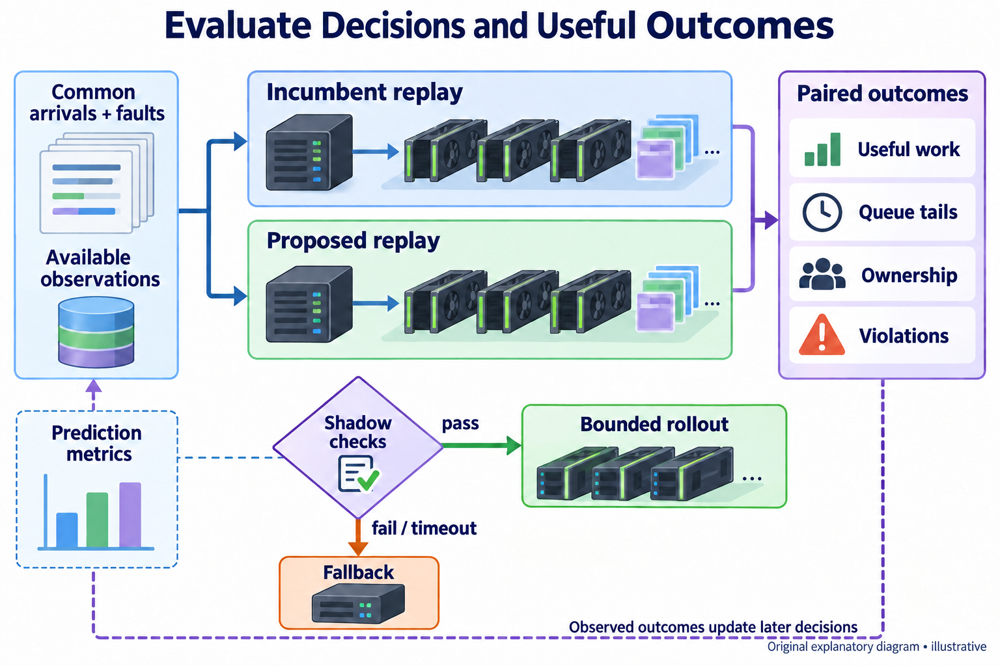
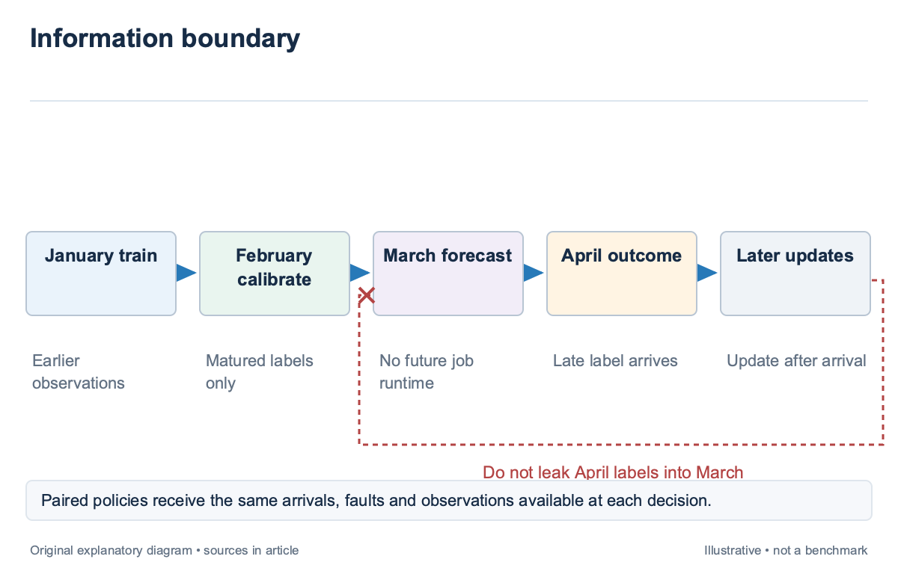
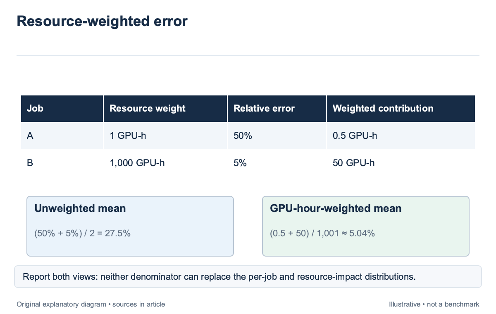
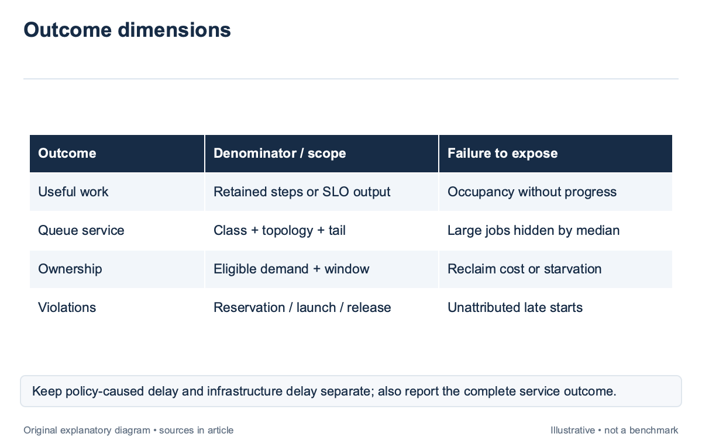
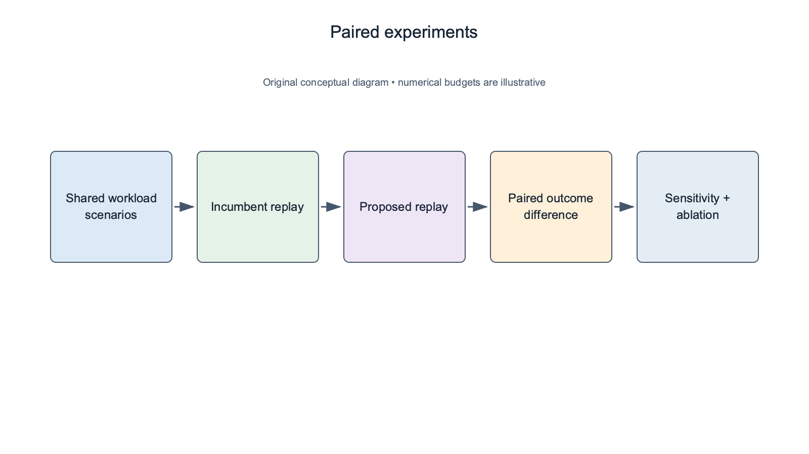
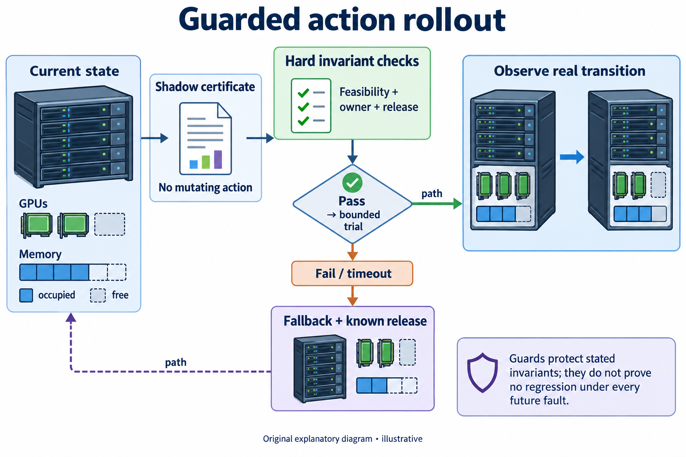
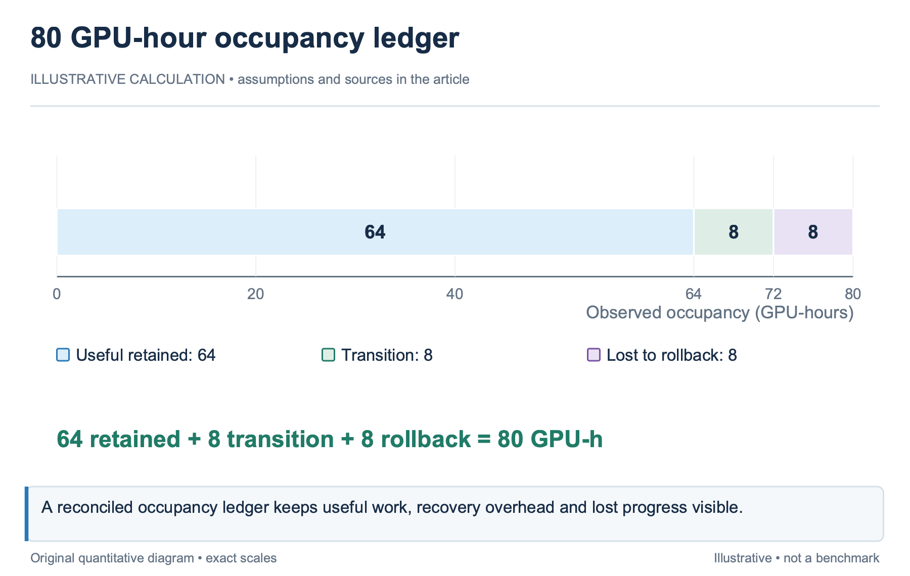

## Overview

A scheduler should be evaluated as a decision system; prediction error is one component; placement, queue policy, interruption, and release determine the outcome; a model can improve average runtime accuracy while the scheduler delays large jobs, violates reservations, or discards more training through preemption.

The evaluation needs a workload trace, an incumbent policy, explicit objectives, and a reproducible information boundary. It should report useful work, GPU-hour-weighted impact, tail wait or SLO attainment, fairness, and violations. Utilization alone cannot establish that the cluster improved.

Kant [\[1\]](https://arxiv.org/abs/2510.01256), introduced in 2025, studies unified scheduling for large AI clusters. Acme [\[2\]](https://arxiv.org/abs/2403.07648), published in 2024, supplies production workload and failure context. This article uses those sources as research anchors and develops an illustrative evaluation protocol for the preceding 13 articles. It does not quote unverified gains from the supplied research map.

## Deep dive

### Define the baseline and information boundary

The baseline should be the incumbent policy or a clearly defined alternative; record its admission, placement, priority, quota, backfill, preemption, and fallback rules; a label such as FIFO is insufficient when the actual implementation preserves topology or applies reservations.

Both policies should receive the same workload arrivals and the same observations available at each decision. Do not give the proposed predictor actual future runtimes while the baseline uses requested limits. That comparison measures an oracle advantage rather than a deployable improvement.

For an illustrative replay, train the predictor on January data, calibrate on February, and evaluate March decisions. At a March submission, expose only the snapshot and labels already available. A long-running February job whose final duration arrives in April cannot be used to calibrate the March forecast retroactively. Kant’s unified scheduling context motivates evaluating workload mix and fragmentation together. The local protocol should preserve the classes and policy conditions of its own cluster rather than transfer a paper’s headline result to a different inventory. Acme [\[2\]](https://arxiv.org/abs/2403.07648) also shows why LLM development contains several job types instead of one homogeneous stream. Separate simulation, shadow decisions, and online trials. Simulation tests a model of the system; shadow mode records proposed actions without applying them; an online trial observes real transitions. Each supplies different evidence. A replay gain should remain labeled as replay until the operational assumptions are verified.

### Measure useful work and resource-weighted impact

Prediction metrics should reflect the resource impact of the jobs; a small relative error on a large allocation can matter more than a large error on a brief single-device experiment; report per-job metrics and GPU-hour-weighted aggregates rather than allowing one denominator to hide the other.

For an illustrative pair, Job A uses 1 GPU for 1 hour and has a 50% duration error. Job B uses 100 GPUs for 10 hours and has a 5% error. The unweighted mean relative error is 27.5%. Weighting by actual GPU-hours gives (1×0.5+1,000×0.05)/1,001≈5.04%. Both summaries are valid and describe different emphasis.

Absolute resource exposure supplies another view. A’s time error corresponds to 0.5 GPU-hours; B’s corresponds to 50. Report directional error too. Underprediction can threaten reservations, while overprediction can reduce backfill. Equal magnitude does not imply equal policy cost. Goodput should count useful retained work under a stated definition. Training can count completed intended progress that survives recovery; serving can count accepted output that meets the declared SLO. Do not mix these units without an explicit weighting or report them separately by class. Preemption and elasticity need transition accounting. Include rollback, checkpointing, reload, migration, and stranded allocations. A scheduler that keeps every device busy through repeated restarts can have high utilization and low retained progress. The event trace should distinguish useful execution from recovery occupancy.

### Report queue tails, fairness, and violations

Queue metrics should include distributions, not only means; Median wait can improve while the largest topology-constrained jobs develop a severe tail; report quantiles by class and shape, plus non-admission and cancellation outcomes. The forecast target from `sched-5` should match the observed allocation-start event. Serving evaluation should retain SLO conditions. Request mix, arrival rate, prompt and output distributions, runtime version, and routing affect latency. A throughput gain that misses the required tail objective is not an acceptable-service gain under that contract. Fairness should use the policy’s declared measure. Report allocation relative to entitlement, offered feasible demand, borrowing, reclaim delay, and interruption exposure. Equal GPU-hours do not prove equal completion experience, while equal request counts do not prove equal serving cost. Violation metrics should identify the rule and cause. Count reservation delay, quota breach, unsupported action, failed coordinated launch, and resource-release timeout separately. A job starting late because its checkpoint is unavailable should not automatically be attributed to backfill.

For an illustrative 100-reservation trial, 2 backfill-caused delays and 3 unrelated infrastructure delays should remain separate counts. A combined 5% late-start rate describes the service outcome, while the 2% attributable count describes the policy mechanism. Preserve both instead of choosing the more favorable denominator.

### Use paired scenarios and sensitivity tests

Paired replay uses the same arrivals, runtime draws, and fault scenarios for both policies. The difference then reflects the policy change rather than independent sampling noise. Retain random seeds and simulator revision so the comparison can be reproduced.

Sensitivity tests vary the assumptions that carry the result; Change runtime uncertainty, cleanup delay, arrival bursts, power caps, and topology availability; a policy that wins only under exact durations may fail when its predictor is calibrated realistically. Report that boundary rather than averaging it away.

For an illustrative backfill test, compare cleanup delays of 2, 5, and 10 minutes using identical workloads. If reservation violations rise sharply at 10 minutes, the result identifies a release-time assumption that requires validation. It does not prove that the production cluster will experience that delay. Ablations can isolate mechanisms. Compare the full policy with bandwidth scoring removed, calibration removed, or topology dry-run removed, while preserving other rules. This shows which component contributes to the simulated outcome. Avoid changing several policy dimensions and attributing the entire difference to one predictor. Stress tests should include unsupported configurations and failures. The fallback path is part of the scheduler. A benchmark that discards every abstention or failed launch evaluates only the easiest decisions and can reward a model for refusing difficult cases without reporting the lost capacity.

### Guard action rollout with explicit no-regression checks

A no-regression check compares a proposed action with the current policy under declared invariants and evidence. It is not a universal mathematical guarantee that no outcome can worsen. State which constraints are hard, which metrics have tolerances, and which uncertain outcomes remain outside the proof.

For an illustrative guarded preemption, require that the incoming job pass full feasibility, victims be policy-eligible, the released shape be reserved, and recovery exposure remain below a declared limit; these checks protect specific properties; they do not prove that the incoming job will finish faster under every future fault.

Shadow mode can record the proposed action and its certificate before execution is authorized. Compare candidate placement, predicted outcome, and fallback with the live decision. Disagreements identify where the new system would mutate state and provide concrete cases for review.

An online trial should begin with a bounded scope and rollback path appropriate to the runtime. Record actual release, launch, progress, and policy violations. Preserve unrelated cluster changes so a measured outcome can be attributed correctly. A new network configuration during the trial can affect both policies and should appear in the report.

The final evaluation artifact should contain workload and model revisions, baseline rules, chronological splits, scenario seeds, metrics with denominators, confidence or uncertainty treatment, failure handling, and decision certificates. This makes the conclusion inspectable. “Better scheduling” then means a stated improvement within measured conditions rather than a generic claim attached to a busy-cluster dashboard.

### Reconcile a scheduler result from the event ledger

For an illustrative 8-GPU allocation held for 10 hours, occupancy is 80 GPU-hours; suppose 8 hours are useful retained execution, 1 hour is launch and reload, and 1 hour is work later lost to rollback; the ledger contains 64 useful GPU-hours, 8 transition GPU-hours, and 8 lost-work GPU-hours, which sum to the observed 80.

A policy that reduces total occupancy to 76 while retaining the same 64 useful GPU-hours improves this simplified resource efficiency from 80% to about 84.2%. A policy that retains only 60 useful GPU-hours in 76 occupancy yields about 78.9%, despite using fewer resources. The definition and arithmetic must accompany the conclusion.

Training progress and serving output still need their own useful-work definitions. GPU-hours are an occupancy denominator, not proof that 1 GPU-hour has the same task value across devices or workloads. Report class outcomes separately when a common objective has not been declared.

Now reconcile queue outcomes; suppose 10 urgent jobs start earlier, while 2 large jobs wait longer because the new placement fragments their domains; the mean wait can fall and the tail can worsen. Preserve the per-class distribution and the causal decision traces rather than describing the policy as uniformly faster. The integrity check should also compare issued predictions with the ledger. A model can underpredict execution while cleanup margin protects the reservation, or predict execution correctly while release fails. These cases belong to different mechanisms. The evaluator should not attribute every late start to the learned model merely because it is the newest component. A final report should state which improvement is supported, under which workload and infrastructure conditions, and which regressions remain. Solver or dry-run certificates explain specific constraints on a snapshot; they do not erase uncertain future outcomes. This scope makes the evaluation useful for an operator deciding whether to expand a trial rather than turning one favorable aggregate into a universal claim.

Metric denominators should remain stable across policy comparisons. In the illustrative paired replay, if the proposed scheduler abstains on 10 difficult requests, report those requests and fallback outcomes in the decision-system result. Comparing its accuracy on accepted requests with the baseline's accuracy on all requests changes the population and can create an apparent gain without better decisions. Use separate conditional and complete-system tables when both are useful. The conditional table evaluates supported predictions; the complete table evaluates all offered feasible work, including fallback, failure, cancellation, and non-admission under the declared rules. This distinction makes model quality and operational coverage inspectable without rewarding either policy for silently dropping difficult cases.

The baseline report should include its fallback implementation and decision latency. In the illustrative paired replay, an incumbent that returns a legal placement immediately and a proposed policy that spends 2 minutes searching receive different effective start times. Count that delay when it affects admission. A faster predicted execution cannot erase time spent deciding, and a solver timeout should produce its documented incumbent fallback rather than disappear from the evaluation.

## Conclusion

Scheduler evaluation connects predictions to decisions and decisions to useful outcomes. A defensible comparison preserves the information boundary, weights resource impact appropriately, reports queue and fairness tails, and counts violations and recovery costs. Replay, shadow mode, and online trials should remain distinct evidence stages.

The series now forms one decision pipeline: describe work, filter feasibility, estimate time and uncertainty, choose placement and layout, manage queue policy, and verify outcomes. The same certificate that explains an individual action supplies the evidence needed to decide whether the scheduler improved the cluster.

### Sources

- [\[1\]](https://arxiv.org/abs/2510.01256) Kant: An Efficient Unified Scheduling System for Large-Scale AI Clusters (2025)
- [\[2\]](https://arxiv.org/abs/2403.07648) Characterization of Large Language Model Development in the Datacenter (2024)
- [\[3\]](https://arxiv.org/abs/1905.03222) Conformalized Quantile Regression (2019)
