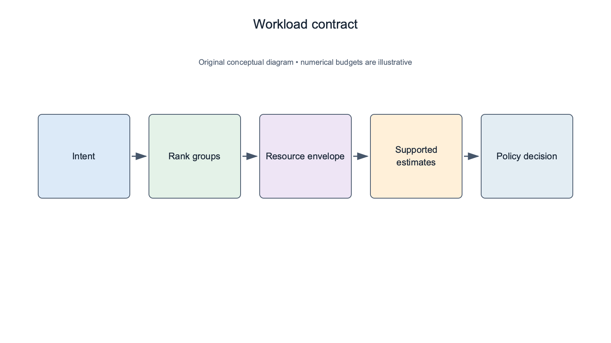
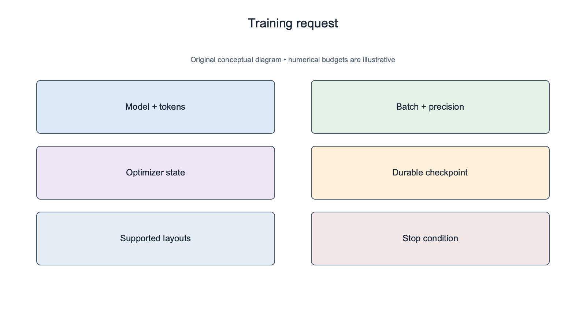
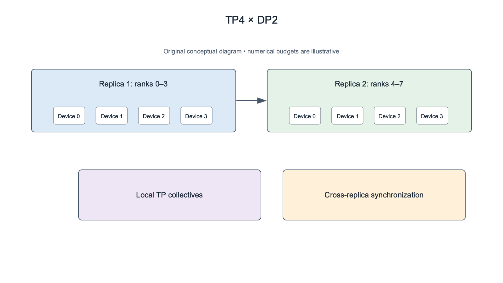
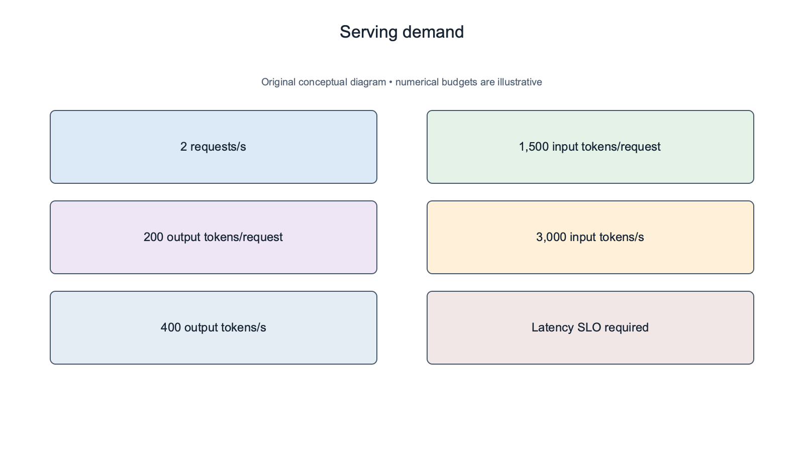
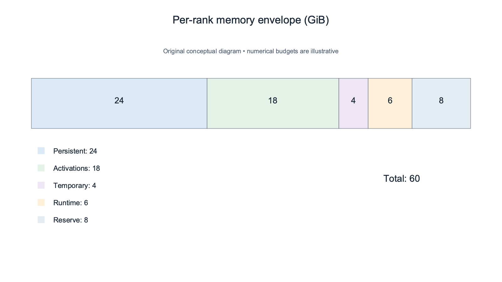

## Overview

An AI scheduler cannot place a job correctly from its GPU count alone; the same request for 8 GPUs might describe 8 independent experiments, 2 tightly connected training replicas, or an inference service whose capacity changes with prompt length; each interpretation produces different legal placements and different consequences for the queue. The scheduler needs a workload model: a structured description of the work, its constraints, and the evidence available to estimate performance. This description is separate from a performance predictor. A predictor consumes the description and estimates duration or throughput; the scheduler combines those estimates with policy and cluster state. A missing field should remain visible rather than silently becoming a default that looks measured.

This article develops that description for training and serving. It follows the decision loop in `sched-1` and assumes the process-mesh and memory concepts in [Distributed Training](/series/distributed-training/). The examples below are illustrative accounting exercises, not benchmarks of a particular GPU. [Acme](https://arxiv.org/abs/2403.07648), published in 2024, provides production context: LLM development includes pretraining, fine-tuning, evaluation, and other work with different resource patterns. Those classes deserve explicit representation.

## Deep dive

### Describe the training work before its allocation

A training request should first identify the work that remains. Record the model configuration, sequence-length regime, global batch, numerical formats, optimizer, dataset or token budget, completed progress, and stopping condition. These fields explain what the job will do even when the scheduler considers a different allocation.

Token count is useful only with its meaning attached; a request for 1 billion remaining tokens can refer to packed sequences, padded examples, or a mixture of lengths whose operator shapes differ; the scheduler should retain the length distribution or a declared workload profile, because 2 jobs with the same token budget can expose different activation peaks and different attention costs. A model name alone does not resolve those differences.

Progress must also refer to durable state. Suppose an illustrative run targets 100,000 optimizer steps, has executed 60,000, and has a durable checkpoint at 59,500. Normal continuation has 40,000 steps left; recovery after losing the current allocation has 40,500. Both values are valid, but they answer different questions. If the scheduler stores only the displayed progress bar, it will underprice rollback by 500 steps. Separate user intent from permitted flexibility. A job can allow several layouts while requiring the same global batch and optimizer behavior, or it can authorize a batch change under a specified learning-rate rule. These permissions are part of the workload contract. A scheduler cannot treat an allocation change that alters the experiment as a harmless capacity optimization merely because the launcher accepts the new command line.

The workload description should be versioned alongside the checkpoint. When a team changes sequence length, activates recomputation, or adds an evaluation phase, the predictor needs a new configuration identity. Keeping the previous runtime history under the same key mixes observations from different workloads and makes an apparent calibration problem out of a bookkeeping error.

### Represent ranks and communication groups

A layout tells the scheduler how ranks cooperate; tensor parallelism, or TP, partitions work within model layers; pipeline parallelism, or PP, assigns layers to stages; data parallelism, or DP, runs replicas that synchronize training state; expert parallelism, or EP, assigns experts to ranks and routes token activations between them. These dimensions create communication groups, not just a multiplication that yields a device count.

For an illustrative TP4×DP2 layout, the scheduler reserves 8 ranks and receives 2 TP groups of 4. The 2 replicas also communicate gradients according to the chosen sharding and synchronization scheme. Placing each TP group inside a fast 4-device domain may satisfy one requirement, yet the links between replicas still affect step time. A single label such as “local placement” hides the distinction. Represent each communication group with its members, operation family, payload regime, frequency, and acceptable topology. A TP collective issued repeatedly within a layer has different sensitivity from an occasional checkpoint transfer. The scheduler need not reproduce the runtime’s collective implementation, but it should know which paths carry repeated synchronized work and which can tolerate a slower route.

[RAPID-LLM](https://arxiv.org/abs/2512.19606), introduced in 2025, models hybrid parallelism through compute, memory, and communication structure. Its memory model accounts for persistent state and peak live transient state, while its network model evaluates the communication generated by the mapping. The transferable lesson is the representation boundary: changing a layout changes several coupled quantities, so the scheduler should not update GPU count while retaining the old memory and network estimates.

Group membership must be derived from an authoritative runtime configuration; a label attached to one pod may describe a worker rather than the whole distributed job; Admission should resolve the allocation unit, expected rank count, and launch owner before queueing it. Otherwise the scheduler can admit 6 workers of an 8-rank job and strand resources while the missing ranks wait elsewhere.

### Model serving as demand with deadlines

A serving workload requires a demand description rather than a finite training budget. Record the model and numerical format, prompt-length distribution, output-length distribution, arrival process, concurrency limits, cache behavior, and service-level objectives. A service-level objective, or SLO, states the latency or availability target used to judge whether capacity is adequate.

The input and output distributions should remain separate. Prefill processes prompt tokens, while decode generates successive output tokens and retains request state. An average of 1,000 total tokens could describe a 900-token prompt with 100 output tokens or the reverse. Those mixes can stress different resources even though a dashboard reports the same total token rate.

For an illustrative service receiving 2 requests per second, with a mean prompt of 1,500 tokens and mean output of 200 tokens, the offered demand averages 3,000 input tokens per second and 400 output tokens per second; these rates describe demand. They do not establish the GPU throughput required to meet a tail-latency objective, because bursts, batching, length variation, and the runtime’s admission policy determine how the demand queues.

[Mélange](https://arxiv.org/abs/2404.14527), published in 2024, identifies request size, request rate, and SLO as key dimensions of heterogeneous serving allocation. It formulates allocation as cost-aware bin packing, with workload slices assigned to GPU capacity under service constraints. The paper concerns serving; its allocation model should not be presented as a ready-made training scheduler.

A cluster allocator can consume measured serving profiles without taking over engine-internal token ordering. The profile should state the runtime version, routing policy, cache assumptions, and the load range tested. If those conditions change, a capacity estimate can lose support even when the GPU and model remain identical. The existing [LLM Inference & Serving](/series/llm-serving/) articles explain the runtime mechanisms beneath that profile.

### Carry resource envelopes and uncertainty together

The resource vector should distinguish reserved capacity from expected use; memory feasibility needs a peak envelope, not the mean memory observed over a run; CPU, host memory, storage bandwidth, and network endpoints can also limit launch or progress. An allocation that satisfies GPU memory but cannot load its checkpoint is not operationally ready.

Consider an illustrative per-rank budget of 24 GiB persistent state, 18 GiB peak activations, 4 GiB temporary buffers, and 6 GiB runtime overhead. The total is 52 GiB. If the operator requires an additional 8 GiB reserve, the admission envelope becomes 60 GiB. Each term needs a provenance label: measured peak, analytical estimate, configured reserve, or unsupported assumption. Adding peaks from unrelated phases can overreserve, while adding averages can underreserve. A graph-aware model tracks which tensors are live together and reports the maximum of the resulting timeline. RAPID-LLM uses this kind of live-state accounting under the selected recomputation and sharding settings. A scheduler may use a simpler conservative envelope, but it should explain the approximation instead of implying that the sum is an exact runtime trace.

Performance fields should carry intervals and support conditions. A 10-hour duration estimate with a 9–14-hour supported band is different from an untested point prediction of 10 hours. Both might enter a planning interface, yet only the supported band supplies evidence for protecting a reservation. `sched-4` and `sched-6` develop prediction and calibration in detail. Resource flexibility belongs beside the envelope. Record minimum and maximum rank counts, supported layouts, resize boundaries, checkpoint prerequisites, and whether the job can pause. These are permissions and capabilities, not predictions. A job may have a favorable estimated resize speedup while its runtime cannot safely reshard the current checkpoint; the capability constraint wins.

### Validate the description at admission and after launch

Admission should reject inconsistent descriptions before they influence the queue; check that the layout produces the declared rank count, communication groups cover the expected ranks, memory units are explicit, and the requested format is supported by the runtime; a malformed TP4×DP2 request declaring 6 ranks has no sensible placement until the mismatch is resolved. Some fields can be checked only at runtime. A launch probe can confirm visible devices, required kernels, communicator membership, and checkpoint readability. Treat these checks as a second validation boundary and record failures separately from training duration. Acme’s production trace includes final status and runtime evidence; successful jobs alone cannot explain the cost of failed launches. The scheduler should retain both the submitted request and the resolved description. This lets an operator distinguish a user-provided estimate from an admission default and a measured capability from an inferred one. When a later decision performs poorly, the record identifies whether the workload changed, the predictor drifted, or the allocator ignored a valid constraint.

A useful workload model is therefore small enough to inspect but rich enough to prevent category errors. It connects intent, rank structure, demand, resource envelopes, and recovery state through stable identifiers. The scheduler can then compare legal alternatives without pretending that every free GPU is interchangeable or that every token has the same scheduling cost.

### Follow one description through a configuration change

For the illustrative TP4×DP2 job, admission can resolve one immutable workload identity and 2 allocation identities. The workload identity holds model, token budget, batch, optimizer, and stopping condition; the allocation identities hold rank mapping, device class, runtime, and the evidence used for memory and duration, so changing placement does not erase what the team intended to train.

Suppose the team authorizes an alternative TP2×DP4 layout with the same global batch. The scheduler must regenerate per-rank state and communication groups, check that the checkpoint can load, and obtain a supported performance profile. Copying the TP4 memory number into the TP2 request would make the description inconsistent even if both layouts reserve 8 ranks.

The same bookkeeping applies to the illustrative serving service at 2 requests per second; a routing change that sends long prompts to a separate pool should create a new demand profile for each pool, while preserving the original client objective; the allocator can then compare capacity under the resolved mixes instead of claiming that a lower average prompt length made the unchanged service cheaper. This trace is an admission audit rather than a benchmark. It shows which fields stay fixed, which must be recomputed, and where the scheduler needs a new capability or measurement before acting. A concise description earns its value by making those dependencies explicit.

## Conclusion

Training and serving need different descriptions, but both benefit from the same separation: what the workload requires, what it permits, what the estimator knows, and what the policy decides. A GPU count supplies only one field in that contract.

The next article applies the description to feasibility. It checks memory, capabilities, topology, and runtime support before any performance score can influence the allocation. Later articles use the same description to predict duration, protect queue reservations, and price interruption without losing the original workload intent.

### Sources

- [Characterization of Large Language Model Development in the Datacenter (2024)](https://arxiv.org/abs/2403.07648)
- [Mélange: Cost Efficient Large Language Model Serving by Exploiting GPU Heterogeneity (2024)](https://arxiv.org/abs/2404.14527)
- [RAPID-LLM: Resilience-Aware Performance analysis of Infrastructure for Distributed LLM Training and Inference (2025 preprint; revised 2026)](https://arxiv.org/abs/2512.19606)
