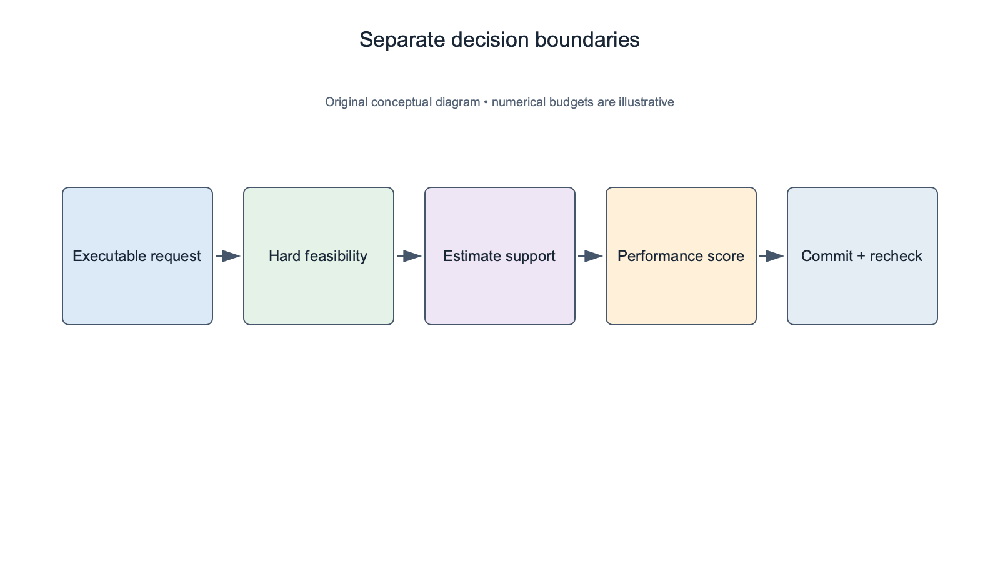
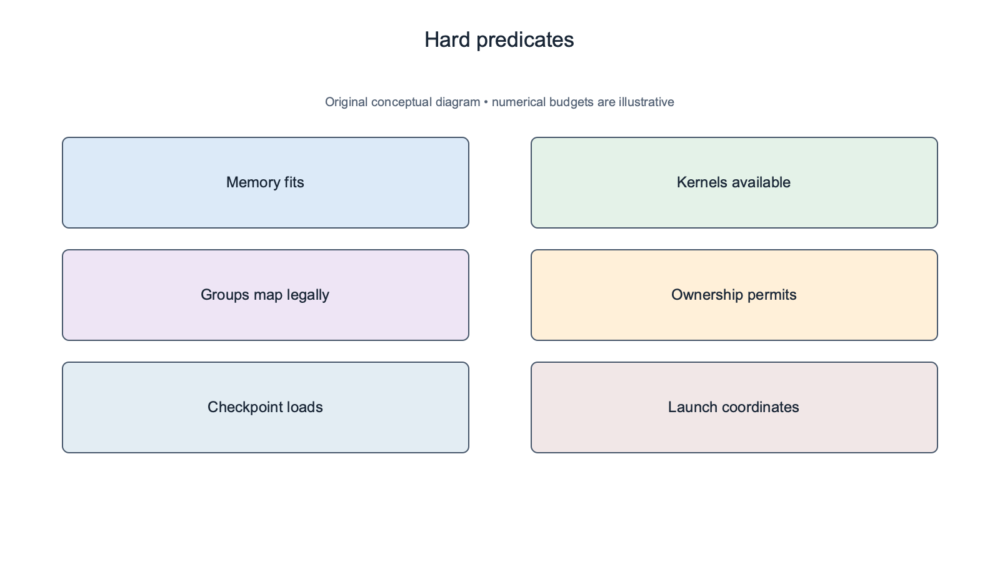
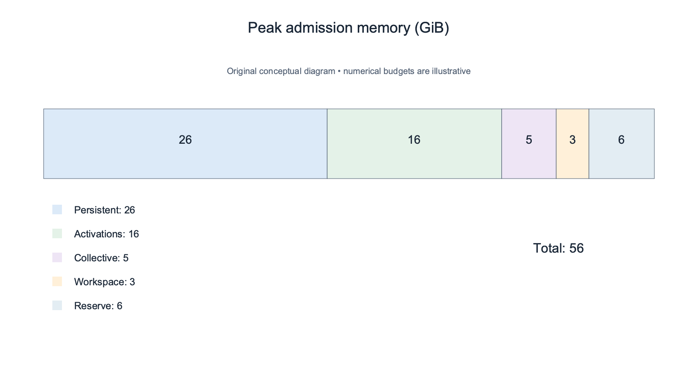
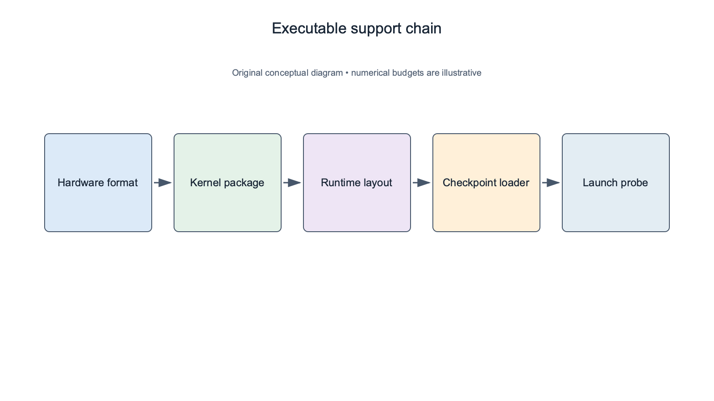
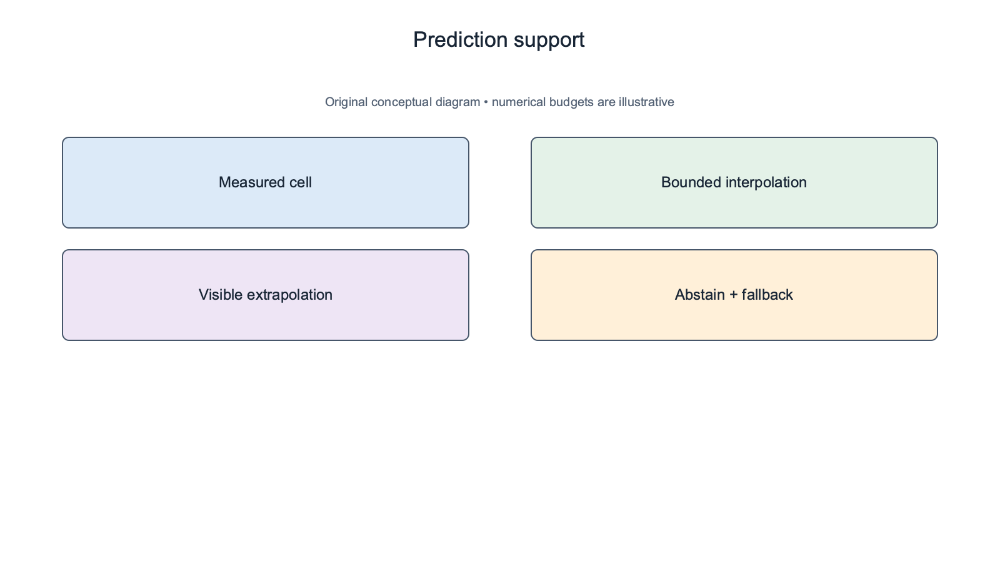
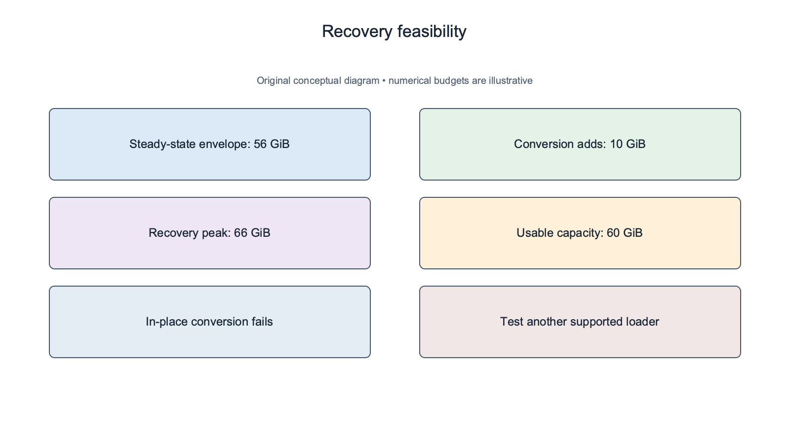

## Overview

A scheduler should reject an impossible allocation before asking whether it is fast; memory capacity, executable kernels, communicator membership, and required topology are feasibility conditions; a high throughput estimate cannot compensate for a rank that cannot allocate its state or a runtime that cannot execute the requested numerical format.

Feasibility is also more than a device specification. A GPU may support a format in hardware while the selected software stack lacks the kernel required by the workload. A performance model may produce a value for that configuration even though it has never observed the runtime combination. The scheduler needs separate answers to 3 questions: can the job run, is the estimate supported, and how attractive is the legal allocation?

This article extends the workload description from `sched-2`. It uses [RAPID-LLM](https://arxiv.org/abs/2512.19606), introduced in 2025, to explain peak live memory and the limitations of analytical performance models. The worked budgets are illustrative and use declared usable capacity rather than a named product’s nominal specification. The existing [training-memory article](/blog/training-memory-and-step-time/) supplies the underlying state categories; here the focus is admission and decision authority.

## Deep dive

### Turn requirements into testable predicates

A hard constraint is a predicate that must hold for a candidate allocation. “At least 60 GiB usable memory per rank” is testable. “Prefer fast GPUs” is an objective. Keep the 2 separate, because a score that blends them permits a sufficiently favorable objective to outweigh a broken requirement. Let an illustrative allocation contain ranks r assigned to devices d. Define a memory predicate for every rank, a capability predicate for the required runtime, and a group-topology predicate for every communication group. The full allocation is feasible only when all required predicates hold. Distributed feasibility is therefore a conjunction over the job, not a collection of individually schedulable workers.

A filter should produce a reason when it rejects a candidate. Distinguish insufficient usable memory, missing kernel capability, unavailable reservation, and an illegal group mapping. These reasons support different remedies. Waiting may resolve occupied memory; changing the supported layout may resolve topology; rebuilding the runtime may resolve a missing operator. Calling all 3 cases “no GPUs available” discards information the operator can use. Policy constraints also belong in the feasibility layer when they are mandatory. A protected reservation or tenant entitlement can make physically idle devices unavailable to this job. The scheduler should record that policy decision explicitly, while preserving the physical capacity snapshot so a reviewer can distinguish policy exclusion from actual exhaustion. A useful filter order checks inexpensive, decisive conditions first. Validate the request, runtime identity, and obvious capacity bounds before invoking an expensive performance model. The order can improve scheduler latency, but it must not alter the final truth value: a candidate that fails topology remains rejected even if memory and capability checks happened to run first.

### Budget peak live memory rather than average use

Training memory contains persistent state and temporary live state. Parameters, gradients, and optimizer state can remain allocated across steps, while activations and communication buffers appear and disappear as the runtime executes. The admission question concerns the maximum simultaneous total, not the average reported by a monitoring interval.

RAPID-LLM counts rank-assigned state after parallelism partitioning and tracks activation lifetimes under the selected recomputation policy; it also accounts for transient parameter materialization under sharding; this matters because the same parameter partition can fit under one execution schedule and exceed capacity under another, even when a spreadsheet gives both configurations the same persistent-state total.

Consider an illustrative rank with 26 GiB persistent state. During its peak phase it holds 16 GiB activations, 5 GiB collective buffers, and 3 GiB temporary workspace. The simultaneous total is 50 GiB. Add a declared 6 GiB operating reserve and the admission requirement becomes 56 GiB; on a device with 60 GiB currently usable, the allocation retains 4 GiB beyond that requirement.

Now suppose a different phase uses an 8 GiB workspace after releasing the 16 GiB activation set. Adding every observed component peak would produce 58 GiB before reserve, although those peaks do not overlap. A lifetime-aware calculation instead compares the phase totals. It avoids this overestimate without replacing the envelope with an unsafe average. A scheduler should retain the budget’s assumptions. The model must identify recomputation, sharding, microbatch count, sequence-length envelope, and the runtime version that produced the workspace behavior. If a fused kernel changes its temporary allocation, the old envelope may no longer describe the executable job, so a configuration hash and a launch-time check are more useful than a model name attached to a memory number.

### Separate hardware capability from executable support

Hardware support is necessary but insufficient; the admission system should resolve the numerical format, operator set, compiler or library implementation, collective backend, and checkpoint representation; a requested precision can be legal on the chip while one load-bearing operator falls back to another path or fails at runtime.

For the illustrative 60 GiB device, the scheduler should consume a tested capability manifest rather than infer executable support from a product family label. The manifest can name supported model families, formats, layouts, kernel packages, and version ranges. A launch probe then confirms that the allocated environment matches the manifest, including device visibility and collective initialization.

Mixed-device allocations need additional checks. Every rank in a communication group must agree on tensor shape, representation, and operation semantics. A pipeline boundary can allow different execution devices while still requiring compatible activation transfers. It does not make arbitrary model partitions or collective combinations valid. `sched-9` examines which layout boundaries are appropriate for heterogeneous placement. Checkpoint compatibility is another executable constraint. A runtime may support a fresh run but lack a safe loader for the checkpoint’s sharding layout. Resharding can require temporary host or device memory that is absent from the steady-state estimate. Admission should include the recovery path when a job starts from existing state, because “fits after loading” is no protection against failure during loading.

A capability check should be reproducible; record the manifest version, container or package identity, probe result, and whether the result was measured or declared; when a job fails, this record helps distinguish a stale support claim from an allocation defect. It also prevents one successful launch from becoming an undocumented universal claim about every configuration on the same GPU.

### Distinguish legal allocations from supported estimates

A support envelope describes where a predictor has evidence. It can include device type, runtime version, model shape, layout, sequence regime, and traffic state. A configuration may be executable but outside that envelope. The scheduler should preserve feasibility while marking its performance estimate unavailable or weakly supported.

Measured evidence and interpolation are different. Suppose an illustrative table contains step-time measurements at sequence lengths 2,048 and 4,096 for one layout and runtime. A prediction at 3,072 can be labeled interpolation under the stated model. A prediction at 16,384 is extrapolation; the same formula may return a number, yet new activation peaks, attention shapes, or communication behavior can invalidate the fitted relationship. RAPID-LLM states that its analytical operator model is intended for design-space exploration rather than cycle-accurate prediction. It abstracts compiler-specific behavior, including exact fusion choices and software serving effects. That limitation should survive into a scheduler interface: an analytical estimate is useful evidence, but it is not a substitute for a tested executable capability or a locally calibrated latency profile.

A fallback policy gives the allocator defined behavior when the model abstains; for a legal but unsupported candidate, the scheduler might use a documented compact-placement baseline, restrict speculative backfill, or request a profile before making a high-impact choice; the fallback must be part of policy, because silently assigning zero cost to a missing prediction rewards the configuration with the least evidence.

The support test itself should be inspectable. Store the features that caused abstention and the model revision used. A distance threshold in a feature space can be a practical warning, but it does not prove that every nearby configuration is safe. The operator should see whether the support decision came from explicit tested cells, a fitted neighborhood, or a heuristic whose calibration remains incomplete.

### Check the full launch and recovery envelope

A distributed allocation can pass steady-state checks and still fail operationally. The scheduler should budget checkpoint staging, temporary resharding buffers, communicator setup, host memory, and storage access. These phases have their own resource peaks and failure modes. Treating launch as a free transition understates both capacity and queue delay.

For an illustrative recovery, suppose steady state requires 56 GiB per rank, but checkpoint conversion temporarily requires 10 GiB more; a 60 GiB usable device cannot perform that conversion in place, even though it can execute the resulting model; a supported streaming loader or host-staged conversion may resolve the problem; until that path is declared and tested, the allocation fails recovery feasibility.

The same principle applies to topology. A reservation for the final rank set should include the coordinated start condition and a timeout policy. If 7 ranks launch while the eighth remains blocked, the system can hold resources without making progress. A gang allocation, meaning a coordinated allocation for the distributed job, should either reach its launch condition or release according to the recorded fallback. Admission should also guard against stale snapshots. Between filtering and commitment, another allocation may consume the memory or reservation used by the candidate. Commit against a versioned cluster state and revalidate the hard constraints before acting. A correct estimate on an old snapshot cannot authorize a placement on the new one.

This final check connects feasibility to the decision certificate from `sched-1`. Record the predicates, assumptions, environment identity, snapshot version, and fallback. The certificate is more useful than a single “fit” flag because it explains what was proved, what was merely estimated, and what changed after the scheduler committed.

### Audit an allocation with missing evidence

Consider the illustrative 60 GiB usable device again; the 56 GiB envelope passes memory, the capability manifest passes the required operators, and the communication groups pass topology; the timing model, however, has no supported observation for this runtime revision. Admission should retain 3 positive feasibility results and one unsupported-estimate result rather than replace them with a single rejection flag. A deterministic fallback can queue the job for ordinary compact placement while declining reservation-sensitive backfill. This distinction preserves legal execution without pretending that a missing duration bound can protect a future start. The operator can request a profile later, and the capability evidence remains valid unless its own configuration changes.

Now change the recovery requirement so checkpoint conversion peaks at 66 GiB. The same allocation fails recovery memory, even though steady state still fits. A supported host-staged loader may provide another feasible path, but the scheduler must test that path and its host-memory and storage requirements before using it; a timing-model fallback cannot fix an executable memory failure. The audit therefore records two different remedies: gather timing evidence for the first case, or change the recovery path or allocation for the second. Keeping the reasons separate prevents a rewriter, predictor, or operator interface from smoothing a factual incompatibility into an apparently uncertain but acceptable score.

## Conclusion

Feasibility should remain a hard boundary around performance optimization. Peak live memory, executable support, communication topology, policy ownership, and launch or recovery conditions decide whether an allocation can run. Predictor support decides how much confidence the scheduler should place in its performance estimate.

The next articles build duration and queue-wait estimates inside those boundaries. Keeping legal execution separate from supported prediction lets the scheduler abstain honestly while retaining deterministic behavior, and it prevents a persuasive score from hiding an impossible allocation.

### Sources

- [RAPID-LLM: Resilience-Aware Performance analysis of Infrastructure for Distributed LLM Training and Inference (2025 preprint; revised 2026)](https://arxiv.org/abs/2512.19606)
- [Kubernetes scheduler: filtering and scoring](https://kubernetes.io/docs/concepts/scheduling-eviction/kube-scheduler/)
