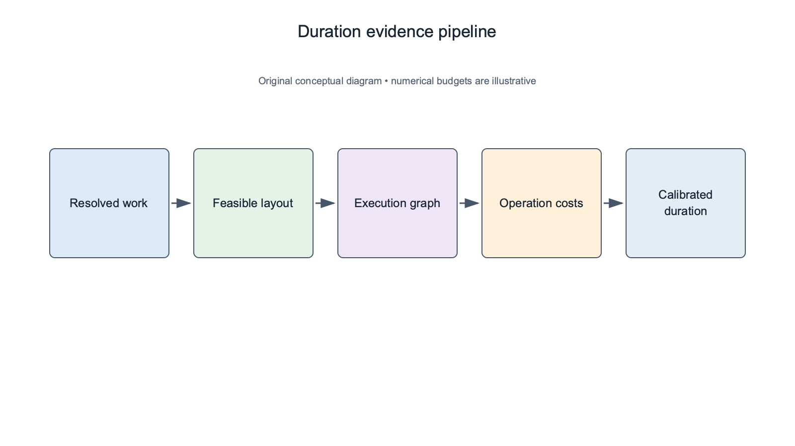
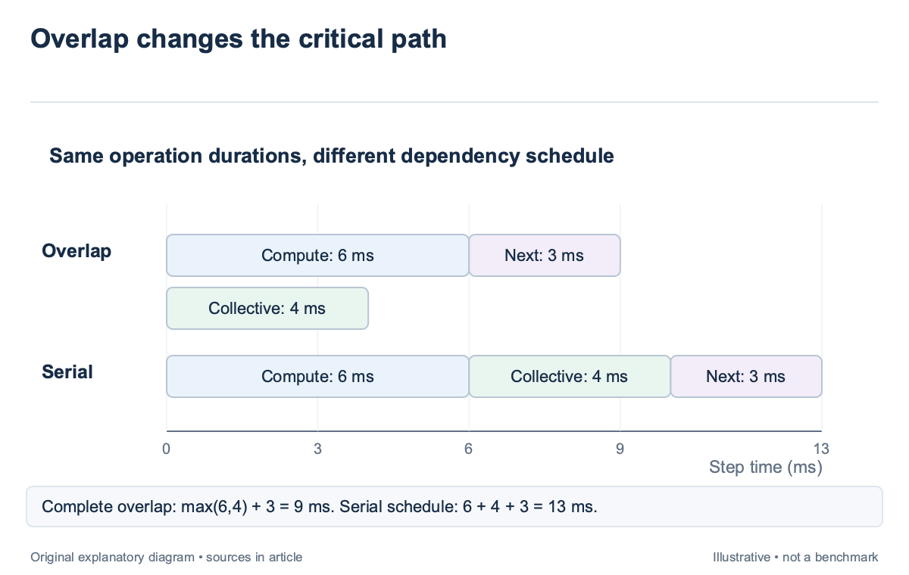
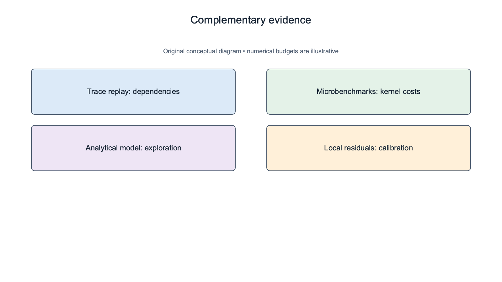
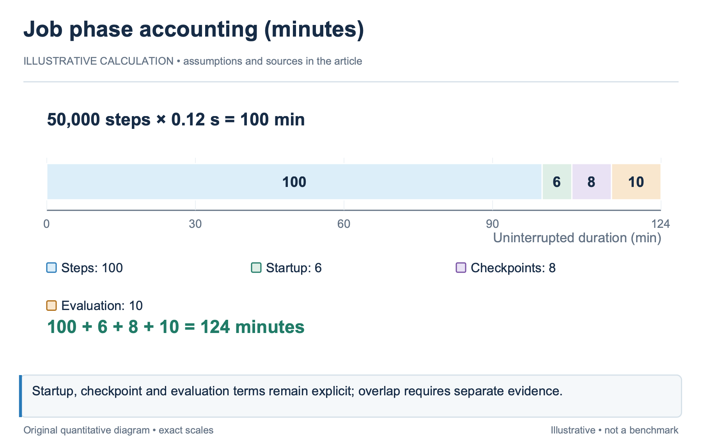
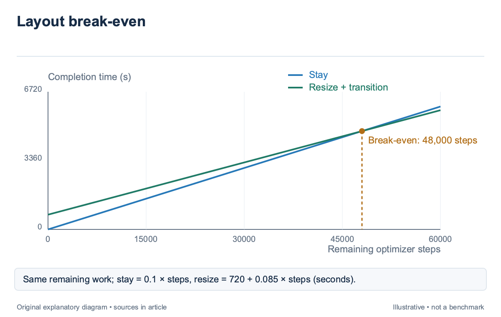

## Overview

For the illustrated 50,000-step job, a duration estimate is useful only when it describes the allocation the scheduler is considering; the runtime of an 8-GPU job cannot be scaled to 16 GPUs by dividing by 2 unless computation, communication, memory behavior, and the execution schedule all support that relationship; a changed layout can shorten one path while exposing another.

The scheduler needs a model of remaining execution time, including the configuration and evidence behind the result. This article compares trace replay, analytical operator models, and locally fitted measurements. It builds on `sched-2` and `sched-3`: the workload must be resolved and the allocation feasible before its duration is priced.

Lumos [\[1\]](https://arxiv.org/abs/2504.09307), introduced in 2025, constructs execution graphs from profiling traces and manipulates those graphs for configuration exploration. RAPID-LLM [\[2\]](https://arxiv.org/abs/2512.19606), also introduced in 2025, combines analytical operator and memory models with network modeling. Their methods offer different evidence, and neither turns a predicted step time into a complete queue or recovery guarantee.

## Deep dive

### Predict the execution graph rather than a device count

A training step in the illustrative 50,000-step job contains dependent operations. Compute kernels produce tensors, collectives exchange them, and later kernels wait for the required results. Some communication overlaps computation; some lies on the critical path. The critical path is the dependency chain that determines when the step can finish, so summing every operation duration can overestimate runtime while ignoring dependencies can underestimate it.

For an illustrative graph, a 6 ms compute segment overlaps a 4 ms collective, then a dependent 3 ms compute segment runs; if the overlap is complete, the path takes 9 ms rather than 13 ms; if the collective starts only after computation, it takes 13 ms. The kernel durations are identical; the dependency and launch schedule produce the difference. Lumos [\[1\]](https://arxiv.org/abs/2504.09307) uses profiling traces to recover fine-grained execution behavior and simulate timing. Its contribution is the execution graph and configuration transformation, while unseen kernel durations can come from measurements or another performance model. That boundary matters: replay can preserve an observed overlap pattern, but a new kernel or runtime configuration needs a defensible cost and a valid transformed dependency structure.

A scheduler-facing predictor built around Lumos [\[1\]](https://arxiv.org/abs/2504.09307) should therefore identify both the graph revision and the operation-cost source. An estimate based on an observed kernel measurement has different support from a shape-based analytical value. When the model changes a layout, it should update the corresponding communication groups, operation shapes, and dependencies together rather than retain an old graph with a new device multiplier.

The existing [gradient-bucket timeline article](/blog/ddp-gradient-buckets-backward-timeline/) explains one overlap mechanism. A cluster scheduler consumes the resulting timing model; it does not need to reconstruct every bucket implementation, but it must preserve the assumptions that make the overlap possible.

### Choose among replay, analytical costs, and local fitting

Trace replay starts from observed execution. It is strongest when the new configuration remains close enough that graph transformations preserve relevant behavior. A kernel microbenchmark can price a new operator shape, while a communication model can estimate a changed collective path. The resulting estimate is a composition of evidence, not one uniformly measured quantity.

An analytical model derives costs from operator shapes and hardware or network parameters; RAPID-LLM [\[2\]](https://arxiv.org/abs/2512.19606) models compute and memory behavior and evaluates communication under the selected mapping; its stated limitations include abstraction of compiler-specific fusion and serving-software effects. This makes the model useful for exploration, while local calibration remains necessary before its results protect high-impact reservations.

A locally fitted model can predict duration from workload features and recent observations. It may capture the actual runtime stack more directly, but it can confuse correlation with a transferable mechanism. A feature such as GPU count may work within one family of layouts and fail when the scheduler changes tensor parallelism or sequence length. Keep the supported feature region explicit.

These approaches can be combined. Use replay for dependency structure, measured or analytical costs for operation durations, and local residuals to calibrate the total. The scheduler should retain that composition, because an error caused by a stale collective model requires a different correction from an error caused by an unmodeled evaluation phase.

For an illustrative model revision, suppose replay predicts 120 ms per step, but recent matching runs have residuals of 5, 8, and 11 ms; a local correction may move the center upward; it should not be applied blindly to a different layout whose communication dominates, since the old residuals summarize a different balance of computation and exposed network time.

### Convert step time into remaining job duration

Step time is only one component of job duration. The scheduler also needs startup, checkpoint loading, periodic checkpoint writes, evaluation phases, and remaining progress. A steady-state model that excludes these phases can rank long runs reasonably while badly estimating a short evaluation or a job resuming from remote storage.

Use an explicit accounting identity for an illustrative planning estimate: remaining duration equals startup plus remaining steps times predicted step time, plus checkpoint and evaluation overhead. Each term uses the same time unit. If failures are included, state whether the result is uninterrupted runtime or expected elapsed completion time under a failure model.

Suppose 50,000 steps remain at 120 ms each; the compute timeline contributes 6,000 seconds, or 100 minutes; add 6 minutes of startup and 4 checkpoint writes at 2 minutes each; the uninterrupted estimate becomes 114 minutes. If the workload also performs a 10-minute final evaluation, the estimate becomes 124 minutes. Omitting that phase would understate the duration by a known amount. Checkpoint overhead may overlap useful work. A measured asynchronous write cost should distinguish wall-clock delay from storage occupancy and background interference. Adding the full write duration to step time can double-count overlap, while ignoring the write can underprice the queue impact on another job sharing storage. The predictor and allocator may need different views of the same operation.

Remaining progress must use the state appropriate to the decision. Normal continuation starts from the current step; preemption and restart start from the durable checkpoint. `sched-11` uses the resulting rollback difference to price victim sets. A single duration field cannot represent both outcomes without a mode label.

### Model layout changes with constant work

A layout comparison should hold the intended training work constant. Record global batch, token budget, numerical format, and optimizer semantics before comparing allocations. If one candidate changes those conditions, report it as a changed experiment or an explicitly authorized alternative rather than a faster execution of identical work.

Consider 2 illustrative feasible layouts for the same remaining workload; Layout A predicts 100 ms per step and needs no transition; Layout B predicts 85 ms but requires 12 minutes to load or reshard state. Over 10,000 remaining steps, A takes 1,000 seconds; B takes 850 seconds plus 720 seconds, or 1,570 seconds. The faster steady-state layout loses for this horizon.

The break-even horizon is 720 seconds divided by the 0.015-second per-step saving, giving 48,000 steps. Beyond that horizon, the simplified model favors B. This arithmetic assumes constant step times, one transition, and equal checkpoint and evaluation behavior. It illustrates why remaining work belongs in the decision rather than establishing a universal resize threshold. A scheduler should also compare uncertainty. If A has a supported narrow interval while B relies on an extrapolated kernel cost, the nominal saving may not justify the transition. State the fallback when either prediction lacks support. A deterministic rule can choose the incumbent layout until a profile exists, while retaining the speculative estimate for offline exploration. Layout search itself has a cost. A model that takes minutes to enumerate thousands of candidates may be appropriate for a long pretraining run but too slow for frequent short jobs. Cache validated configuration profiles and bound online search. The time spent deciding belongs in an operational evaluation of the scheduler, even when it is excluded from the training graph.

### Validate duration estimates chronologically

A predictor should be tested on decisions it could actually have made. Fit on earlier runs, calibrate on a later window, and evaluate on a still later window. Randomly mixing repeated configurations across these sets can hide temporal drift and leak near-duplicate execution evidence into the test period.

Report error by workload class and allocation scale; an average across 1-GPU experiments and large distributed runs can conceal the jobs that occupy most GPU-hours; keep absolute time error, relative error, and directional bias separate. Underprediction threatens reservations; overprediction can waste backfill opportunities. `sched-14` develops the evaluation accounting.

Lumos [\[1\]](https://arxiv.org/abs/2504.09307) explicitly assumes modified configurations function as expected and identifies memory and other system-level metrics as outside its timing scope. A scheduler must therefore apply the feasibility model from `sched-3` independently. Timing accuracy on executable examples does not prove that every generated configuration fits or that a launch succeeds. The validation record for the illustrative 50,000-step job should preserve failed and interrupted runs. A successful-run-only dataset can estimate steady-state execution while understating operational completion time. Label the target accordingly, and avoid treating a canceled run’s partial duration as a completed-job label. Censoring is a property of the data, not a reason to silently discard difficult outcomes. When a residual changes, inspect configuration identity before retraining. A new runtime version, longer sequence regime, changed storage path, or background traffic shift can explain the error. The predictor should expose these fields so a reviewer can distinguish drift from a workload description that no longer matches the job.

### Trace an end-to-end prediction revision

Use the illustrative 50,000-step job to separate a kernel improvement from a complete runtime improvement. The original estimate includes 100 minutes of step execution, 6 minutes of startup, 8 minutes of checkpoint overhead, and 10 minutes of evaluation. If a supported kernel change reduces exposed step time by 10%, the step term becomes 90 minutes and the total becomes 114 rather than 124 minutes.

The complete saving is 10/124, about 8.1%, rather than the kernel's 10%; this calculation assumes the checkpoint and evaluation terms remain unchanged and that the optimized path lies on the critical path; if the faster kernel was fully hidden behind communication, the execution graph could show little or no end-to-end benefit despite an accurate microbenchmark.

Lumos [\[1\]](https://arxiv.org/abs/2504.09307) supports this kind of what-if graph exploration by changing operation costs and simulating the resulting dependencies. Its graph evidence does not establish memory feasibility, so the proposed kernel or layout still passes the independent envelope in `sched-3`. The scheduler should attach both results to the candidate rather than treat timing and memory as interchangeable predictions. A revision report can retain the original graph, changed operation set, cost source, resulting step estimate, and unchanged phase terms. Later measurements then identify whether the discrepancy came from the operation cost, overlap structure, or one of the phases held constant. This is more informative than retraining a single total-duration regressor after every optimization. The same trace helps bound online work. For a short job, a cached validated graph may be enough; for a long run, a finer search can repay its planning latency. Record the decision time and the search restrictions so an apparent training saving does not omit the time the job spent waiting for its plan.

## Conclusion

Training-duration prediction requires a valid workload, a feasible layout, a dependency model, defensible operation costs, and explicit accounting for remaining phases. Trace replay and analytical modeling supply complementary evidence, while local calibration tells the scheduler how those estimates behave on its own cluster.

The next article places duration uncertainty inside the queue. A precise estimate for one job still cannot determine its start time without the running allocations, reservations, topology, and scheduling policy that control when resources become available.

### Sources

- [\[1\]](https://arxiv.org/abs/2504.09307) Lumos: Efficient Performance Modeling and Estimation for Large-scale LLM Training (2025)
- [\[2\]](https://arxiv.org/abs/2512.19606) RAPID-LLM: Resilience-Aware Performance analysis of Infrastructure for Distributed LLM Training and Inference (2025 preprint; revised 2026)
