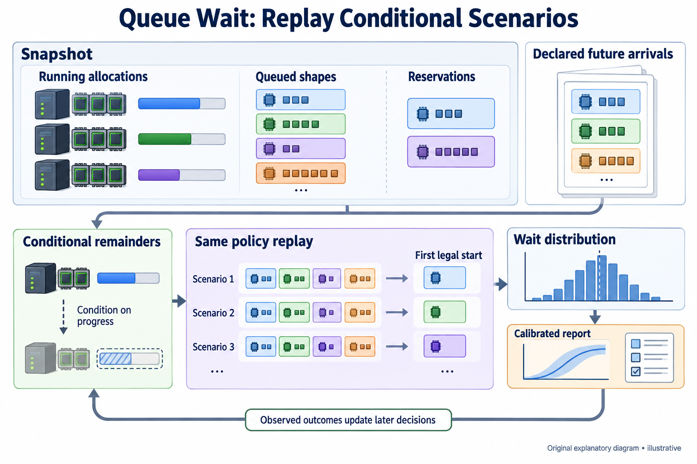
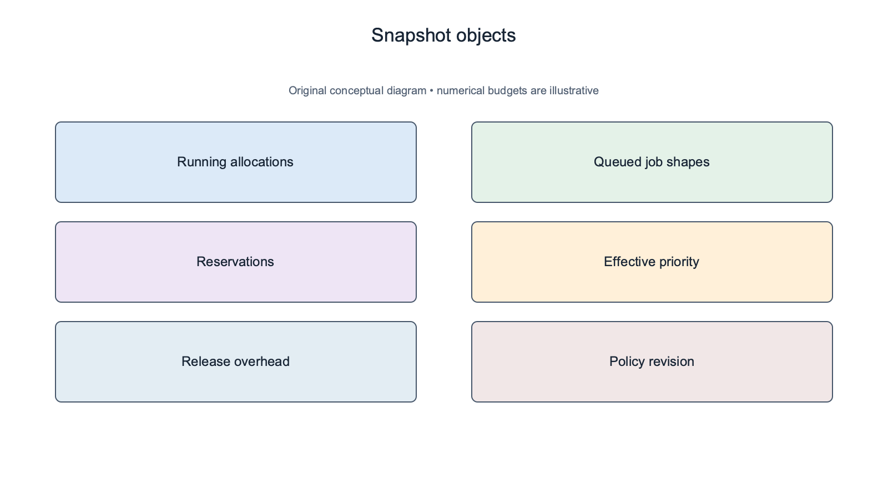
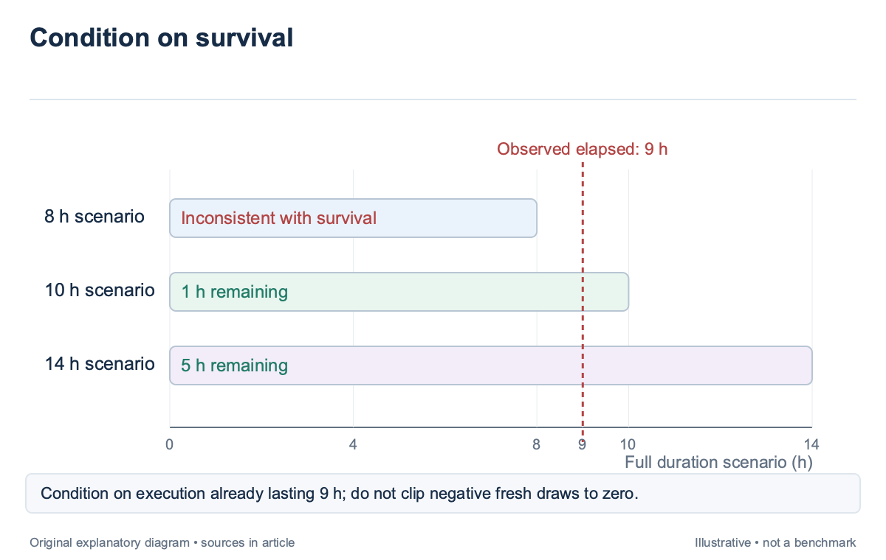
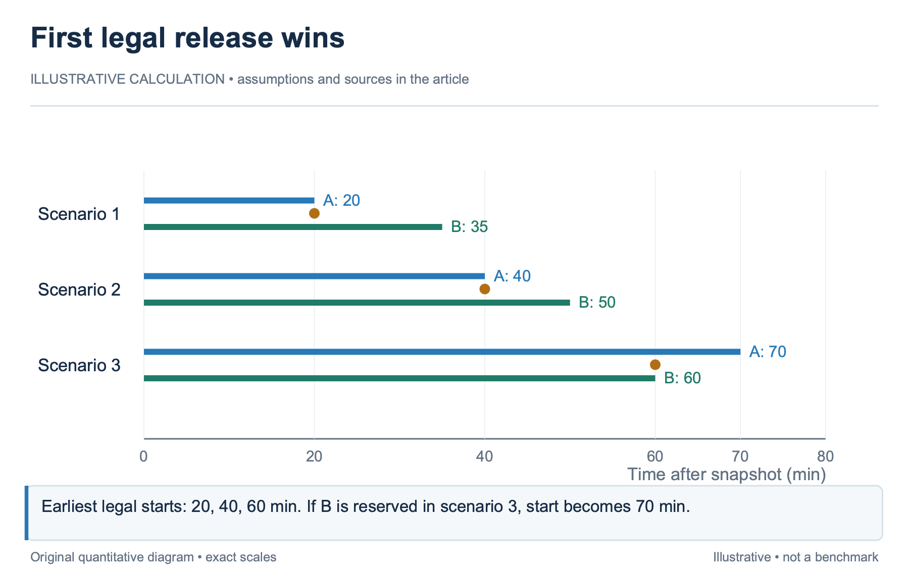
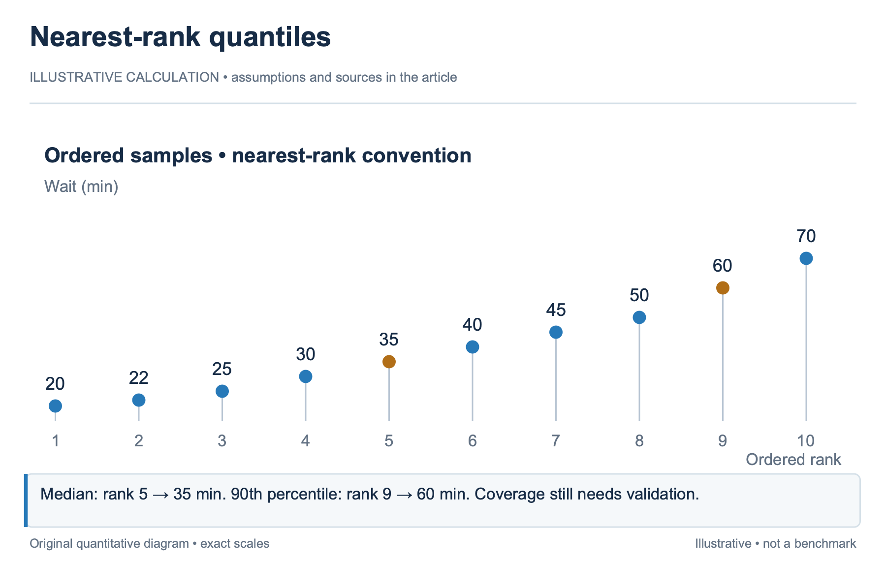
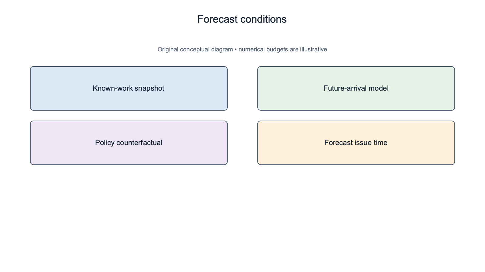

## Overview

A job’s runtime and its queue wait answer different questions; Runtime describes execution after allocation; queue wait describes when the scheduler can and will admit the job; even a perfect runtime model cannot predict a start time without the running jobs, queued demand, reservations, topology, and policy.

Queue-wait estimates should therefore describe a state-dependent distribution. A point such as “starts in 30 minutes” hides uncertainty about running-job completion, future demand, and the policy used to allocate newly released resources. An interval is useful only when its assumptions and coverage are visible.

Predicting batch queue job wait times for informed scheduling of urgent HPC workloads [\[1\]](https://arxiv.org/abs/2204.13543), published in 2022, examines queue-state features and stochastic workload scenarios. Its experiments concern HPC systems, so its fitted coefficients and accuracy do not transfer automatically to an AI cluster. This article uses the method boundary to construct an illustrative policy-replay estimator, building on the duration model in `sched-4`.

## Deep dive

### Capture the state that can change the start time

A queue snapshot should identify every allocation that blocks the incoming job; record the devices and topology occupied, estimated remaining runtime, checkpoint state, release overhead, and any reservation; for queued jobs, retain the complete workload description and effective priority. A total free-GPU count cannot distinguish 8 devices in one domain from 8 isolated devices. Priority is not necessarily submission order. Fair-share adjustments, tenant quotas, reservations, and preemption permissions can alter the next decision. The estimator should use the effective policy state seen by the scheduler, including its revision, rather than infer order from a timestamp. A wait estimate based on FIFO describes a different system when the live scheduler uses backfill or borrowing.

The 2022 HPC paper finds that queue-state information helps prediction, while uncertain job wall times limit what a snapshot can establish. Users supply limits rather than exact completion times. An AI estimator has the same distinction: a declared 12-hour cap is an administrative bound, not a measured expectation that the job will occupy devices for 12 hours. Snapshot time matters. Record when the state was captured and the events already in flight, such as an admitted job loading a checkpoint or a completed worker awaiting release. If the simulator begins from “running” while the live system is still staging state, it can predict a release earlier than the actual allocation permits.

For an illustrative 16-GPU cluster, suppose the incoming job requires one intact 8-device domain. There are 10 idle GPUs, but each of 2 8-device domains has 3 occupied devices. Aggregate availability exceeds the request; topology prevents admission. The wait estimator must follow the release events that restore a whole domain rather than return zero wait.

### Sample remaining work conditionally

A running job needs a remaining-time distribution; if a job has already run for 6 hours, sampling its full duration as though it just started can produce impossible scenarios in which it completed before the snapshot; Condition the remainder on elapsed execution, observed progress, and the current allocation. For a finite training run, progress can supply remaining steps and the latest observed step-time regime. For an opaque batch job, the estimator may use historical conditional durations. Both approaches should distinguish normal continuation from recovery after interruption. A checkpoint age changes restart work but does not automatically change the uninterrupted remainder.

Consider an illustrative job whose full-duration scenarios are 8, 10, and 14 hours. After 9 hours of execution, the 8-hour scenario is inconsistent with the observed survival. The remaining scenarios imply 1 or 5 hours left, subject to the assumed probabilities and any progress evidence. Subtracting 9 from every fresh draw and clipping negatives to zero creates a different distribution and can overweight immediate release. Uncertainty across jobs may be correlated. A storage slowdown can extend several checkpoint writes together, and a shared network fault can affect multiple allocations. Sampling every remainder independently understates some joint tails. A practical model can include common scenario variables for traffic or infrastructure conditions, while documenting which dependencies remain unmodeled.

The HPC paper generates many plausible queue states from uncertain wall times and applies its learned wait predictor to those states. A policy-replay estimator instead executes the scheduling rules on each sampled state. These are related stochastic ideas but different implementations; the article should not attribute a full GPU policy simulator to the paper’s KNN approach.

### Replay the policy on each scenario

An event-driven replay advances between arrivals, completions, checkpoint boundaries, reservation starts, and policy updates; at each event, it applies the live scheduler’s admission and placement rules to the current simulated state; the incoming job’s simulated start time becomes one sample of its wait distribution.

The simulator must reproduce the rules that carry the result. If the live allocator preserves an 8-GPU island, the replay should preserve it. If the live system allows a lower-priority backfill job only when it protects a reservation, the replay must evaluate the same condition. Approximations can be useful, but they belong in the estimate’s model description.

Take an illustrative snapshot with one domain occupied by Job A and another by Job B. A queued TP8 job can use either domain. In 3 replay scenarios, A releases in 20, 40, and 70 minutes, while B releases in 35, 50, and 60. With no earlier queued claimant, the TP8 job starts after 20, 40, and 60 minutes respectively. The last scenario uses B’s earlier release rather than A’s 70-minute completion.

Now add an earlier reservation that claims B in the last scenario; the incoming job must wait until A releases at 70 minutes; this change occurs without changing the incoming job’s runtime or the free-device count at submission. Policy and competing demand alter the start event.

Release overhead belongs in replay. A worker exiting at minute 40 may leave a reservation, communicator, or cleanup phase active until minute 43. The estimator should use the allocation-release event that the scheduler can actually act on, not the application’s final log timestamp. Otherwise short waits inherit a systematic optimistic bias.

### Report the distribution and its conditions

Summarize scenario waits with quantiles and a clear target. A median wait is different from an upper planning quantile, and neither is a deadline guarantee. The interface should state the snapshot time, policy revision, workload identity, scenario count, and whether future arrivals were included.

For an illustrative sample of 10 waits in minutes, use 20, 22, 25, 30, 35, 40, 45, 50, 60, and 70; Under the nearest-rank convention, the median is the fifth ordered value, 35 minutes, and the 90th percentile is the ninth, 60 minutes; another quantile convention may interpolate; record it so operators can reproduce the displayed values.

A scenario quantile does not automatically have calibrated real-world coverage. It summarizes the model’s sampled outcomes. Calibration compares those forecasts with actual starts over later decisions and checks whether the stated bands contain the observed waits at the intended frequency. `sched-6` develops this distinction between model uncertainty and empirical interval behavior. A job can also have a non-admission outcome. An unsupported layout, a denied quota, or a reservation that persists beyond the forecast horizon can produce no start within the simulation window. Report that outcome explicitly rather than dropping it and computing quantiles only from successful scenarios. Conditional-on-start estimates can look reassuring while hiding material non-admission probability.

The uncertainty report should identify dominant causes. For example, 2 domains may be available under most scenarios, while a small tail depends on one long pretraining job. A sensitivity analysis can show how its remainder or a reservation changes the upper wait quantile. This explanation is more useful than attaching a generic “confidence” percentage to the median.

### Decide what future arrivals mean

A snapshot-only forecast asks when the job would start under current known work and policy; it can be useful for immediate planning, but it ignores later arrivals that may gain higher priority or consume borrowed capacity; Label this assumption rather than treating the forecast as an unconditional prediction of the live cluster.

An arrival-aware forecast samples future demand from a declared model. The model should preserve workload classes, resource shapes, and burst structure where those affect admission. A Poisson arrival assumption may be a convenient baseline, yet scheduled evaluation waves or synchronized training submissions can violate it. Validate the arrival model on the cluster’s actual trace. Policy uncertainty can be represented through separate forecasts. If the operator is considering a quota change, replay the current and proposed policy on the same sampled workload scenarios. Using shared scenarios isolates the policy difference from sampling noise. The resulting comparison remains a simulation, not evidence that the proposed policy has already improved production wait. Bound the online cost. A full replay of thousands of long scenarios may be too slow for every queue refresh. Cache stable state, update forecasts after meaningful events, and report forecast age. An older estimate can remain useful if its conditions are unchanged, but the interface should not imply that it was recomputed after a new reservation arrived.

Validation should compare predictions issued at submission with actual allocation starts. Exclude information unavailable at forecast time, retain cancellations as separate outcomes, and stratify by job shape. A median error across short single-device jobs can hide poor estimates for the large topology-constrained jobs that motivated the system.

### Explain a forecast change after one release event

In the illustrative 16-GPU cluster, a TP8 job initially waits because both 8-device domains are fragmented; suppose Domain A releases its occupied ranks at minute 20 while Domain B remains blocked by a reservation; the estimator should recompute from the new snapshot: the incoming job may now be immediately feasible, provided no earlier eligible claimant takes A.

A forecast that changes from [20,60] minutes to zero wait is not necessarily unstable. The information changed. Store the release event and policy result so the interface can explain why the old interval no longer applies. Calibration should compare each issued forecast with its own target and horizon rather than treat a later refreshed forecast as proof that the earlier one was wrong. Now suppose an urgent higher-priority job arrives just before release and claims A. A snapshot-only forecast excluded that future arrival; an arrival-aware forecast may have included similar scenarios. Both can be useful, but their conditions differ. The operator should see the forecast type rather than receive one unlabeled range that silently alternates between them.

The simulator can also expose a conditional query: when would the job start if the new urgent arrival were absent? Running that counterfactual on the same scenario state isolates the policy effect. It remains a modeled explanation, not a claim that the live scheduler could have ignored the urgent job under the actual contract.

For a practical forecast report, retain the earliest resource-shape release, the queued claimant that consumed it, the protected reservation, and the dominant uncertain remainder; these concrete events make a wide band understandable; they also identify where new evidence would help: a progress update for one long run may reduce uncertainty more than doubling the number of Monte Carlo samples.

More samples reduce simulation noise around the assumed distribution; they do not repair a biased runtime or arrival model. The estimator should therefore report sampling convergence separately from empirical coverage. A numerically stable 90th percentile can still be systematically optimistic on later starts if the underlying release-time model omits cleanup.

## Conclusion

Queue wait emerges from uncertain resource-release events and the policy that consumes them. A duration predictor supplies one input; a state snapshot, topology model, and policy replay determine how that input affects admission. Scenario quantiles need calibration before they become trusted planning bands.

The next article addresses that calibration directly. It also explains drift and abstention, because a well-implemented simulator can still produce misleading intervals when its runtime distributions, arrival model, or support assumptions no longer match the cluster.

### Sources

- [\[1\]](https://arxiv.org/abs/2204.13543) Predicting batch queue job wait times for informed scheduling of urgent HPC workloads (2022)
- [\[2\]](https://slurm.schedmd.com/sched_config.html) Slurm scheduling configuration: backfill and time limits
