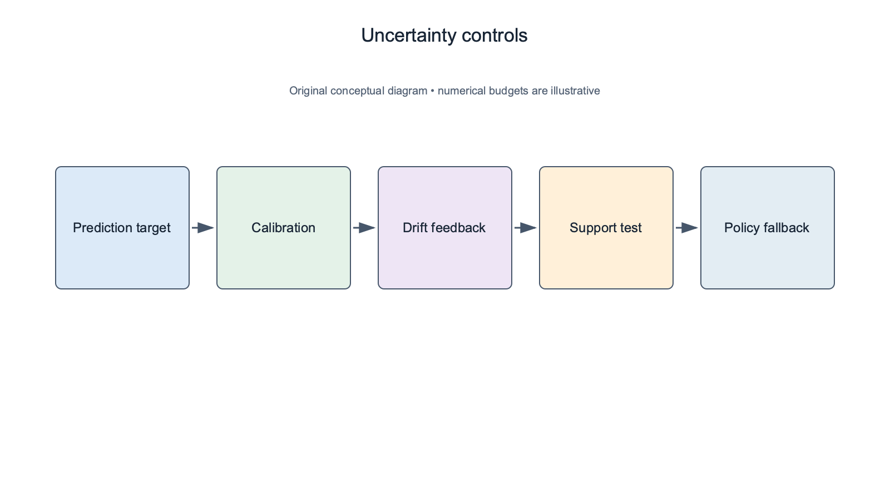
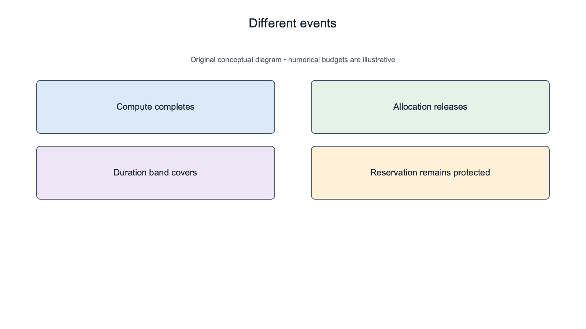
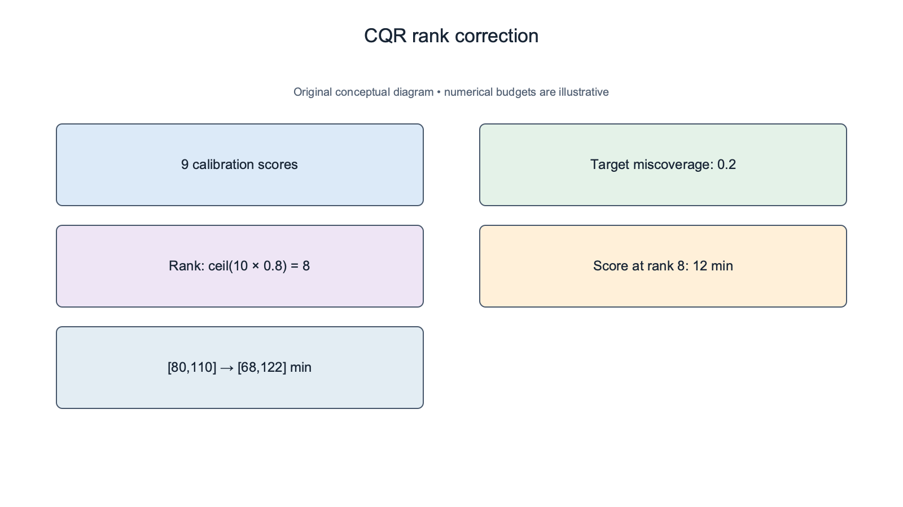
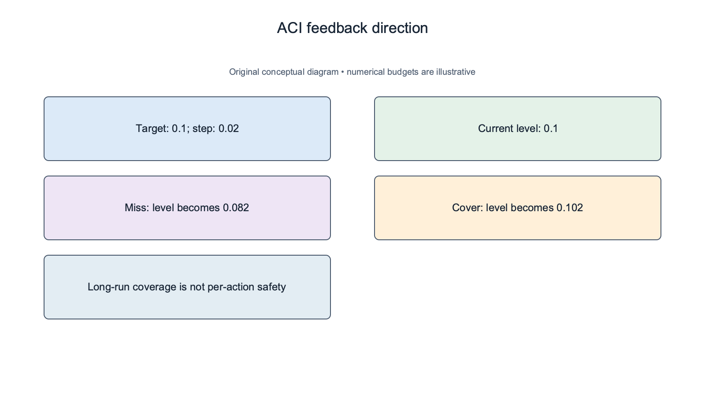
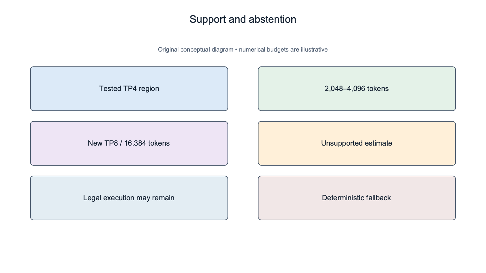

## Overview

A prediction interval should be judged by what it contains, not by how confident its label sounds; if an estimator advertises a 90% duration band, later observations should test whether roughly that fraction falls inside it under the stated conditions; the width matters too: an interval that covers everything by spanning several days may be statistically conservative and operationally useless. Calibration connects model output to observed behavior. Drift monitoring checks whether that relationship changes, while abstention identifies decisions outside the model’s supported region. These mechanisms serve different purposes. None authorizes the scheduler to violate memory, topology, or reservation constraints.

[Conformalized Quantile Regression](https://arxiv.org/abs/1905.03222), published in 2019, combines fitted quantiles with calibration residuals under exchangeability. [Adaptive Conformal Inference Under Distribution Shift](https://arxiv.org/abs/2106.00170), published in 2021, adapts the miscoverage level online and studies long-run coverage. This article applies their statistical boundaries to the duration and wait estimates in `sched-4` and `sched-5`; the numerical examples are illustrative.

## Deep dive

### Define the forecast target and error event

Calibration begins with a target. Uninterrupted training duration, elapsed completion time with failures, and queue wait are different labels. A band calibrated for one cannot be reused for another without new evidence. The target definition should identify start and end events, included overhead, and treatment of interruption.

For a duration interval [L,U], the coverage event is that observed duration lies between L and U. A reservation violation is a policy event: the allocation remains occupied after the protected boundary. The upper interval endpoint may inform reservation protection, but 90% marginal duration coverage does not imply that every protected reservation has a 10% violation probability.

The difference becomes concrete when cleanup takes time; an illustrative job completes computation at minute 38, while resources release at minute 43; a [25,40]-minute compute-duration interval covers the application outcome and still fails a reservation at minute 42. The scheduler needs the release-time target or an explicitly added cleanup budget. Retain issued forecasts rather than reconstructing them later. Store the interval, model revision, snapshot, workload features, and issue time. Calibration must compare what the system actually said with the later outcome. Recomputing a forecast after observing the result leaks information and makes the coverage statistic meaningless. Canceled and failed jobs require explicit handling. A canceled run gives a censored duration, not a normal completed duration equal to its elapsed time. A queue cancellation does not supply an observed start. Report these outcomes separately or use a statistical method designed for them; dropping them should remain a stated dataset restriction.

### Calibrate fitted quantiles with held-out residuals

Quantile regression estimates lower and upper conditional quantiles from workload features. Conformalized Quantile Regression, or CQR, then evaluates how calibration outcomes sit outside or inside those predictions. For outcome y and fitted bounds l and u, a score can be written as the larger of l−y and y−u. The calibration score uses the same unit as the target. A positive score means the outcome lies outside the fitted interval; a negative score means it lies inside with margin. An ordered calibration quantile expands the predicted bounds to account for the observed score distribution. The underlying predictor can be imperfect while the calibration wrapper supplies a marginal coverage result under its assumptions.

For an illustrative calibration with 9 scores and target miscoverage 0.2, the finite-sample rank is the ceiling of (9+1)×0.8, giving rank 8. If the eighth ordered score is 12 minutes, a new fitted interval [80,110] becomes [68,122] minutes. The arithmetic illustrates the rank correction; it does not establish coverage for a changing cluster trace. Exchangeability is load-bearing. Roughly, calibration and test examples must be interchangeable in the joint distribution for the standard split-conformal rank argument. Temporal changes in workload mix, runtime software, or infrastructure can break that condition. A random split that mixes old and new versions can conceal exactly the shift the production estimator must face.

CQR’s guarantee is marginal rather than a promise for every workload subgroup; an overall 90% band can underperform on large TP8 jobs while overcovering small evaluations; Audit coverage and width by relevant class, topology, runtime version, and scale. If subgroup calibration is introduced, retain sample counts and avoid presenting a tiny cell as a well-supported safety envelope.

### Track drift without confusing adaptation with safety

Adaptive Conformal Inference, or ACI, updates a scalar miscoverage level using observed error events. A representative update adds a step size times the difference between target miscoverage and the latest error indicator. After a miss, the level decreases, which generally widens the next interval through the calibration quantile.

For an illustrative target of 0.1, current level 0.1, and step size 0.02, a miss gives 0.1+0.02×(0.1−1)=0.082. A covered outcome instead gives 0.102. The direction is deliberate: misses push toward more conservative sets, while coverage allows a small move toward narrower ones.

The 2021 ACI paper studies long-run coverage frequency under distribution shift; That is not a per-decision safety certificate; a sequence can satisfy a long-run average after a period of concentrated misses, and an interval may become very wide during adaptation. The scheduler still needs deterministic reservation protection and a fallback when a model’s current behavior is unacceptable. Delayed labels complicate deployment. A long pretraining run may reveal its duration weeks after the forecast, while short evaluations produce quick feedback. Updating only on completed jobs can overrepresent the fast class. Track issue-time cohorts and label delay so the operator can see which forecasts have matured and which remain unresolved. Drift monitoring should inspect more than coverage. Track interval width, directional residuals, support rejection rate, and workload mix. A widening band may restore coverage while reducing usable backfill capacity. A sudden rise in abstention can signal a new runtime or layout rather than poor calibration inside the old support region.

### Abstain when configuration evidence is missing

Abstention means the estimator declines to provide a supported prediction. It does not mean the job is infeasible. A new layout can pass the capability and memory checks in `sched-3` while lacking timing evidence. Keep these states separate so an unsupported model does not become an unexplained admission denial. Define support using the features that affect performance. Device identity, runtime revision, model shape, numerical format, layout, sequence regime, and traffic conditions may all matter. A tested table can support explicit cells; interpolation can support a bounded neighborhood under a declared model. Extrapolation should remain visible.

Suppose an illustrative training model was calibrated on TP4 layouts at 2,048–4,096-token sequences. A TP8 request at 16,384 tokens leaves both the layout and sequence region. The predictor may return a mathematical value, but the scheduler should label it unsupported and apply the documented fallback rather than attach the old 90% coverage claim. A fallback can preserve the incumbent policy, require a profile, or use a conservative compact placement. For reservation-sensitive backfill, it may decline the speculative admission while allowing ordinary queued execution later. The policy should identify which decisions require supported estimates and which remain legal without them. Support thresholds also need evaluation. A feature-distance rule is a heuristic, not a proof that all nearby points behave alike. Report how often it accepts configurations that later miss badly and how often it rejects useful ones. Otherwise abstention can look rigorous while simply hiding the hardest examples from the accuracy denominator.

### Evaluate coverage, width, and decision consequences together

For an illustrative batch of 100 matured forecasts, 92 covered outcomes yield empirical coverage of 92%; That count alone does not establish that the intended 90% band is calibrated with useful precision, especially if the examples share a common outage or configuration; report counts, dependence assumptions, and the evaluation window alongside the fraction.

Width measures operational usefulness. Compare a 90% band that spans 2 hours with one that spans 12 hours for the same job class. The wider band may protect more reservations but reduce opportunities to backfill. Evaluate the resulting scheduler decisions rather than choosing the narrowest interval without checking coverage. Directional errors deserve separate counts. A lower-bound miss can indicate overprediction and wasted waiting; an upper-bound miss can cause overrun risk. CQR’s two-sided interval does not itself assign the operator’s asymmetric cost. The scheduler may use a one-sided planning bound under a separately validated target and policy. Chronological validation should preserve the deployment sequence. Train on earlier data, calibrate on a subsequent window, and test later forecasts without retroactive updates. If ACI is evaluated, apply updates only when the corresponding label would have arrived. This reproduces the online information boundary rather than borrowing future residuals.

The final report should connect statistical performance to allocation outcomes: backfill accepted, fallback used, reservation violated, and useful capacity lost to conservatism. A model can improve average coverage while worsening queue behavior. `sched-14` combines these results with GPU-hour-weighted impact and fairness.

### Audit a subgroup whose global coverage looks acceptable

Suppose an illustrative evaluation contains 80 short jobs and 20 large distributed jobs. The interval covers 78 short jobs and 12 large jobs. Overall coverage is 90/100=90%, while short-job coverage is 97.5% and large-job coverage is 60%. The global target is met in this sample, yet the class that occupies the largest domains receives poor planning evidence.

This is why marginal conformal coverage should remain labeled marginal; a standard CQR wrapper does not promise identical coverage for every feature subgroup; the operator can introduce class-specific calibration when enough data exist, but the new class sample count and its assumptions need to appear in the report rather than borrowing confidence from the full 100-job pool.

If the 20 large jobs share one runtime revision, inspect that feature before adjusting every interval. A stale operation profile can create a localized bias, while an infrastructure shift can affect several classes. The remedy should match the evidence: update the relevant model or calibration region, abstain where support is missing, and preserve the still-valid short-job profile. ACI can react after misses arrive, but label delay limits that response. If the large jobs finish much later than the short jobs, the online update stream can look well covered while their forecasts remain unresolved. Report outstanding cohorts and avoid presenting completed-only coverage as a complete picture of all forecasts issued. A useful dashboard pairs coverage with width and decision outcomes. For the large class, show upper-bound misses, reservation-sensitive decisions, fallback admissions, and the amount of capacity withheld by conservative bands. This prevents a wider interval from being called an improvement without examining the queue cost it imposes.

The audit also protects against selective abstention. If the estimator rejects half the difficult TP8 configurations, report accepted coverage and rejection rate together, then evaluate the deterministic fallback on those rejected cases. Otherwise the model can appear better simply by moving its hardest decisions outside the metric denominator.

## Conclusion

Calibration measures how prediction bands behave on later outcomes; drift adaptation changes that behavior over time; abstention protects the boundary of available evidence. Standard conformal assumptions and long-run adaptive guarantees must remain explicit when the estimates enter a scheduler.

The next placement articles use supported estimates as scored evidence while retaining deterministic constraints. A calibrated forecast can inform a decision, but the policy still decides whether its uncertainty is acceptable for topology, reservations, recovery, and tenant entitlement.

### Sources

- [Conformalized Quantile Regression (2019)](https://arxiv.org/abs/1905.03222)
- [Adaptive Conformal Inference Under Distribution Shift (2021)](https://arxiv.org/abs/2106.00170)
