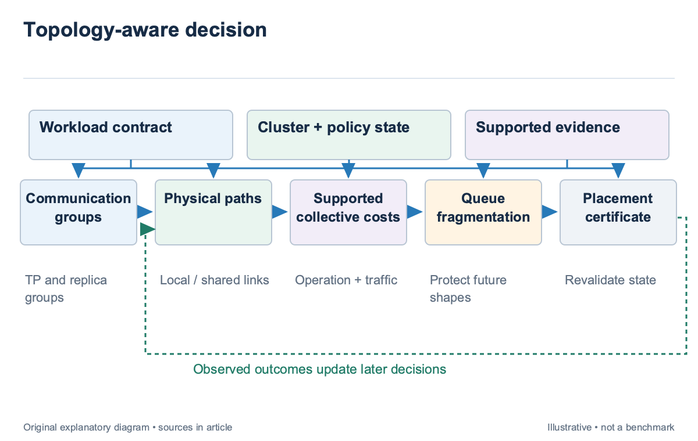
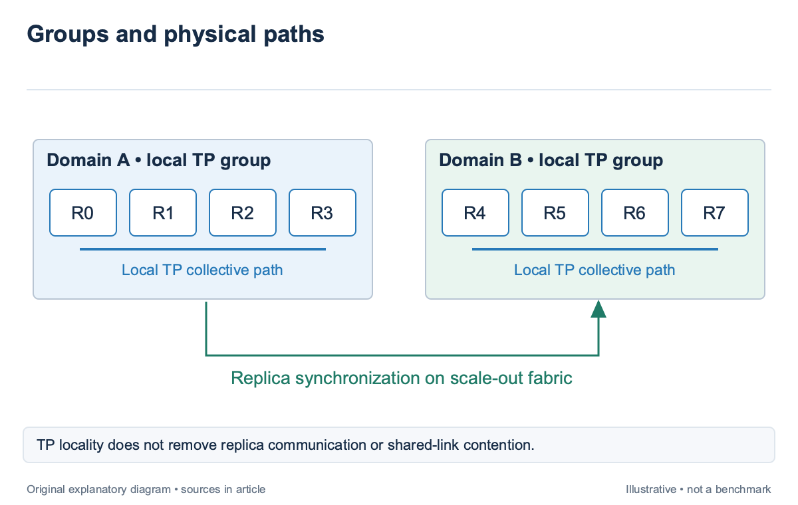
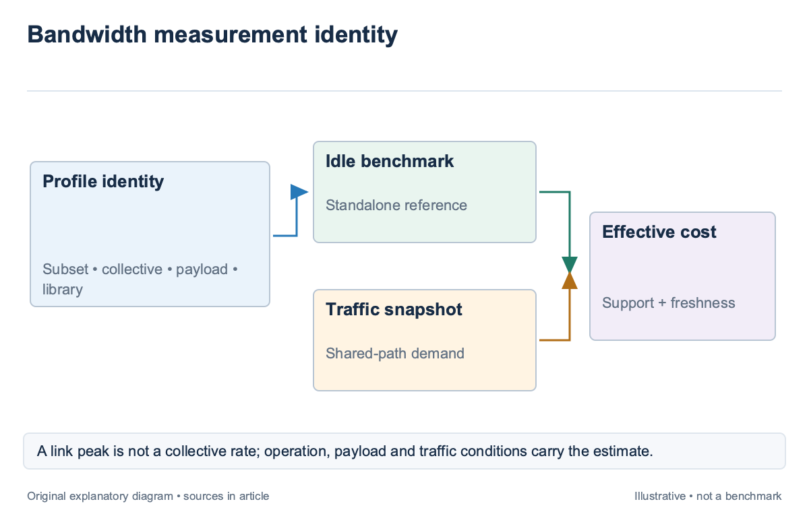
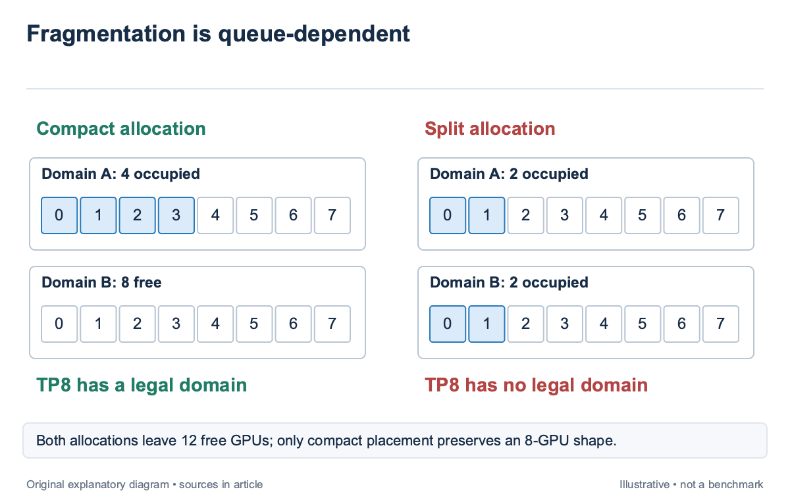

## Overview

Topology-aware placement should price the paths the workload actually uses; physical proximity is useful evidence, but it does not establish effective collective bandwidth under contention; a local GPU group can share a saturated link, while a more distant legal group can have a better available path.

The scheduler needs 2 layers. Hard topology requirements determine whether a communication group can use a candidate allocation. Supported performance estimates then compare the feasible paths, while queue state prices fragmentation and future options. This article builds on the workload groups in `sched-2` and the feasibility boundary in `sched-3`.

BandPilot [\[1\]](https://arxiv.org/abs/2506.15595), introduced in 2025, uses effective collective bandwidth as a dispatch-level objective. It combines sparse NCCL measurements with a predictor and explicitly limits its optimization to the current request. The illustrative examples here add queue consequences as a separate policy concern; they are not reported BandPilot experiments.

## Deep dive

### Map communication groups to the physical graph

Represent the cluster as devices, local interconnect domains, network endpoints, and shared links; map each workload communication group onto that graph; a device count identifies allocation size; group membership identifies which ranks must exchange data repeatedly and which physical resources their traffic can share.

For an illustrative TP4×DP2 job, place each four-rank tensor-parallel group inside one supported 4-device domain. The 2 data-parallel replicas still synchronize across domains. A placement that satisfies the TP requirement can therefore have a poor DP path. The scheduler should retain both mappings rather than collapse the allocation into “same rack.” Different operations expose different bottlenecks. All-reduce, all-gather, reduce-scatter, and all-to-all have distinct data movement and synchronization patterns. The existing [collective-mechanics article](/blog/collectives-ring-tree-reduce-scatter-all-gather/) explains those operations. A placement model should identify which operation and payload regime its bandwidth proxy measures.

A shared-link model prevents double-counting capacity. If 2 communication groups traverse the same uplink, their nominal endpoint rates cannot both be treated as independently available. The allocator can use measured contention profiles or a network model, but it should identify the shared resource that limits the combined demand.

Topology constraints should be explicit; a requirement that a TP4 group remain inside one fast domain is different from a preference to reduce rack distance; the former rejects candidates; the latter contributes to a score. Mixing them can admit a layout the runtime cannot use acceptably while claiming that a favorable distance metric compensated for it.

### Measure the relevant collective rather than a link peak

BandPilot [\[1\]](https://arxiv.org/abs/2506.15595) defines standalone bandwidth for a GPU subset under an idle cluster and effective bandwidth under a traffic profile. It obtains standalone measurements with NCCL benchmarks. The distinction matters because the same subset can deliver less bandwidth when active jobs consume shared network capacity.

A measurement record should include GPU subset, collective, payload size, runtime and library versions, concurrency, topology, and traffic conditions. A link specification is not a collective benchmark. Endpoint bandwidth can exceed the rate realized by an operation whose algorithm, synchronization, or shared path limits progress.

For an illustrative transfer-equivalent payload of 8 GiB, a supported effective rate of 40 GiB/s implies 0.2 seconds under a simple payload-over-rate model; at 20 GiB/s, it implies 0.4 seconds; this arithmetic omits algorithmic latency and overlap; it demonstrates how a contention-adjusted rate changes a cost, not how every collective’s runtime should be calculated.

The operation’s frequency determines its job impact. An extra 0.2 seconds once per checkpoint differs from the same delay on every training step. Record the number and placement of operations in the execution graph. `sched-4` explains why only exposed communication on the critical path determines step completion. Measurement freshness also matters. A profile gathered on an idle fabric can remain a useful standalone reference while becoming an optimistic online estimate. The scheduler should show the traffic evidence used to adjust it and abstain when the observed contention leaves the predictor’s support region.

### Use sparse profiles without hiding uncertainty

Exhaustively benchmarking every GPU subset under every traffic state is infeasible at cluster scale. BandPilot [\[1\]](https://arxiv.org/abs/2506.15595) uses sparse measurements and a surrogate to estimate candidate bandwidth. That approach saves profiling effort, but the estimate should retain its provenance and support conditions when it reaches the scheduler.

A measured subset, a supported interpolation, and an untested extrapolation are different evidence states; if an illustrative table contains 2 tested 4-GPU domains, predicting an unseen cross-domain subset requires assumptions about the path and operation; the predictor may be useful, yet its uncertainty should not disappear merely because the output has units of GiB/s. Calibration should use later measurements from the configurations the dispatcher actually considers. Audit error by operation, subset shape, and traffic regime. A low average error can hide the contended configurations that carry the placement decision. Track underprediction and overprediction of cost separately if their operational consequences differ. The allocator should document its fallback. When bandwidth support is missing, it may choose a tested compact subset, preserve the incumbent policy, or request a profile offline. Giving an unsupported candidate the same confidence as a measured one rewards missing evidence and makes later failures difficult to explain.

Profiling itself consumes resources. Bound online probes and account for their interference with active tenants. A scheduler that improves placement through aggressive benchmarks can impose a cost outside its reported job runtime. The evaluation should include that cost and the latency spent selecting a subset.

### Price fragmentation separately from current-request speed

BandPilot’s stated optimization selects a subset for the current request under the current available devices and traffic state. It does not optimize unknown future arrivals or long-term fragmentation. A broader cluster scheduler can use its bandwidth estimate while adding a separate queue-aware objective.

Consider an illustrative cluster with 2 intact 8-device islands; a 4-GPU job can use 4 devices inside one island, leaving the other intact, or split across both; the split may have a favorable current measurement, yet it can prevent an incoming TP8 job from using either island. Aggregate free capacity remains 12 devices while the larger job loses its legal shape.

A fragmentation metric should describe the demand it protects. Counting free contiguous devices is useful only relative to supported job shapes. An intact 8-device domain matters to a TP8 job; it may offer little special value to 8 independent experiments. Queue-aware fragmentation therefore combines physical topology with workload classes and reservations.

Use an illustrative cost in a common decision scale. Suppose compact placement predicts 10 hours and preserves a reserved island, while split placement predicts 9.8 hours and incurs a declared 0.5-hour equivalent fragmentation penalty. The costs are 10 and 10.3. Compact placement wins under that policy, even though its isolated runtime is slower. The penalty is a policy choice, not a measured time unless a validated queue model derives it. Record the weight, protected demand, and sensitivity. If the queue changes, the same placement can receive a different fragmentation cost. The decision certificate should make that dependency visible.

### Revalidate topology and traffic at commitment

A placement score uses a snapshot; before commitment, recheck that the devices, links, and reservations used by the candidate remain available; another allocation may change traffic or consume a required domain between filtering and launch. A valid prediction on the old state cannot authorize an allocation on the new state.

Commit the distributed group as one allocation unit. Partial admission can strand ranks and hold devices while the remaining workers wait. Record the expected communicator membership, launch condition, and timeout release policy. This is coordinated resource allocation rather than an engine-level collective implementation.

After launch, compare observed communication and step time with the estimate. A bandwidth proxy may improve while application runtime does not, because compute or another communication group dominates. BandPilot [\[1\]](https://arxiv.org/abs/2506.15595) explicitly optimizes collective bandwidth rather than application-level step time; an end-to-end scheduler evaluation should preserve that distinction.

The observation record should include co-tenants and traffic regime; without that context, a slow collective can be attributed incorrectly to the selected GPU subset; a later predictor trained on the incomplete record may learn that a good topology is inherently slow when the real cause was transient shared-link contention.

Evaluate placement on a common workload trace against the incumbent policy. Report useful work, queue delay, fragmentation-induced admission failures, and profiling overhead. A current-request bandwidth gain alone cannot establish a cluster-level improvement if it delays larger jobs or creates more preemption later.

### Compare a bandwidth proxy with observed job progress

For an illustrative placement audit, Candidate A has a supported collective bandwidth of 40 GiB/s and Candidate B 50 GiB/s for the profiled operation. The proxy improves by 25%. If communication occupies only 20% of the exposed step time, however, a simple model that speeds only that component gives a new normalized time of 0.8+0.2/1.25=0.96.

The resulting end-to-end saving is 4%, under the stated component and overlap assumptions; this is not a benchmark or a general speedup law for every collective; it demonstrates why BandPilot's dispatch-level bandwidth objective should not be relabeled as an application-level runtime improvement without a dependency model and later measurement.

Now add a queued TP8 reservation that only Candidate B would fragment. A 4% modeled saving for the current job may be outweighed by the protected start. The scheduler should retain the supported bandwidth gain and the separate policy exclusion, so the rejected candidate does not appear to have failed a measurement it actually passed. The after-launch record can compare collective duration, exposed communication, step time, and co-tenant traffic. If bandwidth improves but step time does not, inspect the critical path before discarding the profile. Another collective or compute segment may dominate. If both degrade, inspect traffic support and snapshot freshness before blaming physical distance. A subset predictor also needs operation-specific validation. An all-reduce profile does not automatically price all-to-all, and a small-payload measurement can misrepresent a larger transfer regime. Retain those dimensions in the tested cell identity. The allocator can use several profiles when the workload has several load-bearing groups.

Finally, evaluate fragmentation over the full trace. Count how often an allocation leaves legal shapes for later jobs, how often those shapes are actually demanded, and how much waiting the preservation rule imposes on the current request. A queue-aware penalty is useful only when its protected demand and cost are explicit; preserving every large island indefinitely can create idle capacity without a corresponding workload benefit.

A placement profile should distinguish endpoint saturation from shared-path saturation; In the illustrative TP4×DP2 allocation, each local TP group can pass its standalone test while replica synchronization competes on one uplink; inspect both operation traces and the shared-link state before assigning the slowdown to a device subset. The scheduler can preserve a good local mapping and choose another replica path if the runtime and topology support it. The observation also needs a time window. A short idle measurement before launch can miss a co-tenant checkpoint that begins during training. Retain traffic state at prediction and during execution, then compare the supported regimes rather than treating every later sample as evidence for the original snapshot. A mismatch can justify abstention or a profile revision without invalidating the physical feasibility certificate.

## Conclusion

Topology-aware placement maps communication groups onto physical paths, distinguishes hard requirements from performance preferences, and uses collective measurements with their traffic and software conditions intact. Sparse predictors can make the search practical, provided their support and fallback remain visible.

The next article broadens the comparison to heterogeneous devices and power limits. A favorable network path is one feature of a feasible configuration; memory, runtime support, workload mix, cost, and uncertainty still determine which allocation serves the cluster’s objective.

### Sources

- [\[1\]](https://arxiv.org/abs/2506.15595) BandPilot: Toward Performance- and Contention-Aware GPU Dispatching in AI Clusters (2025)
- [\[2\]](https://arxiv.org/abs/2512.19606) RAPID-LLM: Resilience-Aware Performance analysis of Infrastructure for Distributed LLM Training and Inference (2025 preprint; revised 2026)
