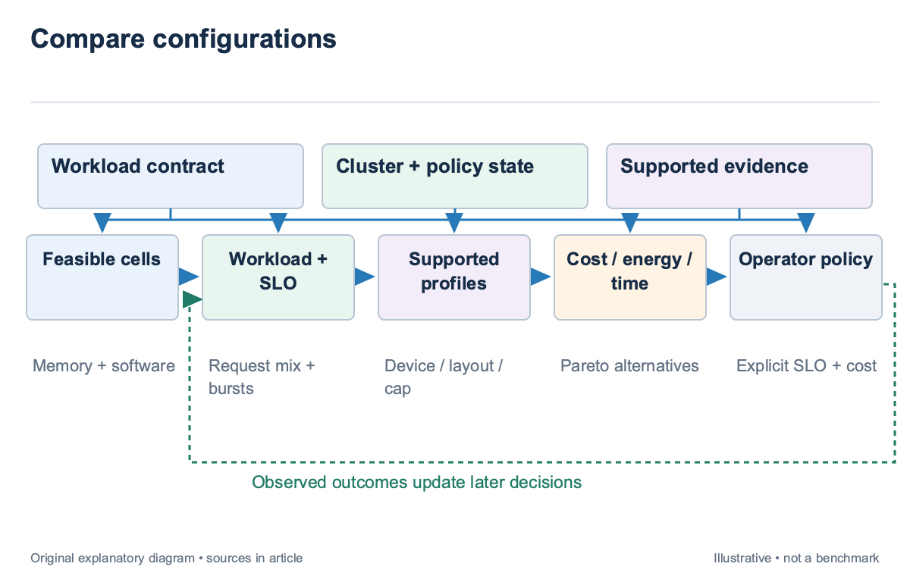
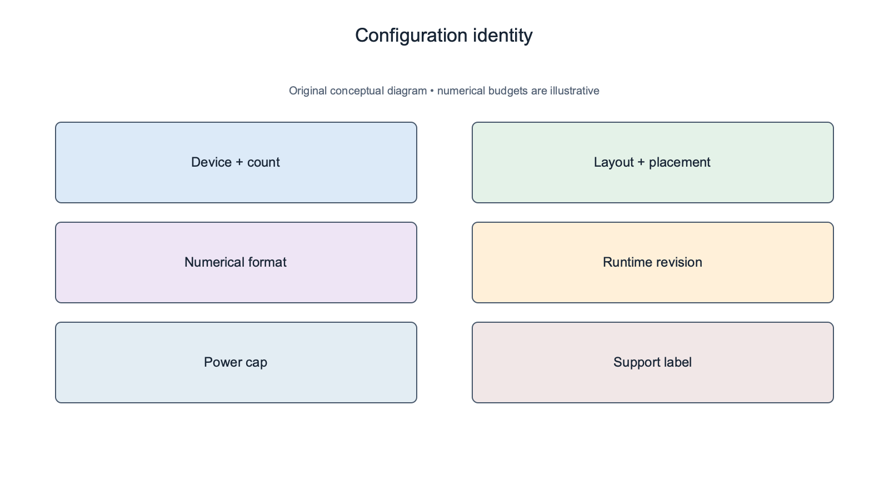
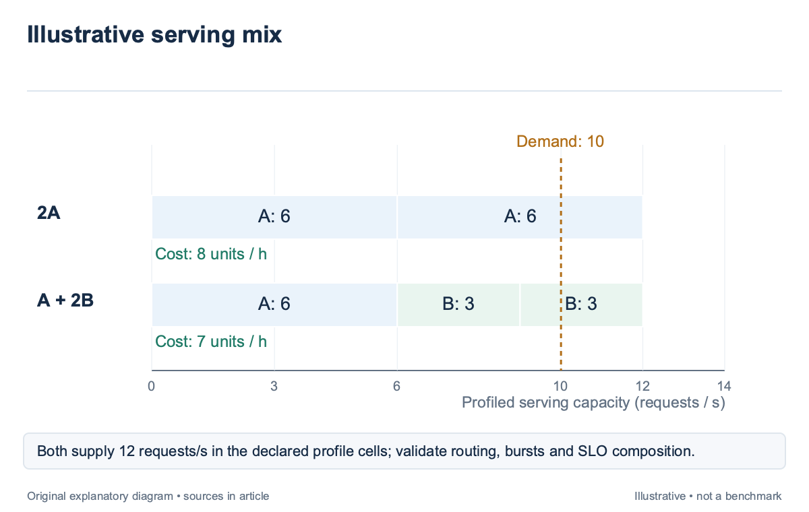
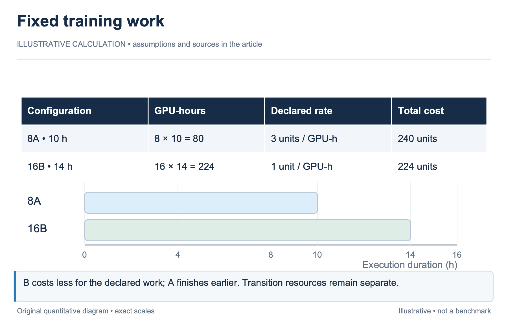
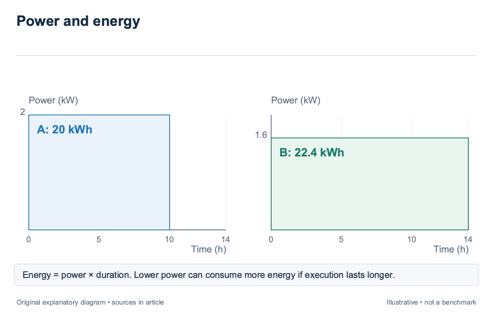
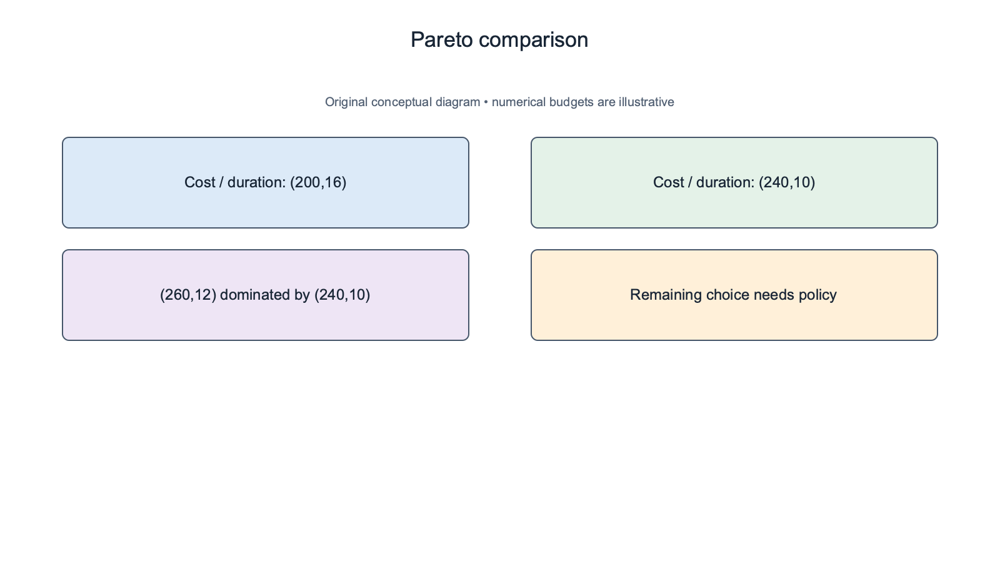

## Overview

A heterogeneous allocator should compare configurations rather than assign every GPU type a universal rank; memory capacity, kernel support, communication, workload shape, and power state can change which device is useful; the most expensive device is not automatically the cheapest way to meet a service objective.

For serving, request sizes, arrival rate, and latency targets affect the capacity needed. For training, layout and remaining work affect duration and transition cost. These workloads can share a cluster while requiring different performance models and different units of useful output.

Mélange [\[1\]](https://arxiv.org/abs/2404.14527), published in 2024, formulates heterogeneous serving allocation as cost-aware bin packing. Its workload dimensions include request size, request rate, and SLO. This article develops the allocator interface around that idea and the feasibility checks in `sched-3`. All Device A and Device B numbers below are illustrative profiles, not product specifications or measured vendor comparisons.

## Deep dive

### Enumerate feasible configurations before comparing value

A configuration includes device type, count, placement, layout, numerical format, runtime revision, and power cap; changing any of these can alter executable support, peak memory, and performance; a table indexed only by GPU name hides the conditions needed to interpret its values.

Apply the hard checks first. A device with favorable nominal throughput is irrelevant if the model cannot fit or the runtime lacks a required kernel. A mixed-device group also needs compatible communication and checkpoint handling. The supported configuration set is therefore the output of feasibility, not the complete inventory of physically idle accelerators.

For an illustrative service, Device A can hold one model replica with the required cache envelope, while Device B requires 2-way tensor parallelism. Compare one A replica with a two-B configuration. Comparing one A device with one B device would price an infeasible alternative and could make the smaller device look artificially cheap. Power cap belongs in the configuration identity. A profile measured at one cap cannot be assigned to another without evidence. The cap can change clocks, execution time, and energy, while memory and communication may limit the workload differently. A lower cap can save power without proportionally reducing throughput, but that relationship must be measured for the relevant workload. The allocator should retain support labels. A tested cell can supply a calibrated capacity estimate; an analytical or interpolated cell can support exploration under declared assumptions. Unsupported cells remain visible but should not inherit the confidence of a neighboring profile simply because the device family is similar.

### Match serving capacity to request mix and latency

Serving capacity should be measured under the demand profile and SLO; a maximum token rate without latency conditions does not show how many requests the configuration can serve acceptably; Prompt and output distributions, batching, routing, and cache state all affect the operational envelope.

Mélange [\[1\]](https://arxiv.org/abs/2404.14527) treats workload slices as items and GPU capacities as bins under service constraints. This makes heterogeneity useful: different slices can have different cost-efficient devices. The formulation concerns serving, so it does not establish a training allocation rule or a universal device ordering.

Suppose an illustrative measured profile says one A configuration supports 6 requests per second under the required latency target, while one B configuration supports 3. If demand is 10 requests per second, 2 A configurations supply 12 units of profiled capacity. One A plus 2 B also supplies 12. Both are candidates, subject to routing, burst margin, and whether the profiles compose under shared resources.

At illustrative hourly costs of 4 for A and 1.5 for B, the homogeneous A allocation costs 8 per hour, while the mixed allocation costs 7; this arithmetic compares declared profile cells; it does not prove equal tail latency under real routing, because dividing demand changes batch formation and can expose a shared network or storage bottleneck. Validate the combined allocation at the offered load. A capacity profile may be nonlinear near saturation, and tail latency can degrade before mean throughput stops increasing. The allocator should preserve headroom according to a documented policy and report whether the chosen mix was measured jointly or assembled from independent profiles.

### Compare training duration and transition costs

Training allocation holds the intended work constant and compares feasible execution alternatives. Record model, sequence regime, global batch, optimizer semantics, remaining progress, and supported layouts. Device count alone cannot define equivalence when one alternative changes the experiment.

For an illustrative fixed workload, 8 A devices predict 10 hours and cost 3 per device-hour. The allocation cost is 8×10×3=240. Sixteen B devices predict 14 hours at 1 per device-hour, giving 224. B is cheaper in this simplified accounting, while A finishes 4 hours earlier. A deadline or queue objective can change the preferred choice.

Include transition cost when the job is already running; if moving to B requires a 2-hour checkpoint conversion and reload, its elapsed completion time becomes 16 hours; Charge the actual resources used during conversion and loading rather than multiplying every transition hour by the final GPU count without evidence.

Runtime uncertainty can reverse the nominal ranking. A supported A interval of 9–11 hours and a B interval of 11–20 hours tell a different planning story from the point values. The allocator should state whether it optimizes expected cost, an upper completion bound, or an ordered policy that protects deadlines before minimizing spend.

A mixed training allocation also needs a layout-specific model. Synchronous ranks can wait for slower peers, while pipeline stages can be balanced differently. `sched-9` examines these boundaries. Treating a heterogeneous group as the sum of independent device throughputs ignores the synchronization that determines useful progress.

### Price energy with explicit measurement scope

Energy is power integrated over execution time; a device power cap is not the same as average device power, and device energy is not the same as server or rack energy; state the measurement scope before comparing configurations. Otherwise a board-only number can be mixed with a whole-node measurement and appear more efficient for accounting reasons.

For an illustrative configuration averaging 2 kW over 10 hours, energy is 20 kWh. A lower-power alternative averaging 1.6 kW over 14 hours uses 22.4 kWh. The second draws less instantaneous power but uses more energy for the fixed workload. This example assumes equal work and constant average power. Power constraints can still favor the lower draw. A cluster with a hard facility limit may value peak reduction even if total energy rises. Cost, completion time, energy, and power headroom are separate objectives. The allocator should state their ordering or weights rather than describe one configuration as simply “more efficient.” Serving needs a useful-output denominator that respects latency. Tokens generated after missing the required SLO may not count as acceptable service under the operator’s definition. Training should use completed intended work or a specified goodput measure. The existing [energy article](/blog/energy-useful-token-power-clocks-slos/) explains why utilization alone is an inadequate denominator.

A power-aware profile should include cap, observed power scope, workload regime, and runtime version. When the cap changes, revalidate both performance and the energy calculation. A simple frequency scaling assumption may be useful for an illustrative model, but it should not be presented as measured behavior for every operator.

### Retain a Pareto set and explain the final policy

A Pareto set contains configurations for which no other candidate is better on every selected objective; it helps separate the measured tradeoff from the operator’s preference; the scheduler can first remove dominated candidates, then apply deadline, entitlement, power, and cost policy to the survivors.

Consider 3 illustrative candidates with cost and duration pairs (200,16), (240,10), and (260,12). The third is dominated by the second, which is both cheaper and faster. The first and second remain: one is cheaper, one finishes sooner. A policy decision is still needed to choose between them. Uncertainty should remain attached to that comparison. Nominal dominance can disappear when intervals overlap or profiles have different support. Avoid deleting a candidate solely because an unsupported point prediction makes it look dominated. The decision record should identify whether the comparison used measured centers, calibrated bounds, or an analytical exploration model.

Queue consequences belong in the final policy. A configuration that consumes the only large-memory domain can block another job, while a cheaper small-device allocation may preserve it. This opportunity cost is separate from the current workload’s hourly price. `sched-7` supplies topology-aware fragmentation, and `sched-12` supplies entitlement and borrowing constraints. After deployment, evaluate the chosen mix under actual routing or training progress. Retain rejected alternatives and score terms so an operator can ask whether the allocation missed its objective because the profile drifted, the workload changed, or the policy weight was inappropriate. The allocator should produce a reproducible decision rather than an unexplained device recommendation.

### Inspect a heterogeneous allocation's robustness

Take the illustrative serving mix with one A and 2 B configurations, total profiled capacity 12 requests per second, and demand 10; the nominal headroom is 2 requests per second, or 20% of offered demand; if one B configuration becomes unavailable, remaining profiled capacity falls to 9 and no longer meets the declared load under the same assumptions. A robustness policy can reserve another configuration, lower admitted demand, or accept a degraded mode under a separately stated service contract. These choices have different cost and latency consequences. The allocator should not describe the nominal minimum-cost mix as fault-tolerant unless the failure scenario was included in its constraints. Mélange's cost-aware formulation provides a serving allocation mechanism, while local availability and routing requirements expand the operator's problem. Preserve that distinction. Adding a spare is a policy or formulation change, not evidence that the original paper measured the new service behavior.

For training, inspect the analogous failure path. The illustrative 16-B allocation is cheaper at its point estimate, but a restart can change both elapsed time and occupied device-hours. A cost comparison should state whether it describes uninterrupted execution, expected failure-adjusted cost, or an upper planning bound. Those targets cannot share one unlabeled value. A power limit can also invalidate simultaneous profiles. If independent configurations were measured at caps whose sum exceeds the facility budget, their combined capacity is not feasible at those settings. Re-enumerate supported power-state cells or restrict concurrency before adding throughput. Physical inventory does not create the missing power envelope. The final comparison should therefore show the workload, supported capacity or duration, nominal cost, energy scope, failure assumptions, and shared-resource limits. Keeping this table small and explicit makes heterogeneity a reproducible configuration decision rather than a collection of device names arranged by an unexplained score.

Profile composition deserves its own validation case. In the illustrative mixed service, the 6-request A profile and each 3-request B profile were defined under one workload mix. Routing all long prompts to A changes its mix, while B receives another distribution. Recompute or measure those resolved profiles before adding their capacities. The original 12-request total does not automatically survive a routing policy that changes the item distribution in every bin. Record the load-balancer revision with the allocation. A routing update can improve one pool while creating a tail in another, even when average cluster token rate remains stable. The allocator's after-launch check should inspect per-pool SLO attainment and offered demand, then distinguish a capacity-model error from demand that no longer matches the admitted description.

## Conclusion

Heterogeneous allocation compares feasible, supported configuration cells under an explicit workload and objective; Serving requires request mix and latency conditions; training requires constant work, layout, remaining progress, and transition accounting; Power, energy, cost, and completion time should remain separate quantities.

The next article chooses layout together with placement. That step is necessary whenever device heterogeneity changes synchronization, stage balance, memory partitioning, or the communication path that turns nominal hardware capacity into useful job progress.

### Sources

- [\[1\]](https://arxiv.org/abs/2404.14527) Mélange: Cost Efficient Large Language Model Serving by Exploiting GPU Heterogeneity (2024)
- [\[2\]](https://arxiv.org/abs/2512.19606) RAPID-LLM: Resilience-Aware Performance analysis of Infrastructure for Distributed LLM Training and Inference (2025 preprint; revised 2026)
