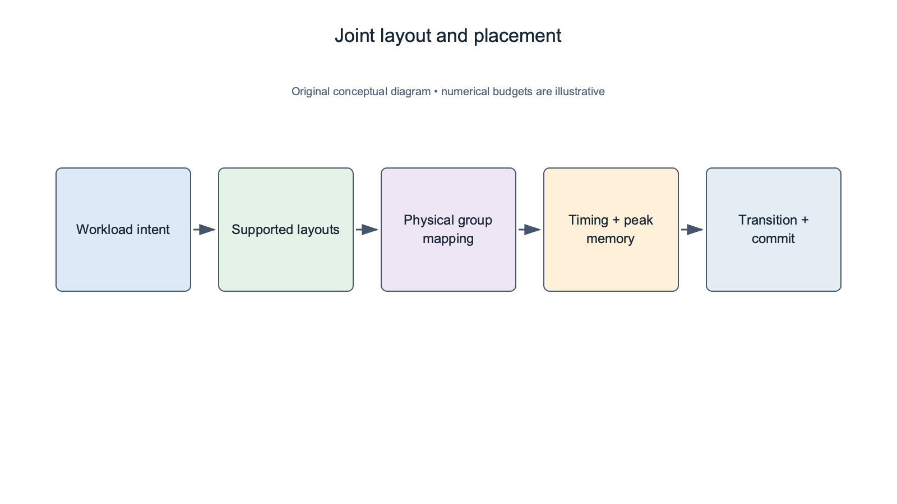
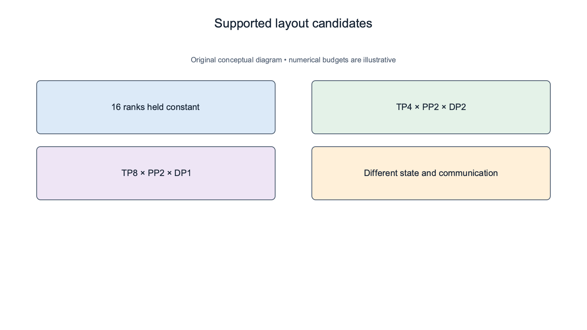
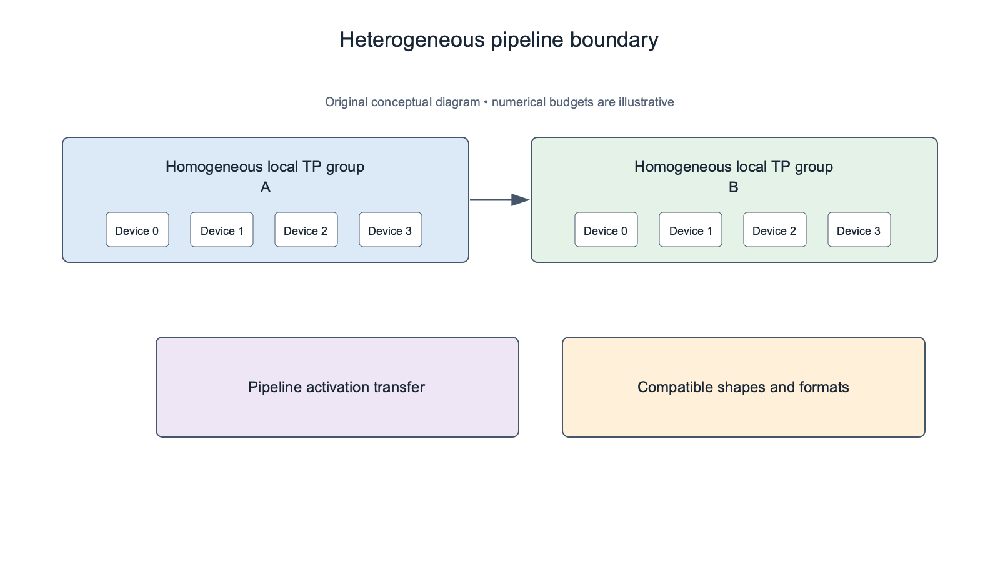
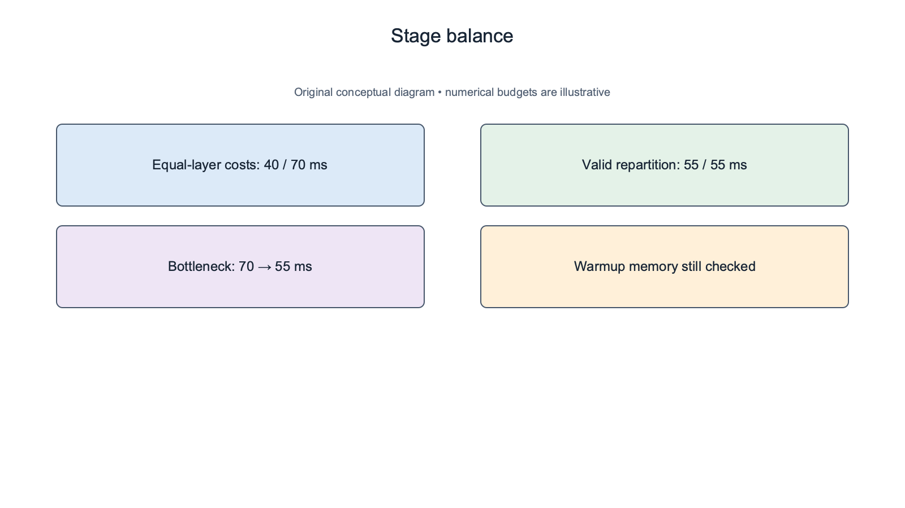
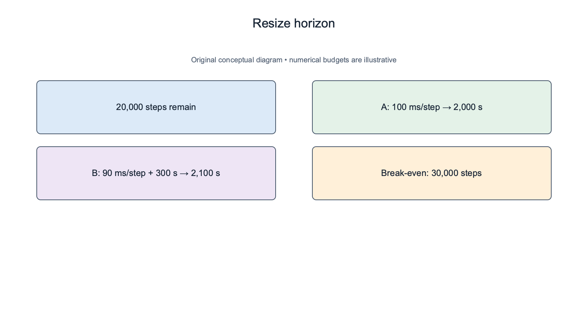

## Overview

Parallelism layout and physical placement should be chosen together; tensor, pipeline, data, and expert parallelism change memory partitioning and communication; the physical allocation determines which paths carry that communication and which devices synchronize. Choosing one while freezing the other can exclude the best legal configuration or admit a poor one.

Heterogeneous clusters make this coupling visible. In the illustrated 16-rank job, a synchronous group can wait for its slowest member, while pipeline stages can assign different amounts of work to different device groups. A slower network boundary may be acceptable between stages and expensive inside a frequently communicating tensor-parallel group.

[Harp](https://arxiv.org/abs/2509.24859), introduced in 2025, confines intra-operator parallelism to homogeneous subclusters and searches finer-grained inter-operator plans. This article uses that design boundary alongside [RAPID-LLM](https://arxiv.org/abs/2512.19606) to explain joint layout and placement. The examples are illustrative stage budgets, not measurements of either system.

## Deep dive

### Enumerate layouts that preserve workload intent

Start with the workload contract from `sched-2`; record global batch, sequence regime, optimizer semantics, numerical format, remaining work, and the layouts the runtime supports; a layout search may alter partitioning while preserving those conditions. A change that alters the experiment requires separate authorization in the workload description. Tensor parallelism partitions layer operations across ranks. Pipeline parallelism assigns layers or operator groups to stages. Data parallelism replicates work and synchronizes state. Expert parallelism routes activations to distributed experts. These dimensions can overlap or share axes in runtime-specific ways, so the scheduler should consume an authoritative layout description rather than assume that every dimension always multiplies independently.

For an illustrative 16-rank job without EP, supported candidates might include TP4×PP2×DP2 and TP8×PP2×DP1. Both reserve 16 ranks. Their memory, collective frequency, pipeline schedule, and replica synchronization differ. Equal device count does not make them equal workload executions from the allocator’s perspective.

For the illustrative 16-rank job, prune unsupported layouts before performance search. Apply per-rank memory, kernel capability, checkpoint compatibility, and communicator checks from `sched-3`. A mathematically valid factorization can be unavailable in the runtime. The search should retain rejection reasons so the operator can distinguish a software restriction from a physical capacity limitation.

For the illustrated PP2 job, the candidate identity should include stage partitioning and microbatch schedule; two PP2 layouts can assign different layer sets to the stages and expose different activation peaks; a coarse label such as “pipeline parallel” is insufficient for predicting duration or recovering a checkpoint after migration.

### Place tightly synchronized groups deliberately

A tensor-parallel group repeatedly exchanges intermediate results within layers. Mixing devices with different compute rates can create synchronized waiting, while crossing a slow network can expose communication on the step’s critical path. A homogeneous local group is therefore a useful candidate, although its benefit still depends on the actual operator and collective profile.

Harp avoids slow cross-cluster intra-operator collectives by keeping those groups inside homogeneous subclusters and introducing heterogeneity at the inter-operator level. Its planner searches stage assignments at finer granularity to recover balance. This is a research strategy with its own supported execution model, not proof that every mixed-device training system should use the same restriction.

For an illustrative 2-stage pipeline, Stage A uses a faster 4-device group and Stage B a slower 4-device group; assigning half the layers to each can leave B as the bottleneck; a finer partition may assign more work to A and less to B, subject to memory and the runtime’s valid partition boundaries. Pipeline placement still needs compatible transfers. The stages must agree on activation shapes, numerical representation, and schedule. Crossing device classes or software stacks does not remove these requirements. A runtime-supported boundary is an executable capability, while a favorable latency prediction is merely performance evidence. Data-parallel placement introduces another path. Replicas synchronize gradients or sharded state according to the runtime. Keeping TP groups local does not eliminate scale-out communication. The joint model should retain every communication group and avoid pricing only the most visible pipeline boundary.

### Balance stages using the bottleneck and memory

A pipeline’s steady-state progress is constrained by its slowest stage under the selected schedule. Stage balance should therefore use supported execution costs rather than layer count alone. Layers can have different operator shapes, and different devices can execute those shapes at different relative rates.

Suppose an illustrative equal-layer partition gives stage times of 40 and 70 ms. The bottleneck is 70 ms. Moving a valid operator group from the slower stage to the faster one yields 55 and 55 ms. Under a simplified fully filled pipeline model, the steady-state bottleneck falls by 15 ms, or about 21.4% of the original 70 ms. That comparison excludes warmup, drain, communication, and memory effects. More microbatches can improve pipeline occupancy while increasing live activations. The candidate must remain feasible under the actual schedule. A balanced stage-time table is not enough if one stage exceeds memory during warmup. The existing [tensor and pipeline article](/blog/tensor-pipeline-parallelism-partitions-bubbles/) explains bubbles and partition mechanics. The cluster scheduler consumes a layout profile that includes those costs. It should not assume an ideal filled pipeline when a short job has too few microbatches to reach the steady-state regime.

Harp’s fine-grained planning addresses the search-space restriction created by homogeneous intra-operator groups; its method also has planning overhead; the scheduler should account for search latency and profiling requirements when deciding whether to optimize a long run online or reuse a validated plan for a short job.

### Evaluate network and transition costs jointly

A layout change alters communication and may require state redistribution. Price the new execution graph, the physical paths, and the transition separately. A steady-state improvement can lose when little work remains or when checkpoint conversion occupies scarce resources for a long interval.

For an illustrative workload with 20,000 steps left, Layout A takes 100 ms per step. Layout B takes 90 ms but requires 5 minutes to transition. A’s remaining execution is 2,000 seconds; B’s is 1,800+300=2,100 seconds. The faster layout loses by 100 seconds under these assumptions.

The break-even horizon is 300 seconds divided by 0.01 seconds saved per step, or 30,000 steps; if the job has more work remaining, B can become attractive; add uncertainty and repeated changes before using that threshold operationally; an illustrative constant-time calculation does not describe a runtime whose resharding cost depends on state size or topology.

Network measurements for the illustrative PP2 plan must match its layout. A TP collective profile cannot be substituted for a pipeline transfer profile simply because both use the same link. Operation family, payload, concurrency, and overlap determine the exposed cost. `sched-7` explains how to retain that provenance. Cross-site placement needs effective bandwidth and latency measurements, not only declared WAN rates. The runtime’s transfer protocol and pipeline schedule can expose long delays or buffering requirements. Avoid extrapolating a small research setup to an arbitrary multi-site cluster without preserving its evaluated scale and configuration conditions.

### Search with bounded cost and explicit alternatives

A joint search can become large. It combines layout factorizations, stage partitions, device groups, physical paths, and power states. Prune infeasible candidates, reuse tested profiles, and bound the online search horizon. The allocator should report when it returns the best candidate found under a time budget rather than imply a global optimum.

A solver result needs its scope; if the formulation restricts TP to homogeneous groups, its optimum applies inside that candidate set; an omitted asymmetric layout may perform differently, but it was not evaluated. Record the restrictions so a reviewer can understand what “best” means and where further research could expand the search.

For an illustrative time-limited search, retain the incumbent legal plan and the best new candidate. If the search reaches its deadline without a supported improvement, use the incumbent. This fallback gives deterministic behavior while allowing offline exploration to continue without holding the queue indefinitely.

Uncertainty should affect comparisons. A nominal 5% improvement supported only by extrapolated operator costs may not justify a state migration. An ordered policy can require a minimum supported benefit and protect deadlines or reservations first. The threshold is an operator rule and should be documented as such. The decision certificate should include workload identity, candidate layouts, rejection predicates, predicted costs, transition assumptions, and the search limit. After execution, compare stage times, communication, and memory with the profile. This links a poor outcome to a specific model or constraint rather than leaving “heterogeneity” as a catch-all explanation.

### Audit a pipeline plan before migration

For the illustrative balanced 2-stage plan, Stage A and Stage B each predict 55 ms; add a supported 5 ms exposed transfer at the boundary; Under a simplified serial boundary model, the relevant path can become 60 ms. A planner that reports only stage compute balance would overstate the benefit; the actual schedule determines whether that transfer overlaps and by how much. Harp's heterogeneous planning boundary keeps intra-operator groups homogeneous while exploring inter-operator partitions. The local audit should identify the exact valid partition boundary, activation shape, transfer format, and microbatch schedule used by the candidate. A different runtime can require another representation or buffering rule even when the stage names match.

Memory validation should use the transition and pipeline phases. Suppose a stage has 40 GiB persistent state and 12 GiB steady live activations, but warmup raises activations to 22 GiB. The peak is 62 GiB before workspace or reserve. A device with 60 GiB usable capacity fails this illustrative envelope despite the attractive 55 ms stage-time estimate. A supported recomputation or partition change may produce another feasible candidate. The scheduler should recompute timing and memory together, because reducing activations can add compute and moving layers changes the stage balance. Fixing the memory number alone while retaining the old cost creates an inconsistent plan. Migration also needs checkpoint compatibility. Retain the source layout, target layout, state-transfer method, temporary resource requirement, and rollback state. If the runtime lacks a supported conversion, the plan remains an offline research candidate rather than an executable action.

The audit ends with a clear scope statement: best supported plan found inside the enumerated layout and partition set, under the search budget and measured network conditions. That statement leaves room for asymmetric tensor sharding or other research alternatives without pretending that they were evaluated. After launch, observed stage balance and memory peaks test the certificate rather than merely confirming that all requested ranks appeared.

A stage assignment should retain rank and operator identities through planning and launch; In the illustrative 2-stage pipeline, a planner may name stages A and B while the runtime numbers workers differently; the admission record should resolve that mapping and confirm the activation boundary rather than rely on labels that happen to match. A correct partition with incorrect rank ownership can fail communicator setup or load state onto the wrong shard. After migration, compare each observed stage cost with its supported profile and inspect the maximum live memory over warmup and drain. A balanced average can hide one slow microbatch or a transient peak. Keep the observation aligned to the exact schedule so the next planner learns from the executable layout rather than an approximate label.

## Conclusion

Joint layout and placement connects the model’s partitioning to the devices and links that execute it. Homogeneous synchronized groups and heterogeneous pipeline stages are one useful research boundary, while stage balance, memory lifetimes, network paths, and transition cost determine whether a candidate is worthwhile.

The next articles change the queue and running allocations. Backfill, preemption, quotas, and elasticity all rely on the same resolved layout; freeing enough devices is insufficient unless the resulting physical shape can execute the incoming job.

### Sources

- [HARP: Orchestrating Automated Parallel Training on Heterogeneous GPU Clusters (2025 preprint; revised 2026)](https://arxiv.org/abs/2509.24859)
- [RAPID-LLM: Resilience-Aware Performance analysis of Infrastructure for Distributed LLM Training and Inference (2025 preprint; revised 2026)](https://arxiv.org/abs/2512.19606)
