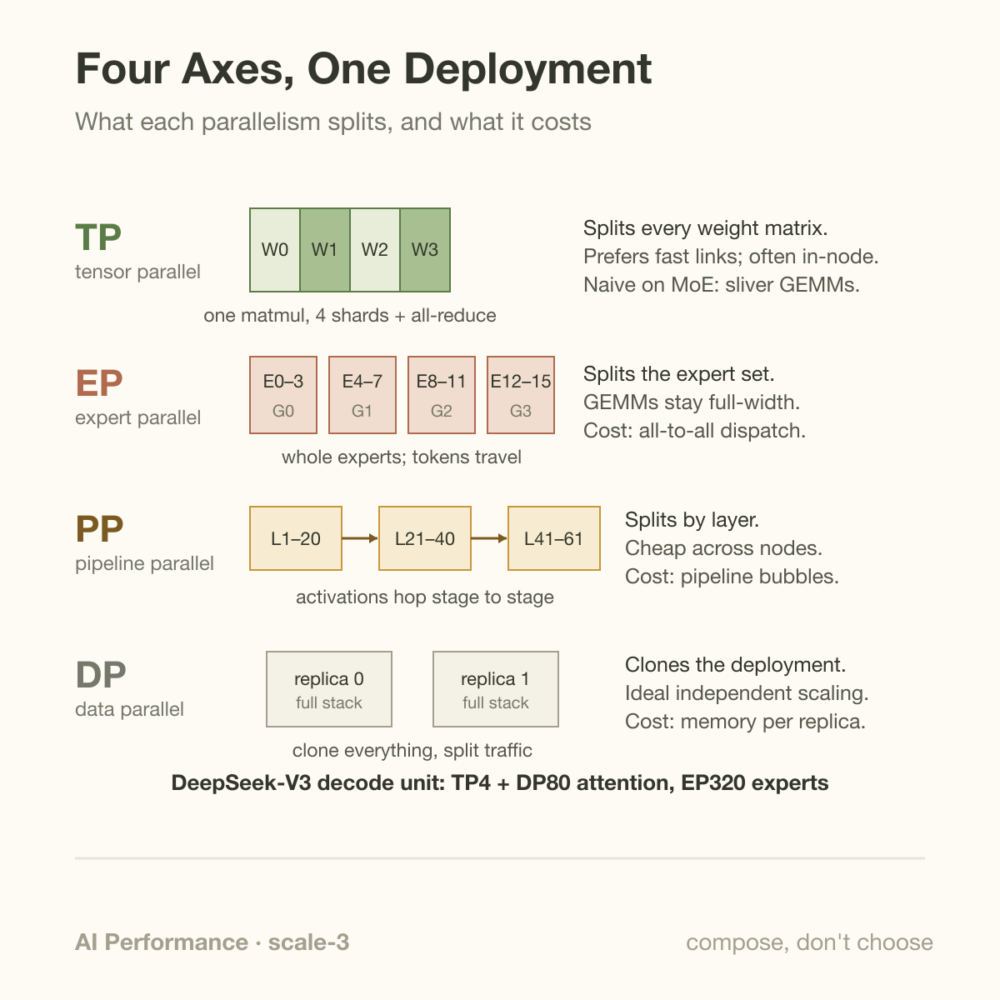
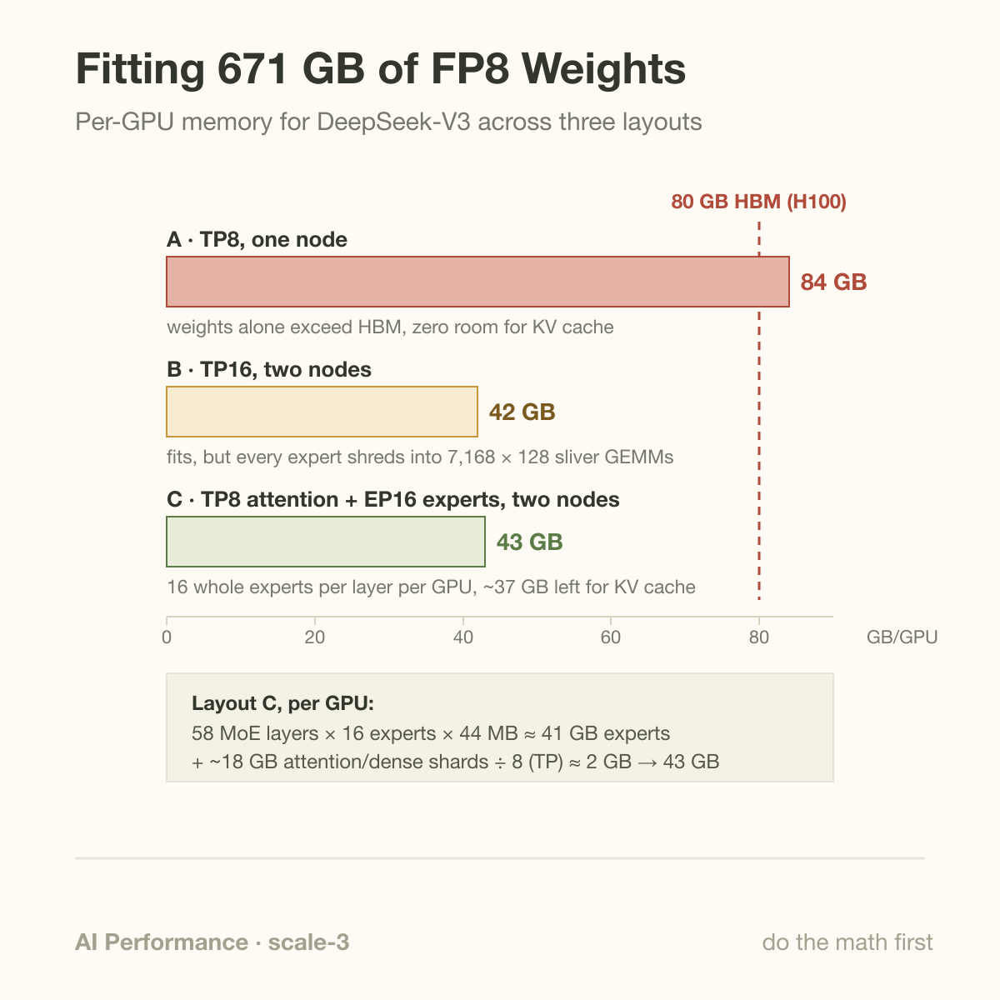
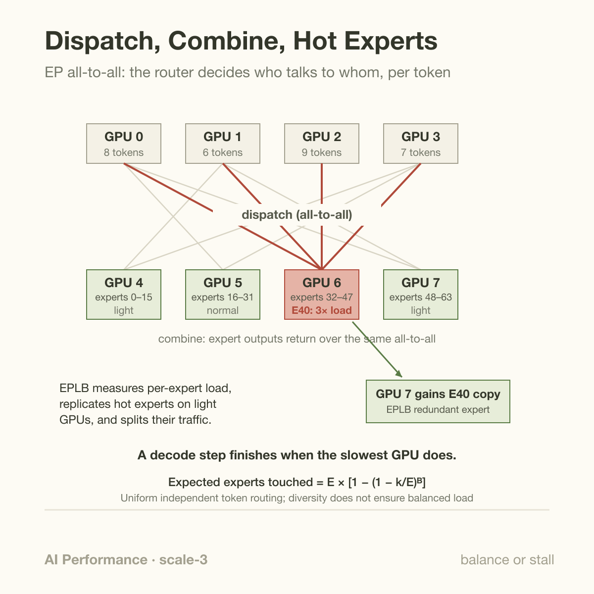

Kimi K2 carries just over 1 trillion parameters. A token flowing through it touches about 32 billion of them, roughly 3 percent. The other 97 percent sit idle for that token, yet every one of those bytes must be resident in GPU memory, warmed up and reachable within microseconds, because the *next* token may route somewhere else entirely. This asymmetry is the whole serving problem for Mixture-of-Experts models: sparse in compute, dense in memory, and promiscuous in communication.

DeepSeek-V3, the open model whose deployment is documented in the most detail, makes the shape concrete: 671B total parameters, 37B activated per token. No single GPU holds that. No single *node* holds that comfortably. And, more interestingly, no single parallelism strategy serves it well. Tensor parallelism, expert parallelism, pipeline parallelism, and data parallelism are not 4 options on a menu. For MoE giants they are 4 axes of 1 layout, and the job is composing them.

## What an MoE actually stores

Quick structural recap (if prefill/decode or transformer blocks are hazy, start with [how an LLM generates text](/blog/how-an-llm-generates-text/) and [the transformer architecture](/blog/transformer-architecture-in-one-picture/)). A dense transformer layer has attention plus 1 feed-forward network (FFN). An MoE layer replaces that single FFN with many parallel copies, the *experts*, plus a small learned router: for each token, the router scores all experts and sends the token's hidden state to the top-k of them. Classic designs used tiny k: GShard routed each token to its top 2 of up to 2048 experts; Switch Transformer cut that to top 1. Modern fine-grained MoEs go wider and shallower per expert: DeepSeek-V3 has 256 routed experts per MoE layer plus 1 always-on shared expert, and routes each token to 8 of them. Kimi K2 uses 384 experts, again selecting 8.

Do the byte accounting for DeepSeek-V3 and you see where the mass lives. Hidden size is 7,168; each expert's intermediate size is 2,048; an expert is 3 projection matrices (gate, up, down), so 3 × 7,168 × 2,048 ≈ 44M parameters, about 44 MB in FP8. There are 58 MoE layers (the first 3 of 61 are dense), so the routed experts alone hold 58 × 256 × 44 MB ≈ 653 GB. Attention, the dense layers, embeddings, and shared experts account for only the remaining ~18 GB. In other words, roughly 97 percent of the model is expert weight, and any given token ignores nearly all of it.

That is the promise: train and store a 671B model, pay 37B worth of FLOPs per token. The fine print is that the promise only survives deployment if you can (a) fit the weights, (b) keep every expert's load roughly equal, and (c) move tokens to experts fast enough that the network doesn't eat the FLOPs you saved.

## 4 axes, 1 layout

Each parallelism axis answers a different question, and each fails alone.

**Tensor parallelism (TP)** splits individual weight matrices across GPUs; every matmul becomes a partial matmul plus an all-reduce. It wants the fattest interconnect you have, which is why TP almost always stays inside a node on NVLink. Applied naively to an MoE, TP shards *every expert* across all GPUs, which turns thousands of small expert matmuls into slivers (more on this in the worked example).

**Expert parallelism (EP)** splits the expert *set*: each GPU owns whole experts, and tokens travel to whichever GPU holds the experts their router chose. Nothing about a matmul is split, so the GEMMs stay chunky. The cost moves into the network as an all-to-all exchange of token hidden states, 2 times per MoE layer (dispatch and combine).

**Pipeline parallelism (PP)** splits by layer: GPUs 0–7 hold layers 1–30, the next group holds the rest, and activations flow across the stage boundary. Per-boundary traffic is tiny (1 hidden state per token), so PP crosses nodes cheaply, at the price of pipeline bubbles and more scheduling complexity.

**Data parallelism (DP)** clones. 2 replicas serve 2 times the traffic. In modern MoE serving DP shows up *inside* the model too: DeepSeek runs attention data-parallel (each DP rank has its own requests and its own KV cache) while the expert layers below are shared across the whole EP group.

The composition rule that falls out of the hardware: TP inside the node where NVLink makes all-reduce cheap, EP across the expert dimension because experts are naturally whole units, PP across nodes where bandwidth is scarce, DP wherever you need more throughput. Not chosen. Composed.

## Worked example: fitting 671 GB on 8 vs 16 GPUs

Take DeepSeek-V3 in FP8, so weights are approximately 671 GB, and H100-class GPUs with 80 GB of HBM. Follow the arithmetic by hand.

**Layout A, TP8 on 1 8-GPU node.** Shard everything 8 ways: 671 / 8 ≈ 84 GB per GPU. That already exceeds 80 GB before a single byte of KV cache, activations, or CUDA buffers. Dead on arrival. (This kind of budget check is the same drill as in [GPU memory math](/blog/gpu-memory-math-will-it-fit/).)

**Layout B, TP16 across 2 nodes.** Now 671 / 16 ≈ 42 GB per GPU, which fits. But look at what TP did to the experts: each expert's 2,048-wide intermediate dimension is split 16 ways, so every expert matmul on every GPU is a 7,168 × 128 sliver. During decode an expert might receive 3 tokens; a (3 × 7,168) × (7,168 × 128) GEMM is laughably memory-bound and leaves the tensor cores idle. Worse, the 2 all-reduces per layer now cross InfiniBand instead of NVLink, multiplying communication latency at every one of 61 layers.

**Layout C, TP8 for attention + EP16 for experts, 2 nodes.** Give each GPU 256 / 16 = 16 whole routed experts per MoE layer: 58 layers × 16 experts × 44 MB ≈ 41 GB of expert weight per GPU. Shard the ~18 GB of attention/dense/shared weight TP8 within each node: about 2 GB per GPU. Total ≈ 43 GB, leaving ~37 GB for KV cache and activations. Expert GEMMs stay full-width at 7,168 × 2,048. The new cost is explicit: every token's hidden state (7,168 values, 14 KB in BF16) must be shipped to up to 8 expert-owning GPUs and shipped back, 2 times per MoE layer.

Same model, same GPUs, and the difference between "does not fit," "fits but crawls," and "fits with room for a real batch" is purely how you compose the axes. At production scale DeepSeek pushes the same logic much further: the V3 technical report describes a prefill unit of 4 nodes (32 GPUs, attention TP4 + DP8, experts EP32) and a decode unit of 40 nodes, where 320 GPUs run EP320: 256 GPUs hosting 1 routed expert each, and 64 GPUs hosting shared experts and redundant copies of hot ones.

## Going deeper: all-to-all and the hot-expert problem

Composing the axes buys you fitting and fat GEMMs. It also creates the 2 failure modes that dominate MoE serving in practice.

**The all-to-all is the new bottleneck.** In dense serving, communication means all-reduce: a regular, symmetric pattern that NCCL has optimized for a decade. EP dispatch is different. Which GPU talks to which, and how much, is decided by the router *per token, per layer*. It is sparse, irregular, and latency-critical during decode, where each step moves only a few KB per token but sits on the critical path of every generated token. This is why DeepSeek open-sourced DeepEP, a dedicated all-to-all library: throughput-oriented kernels for prefill that saturate NVLink (~150 GB/s) intranode and RDMA (~40–50 GB/s per GPU) across nodes, and separate low-latency decode kernels that use pure RDMA with device-initiated transfers to keep dispatch in the low hundreds of microseconds even at EP sizes in the hundreds (numbers are DeepSeek's own, measured on H800). The same overlap discipline from [hiding the network](/blog/hide-the-network-overlap-communication/) applies here in sharpened form: DeepSeek runs 2 micro-batches per unit so that 1 micro-batch's attention executes while the other's dispatch/combine is in flight, and DeepEP's hook-based receive path costs 0 SM cycles while data streams in.

**Load balance decides your latency.** The router is trained, not designed, and real traffic is skewed: a burst of coding requests will hammer whichever experts specialized in code. Under EP, an overloaded expert is an overloaded *GPU*, and a decode step finishes only when the slowest GPU finishes. 1 expert receiving 3× average traffic means every token in the batch waits, on every layer where that expert is hot. Training-time tricks (auxiliary balance losses, or V3's auxiliary-loss-free bias adjustment) keep routing statistically reasonable, and capacity limits with token dropping protect training throughput, but in serving you cannot drop a user's token. The deployment-time answer is replication: measure per-expert load, then place *redundant copies* of hot experts on underloaded GPUs and split their traffic. DeepSeek's EPLB (Expert Parallelism Load Balancer) does exactly this, with a hierarchical mode that first balances expert groups across nodes (so group-limited routing keeps most dispatch traffic inside a node) and a global mode for larger EP degrees. Those 64 extra GPUs in the decode unit are load-balancing insurance.

## Routing diversity and routing balance are different

With $$E$$ experts, $$k$$ distinct choices per token, and $$B$$ independent uniformly routed tokens, expected distinct experts touched in a step are

$$
\mathbb E[U]=E\left[1-\left(1-\frac{k}{E}\right)^B\right].
$$

For 256 experts, 8 choices, and 128 tokens, the expectation is approximately 251.6 experts. This follows by counting each expert's probability of being chosen at least once. Uniform choices within a token are without replacement; independence is assumed across tokens. Real learned routing can be skewed, so this is an illustrative baseline rather than an empirical router model.

Touching nearly every expert does not prove every weight crosses HBM each step. Placement, caching, reuse, and kernel grouping determine traffic. Nor does diversity imply balanced load: 1 expert can receive many more tokens than another.

The method is to collect per-expert token counts and per-device completion times. Expert parallelism distributes resident weights; grouped execution reuses an expert's weights across its assigned tokens. Replication can reduce a hot expert's load but spends memory and complicates routing. Compare the slowest shard and exposed communication before and after placement changes. Aggregate active-parameter counts hide precisely the straggler that controls a synchronized step, so a capacity-fitting layout still needs a routing-aware latency evaluation.

## Common misconceptions

**"37B active means it serves like a 37B dense model."** Per token, yes, the FLOPs are ~37B-scale. Per *step*, no. With a decode batch of 128 tokens each picking 8 of 256 experts, the expected number of distinct experts touched per layer is 256 × (1 − (248/256)^128) ≈ 252 of 256. Nearly the full 671 GB of weights streams from HBM every decode step regardless of sparsity. MoE sparsity saves compute, not weight bandwidth, and decode was already bandwidth-bound.

**"Pick the best parallelism for your model."** There is no best 1; the axes solve different problems and the units of a real deployment use different mixes. DeepSeek's own system runs TP4 attention, DP8 or DP80 attention replicas, EP32 or EP320 experts, and pipelines across deployment units, simultaneously. Even the prefill and decode phases of the *same request* run under different compositions, which is half the argument for [prefill/decode disaggregation](/blog/the-prefill-decode-disaggregation-story/).

**"Expert load evens out on average, so ignore it."** Averages are exactly the wrong statistic. Step latency is a max over GPUs, not a mean, so a balanced *average* with per-step spikes still stalls every step that spikes. And the skew is not noise you can wait out: routing distributions shift with workload mix (code vs. chat vs. long documents), which is why EPLB re-derives placements from measured load rather than fixing them at deployment time.

## The bigger picture

Serving MoE giants is where the themes of this series converge. The memory arithmetic is the same as ever, just at 671 GB scale. The communication problem gets a new pattern, all-to-all, on top of the all-reduce you already had. And the hardware is bending toward the workload: 1 reason rack-scale NVLink domains like [NVL72](/blog/nvl72-one-rack-one-giant-gpu/) matter is that a 72-GPU EP domain on 1.8 TB/s NVLink makes dispatch dramatically cheaper than RDMA hops. The economics are not academic either; the MoE-plus-cheap-dispatch stack is a large part of how [DeepSeek priced its API where it did](/blog/when-a-kernel-cuts-api-prices/). 10 years ago "distributed inference" meant a model server and a load balancer. Now it means a 320-GPU decode unit whose step time depends on where expert 137's replica lives.

## Takeaway

- MoE giants are sparse in FLOPs but dense in bytes: DeepSeek-V3 activates 37B of 671B parameters per token, yet a realistic decode batch touches ~98 percent of experts every step, so all 671 GB must be resident and bandwidth-fed.
- TP, EP, PP, and DP are composed, not chosen: TP inside the NVLink domain for attention, EP across whole experts to keep GEMMs full-width, PP across nodes, DP for replicas; a naive single-axis layout either doesn't fit (TP8) or shreds expert GEMMs into 128-wide slivers (TP16).
- Once composed, the fight moves to the network and the router: all-to-all dispatch needs dedicated kernels (DeepEP) and overlap, and hot experts need measured-load replication (EPLB), because a decode step is only as fast as the most overloaded expert GPU.

## Sources

- DeepSeek-AI, "DeepSeek-V3 Technical Report" — <https://arxiv.org/abs/2412.19437>
- Kimi Team, "Kimi K2: Open Agentic Intelligence" — <https://arxiv.org/abs/2507.20534>
- Fedus, Zoph, Shazeer, "Switch Transformers: Scaling to Trillion Parameter Models with Simple and Efficient Sparsity" — <https://arxiv.org/abs/2101.03961>
- Lepikhin et al., "GShard: Scaling Giant Models with Conditional Computation and Automatic Sharding" — <https://arxiv.org/abs/2006.16668>
- DeepEP: an efficient expert-parallel communication library (self-reported benchmarks) — <https://github.com/deepseek-ai/DeepEP>
- EPLB: Expert Parallelism Load Balancer — <https://github.com/deepseek-ai/EPLB>

*Part of the [LLM Inference & Serving](/series/llm-serving/) learning path. Browse its published articles by topic.*
