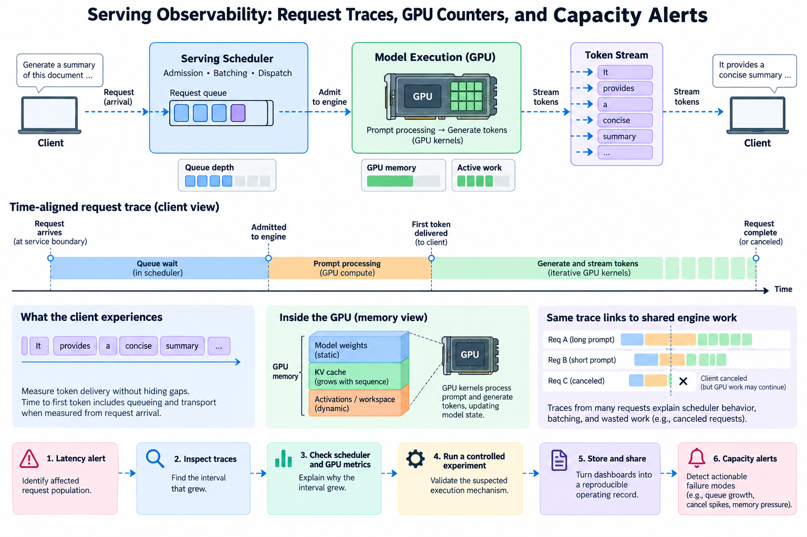
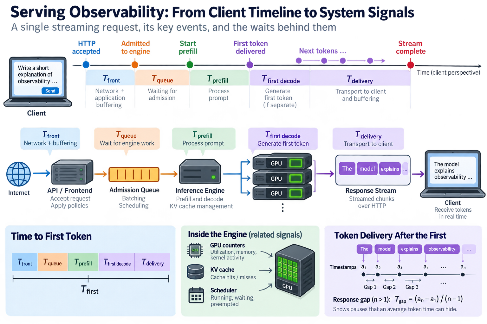
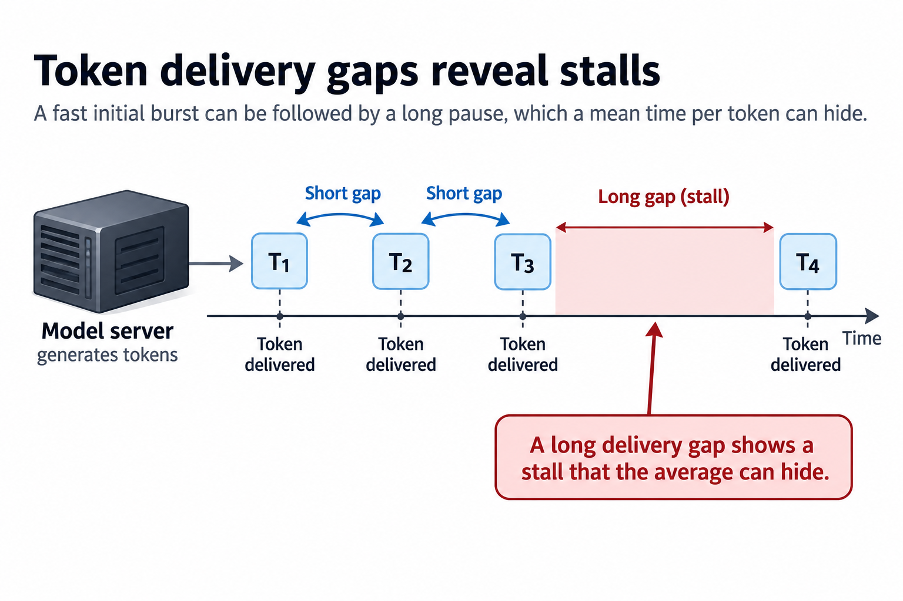

A dashboard full of green GPU-utilization charts can coexist with an unusable inference service. Requests may wait in an admission queue, long prompts may delay short ones, and the engine may spend substantial work on responses that clients cancel. Observability needs to connect the user's waiting time to the system's execution rather than treating each layer as an unrelated collection of charts.

The goal is a causal investigation path. A latency alert identifies an affected request population. Request traces locate the time interval that grew. Scheduler and resource measurements explain why that interval grew. A targeted profile then tests the suspected execution mechanism.

We will define consistent timing boundaries, derive a few useful capacity relationships, and design measurements that survive batching and multiple replicas. Numerical examples are illustrative. Exact exported metric names and their availability depend on the installed serving-engine version and should be verified against its documentation.

## 1. Begin with the timeline the client experiences

*Overview of the article’s core mechanism. The following sections explain the objects, relationships, equations, assumptions, and worked examples shown here.*

For a streaming request, record arrival at the service boundary, admission to engine work, start of prompt processing, delivery of the first generated token, subsequent token deliveries, and termination. These events describe different waits. A client-side timestamp also includes network and application buffering that an engine-local timestamp cannot observe.

Define time to first token using an explicit origin and delivery boundary. If the origin is HTTP acceptance and the endpoint is the first streamed chunk, this measure includes service queueing and transport behavior. If an engine metric starts after admission, it excludes an earlier wait. Both can be useful, but they are not interchangeable.

A simplified decomposition is

$$
T_{\mathrm{first}}=T_{\mathrm{front}}+T_{\mathrm{queue}}+T_{\mathrm{prefill}}+T_{\mathrm{first\ decode}}+T_{\mathrm{delivery}}.
$$

Some engines produce the first output token at the end of prefill rather than in a separately identified decode interval. Use a decomposition matching the actual implementation and avoid double-counting it. The equation is a bookkeeping model, not a requirement that every engine expose those exact phase labels.

## 2. Measure token delivery without hiding gaps

After the first token, define delivery gaps between consecutive output-token timestamps. Their distribution reveals pauses that average generation time can conceal. A response can have a fast initial burst followed by a long stall while maintaining an apparently acceptable mean time per token.

For n output tokens and timestamps a_1 through a_n, one response-level average gap is

$$
\overline{T}_{\mathrm{gap}}=(a_n-a_1)/(n-1),\qquad n>1.
$$

The formula is undefined for a single-token response; do not manufacture a zero observation and blend it into the same distribution. If chunks contain multiple tokens, the transport may not provide a true delivery timestamp for each token. Report the measurement as chunk timing or explain the reconstruction method.

Distinguish averaging per-response gaps from pooling every observed token gap. Pooling gives longer outputs more weight. Averaging response summaries gives each qualifying response one vote. A change in output-length distribution can move these metrics differently even when the underlying engine behavior is similar.

Track successful termination, client cancellation, timeout, and engine failure as separate outcomes. A cancelled request's generated tokens can consume compute without becoming useful client output. Completion throughput and engine-generated token throughput answer different questions and both belong in a production investigation.

## 3. Connect request traces to shared engine work

Continuous batching breaks the simple assumption that one request owns one GPU launch. A single attention kernel can process tokens from many requests, and one request can move through multiple changing batch compositions. Tracing every launch as a child of a single request would misrepresent this shared execution.

Instead, correlate request identifiers and phase events with scheduler iterations, batch descriptors, and aggregate execution windows. A sampled trace can show when a request was eligible, when it received work, and which iteration processed that work. A GPU profile of the corresponding window reveals the shared kernels and gaps.

Use monotonic clocks for durations within one process. Cross-process comparisons require a documented clock relationship; ordinary wall-clock timestamps can drift or jump. When exact cross-host alignment is unavailable, keep local durations authoritative and use broader correlation windows rather than claiming precise ordering from unreliable timestamps.

The most useful trace attributes describe the workload and state: prompt length, generated length, model and configuration identity, cache-hit category, scheduling class, and termination reason. Preserve bounded attribute values for aggregated metrics. Unique request identifiers belong in traces or logs, where they do not create an unbounded metric series population.

## 4. Interpret queues using consistent request populations

Little's law relates average population L, arrival rate lambda, and average time W for a stable system with consistent boundaries:

$$
L=\lambda W.
$$

If an illustrative admitted request population completes at 20 requests per second and spends an average 0.5 seconds in the engine's waiting queue, its average queue population is 10 requests under the required steady-state assumptions. Comparing that estimate with measured queue depth can reveal a boundary mismatch or transient behavior.

The law does not predict tail latency by itself, and it does not justify replacing mean time with p99. During overload, arrivals and completions differ and the queue may grow without a stationary average. Inspect the time series and offered load before applying a steady-state relationship.

Track offered, admitted, rejected, and completed requests separately. An admission controller can keep engine latency healthy by rejecting demand, while the overall service delivers fewer successful responses. A dashboard showing only admitted traffic would make that change look like an uncomplicated recovery.

Queue request count is also a weak proxy for queued work. Ten short prompts differ from ten long prompts with large output budgets. Add workload measures such as pending prompt tokens, estimated cache reservations, and request classes where the engine can provide them accurately.

## 5. Aggregate histograms correctly across replicas

A quantile is a property of a distribution. Averaging per-instance p99 values does not produce the fleet p99, because instances can receive different volumes and shapes of traffic. The same problem appears when averaging quantiles across time windows.

For compatible cumulative histogram buckets, aggregate bucket counts across the intended population and then estimate the quantile from the combined histogram. Keep bucket definitions, units, and outcome filters consistent. A histogram with broad buckets can only localize the quantile coarsely; extra decimal places do not add information.

For a simple example, suppose one replica handles 990 fast requests and another handles 10 very slow requests. Giving their p99 values equal weight ignores a 99-to-1 volume ratio. Even volume-weighting the quantile values does not reconstruct the mixed distribution. You need the observations or a suitable distribution summary.

Choose buckets around meaningful service objectives and expected operating ranges. Retain counts so an apparently dramatic percentile is not interpreted without its sample population. Small-window tails can fluctuate sharply when only a few requests complete, especially for low-volume classes or newly started replicas.

## 6. Link GPU evidence to the suspected bottleneck

Utilization indicates activity over a sampling interval, but it does not tell you how much useful work completed. A GPU may execute inefficient kernels continuously, wait through small alternating gaps, or process work whose results will be discarded. Pair utilization with admitted workload, completed tokens, and latency.

A targeted profile can inspect memory traffic, matrix-unit activity, kernel duration, launch spacing, and synchronization. If decode slows as contexts grow, cache-read traffic is a plausible hypothesis. If queueing grows while kernel times remain stable, admission or scheduling is a more direct investigation path.

Resource counters sampled at coarse intervals can hide short stalls. Conversely, a detailed profile can perturb the workload or capture an unrepresentative window. Record the sampling method and compare profiled behavior with ordinary service measurements before generalizing.

GPU memory measurements need similar care. Allocated tensor memory, allocator-reserved memory, cache-block occupancy, and device-wide usage represent different layers. A high reserved-memory value does not alone prove that the cache is full. Inspect the engine's capacity and eviction measurements alongside runtime and device totals.

## 7. Design alerts that identify an actionable failure mode

Start with the service outcome: successful completion latency, first-token latency, streaming gaps, or accepted throughput below its objective. Pair it with supporting evidence such as queue growth, rejections, cache pressure, or a replica losing capacity. An alert should make the next investigation clear.

One useful SLO formulation is an error fraction e over qualifying requests, compared with the allowed fraction epsilon. The normalized consumption rate is

$$
B=e/\epsilon.
$$

For an illustrative 99% objective, epsilon is 0.01. An observed 5% failure or latency-miss fraction corresponds to a burn rate of 5 under the same outcome definition. This ratio does not establish how long the condition will last; window lengths and traffic volumes remain essential.

Use both a sustained view and a shorter confirmation view when the alerting system supports that policy. A brief workload spike and a persistent capacity loss call for different responses. Keep the qualifying population explicit so maintenance traffic or a new request class does not silently redefine the objective.

Avoid alerting on every resource threshold independently. A GPU counter crossing a threshold can be normal at the intended operating point. Resource alerts are most useful when they signal a known failure risk or support a service symptom, rather than generating noise whenever hardware is busy.

## 8. Use controlled experiments to validate the diagnosis

When investigating a regression, preserve the model, engine version, hardware, request distribution, and concurrency policy. Compare prompt and output lengths, cache-hit rates, and termination reasons before attributing a latency change to a code change. A workload shift can imitate a kernel regression.

Change one relevant control at a time when feasible. If reducing admitted concurrency removes streaming stalls while kernel durations remain similar, queueing or shared-resource contention becomes a stronger explanation. If one prompt-length bucket regresses while others remain stable, inspect that shape and backend path directly.

Use traces to select representative profiling windows, including ordinary operation and the degraded condition. Keep the observations tied to an explicit hypothesis. Collecting more counters without a question can increase storage and review time while doing little to distinguish explanations.

After applying a fix, verify the original service objective and neighboring outcomes. A scheduler adjustment can improve short-request latency while reducing long-request completion throughput. Report the affected populations rather than declaring success from a single fleet average.

## 9. Turn dashboards into a reproducible operating record

Maintain a compact set of linked views: service outcomes, offered and admitted demand, engine queues and cache state, replica health, and resource execution. Their filters should use compatible model and request-class labels so moving between views preserves the investigated population.

Document metric boundaries and version-dependent definitions near the dashboards. Record deployments, configuration changes, and capacity changes on the same timeline. An unexplained change in replica count or sampling definition can otherwise look like a model-performance event.

Keep a small reproducible load case for each important incident pattern. It should capture the relevant workload shape and objective without requiring the entire original traffic stream. The case becomes useful evidence for future regressions and a practical test of whether an optimization survives realistic serving conditions.

Good observability closes the distance between a slow response and the mechanism that made it slow. Request measurements define the symptom, engine state locates the wait, and GPU evidence tests the execution hypothesis. Capacity decisions become much more reliable when all 3 describe the same workload and timing boundaries.

## Sources

- [vLLM metrics design documentation](https://docs.vllm.ai/en/latest/design/metrics/).
- [Prometheus histogram practices](https://prometheus.io/docs/practices/histograms/).
- [OpenTelemetry trace concepts](https://opentelemetry.io/docs/concepts/signals/traces/).
