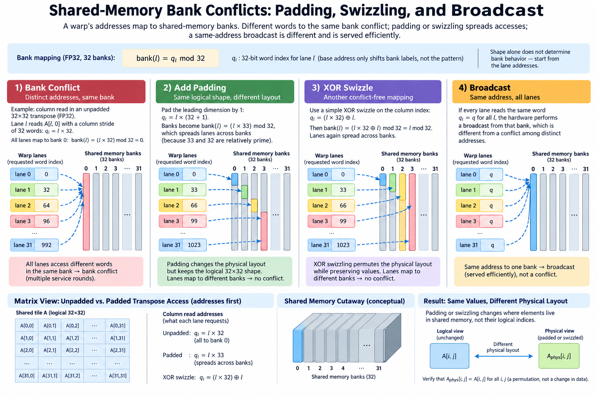
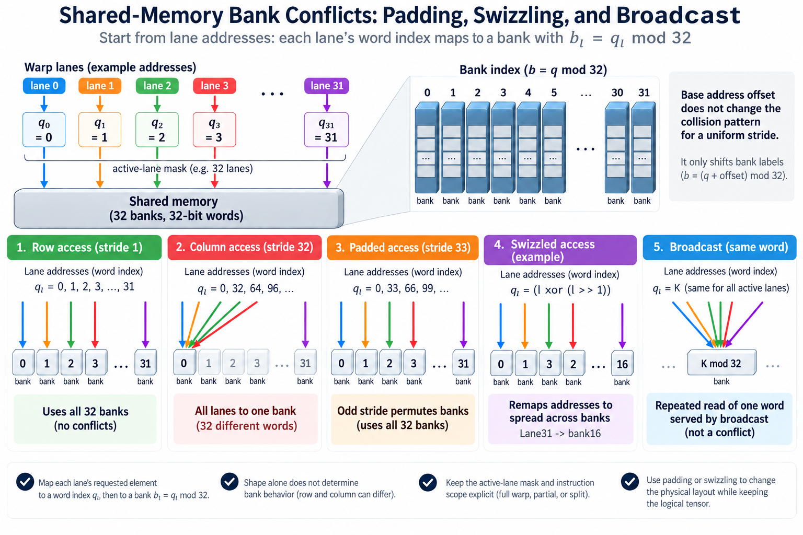

Shared memory is fast when the access pattern fits its bank organization. It is not one unlimited-bandwidth array. A warp can request distinct words that map to the same bank, forcing additional service work even though all addresses are valid and the mathematical operation is correct.

The useful method is to map lane addresses to banks, distinguish repeated reads of one word from requests for different words, and inspect the instruction the compiler actually generates. Padding or swizzling can change the physical layout while preserving the logical tensor.

We will derive a simple FP32 mapping and work a transpose example. The arithmetic model uses 32 banks and successive 32-bit words, matching the stated CUDA guidance. Other element widths and generated instructions require their actual supported access behavior rather than a blind application of the simplified formula.

## 1. Begin with lane addresses, not array dimensions

*Overview of the article’s core mechanism. The following sections explain the objects, relationships, equations, assumptions, and worked examples shown here.*

For a warp access, record which logical element each active lane requests and convert it to a physical shared-memory word address. Shape alone does not determine the access pattern. Threads reading a row and threads reading a column can use the same array with very different bank behavior.

In the simplified 32-bit-word model, let q_l be lane l's word index. Its bank is

$$
b_l=q_l\bmod32.
$$

The base address adds a constant offset to the mapping. That changes bank labels but not the collision pattern for a uniform stride. Actual alignment and instruction width still matter to the generated requests.

Keep the active-lane mask and instruction scope explicit. A full-warp formula should not be applied unchanged to a partial request or an instruction that is split into multiple transactions. The model is a starting point for analysis, not a replacement for the compiled access.

## 2. Derive the stride conflict pattern

For distinct FP32 words with positive stride s, let q_l=q_0+ls over 32 active lanes. The number of distinct banks is 32 divided by the greatest common divisor of 32 and s:

$$
N_{\mathrm{banks}}=32/\gcd(32,s).
$$

Each used bank receives gcd(32,s) different-word requests under this simplified pattern. Stride 1 uses all banks once. Stride 2 uses 16 banks twice. Stride 4 uses 8 banks four times. Stride 32 sends all distinct words to the same bank.

An odd stride is relatively prime to 32 and permutes the banks. Stride 33 therefore avoids the column collision in the common padded transpose example. This result concerns distinct words; repeated reads of exactly one word need the separate broadcast analysis.

The conflict factor is not automatically the whole-kernel slowdown. Other instructions, arithmetic, barriers, global traffic, and occupancy remain in the execution budget. A large local serialization factor can have a modest end-to-end effect if the access is rare or hidden.

The stride result follows from the first repeat in the bank sequence. Two lanes separated by t use the same bank when t times s is divisible by 32. The smallest positive such t is 32 divided by the greatest common divisor. That is the sequence period, so a full 32-lane access repeats each used bank the corresponding number of times. This derivation also identifies the assumptions: distinct words, the stated bank width, and the stated active population. It is more reliable than memorizing that odd strides happen to work in one example.

## 3. Work the unpadded matrix transpose

Consider a shared FP32 tile with 32 rows and 32 columns stored row-major. The word index for row r and column c is

$$
q_{r,c}=32r+c.
$$

A warp reading one row uses consecutive words and distinct banks. A warp reading one column with lane l assigned to row l has bank c for every lane, even though the words occupy different rows. The column access creates the classic 32-way pattern in this model.

A transpose kernel can use shared memory to make global reads and writes coalesced, yet still suffer this local column conflict. Improving global access is therefore not proof that the shared layout is efficient.

Derive both the load and store patterns through the staging tile. Producers and consumers can traverse it differently. The relevant analysis follows each shared-memory instruction, not just the declaration or the global output layout.

## 4. Add padding while preserving logical shape

Allocate 33 physical columns for a logical 32-column tile. The word index becomes 33r+c. A column access now maps lane l to bank l+c modulo 32, distributing distinct words across all banks.

The storage change is

$$
S_{\mathrm{plain}}=32\cdot32\cdot4=4096\text{ bytes},\qquad S_{\mathrm{padded}}=32\cdot33\cdot4=4224\text{ bytes}.
$$

Padding adds 128 bytes, or 3.125%, in this example. The logical matrix remains 32 by 32. Every address expression must use the physical row stride 33; retaining stride 32 in one consumer would change the mapping and potentially the result.

That small storage increase can matter near a shared-memory allocation threshold or when many tiles are buffered. Measure compiled resource usage and occupancy. Padding is a tradeoff that often has a clear local benefit, not a universally free optimization.

Test boundary tiles with the same physical stride. A correct full tile can hide an incorrect masked tail or a consumer that assumes logical width equals storage stride.

## 5. Derive a simple XOR swizzle

A swizzle permutes physical locations while preserving logical identity. For a 32-by-32 tile, one illustrative mapping uses

$$
q_{r,c}=32r+(c\mathbin{\mathrm{xor}}r),\qquad0\le r,c<32.
$$

For fixed row r, varying c permutes columns and therefore banks. For fixed column c, varying r also permutes the bank index c xor r. Both patterns use distinct banks in the stated model without the extra padded column.

The mapping is bijective within the tile because each row keeps its own 32-word region and XOR with a fixed row identifier permutes the columns. This proves that logical values can be recovered if every producer and consumer applies the same mapping.

This is an explanatory software layout, not a universal hardware swizzle recipe. Wider tiles, different element widths, specialized matrix loads, and asynchronous-copy mechanisms need their supported layouts. An arbitrary XOR expression should not be substituted for a hardware-required format without checking semantics.

## 6. Distinguish broadcast from different-word collisions

When active lanes read exactly the same shared-memory word, supported broadcast behavior can serve that value to the requesting lanes. The address equality matters: equal bank identifiers alone do not establish that the requested words are the same.

For the column example, lane 0 reads word c and lane 1 reads word 32+c. These words share a bank but are distinct locations. Calling that access a broadcast would erase the very conflict the model is supposed to explain.

Writes require a separate ownership analysis. Multiple ordinary writes to one location should not be interpreted as a meaningful broadcast reduction. CUDA describes specific behavior for simultaneous same-location writes, and the application must use a supported combining mechanism when every contribution matters.

Keep read and write patterns distinct in the diagram and tests. A layout that improves a read phase may not improve the write phase, and a performance counter does not prove that conflicting writers compute the required result.

## 7. Respect element width and generated transactions

The simple modulo formula is based on 32-bit words. A wider element can span multiple banks, and an instruction can be partitioned into transactions with a particular service pattern. Smaller elements can share word-level structure. These details change how conflicts should be counted.

Do not infer a conflict factor by replacing the word stride with a byte stride in the same formula. Convert addresses according to the actual bank and instruction model. Preserve dtype, alignment, vector width, and active lanes in the analysis.

Compiler vectorization can also change the request pattern. Source-level scalar loads may become different generated instructions, and a layout change can alter that choice. Inspect compiled code or profiler evidence when a surprising result requires it.

Specialized matrix operations can impose operand layouts that deliberately differ from ordinary row-major indexing. Their supported layout contract is the relevant starting point. Padding designed for a scalar transpose should not automatically be assumed optimal for those instructions.

## 8. Verify that the mapping preserves values

Use a deterministic tile whose value encodes row and column, such as 100r+c. Store and recover through the padded or swizzled layout, then compare the logical output. This exposes incorrect producer-consumer association that uniform values can hide.

For the XOR example, logical position row 3, column 5 maps to physical column 6 because 5 xor 3 is 6. The consumer must request that same location for the logical value. Reading physical column 5 instead produces another logical element despite remaining in bounds.

Exercise repeated staging and reuse with the supported barriers. A conflict-free layout can still race if producers overwrite a tile before consumers finish. Layout efficiency and ownership correctness are complementary requirements.

Include partial logical dimensions and the supported lane masks. Tail loads should initialize needed shared slots appropriately, and final stores should preserve logical bounds. A proof for a full 32-by-32 tile does not establish every wrapper case automatically.

## 9. Measure local evidence and whole-kernel impact

Use profiler measurements appropriate to shared-memory requests and conflict behavior, consulting current metric definitions. Compare the same logical workload and generated path. A counter reduction is useful evidence for the mechanism, not the final performance objective.

Measure elapsed kernel time, global traffic, occupancy, registers, and shared allocation alongside the local access. Padding or swizzling can reduce one cost while changing address arithmetic, instruction selection, or concurrency.

For an illustrative kernel spending 20% of its baseline time in an affected shared-access phase, halving that phase gives a fixed-workload overall speedup of about 1.11 if all other costs stay constant. This calculation prevents a local improvement from being presented as the entire kernel gain.

Repeat across representative shapes and working sets. A microbenchmark designed to isolate bank service can reveal the access mechanism, while the full operation establishes whether that mechanism limits useful execution.

Global-memory coalescing and shared-bank distribution are separate mappings. A producer can read consecutive global elements efficiently and then store them through a padded or swizzled shared layout. The consumer must recover the intended logical element before its global output mapping. Improving the shared layout should preserve those global access and value relationships, otherwise a local gain can introduce a different traffic cost or an incorrect transpose.

## 10. Choose the simplest verified layout

Begin with a lane-to-address map and identify actual different-word collisions. Padding is often easy to reason about and test. A swizzle can preserve storage capacity but adds mapping complexity and must match all consumers.

Keep the layout contract, deterministic recovery tests, supported synchronization, compiled resource usage, and timing evidence together. This record makes a later instruction or dtype change easier to evaluate without reusing an invalid bank assumption.

A useful comparison can list the unpadded, padded, and swizzled versions with physical stride, storage bytes, observed requests, kernel duration, and correctness. If a layout reduces conflict evidence but leaves duration unchanged, another resource may dominate. If it improves duration while increasing storage enough to reduce concurrency on larger cases, the operating choice needs the full workload distribution rather than one isolated tile.

Shared-memory bank optimization is a mapping problem. Distinct words, bank organization, broadcast, and instruction scope determine the local service pattern. Prove the logical permutation, preserve producer-consumer ownership, and adopt the layout whose measured useful execution improves under the actual supported hardware path.

## Sources

- [CUDA shared-memory access and transpose guidance](https://docs.nvidia.com/cuda/cuda-programming-guide/02-basics/writing-cuda-kernels.html).
- [CUDA advanced kernel programming](https://docs.nvidia.com/cuda/cuda-programming-guide/03-advanced/advanced-kernel-programming.html).
- [Nsight Compute profiling guide](https://docs.nvidia.com/nsight-compute/ProfilingGuide/index.html).
