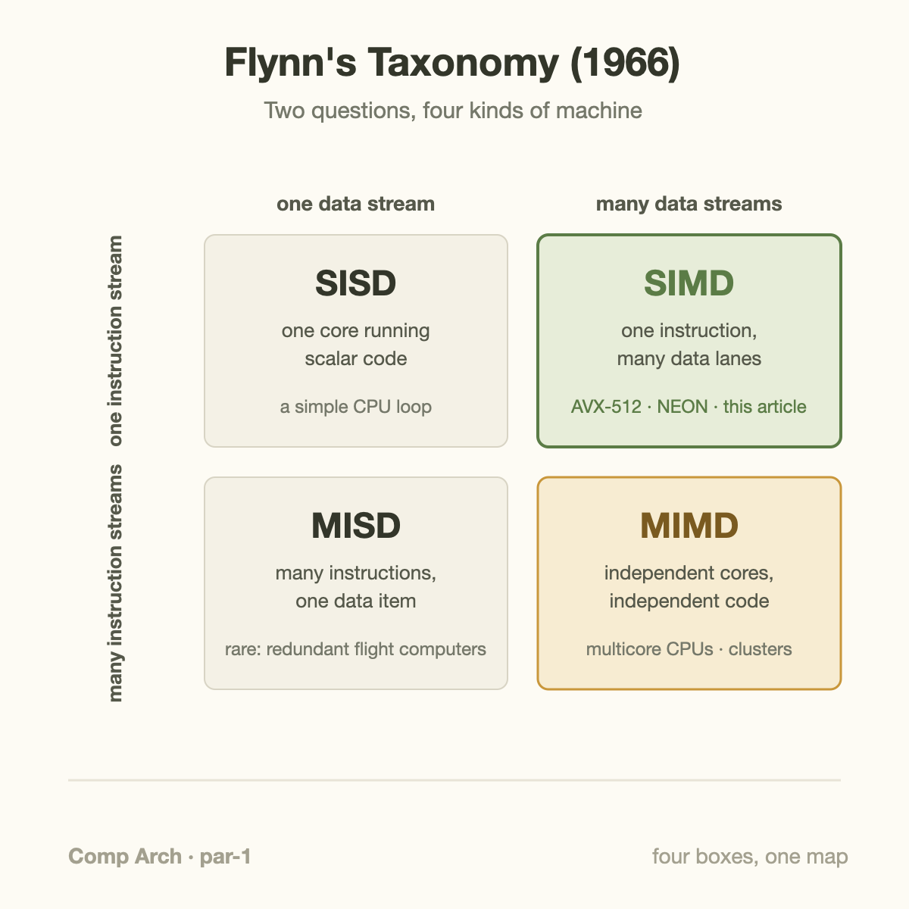
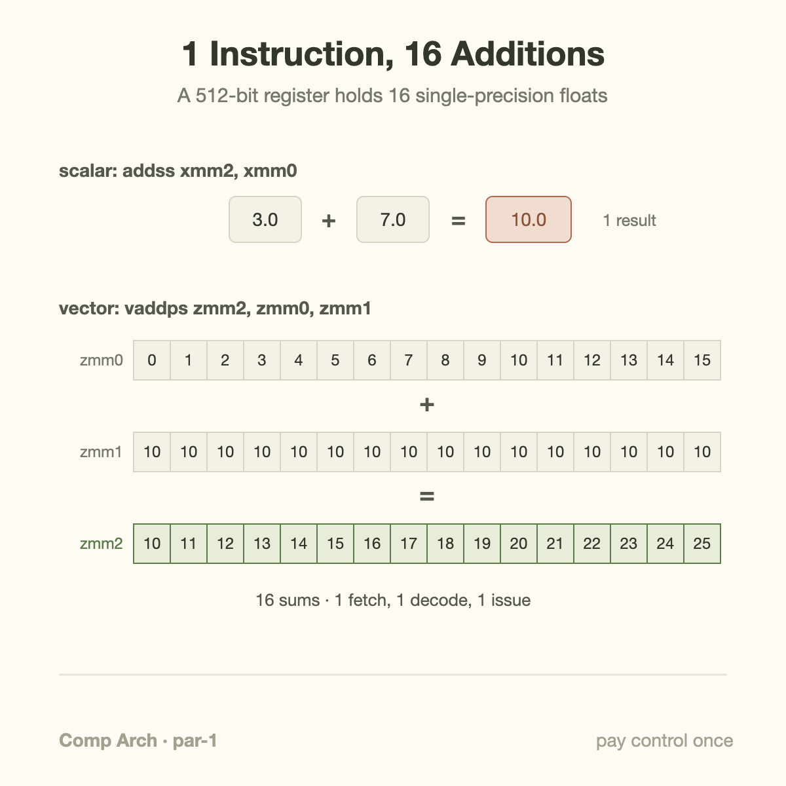
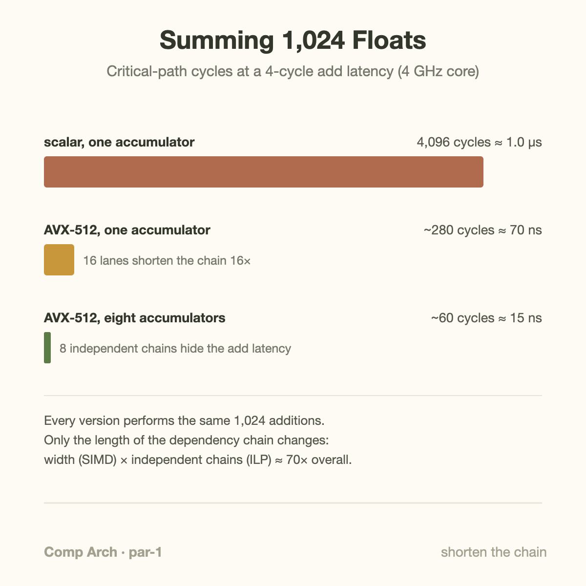

A single core in a modern server CPU can finish 64 single-precision floating-point operations every clock cycle. It gets there with just two instructions per cycle: each one is a fused multiply-add applied to 16 numbers at once, and a multiply-add counts as two operations. Sixteen lanes, times two operations, times two execution units. That is 64.

This matters because the other route to speed closed two decades ago. Clock frequencies have been stuck between roughly 3 and 5 GHz since the mid-2000s, when power density made further scaling impractical. Nearly all the growth in per-core arithmetic since then has come from *width*: making each instruction touch more data. The technique is called **SIMD**, and it is the first rung on a ladder that leads, a few articles from now, to GPUs and TPUs.

## Flynn's four boxes

In 1966 Michael Flynn proposed a classification of computers so simple it still organizes the whole field. Ask two questions about a machine. How many *instruction streams* does it follow at once? And how many *data streams* do those instructions touch? Two questions with two answers each gives four boxes.



- **SISD** — single instruction, single data. One core running scalar code, exactly the fetch-decode-execute machine from [the first article in this series](/blog/what-a-cpu-actually-does/). Each instruction produces one result.
- **SIMD** — single instruction, multiple data. One instruction stream, but each instruction operates on a whole batch of values at once. This article.
- **MISD** — multiple instructions, single data. The odd one out; it shows up mainly in fault-tolerant designs where redundant units process the same input and vote.
- **MIMD** — multiple instructions, multiple data. Independent cores each running their own code: every multicore CPU, every cluster.

The taxonomy earns its keep because the boxes have very different economics. MIMD needs a full core per stream, with its own fetch, decode, branch predictor, and scheduler. SIMD pays for that expensive control machinery once and shares it across many arithmetic units. When the same operation applies to element after element of an array, which describes most of image processing, signal processing, and essentially all of deep learning, SIMD gets you more math per dollar and per watt than any other box.

The energy argument deserves a number. Fetching, decoding, and scheduling one instruction costs on the order of 10 to 100 times more energy than the 32-bit arithmetic it triggers (Horowitz put instruction overhead around 70 picojoules against under one picojoule for a floating-point add). A scalar machine pays that overhead per result. A 16-lane SIMD machine pays it per 16 results.

## Wider registers, not faster ones

The hardware mechanism is the **vector register**. A normal general-purpose register on x86-64 holds 64 bits. AVX-512, the widest SIMD extension in mainstream x86 CPUs, adds 32 registers named `zmm0` through `zmm31`, each 512 bits wide. One such register holds 16 single-precision floats, or 8 doubles, or 64 bytes, and the register file alone is 2 KB of the hottest storage on the chip.

A vector instruction names these registers just like scalar code names ordinary ones. The instruction `vaddps zmm2, zmm0, zmm1` reads two 512-bit registers, adds them lane by lane, and writes 16 sums into a third. Behind it sit 16 floating-point adders physically side by side. The instruction is fetched once, decoded once, and scheduled once; the arithmetic fans out.



The idea is old. The Cray-1 of 1976 built its legend on eight vector registers of 64 elements each, and supercomputers were "vector machines" for two decades. The mainstream caught up in small steps: MMX in 1997 (64-bit), SSE in 1999 (128-bit, the first 4-float registers), AVX in 2011 (256-bit), and AVX-512 reaching servers in 2017. ARM took a parallel path with 128-bit NEON, now in every phone, and the newer SVE extension, which lets hardware choose any width from 128 to 2048 bits while the code stays the same. Fujitsu's A64FX, the chip inside the Fugaku supercomputer, runs SVE at 512 bits.

One phrase in the heading above is doing real work: wider, *not faster*. A vector add has about the same latency as a scalar add, roughly 4 cycles on recent Intel cores. SIMD is a pure throughput play, and that distinction is about to bite us in the worked example.

## A worked example: summing 1,024 floats

Take the most ordinary loop in numerical computing, in C:

```c
float sum = 0.0f;
for (int i = 0; i < 1024; i++)
    sum += a[i];
```

**Scalar version.** Compiled without vectorization, each iteration does about four instructions: load the element and add it to `sum` (one fused instruction on x86), bump the index, compare, branch. Call it 4,096 instructions for the whole loop. But instruction count is not what dominates here. Every add reads the previous add's result, so the 1,024 additions form a *dependency chain*, and with a 4-cycle add latency the chain alone costs 1,024 × 4 = 4,096 cycles. At 4 GHz that is about one microsecond, and no amount of clever hardware can shorten it, because arithmetic number 513 legally cannot start before number 512 delivers.

**AVX-512 version.** Load 16 floats into a vector register per iteration and add them into a 16-lane vector accumulator: 1,024 ÷ 16 = 64 iterations. The dependency chain is now 64 vector adds, 64 × 4 = 256 cycles. At the end the accumulator holds 16 partial sums (lane 0 has the sum of elements 0, 16, 32, …), which a short *horizontal reduction* folds together: shuffle and add the two halves, four times, since 2⁴ = 16, costing maybe 25 more cycles. Total around 280 cycles, roughly 70 nanoseconds. That is a 15× speedup, achieved by shrinking the chain 16-fold and paying a small toll at the end.

Worth checking before celebrating: 1,024 floats is 4 KB, which sits comfortably in the L1 cache, so memory bandwidth is not the constraint here. Keep a pin in that; it does not stay true for big arrays.

## Going deeper: feeding two pipes with eight chains

The vectorized loop is still leaving most of the machine idle. The core can *start* two vector adds per cycle (two execution ports), but each add takes 4 cycles to finish, and our single accumulator forces every add to wait for the previous one. One add begins every 4 cycles on hardware built to begin eight in that time. The vector units sit idle 87% of the loop.

The fix is to break the chain: keep **eight independent accumulators**, add every eighth vector into each, and fold the eight together at the end. Now the scheduler always has independent work, the loop becomes throughput-bound at 64 adds ÷ 2 per cycle = 32 cycles, and with the wind-down reduction the whole sum lands around 60 cycles, about 15 nanoseconds. Nearly 70× the scalar baseline.



Two honest footnotes. First, the accumulator trick is instruction-level parallelism, not SIMD; scalar code with eight accumulators gains from it too. SIMD contributes the 16×, latency-hiding contributes the rest, and the two multiply because they attack different limits, exactly the latency-versus-throughput split from [the pipeline article](/blog/what-a-cpu-actually-does/). Second, both tricks quietly reorder the additions, and floating-point addition is not associative: summing in a different order can produce a slightly different rounding. The math is fine for almost every application, but the *compiler is not allowed to assume that*, which brings us to the practical question.

## Auto-vectorization and where it gives up

You rarely write `vaddps` by hand. Modern compilers auto-vectorize loops at `-O2`/`-O3`, and for clean loops they do it well. The interesting question is when they refuse, because they refuse often and silently. The classic blockers:

- **Possible aliasing.** If the compiler cannot prove that the output array does not overlap an input array, vectorizing could change the program's meaning, so it won't. The `restrict` keyword exists to make that promise.
- **Loop-carried dependencies.** A prefix sum (`out[i] = out[i-1] + a[i]`) genuinely needs the previous result each step. No legal transformation makes independent lanes out of it (parallel prefix algorithms exist, but they restructure the computation, which a compiler will not do on its own).
- **Floating-point reductions.** Our running example! GCC and Clang will not vectorize `sum += a[i]` on floats by default, because doing so reorders the adds. You must grant permission with `-ffast-math`, `-fassociative-math`, or `#pragma omp simd reduction(+:sum)`. Skip the flag and you keep the 4,096-cycle version while believing you shipped the 60-cycle one.
- **Branches and irregular access.** AVX-512 has per-lane mask registers (`k0`–`k7`) that let an instruction execute in some lanes and not others, plus gather and scatter instructions for non-contiguous addresses. They make vectorizing branchy or pointer-chasing code *possible*, not fast; a gather that touches 16 different cache lines does 16 cache accesses.

Two more real-world cautions. Early AVX-512 chips (Skylake-SP, 2017) dropped their clock frequency under sustained 512-bit work, occasionally making vectorized code slower in mixed workloads; later generations largely fixed this, but it left a lasting folk memory. And the caveat pinned earlier: stream a 1 GB array from DRAM instead of 4 KB from L1 and a single core becomes memory-bandwidth-bound, at which point the sum runs at the speed of DRAM and the register width barely matters. Wide arithmetic only pays when the data can arrive fast enough, which is why [memory bandwidth, not FLOPs, is the number that decides modern accelerator designs](/blog/blackwell-to-rubin-memory-math/).

The pragmatic workflow: ask the compiler for its vectorization report (`-Rpass=loop-vectorize` in Clang, `-fopt-info-vec` in GCC), read what it refused and why, then either fix the loop or drop to intrinsics, the C functions in Intel's Intrinsics Guide that map one-to-one onto vector instructions. And always measure.

## Common misconceptions

**"SIMD makes each operation faster."** It does not; it makes each *instruction* do more operations. A `vaddps` has essentially the same latency as a scalar `addss` (about 4 cycles either way, per Agner Fog's instruction tables). That is why our single-accumulator vector loop was still latency-bound and left 87% of the vector hardware idle. Width raises throughput; only breaking dependency chains fights latency.

**"The compiler vectorizes automatically, so I get 16× for free."** Sometimes. But the most common loop in numerical code, a floating-point reduction, is skipped by default for correctness reasons, aliasing it cannot disprove blocks many others, and a loop that vectorizes cleanly but streams from DRAM speeds up hardly at all. Auto-vectorization is real and valuable, and it is also the layer where quiet 10× regressions hide. Check the report.

**"SIMD and multithreading are the same kind of parallelism."** They are different Flynn boxes and they multiply, not compete. SIMD is data parallelism inside one instruction stream on one core; threads across cores are MIMD, independent streams. A 60-core server chip at 2.5 GHz doing 64 FP32 operations per core-cycle peaks near 9.6 TFLOPs precisely because the two axes stack, and leaving either one unused forfeits its full factor.

## From 16 lanes to a warp

Here is the bridge to everything that follows in this series. Suppose you commit fully to Flynn's SIMD box: strip out the branch predictors and the big caches, keep thousands of arithmetic lanes, and run at a modest clock. You have roughly described a GPU.

NVIDIA calls its model **SIMT**, single instruction, multiple *threads*. You write scalar-looking code for one thread; the hardware runs threads in groups of 32 called **warps**, and all 32 execute the same instruction each step, on their own data. When threads in a warp branch different ways, the hardware runs both paths with per-lane masks, the same mechanism as AVX-512's `k` registers, just managed automatically. An H100 has 16,896 FP32 lanes across its streaming multiprocessors; against a CPU core's 32 lanes (two 16-wide units), that is the same idea scaled three orders of magnitude, with the programming model turned inside out to make the width bearable. When an ML performance engineer talks about [keeping utilization high without sacrificing goodput](/blog/goodput-vs-utilization/), the machinery being kept busy is, at bottom, these lanes.

The price of the wide, simple machine is everything the CPU's control logic used to handle: latency tolerance, branchy code, small irregular tasks. How GPUs pay that price, and why the CPU-versus-GPU split is really a latency-machine-versus-throughput-machine split, is the next article.

## Takeaway

- SIMD amortizes the expensive part of an instruction (fetch, decode, schedule, roughly 10–100× the energy of the arithmetic itself) across many lanes: AVX-512 does 16 float operations per instruction, and per-core FLOP growth since the mid-2000s has come almost entirely from this width.
- Width fixes throughput, not latency. Summing 1,024 floats fell from 4,096 cycles to about 280 by vectorizing, and to about 60 only after eight independent accumulators broke the dependency chain; the two tricks multiply.
- Auto-vectorization fails silently on FP reductions, possible aliasing, and irregular access, and helps little when DRAM is the bottleneck; read the compiler's vectorization report and measure. GPUs (SIMT) are this same idea with thousands of lanes and masks managed by hardware.

## Sources

- M. J. Flynn, "Some Computer Organizations and Their Effectiveness," *IEEE Transactions on Computers*, C-21(9), 1972 (the taxonomy paper).
- R. M. Russell, "The CRAY-1 Computer System," *Communications of the ACM*, 21(1), 1978.
- M. Horowitz, "Computing's Energy Problem (and what we can do about it)," ISSCC 2014 (per-operation and per-instruction energy figures).
- Agner Fog, [instruction tables and optimization manuals](https://www.agner.org/optimize/) (latencies and throughputs used above).
- Intel, [Intrinsics Guide](https://www.intel.com/content/www/us/en/docs/intrinsics-guide/index.html) (the AVX-512 instruction reference).
- NVIDIA, [CUDA C++ Programming Guide](https://docs.nvidia.com/cuda/cuda-c-programming-guide/) (the SIMT execution model).

---

*Part of the **Computer Architecture & ASIC** series. Previous: from DRAM to HBM, how memory went 3D. Next: CPU vs GPU — latency machines and throughput machines.*
