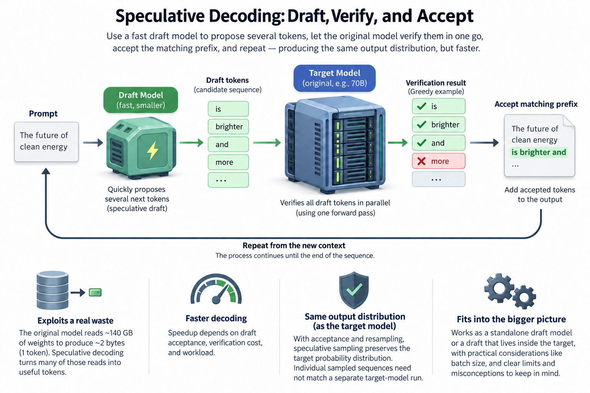
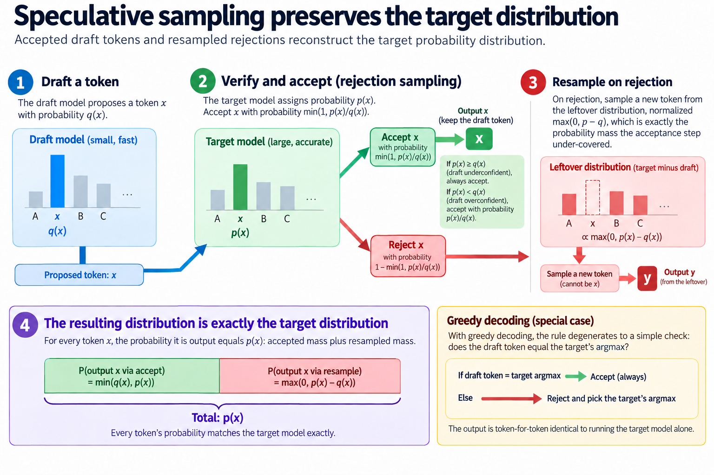
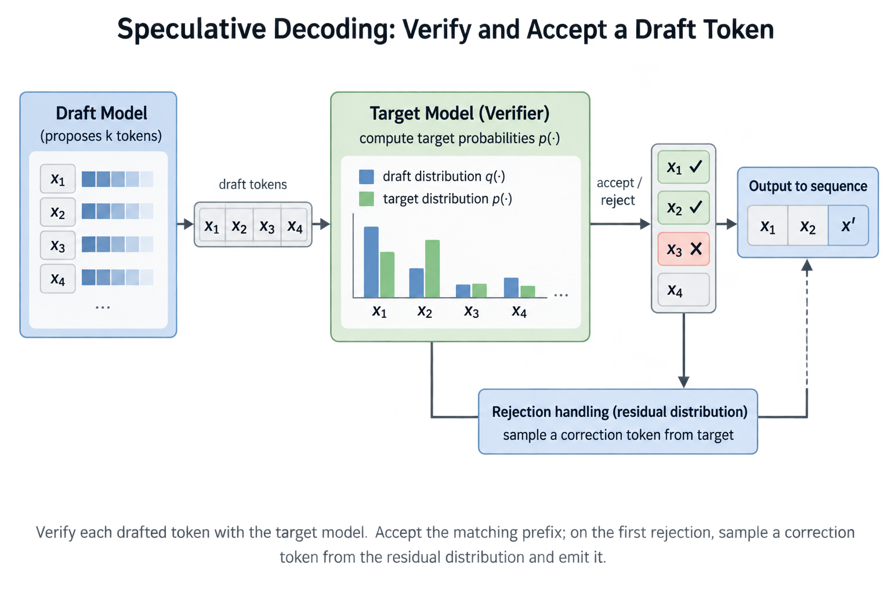
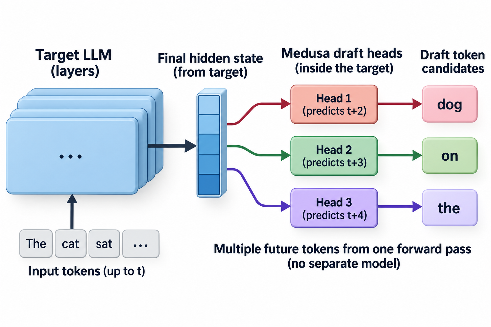

## Overview

A 70B-parameter model in FP16 streams roughly 140 GB of weights through the GPU to emit 1 token, which is about 2 bytes of useful output. On an H100 SXM with 3.35 TB/s of HBM bandwidth, that read alone takes ~42 ms, and no amount of extra compute shortens it. Speculative decoding attacks exactly this waste: it routinely delivers 2-3x faster decoding while producing, provably, the *same* output distribution as the original model.

That last clause is the part people refuse to believe at first, so let's earn it properly.

## Deep dive

### The waste speculation exploits

During [decode](/blog/how-an-llm-generates-text/), an autoregressive model generates 1 token per forward pass, and each pass must read every weight from HBM. The arithmetic per token is tiny relative to the bytes moved, so the tensor cores sit mostly idle while the memory system does all the work. This is [the memory wall](/blog/the-memory-wall-latency-numbers/) in its purest form: at batch size 1, a GPU capable of ~990 TFLOPS of dense BF16 might sustain 1-2% of that during decode.

Here's the asymmetry that makes speculation possible. Verifying a *sequence* of tokens is cheap; generating 1 is expensive. If someone hands you 5 candidate tokens, the target model can score all 5 positions in a single forward pass, because a transformer processes positions in parallel (that's the whole reason prefill is fast). The weight read is the same ~140 GB whether you evaluate 1 position or 5. 5 positions for the price of 1.

So the recipe, first published by Leviathan, Kalman, and Matias at Google and independently by Chen et al. at DeepMind:

1. **Draft.** Run a small, cheap model autoregressively to propose the next *k* tokens. A 1B draft next to a 70B target costs ~1.5% of the bandwidth per token.
2. **Verify.** Run the big target model *once* over all k drafted positions in parallel. This yields the target's probability distribution at every position, including position k+1.
3. **Accept or reject.** Walk left to right, keeping drafted tokens the target agrees with. At the first disagreement, throw away the rest and substitute a token drawn from the target's own (corrected) distribution.

Every verification pass emits at least 1 token, because even if the very first draft token is rejected, the correction comes straight from the target's distribution. And if all k drafts survive, you also get a free "bonus" token: the target's prediction at position k+1 was computed anyway.

### Why the output is exactly the same

The acceptance rule is a small piece of rejection sampling, and it is worth seeing in plain words because it converts speculation from "clever approximation" to "exact algorithm."

Say the draft model proposed token *x* with probability *q(x)*, and the target model assigns it probability *p(x)*. Accept *x* with probability min(1, p(x)/q(x)). Where the draft was *underconfident* relative to the target (p ≥ q), always accept. Where it was *overconfident* (p < q), accept proportionally, keeping exactly the p/q fraction. On rejection, resample from the leftover distribution, normalized max(0, p − q), which is precisely the probability mass the acceptance step under-covered.

Add the 2 paths together and every token comes out with probability exactly p(x). Not approximately: the accepted mass plus the resampled mass reconstruct the target distribution identically. With greedy decoding the rule degenerates to a simple check, does the draft token equal the target's argmax, and the output is token-for-token identical to running the big model alone. Both original papers carry the 3-line proof; the intuition above is all of it.

This is what separates speculative decoding from distillation, quantization, or early exit. Those trade quality for speed. Speculation trades *spare compute* for speed and touches quality not at all.

### A worked example you can check by hand

Take k = 4 drafted tokens per cycle and a per-token acceptance rate of α = 0.70, a realistic figure for a well-matched draft. Assume, as the original analysis does, that acceptances are roughly independent. Enumerate the outcomes of 1 draft-verify cycle:

| Outcome | Probability | Tokens emitted |
|---|---|---|
| First draft rejected | 0.30 | 1 (correction) |
| 1 accepted, then reject | 0.7 × 0.3 = 0.21 | 2 |
| 2 accepted, then reject | 0.7² × 0.3 = 0.147 | 3 |
| 3 accepted, then reject | 0.7³ × 0.3 = 0.103 | 4 |
| All 4 accepted | 0.7⁴ = 0.240 | 5 (4 + bonus) |

Expected tokens per cycle: 0.30·1 + 0.21·2 + 0.147·3 + 0.103·4 + 0.240·5 ≈ **2.77**. The closed form from Leviathan et al. gives the same thing: (1 − α^(k+1)) / (1 − α) = (1 − 0.168) / 0.3 ≈ 2.77.

Now wall-clock it. Suppose a target decode step takes 30 ms and each draft step takes 2 ms. The verify pass over 5 positions still costs ≈30 ms, because at low batch it's bandwidth-bound and reads the same weights. 1 cycle: 4 × 2 + 30 = 38 ms for 2.77 tokens, so 13.7 ms per token against the 30 ms baseline. **2.2x faster**, and the transcript is statistically indistinguishable from the unassisted model.

Play with α and you see why acceptance rate is the whole game. At α = 0.5 the expectation drops to 1.94 and the same cycle is only ~1.5x. At α = 0.85 it rises to 3.71 and you clear 2.9x. Every architectural idea in this space, from better draft models to draft trees, is ultimately an attempt to move α, or to get more expected tokens per verify at the same draft cost.

Longer drafts are not free wins either: pushing k from 4 to 8 at α = 0.7 raises expected tokens only from 2.77 to 3.20, while draft time doubles and rejected work grows. There's an optimal k for every (α, draft-cost) pair, and it's usually smaller than intuition suggests.

The verifier preserves the target distribution through probability accounting, not through a semantic judgment of draft quality. For target probabilities p and draft probabilities q at the same prefix:

$$
a(x)=\min\left(1,\frac{p(x)}{q(x)}\right),\qquad
r(x)=\frac{\max(0,p(x)-q(x))}{\sum_y\max(0,p(y)-q(y))}.
$$

Only proposed tokens with positive q need the ratio. The residual r is used after rejection; if rejection probability is 0, no residual draw is needed. For p equal to (0.6,0.4) and q equal to (0.8,0.2), accepted probability mass is (0.6,0.2). Rejection has mass 0.2 and the residual selects the second token, restoring exactly (0.6,0.4).

Under the simplifying assumption of independent, constant acceptance alpha, k draft tokens yield

$$
E[L]=\sum_{j=0}^{k}\alpha^j=\frac{1-\alpha^{k+1}}{1-\alpha},\qquad
\mathrm{speedup}\approx\frac{t_{\mathrm{target}}E[L]}{k t_{\mathrm{draft}}+t_{\mathrm{verify}}}.
$$

L includes a target-produced correction or bonus token. At alpha equal to 0.7 and k equal to 4, E[L] is 2.7731. With 30-millisecond target verification and 2 milliseconds per draft token, predicted speedup is 2.19. Measure acceptance by position and verification duration under real batching; context-dependent acceptance and saturated compute invalidate a single constant-alpha forecast.

### Going deeper: drafts that live inside the target

The classic setup needs a separate small model that behaves like the big 1, which is an annoying artifact to train, deploy, and keep in sync. The strongest recent methods dissolve the draft into the target itself.

**Medusa** (Cai et al.) bolts extra decoding heads onto the target's final hidden state: head 1 predicts token t+2, head 2 predicts t+3, and so on, all from 1 forward pass, no separate model. Because each head alone is weak, Medusa drafts a small *tree* of candidate continuations and verifies the whole tree in one pass using a tree-shaped attention mask, so many alternative branches share 1 weight read. The paper reports 2.3-3.6x depending on model and task.

**EAGLE** (Li et al.) drafts at the feature level instead of the token level: a single lightweight transformer layer autoregressively extends the target's last hidden state, then reuses the target's own LM head to produce token candidates. The target's hidden features are much more predictable than sampled tokens, so acceptance rates jump. **EAGLE-2** goes further by making the draft tree dynamic: it uses the draft model's confidence scores to grow the tree where acceptance is likely and prune where it isn't, reporting speedups of roughly 3x to 4x (best on code generation, where text is most predictable). All these numbers are the authors' own benchmarks, single-request latency on their hardware, so treat them as upper bounds rather than what your cluster will see.

The trend line matters more than any single number: draft quality keeps improving because the draft gets to peek at richer signals from the target, while verification cost stays 1 parallel pass.

### The batch-size catch

Everything above assumed the verify pass is "free" beyond its weight read. That's true at batch 1 and thoroughly false at batch 64.

Speculation spends extra FLOPs to save bandwidth-bound time: draft FLOPs, plus target FLOPs on every position that ends up rejected. At low batch the GPU has enormous idle compute, so some of this spend can fit within otherwise unused compute capacity. As continuous batching drives up concurrency, decode arithmetic intensity climbs, and the GPU drifts from memory-bound toward compute-bound. Now every speculative FLOP displaces useful work for some other request in the batch. At α = 0.7 and k = 4, the expected accepted draft prefix is only 1.773 of 4 proposals; later rejected-prefix work is substantial, and at high batch that waste turns into real throughput loss rather than harvested idle time.

So production schedulers treat speculation as a latency tool, not a throughput tool: enable it for interactive, low-concurrency traffic where [TPOT](/blog/ttft-and-tpot/) is the metric that matters, shrink k or disable it as batch pressure rises. vLLM's implementation exposes exactly this knob for that reason. This is the same logic that drives [prefill/decode disaggregation](/blog/the-prefill-decode-disaggregation-story/): different phases and different traffic mixes want different operating points on the same hardware.

### Common misconceptions

**"Speculative decoding is a lossy approximation, so quality must drop a little."** No. The rejection-sampling rule reconstructs the target distribution exactly; with greedy sampling the output is bit-identical to the unassisted model. This is proven in 3 lines in both founding papers, not measured empirically and hoped for. If a deployment shows quality drift, something else is wrong (a mismatched tokenizer, a relaxed acceptance rule, or "lossy" variants deliberately chosen for extra speed).

**"A stronger draft model always helps."** Only if it raises acceptance enough to pay for its own latency. Rerun the worked example with a draft that costs 8 ms per token instead of 2 ms but lifts α from 0.70 to 0.80: expected tokens rise to 3.36, but the cycle now costs 4 × 8 + 30 = 62 ms, or 18.5 ms per token, slower than the *worse* draft's 13.7 ms. What you want is alignment with the target per unit cost, which is why a distilled sibling or an EAGLE head beats a generically "better" small model.

**"It saves compute."** It spends strictly *more* FLOPs than plain decoding: the entire draft, plus target work on every rejected position. What it saves is time spent stalled on memory bandwidth. That's precisely why the technique shines at batch 1 and fades at batch 64, and why "speculation made my throughput worse" is not a bug report, it's the roofline talking.

### Where this sits in the bigger picture

Speculative decoding is the third member of a family of tricks that all answer the same question: decode wastes the GPU's parallelism, so where do we find useful parallel work? Batching finds it across *requests*. Speculation finds it across *future positions of 1 request*, which makes it the rare optimization that helps the single user waiting on a chatbot rather than the aggregate. That is also why it shows up in latency-critical products first: the technique buys the thing money otherwise can't, faster tokens for 1 stream, without the accuracy negotiations that quantization requires. If you internalize 1 diagram from this series, make it the one at the top: sequential cheap guesses, 1 parallel expensive check, exact output. Most of modern inference optimization is variations on that move.

## Conclusion

- Decode is bandwidth-bound, so verifying k drafted tokens in one target pass costs about the same as generating 1; acceptance rate α converts that slack into real speedup, (1 − α^(k+1))/(1 − α) expected tokens per pass.
- The rejection-sampling acceptance rule makes the output distribution *exactly* the target model's. Speed without a quality trade, at the price of extra FLOPs.
- Those extra FLOPs are free only when the GPU has idle compute: speculation is a low-batch latency optimization that fades, and can invert, at high batch.

### Sources

- Leviathan, Kalman, Matias. *Fast Inference from Transformers via Speculative Decoding.* ICML 2023. https://arxiv.org/abs/2211.17192
- Chen et al. *Accelerating Large Language Model Decoding with Speculative Sampling.* DeepMind, 2023. https://arxiv.org/abs/2302.01318
- Cai et al. *Medusa: Simple LLM Inference Acceleration Framework with Multiple Decoding Heads.* 2024. https://arxiv.org/abs/2401.10774
- Li et al. *EAGLE: Speculative Sampling Requires Rethinking Feature Uncertainty.* ICML 2024. https://arxiv.org/abs/2401.15077
- Li et al. *EAGLE-2: Faster Inference of Language Models with Dynamic Draft Trees.* EMNLP 2024. https://arxiv.org/abs/2406.16858
- vLLM project, speculative decoding implementation. https://github.com/vllm-project/vllm

*Part of the [LLM Inference & Serving](/series/llm-serving/) learning path. Browse its published articles by topic.*
