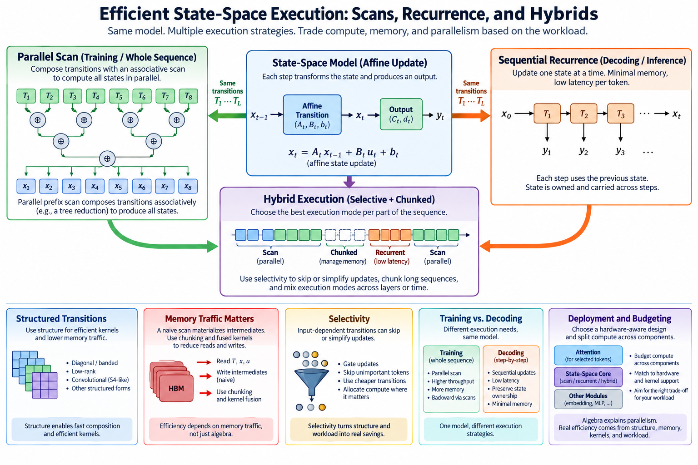
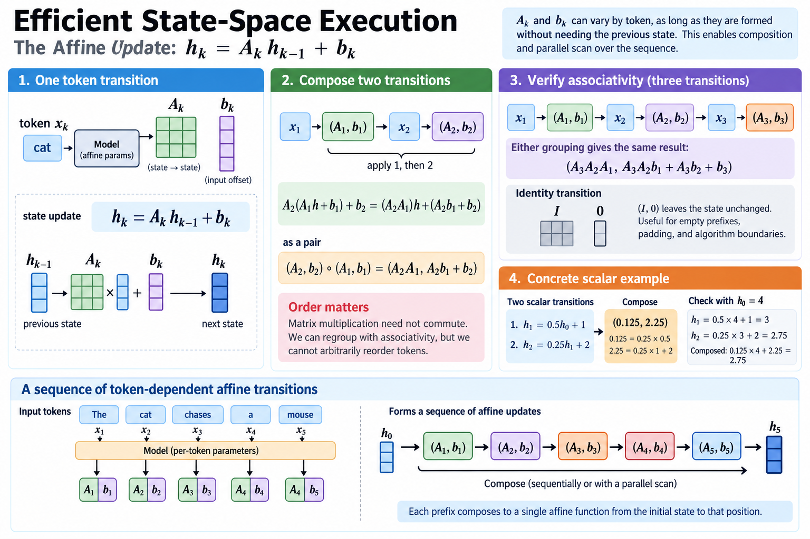
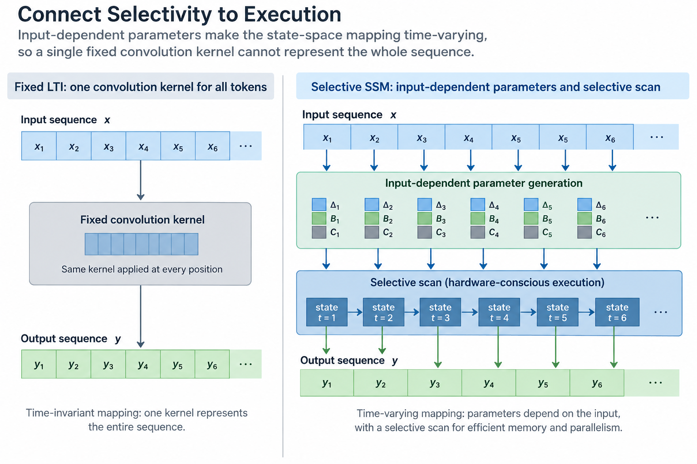
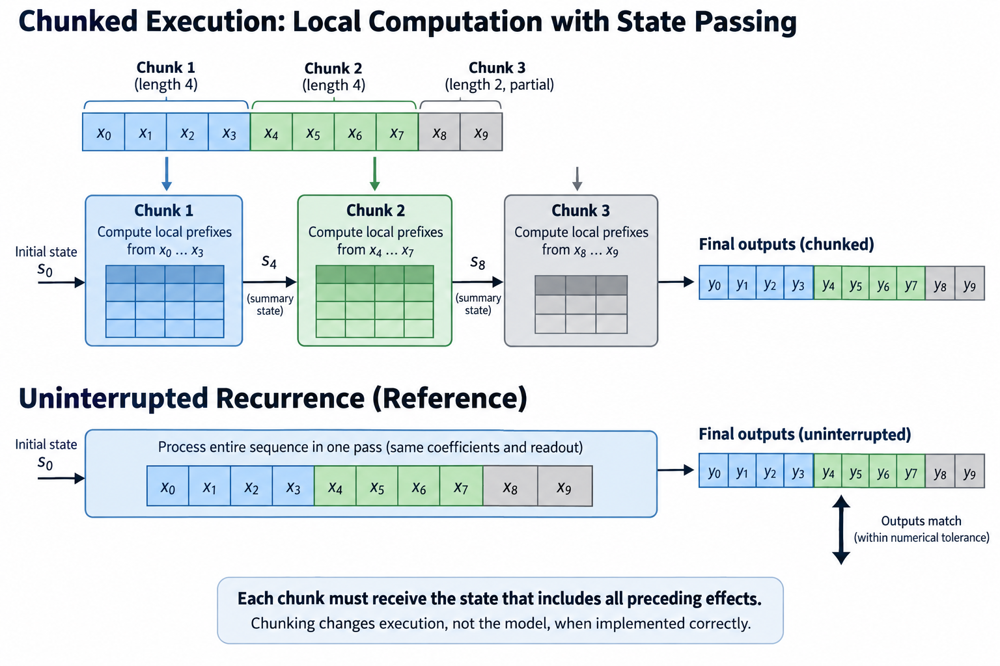
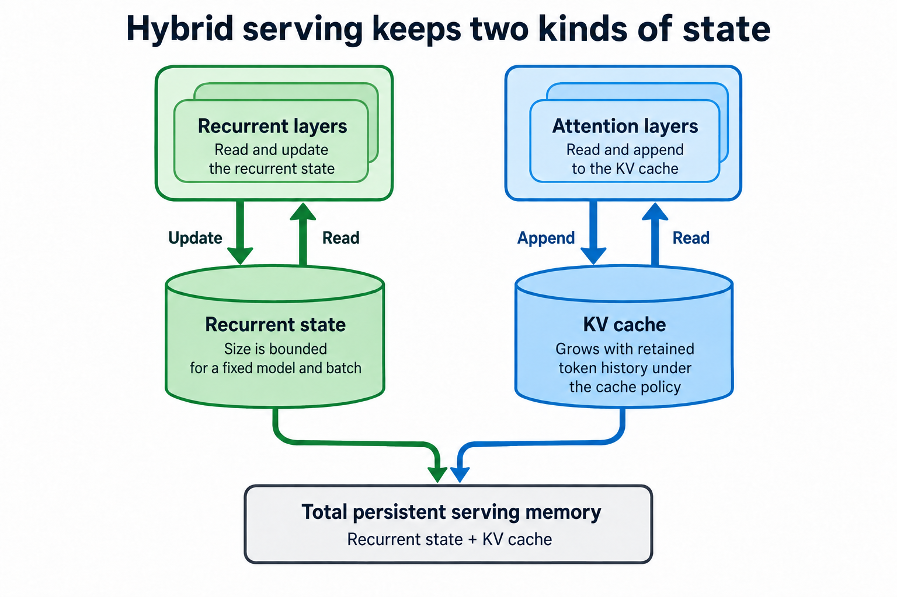
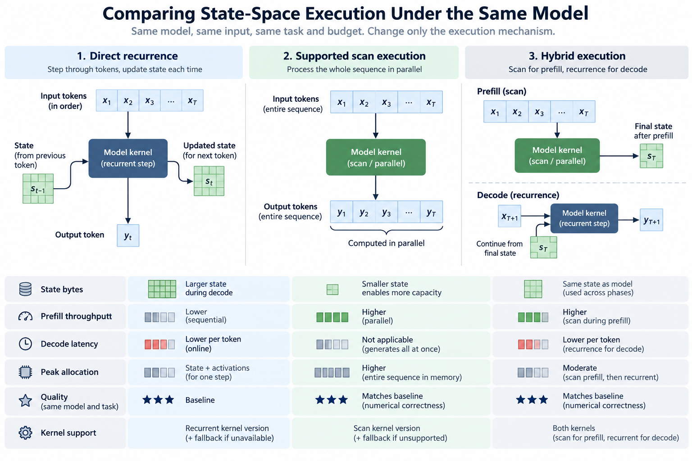
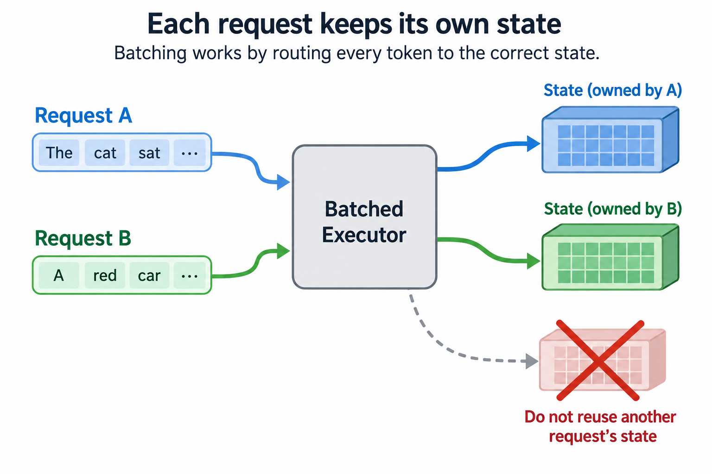

## Overview

A recurrence appears sequential because each state depends on the previous one, but for an affine state update the transition functions can be composed associatively, so a parallel scan can organize that composition over a whole sequence while incremental inference still updates 1 state at a time.

This article derives the composition law and connects it to selective state-space execution, chunking, and hybrid architectures. The algebra explains available parallelism, but actual efficiency depends on 4 further things: structured matrices, memory traffic, kernel support, and workload. It is not a benchmark claim that every scan automatically beats attention.

*An original conceptual illustration. Numerical plots and examples are illustrative unless explicitly identified as measured evidence.*

## Deep dive

### 1. Define the affine update

Write one sequence transition as a matrix A_k and an input-dependent offset b_k. The state can take either of 2 shapes: a vector, or a structured collection of values under the architecture's representation.

$$
h_k=A_kh_{k-1}+b_k.
$$

The 2 coefficients A_k and b_k can vary by token while remaining fixed for the purpose of evaluating a given forward sequence. Their dependence on input does not prevent composition of the resulting affine functions.

The important distinction is whether the coefficients themselves require an unavailable previous state, since the scan argument considered here assumes they can be formed under the model's supported interface before or during the organized computation, and arbitrary nonlinear recurrent functions do not inherit this simple affine composition law.

### 2. Compose two transitions

Apply transition 1 and then transition 2. Substitution gives a combined matrix product and a combined offset.

$$
A_2(A_1h+b_1)+b_2=(A_2A_1)h+(A_2b_1+b_2).
$$

Represent a transition by the pair (A,b). Composition in temporal order therefore produces the pair (A_2A_1, A_2b_1+b_2).

Order matters because matrix multiplication need not commute. A parallel algorithm can regroup composition but cannot arbitrarily reorder tokens. This distinction prevents a common implementation mistake: associativity permits a tree of operations, while commutativity would permit swapping them. The recurrence needs only the first of those 2 properties.

### 3. Verify associativity

Composing 3 transitions yields the same combined mapping under either grouping. The final matrix is A_3 A_2 A_1, and the offset accumulates earlier contributions through later transitions.

$$
b_{321}=A_3A_2b_1+A_3b_2+b_3.
$$

This associativity supports prefix computation. Each prefix gives the composed function from the initial state to the state at that position.

The identity transition is the pair (I,0). It is useful for empty prefixes, padding, and algorithm boundaries. Preserve the initial-state convention: applying a prefix function to a nonzero initial state differs from using only its offset. Algebraic correctness should be checked on a tiny case before optimizing execution.

### 4. Work through a scalar prefix

Take a first scalar transition with multiplier 0.5 and offset 1, followed by a second with multiplier 0.25 and offset 2. The composed multiplier is 0.125, and the offset is 2.25.

Starting from state 4, direct recurrence produces 3 after the first transition and 2.75 after the second. Applying the composed pair gives 0.125 times 4 plus 2.25, also 2.75.

The example verifies temporal order and offset propagation. Reversing the pair order generally changes the result. These small known values, such as the 2.75 that both routes produce, are more useful for detecting composition mistakes than an unexplained large random test, though neither establishes learned-model quality.

### 5. Explain parallel prefix scan

A scan computes every prefix of an associative operation. A tree can combine neighboring transitions 2 at a time, then distribute prefix information to recover states across the sequence.

For L items, appropriate parallel scan algorithms can have logarithmic dependency depth while keeping total work proportional to L under a constant-cost associative operation.

$$
\text{work}=O(L),\qquad \text{parallel depth}=O(\log L).
$$

These bounds exclude the cost of each pair composition, and general dense matrix multiplication is expensive, so the structure of A matters: a theoretical logarithmic dependency depth does not imply low wall time or efficient GPU occupancy for every state representation and sequence length.

### 6. Use structured transitions

Diagonal transitions replace matrix products with elementwise multiplication, 1 multiply per state channel, and the offset update uses compatible elementwise operations. Other structured forms can offer their own efficient composition paths.

State-space parameterization and execution algorithm are 2 halves of the same question and must be discussed together. A generic dense n-by-n transition can require much more work and storage than a diagonal or constrained representation.

Inspect the 4 actual tensor axes, batch, channels, state width, and sequence, along with parameter sharing. A scalar composition example explains the law, but implementation must preserve those axes. Broadcasting mistakes can silently turn an intended selective recurrence into a different mapping with the same output shape.

### 7. Connect selectivity to execution

The selective state-space design in Mamba makes parameters including discretization step, input mapping, and readout depend on the input. That changes a fixed time-invariant mapping into a time-varying one.

1 fixed convolution kernel no longer represents the whole sequence in the same way as an LTI system. The architecture instead uses a hardware-conscious selective scan path.

The mathematical recurrence and its optimized evaluation are 2 complementary innovations. Content-dependent coefficients address information selection, while execution organization addresses memory and parallelism. Discuss both rather than treating input dependence alone as a guarantee of efficiency or presenting a generic scan as the complete original algorithm.

### 8. Understand memory traffic in a naive scan

Materializing expanded state at every token can create a tensor proportional to the product of 3 axes: sequence length, channel count, and state dimension. Reading and writing it can overwhelm the benefit of parallel arithmetic.

$$
M_{\mathrm{expanded}}\propto BLDNp.
$$

Here B is batch, L sequence length, D channels, N state width, and p bytes per value under this illustrative layout. Actual sharing and implementations can change the tensor structure.

The hardware-aware execution in Mamba emphasizes organizing computation and memory so that large intermediate state is not unnecessarily moved through device memory. Inspect which values are materialized, retained, or recomputed. Operation counts alone cannot establish the cost of a selective state-space layer.

### 9. Explain chunked execution

Chunking divides a long sequence into blocks, where each block computes local prefix information and block summaries compose across boundaries, so the initial state passed into chunk 2 must already include everything chunk 1 produced.

This can balance 3 pressures: local parallelism, memory footprint, and kernel scheduling. Chunk length affects temporary work, synchronization, and utilization, so it is an execution parameter rather than a semantic change when implemented correctly.

Verify a 2-chunk computation against uninterrupted recurrence with nonzero initial state. Also test a partial final chunk. The exact output should agree within the chosen numerical tolerance under the same coefficients and readout. A reset at each boundary would define a different model.

### 10. Distinguish whole-sequence training from decoding

Whole-sequence processing has many known inputs and can exploit prefix parallelism. Autoregressive decoding receives 1 newly generated token at a time and usually updates the retained state incrementally.

The recurrent state can remain bounded by architecture dimensions rather than context length. However, weights, temporary work, and any hybrid attention cache remain 3 separate memory terms.

Measure prefill and decode under their actual shapes. A fast full-sequence scan does not automatically establish one-token latency, and bounded state does not establish equivalent long-context retrieval quality. The execution and information tradeoffs need separate evidence.

### 11. Account for backward computation

Training must differentiate through the recurrence and its input-dependent coefficients. Saving every intermediate can consume memory; recomputation can reduce storage at the cost of additional work.

An optimized backward path can exploit structure, but it still needs correct gradients for the selected parameterization and nonlinear surrounding operations. Freezing some components does not remove all input-gradient requirements.

Use a tiny finite-difference or reference-autodiff comparison for composition and coefficient gradients when implementing a new kernel. Then measure complete training resource use. A forward-only scan benchmark cannot establish total adaptation or pretraining efficiency.

### 12. Explain state-space duality carefully

Mamba-2 develops a state-space duality perspective and execution design connecting structured sequence operations to forms that can map efficiently to hardware. Its mathematical constraints and block algorithms differ from simply applying the original Mamba scan unchanged.

The useful lesson is that equivalent or related mathematical representations can expose different compute primitives and memory organizations. Exact applicability depends on the parameterization.

Read the primary method before translating the duality into an implementation. A broad analogy between recurrence and attention is not proof that every attention matrix can be replaced by an arbitrary fixed-size state without changing the model's information access or quality.

### 13. Budget hybrid architectures explicitly

A hybrid can combine recurrent state-space layers with attention layers. It then carries recurrent state for one subset and context-dependent cache for the attention subset under the chosen cache policy.

$$
M_{\mathrm{state}}=M_{\mathrm{recurrent}}+M_{\mathrm{attention\ cache}}+M_{\mathrm{other}}.
$$

The attention term can still grow with context, even if many layers use bounded recurrence. Report the layer schedule, state dimensions, attention heads, cache precision, and context envelope.

Hybrids can balance information access and cost, but their existence does not establish a universal best ratio, so evaluate actual task behavior and backend execution: a model family label is insufficient to determine whether its serving memory is entirely independent of sequence length.

### 14. Inspect numerical regrouping

Associativity holds in exact real arithmetic. Floating-point addition and multiplication can produce small differences when a scan tree changes grouping relative to serial recurrence.

Use tolerances appropriate to dtype, sequence length, and coefficient magnitudes. Inspect long-sequence behavior and transient amplification where relevant. A bitwise-equality requirement can be inappropriate for mathematically equivalent regrouping, while a loose tolerance can hide an indexing mistake.

Separate numerical error from state-selection quality. More precision can reduce rounding effects but cannot recover information the architecture never retained. Both belong in a complete evaluation under the intended context envelope.

### 15. Build a meaningful comparison

Compare direct recurrence, supported scan execution, and any relevant alternative under the same coefficients for numerical correctness. For learned architecture comparisons, hold task evaluation, generation budgets, and workload definitions consistent.

Report state bytes, prefill throughput, decode latency, peak allocation, and quality. Include kernel versions and unsupported fallbacks. A smaller state can enable capacity while another workload remains limited by weights or dispatch.

No sequence model or GPU kernel was executed for this article. The prefix example and complexity expressions are explanatory. Primary sources provide evidence under their configurations; a new deployment needs measurements of its own architecture and backend.

### 16. Connect algebra to a concrete deployment

Affine composition exposes parallelism without changing temporal order. Structured transitions make composition affordable, while memory-aware organization determines whether the available arithmetic maps efficiently to hardware.

Incremental inference uses the same model through a retained state, and hybrids add other context storage. State-management, chunk boundaries, predictor interfaces, and numerical tolerances therefore belong in the deployment contract.

The useful architecture explanation identifies what information is compressed, which coefficients depend on content, and which algorithm evaluates the resulting mapping. That connects state-space theory to systems performance without replacing task evidence with a complexity slogan.

### 17. Preserve state ownership in serving

Each independent sequence needs the state associated with its own processed prefix. Reusing another request's state or resetting a continued request changes the model's input history. Batching therefore requires correct sequence-to-state indexing as well as efficient kernels.

Branching generation can require copying or otherwise managing state for several continuations. Prefix reuse also needs an exact compatibility contract for model revision, numerical policy, and processed tokens. A bounded state is smaller than some context caches, but it still has ownership and lifetime rules.

## Conclusion

Test a small interleaved pair of sequences against independent execution. Then test continuation after a pause and branching from one shared prefix. These checks verify service state management without confusing it with the mathematical scan's numerical correctness or the model's held-out quality.

### Sources

- [Mamba: Linear-Time Sequence Modeling with Selective State Spaces](https://arxiv.org/abs/2312.00752).
- [Transformers are SSMs: Generalized Models and Efficient Algorithms Through Structured State Space Duality](https://arxiv.org/abs/2405.21060).
- [Efficiently Modeling Long Sequences with Structured State Spaces](https://arxiv.org/abs/2111.00396).
