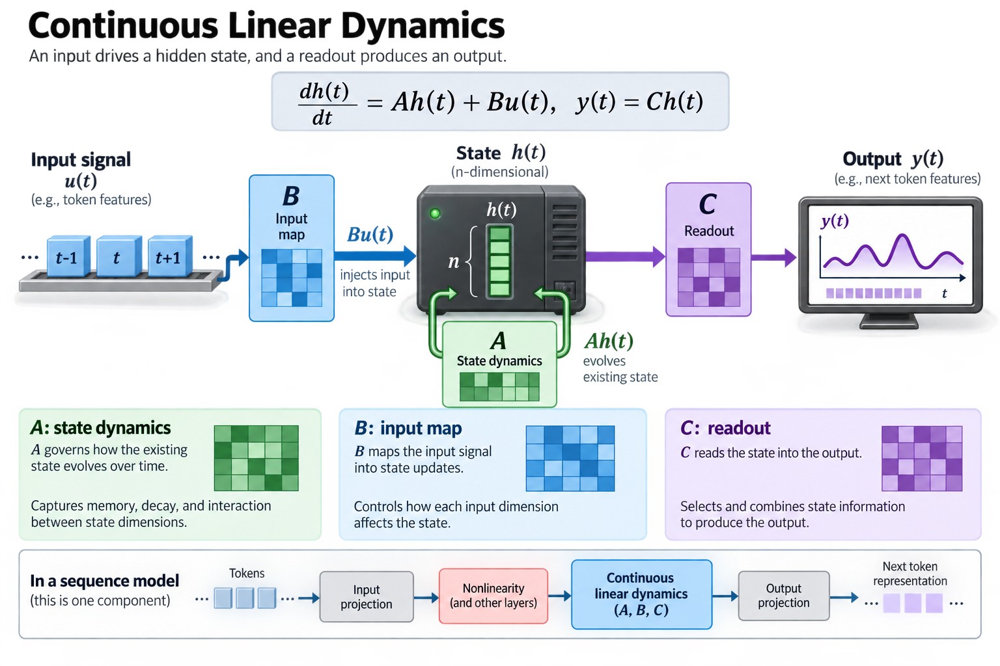
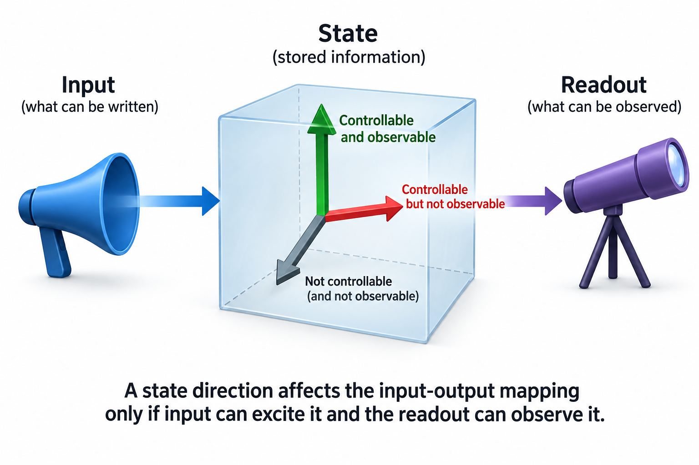

State-space models summarize an input sequence through an evolving state. Their mathematical foundation comes from dynamical systems: an input drives a hidden state, and a readout produces an output. Discretization connects continuous dynamics to token-by-token computation, while structure determines whether the model can also be evaluated efficiently over a whole sequence.

This article derives the basic dynamics, discrete transitions, stability, and convolution relationship. It then explains what changes when parameters depend on input. The examples are illustrative foundations for understanding sequence architectures, not benchmark evidence that one architecture universally outperforms attention.

*An original conceptual illustration. Numerical plots and examples are illustrative unless explicitly identified as measured evidence.*

## 1. Define continuous linear dynamics

Let u(t) be an input signal, h(t) an n-dimensional state, and y(t) an output. A continuous linear state-space system uses matrices A, B, and C to define evolution and readout.

$$
\frac{dh(t)}{dt}=Ah(t)+Bu(t),\qquad y(t)=Ch(t).
$$

A governs how existing state evolves, B maps input into state, and C reads state into output. Some systems also include a direct input-to-output term; the simplified equations omit it to isolate the recurrence.

A sequence model places these dynamics inside a learned architecture with projections, nonlinearities, and other components. The linear system is an important mechanism, but it is not a complete language model by itself.

## 2. Solve the state over an interval

For constant matrices, the solution over an interval of length Delta combines homogeneous state evolution with an integral of the driven input.

$$
h(t+\Delta)=e^{\Delta A}h(t)+\int_0^\Delta e^{(\Delta-\tau)A}Bu(t+\tau)\,d\tau.
$$

The matrix exponential carries the previous state forward. The integral accumulates input effects over the interval, weighted by subsequent state dynamics.

This expression shows why discretization requires an input assumption. A token sequence does not directly specify a continuous function between samples. A zero-order hold or another rule provides that missing interface. The resulting discrete coefficients depend on that rule and the step size.

## 3. Derive zero-order-hold discretization

Assume input remains constant over the interval. The continuous solution becomes a discrete recurrence with transition A_bar and input map B_bar.

$$
\bar A=e^{\Delta A},\qquad \bar B=\int_0^\Delta e^{\tau A}B\,d\tau,\qquad h_k=\bar A h_{k-1}+\bar B u_k.
$$

The integral expression remains valid when A is singular. A formula using A inverse is only appropriate under its additional invertibility assumptions and numerical handling.

The recurrence maps a sampled input into a new state. Indexing conventions can place the sample at another interval boundary, so define them consistently before translating the formula into code. Discretization is a numerical interface, not merely replacing derivatives with token indices.

## 4. Work through a scalar decay

Consider dh/dt equal to negative 2h plus u, with interval length 0.5 and constant input. The discrete state multiplier is exp of negative 1, approximately 0.3679.

The input multiplier is the integral of exp of negative 2tau over the interval, approximately 0.3161. Starting from state 0 and input 1 gives a new state of approximately 0.3161.

These values show how continuous decay and input accumulation combine. Using the transition exponential but replacing the input integral with an arbitrary coefficient would define a different discrete system. The example is a known scalar calculation, not evidence of a learned sequence model's quality or runtime.

## 5. Compare a forward-Euler approximation

Forward Euler approximates the state change using the current derivative. It produces a transition I plus Delta A and an input coefficient Delta B.

$$
\bar A_{\mathrm{Euler}}=I+\Delta A,\qquad \bar B_{\mathrm{Euler}}=\Delta B.
$$

For the scalar decay above, the state multiplier becomes 0 at Delta equal to 0.5. It differs substantially from the exact exponential multiplier despite being derived from the same continuous equation.

Larger steps can even make an Euler discretization unstable for a continuously stable system. This illustrates why discretization choice matters. A learned model can adapt parameters within a procedure, but the mathematical stability and representation assumptions should still be explicit.

## 6. Explain bilinear discretization

The bilinear or trapezoidal method produces another approximation using both sides of the interval. S4 uses a bilinear discretization under its stated formulation.

$$
\bar A=(I-\tfrac\Delta2 A)^{-1}(I+\tfrac\Delta2 A),\qquad \bar B=(I-\tfrac\Delta2 A)^{-1}\Delta B.
$$

The required inverse must exist, and an implementation usually solves the corresponding linear system rather than treating symbolic inversion as a numerical instruction.

For the scalar example, the transition multiplier becomes one third, closer to the exact 0.3679 than the Euler result at that step. This does not make bilinear discretization identical to zero-order hold. Each method has a distinct interface and approximation.

## 7. Define discrete stability

For a fixed linear discrete transition with no input, repeated state evolution multiplies by powers of A_bar. A standard asymptotic stability condition is that its spectral radius is below 1.

$$
\rho(\bar A)<1\quad\Longrightarrow\quad\bar A^k h_0\to0.
$$

This condition concerns fixed finite-dimensional linear dynamics. It does not imply that every learned nonlinear architecture using a similar component is globally stable under arbitrary inputs.

Non-normal matrices can also exhibit transient growth even when eigenvalues lie inside the unit circle. Inspect conditioning and numerical behavior when long recurrences matter. An eigenvalue plot is useful theory, but it should not be mistaken for a complete finite-precision robustness test.

## 8. Connect decay to memory timescales

For a scalar discrete multiplier a with magnitude below 1, an input contribution decays geometrically. A multiplier close to 1 retains effects longer than one close to 0.

$$
|a|^k=\tfrac12\quad\Longrightarrow\quad k_{1/2}=\frac{\log(1/2)}{\log|a|}.
$$

The half-life expression applies to the magnitude under its assumptions and excludes a equal to 0 or unit magnitude. It describes decay, not semantic memory accuracy.

Long retention can preserve useful context but also retain irrelevant information. A sequence architecture must decide what to write and read, not only how slowly state decays. This distinction motivates input-dependent selection mechanisms beyond fixed linear dynamics.

## 9. Unroll the discrete recurrence

With zero initial state and fixed coefficients, repeated substitution expresses the output as a weighted sum of past inputs.

$$
y_k=\sum_{j=0}^{k}C\bar A^{k-j}\bar B u_j.
$$

Each coefficient depends only on the lag k minus j. That time-invariant structure creates a convolutional representation with kernel K_l equal to C A_bar to the power l B_bar.

The recurrence and convolution describe the same fixed linear mapping under the initial-state and indexing convention. Their execution differs: recurrence suits incremental state updates, while convolution can expose whole-sequence parallelism. Computing the kernel efficiently is itself an important algorithmic problem.

## 10. Understand S4's structured contribution

S4 develops a structured state-space parameterization and efficient handling of the resulting sequence convolution. The contribution includes mathematical structure that makes large useful state spaces practical, rather than merely noticing that a recurrence can be unrolled.

The paper connects its design to long-range sequence modeling and prior state-space structure. Implementing it requires the exact parameterization and kernel computation, not only a generic dense matrix exponential.

Keep the convolutional training path and recurrent inference path attached to their numerical conventions. Equivalent real-number mappings can produce small finite-precision differences. Validate a small direct recurrence against convolution before measuring a learned complete architecture.

## 11. Make coefficients input dependent

Selective state-space designs allow some coefficients to depend on the current input. A broad recurrence can be written with timestep-specific transition and input maps.

$$
h_k=\bar A_k h_{k-1}+b_k,\qquad b_k=\bar B_k u_k.
$$

Mamba introduces input-dependent selection through parameters including step size and input/readout mappings under its architecture. That allows information propagation to respond to content rather than only fixed lag.

The fixed convolution identity no longer applies directly because coefficients depend on the sequence. The computational strategy must change accordingly. The next article derives how affine composition supports parallel scans even when a single fixed convolution kernel is unavailable.

## 12. Avoid an overly broad stability claim

Time-varying transitions require reasoning about products of matrices rather than powers of one fixed matrix. Individually benign eigenvalues do not automatically prove stability for arbitrary switching among noncommuting transitions.

A constrained diagonal or otherwise structured design can support stronger statements under specific parameter bounds. State those assumptions explicitly. Do not borrow a fixed-system spectral-radius argument and apply it unchanged to every selective model.

Also distinguish state stability from task performance. A stable model can forget useful information too quickly, while a numerically delicate recurrence can fail over long sequences. Quality and finite-precision execution need their own evidence under the intended context envelope.

## 13. Count state separately from context storage

A recurrent layer carries a state whose size is determined by its architecture rather than necessarily growing with the number of processed tokens. This can reduce incremental storage relative to retaining per-token attention keys and values.

That structural comparison excludes model weights, workspaces, and any attention layers in a hybrid architecture. State dimension, layer count, channels, and numerical format still determine bytes.

A bounded state is a compression of context. It must preserve the information needed for future outputs, and it may lose distinctions accessible to an explicit context cache. Storage scaling alone does not establish equal retrieval or reasoning quality.

## 14. Validate the dynamics interface

Use a scalar system with an analytic solution to check discretization coefficients. Compare a short fixed-coefficient recurrence with its explicit convolution. Inspect impulse response and decay under documented initial state.

For input-dependent coefficients, test direct recurrence and the supported parallel implementation on known small inputs. Preserve indexing, initial state, readout, and precision.

These checks establish numerical correctness, not learned-model quality. No sequence-model training or GPU execution was performed for this article. The primary papers provide experiments under their settings, while a new deployment requires its own quality and execution measurements.

## 15. Connect foundations to architecture decisions

State-space theory explains how inputs enter a state, how previous information evolves, and how outputs are read. Discretization determines the token-level transition, while time invariance determines whether a fixed convolution representation is available.

Selective mechanisms change those assumptions to support content-dependent retention and filtering. Efficient execution then requires algorithms matched to the new recurrence rather than applying the old convolution argument unchanged.

This foundation makes architecture comparisons more precise. Ask what information is compressed, what state is stored, which coefficients vary, and what execution path implements the mapping. Those questions connect mathematical dynamics to a concrete model-and-backend operating point.

## 16. Interpret the initial-state assumption

The convolution expression above assumes zero initial state. With a nonzero state, the output includes an additional homogeneous term involving C A_bar to the appropriate power times that initial state. Omitting it changes the mapping.

This matters when a service resumes cached recurrent state or processes a sequence in chunks. Chunk boundaries should preserve the intended state rather than resetting it accidentally. A whole-sequence zero-state test does not establish correct continuation behavior.

Use a tiny two-chunk example and compare with one uninterrupted recurrence. Include a nonzero initial state so that boundary handling is visible. The test connects continuous and discrete theory to the practical state-management contract needed for incremental sequence execution.

## 17. Distinguish stored state from accessible information

A state direction matters to the input-output mapping only when input can excite it and the readout can observe it. Classical controllability and observability formalize these properties for a fixed linear system. Adding more state dimensions does not automatically add useful memory if those directions are inaccessible or invisible under the chosen maps.

This provides a useful architecture intuition without replacing learned-model evaluation. Input maps determine what can be written, transitions determine what persists, and readouts determine what can affect predictions. Selective designs make some of those interfaces content dependent, changing the problem beyond the fixed linear setting.

Inspect the complete architecture rather than reporting state dimension alone as a quality measure. A larger state can add storage and computation while failing to preserve the distinctions a task needs. The useful comparison connects the write, evolution, and read interfaces to held-out sequence behavior.

## Sources

- [Efficiently Modeling Long Sequences with Structured State Spaces](https://arxiv.org/abs/2111.00396).
- [HiPPO: Recurrent Memory with Optimal Polynomial Projections](https://arxiv.org/abs/2008.07669).
- [Mamba: Linear-Time Sequence Modeling with Selective State Spaces](https://arxiv.org/abs/2312.00752).
