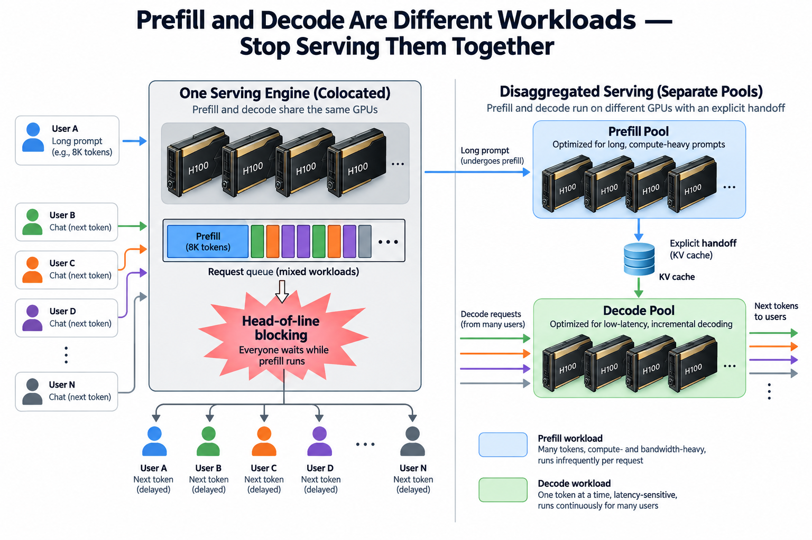
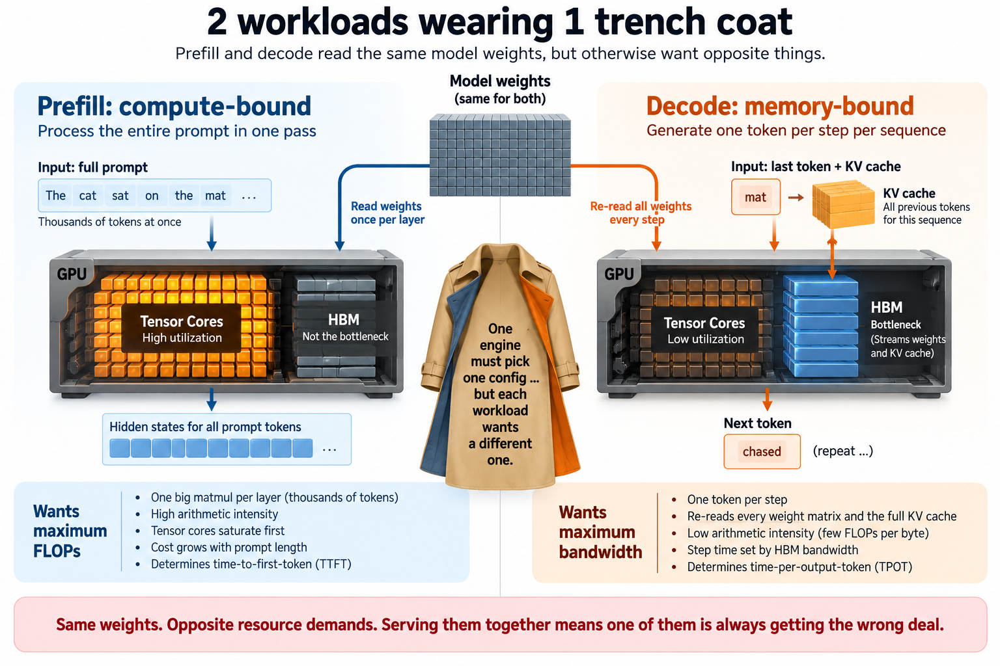
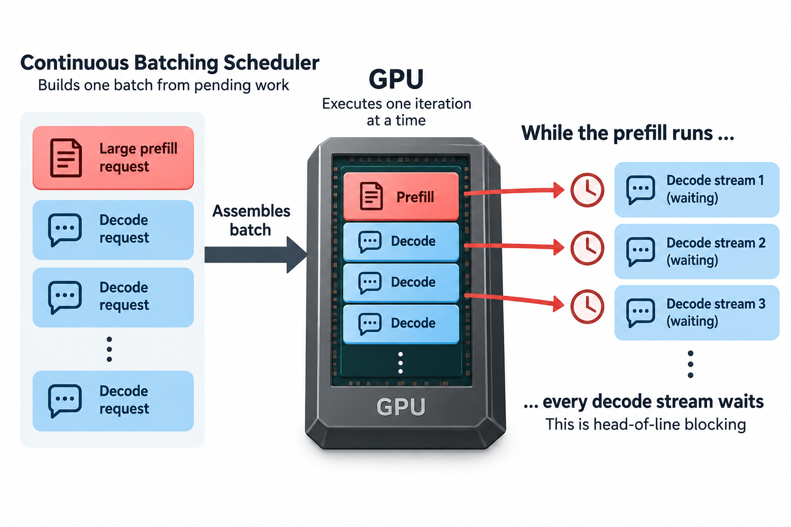
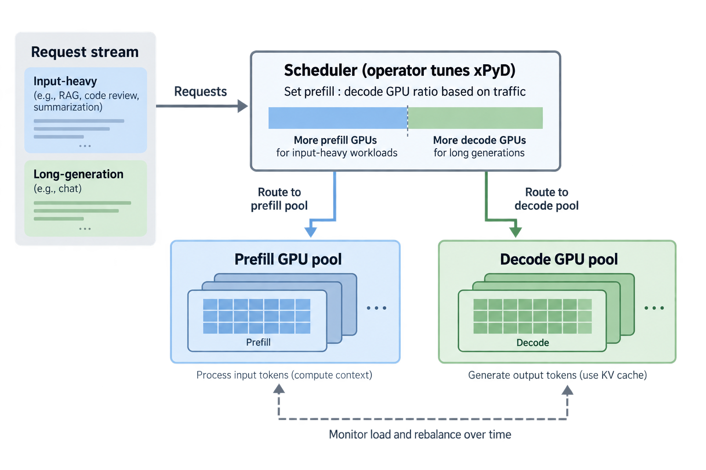

## Overview

An illustrative 70B-model calculation using 1 H100's compute and bandwidth budget gives roughly 2.9 seconds for an 8,192-token prefill. The 140 GB of BF16 weights require multiple 80 GB GPUs in a real deployment, so these numbers are a reference model rather than a runnable single-GPU configuration. If that prefill runs inside the same engine that is decoding for 30 other users, every 1 of those users watches their next token arrive 2.9 seconds late — a 69x spike over the 42 ms they were getting a moment earlier. This is not a pathological corner case. The DistServe team measured decode inter-token latency inflating 2–30x under colocation on real traces, and that single observation went from rejected paper to the default architecture of every major serving stack in about 18 months.

This article is the operator's view: why the interference happens, how to compute it by hand for your own traffic, what the KV handoff actually costs, and where disaggregation does *not* pay. If you want the history of how the idea won — Splitwise, DistServe, Mooncake, and NVIDIA eventually cutting a dedicated prefill chip — that story is in [The Prefill/Decode Disaggregation Story](/blog/the-prefill-decode-disaggregation-story/). Here we do the math.

## Deep dive

### 2 workloads wearing 1 trench coat

Autoregressive inference has 2 phases with almost nothing in common except the weights they read. (If the phases themselves are new to you, start with [How an LLM Generates Text](/blog/how-an-llm-generates-text/).)

**Prefill** processes the entire prompt in 1 pass. Every layer runs 1 big matmul over thousands of tokens at once, so the arithmetic intensity — FLOPs performed per byte fetched from memory — is high. The GPU behaves like a training accelerator: tensor cores saturate long before HBM bandwidth does. Prefill is **compute-bound**, its cost grows linearly with prompt length (quadratically in the attention term), and the user-facing metric it determines is time-to-first-token (TTFT).

**Decode** generates 1 token per step per stream. Each step must re-read every weight matrix and the full KV cache to produce a single token per sequence, so arithmetic intensity is miserable — a handful of FLOPs per byte. Decode is **memory-bound**: the step-time floor is set by how fast HBM can stream the weights, not by how fast the tensor cores multiply. Its metric is time-per-output-token (TPOT). The [TTFT and TPOT](/blog/ttft-and-tpot/) primer covers why these 2 numbers, not aggregate tokens/s, define user experience.

So 1 phase wants maximum FLOPs, the other wants maximum bandwidth; 1 wants small tensor-parallel groups sized for TTFT, the other wants huge batches to amortize the weight reads; 1 finishes in a burst, the other trickles for minutes. A colocated engine must pick 1 configuration — 1 parallelism layout, 1 batching policy, 1 scheduler — and impose it on both. Whatever it picks is wrong for 1 of them.

But the config compromise is the smaller problem. The bigger 1 is interference in time.

### The head-of-line blocking math

Modern engines use continuous batching: at every iteration the scheduler assembles a batch from whatever work is pending — decode steps for running streams, prefills for newly admitted requests — and launches it. The GPU executes iterations serially. So when a large prefill enters an iteration, every decode stream in the engine waits for it. That is head-of-line (HOL) blocking, and you can compute its size with 4 numbers.

Use a 70B-parameter dense model in BF16 and 1 H100's resource budget as a hypothetical reference. Its 140 GB of weights do not fit 1 80 GB H100. Real tensor-parallel deployments divide the weights across GPUs and add communication; measured performance and ratios need not scale uniformly.

**Decode floor.** 70B params × 2 bytes = 140 GB of weights, streamed once per decode iteration. At H100's ~3.35 TB/s HBM3 bandwidth: 140 / 3350 ≈ **42 ms per iteration**. Every stream in the batch shares that read, which is why decode wants big batches; but no batch makes it faster than 42 ms. That is an idealized weight-transfer bound, not a measured healthy TPOT.

**Prefill cost.** Linear-layer FLOPs are ≈ 2 × params × tokens. For an 8,192-token prompt: 2 × 70e9 × 8192 ≈ 1.15 PFLOP. At an assumed 40% utilization of the H100's ~990 TFLOPS BF16 peak, that is 1.15e15 / 4.0e14 ≈ **2.9 seconds** of GPU time, attention cost not included.

**The stall.** Run that prefill unchunked in a colocated engine and 30 concurrent decode streams each experience 1 inter-token gap of ~2.9 s — a **69x** multiple of the 42 ms median. Their users see the generation visibly freeze.

**Now add traffic.** Say your mix is 90% short prompts (512 tokens ≈ 0.18 s of prefill) and 10% long ones (8,192 tokens ≈ 2.9 s), arriving at 2 requests/s. On average a long prefill lands every 5 seconds. In any 10-second window, a decoding user expects to eat about 2 long-prefill stalls: roughly 5.8 s of their wall-clock time spent waiting on *other people's prompts*. Instead of 10 s / 42 ms ≈ 238 tokens they get about 100. Mean TPOT degrades to ~100 ms — bad but survivable — while **p99 TPOT is ~2.9 s, 70 times the median**. The average hides it; the tail is where colocation dies. This is the same lesson as [Goodput vs. Utilization](/blog/goodput-vs-utilization/): the GPU was "100% busy" the whole time, and a large fraction of that busyness was destroying your SLO.

Chunked prefill — splitting the prompt into slices and co-scheduling 1 slice per decode iteration — is the standard colocated mitigation, and it genuinely caps the worst-case gap. But look at what the knob trades. A 512-token chunk costs ≈ 2 × 70e9 × 512 ≈ 72 TFLOP ≈ 180 ms per iteration at our 400 TFLOPS effective rate: TPOT for everyone degrades ~4x for the whole duration of the prefill. Shrink the chunk to 128 tokens and the per-iteration tax drops near the 42 ms floor, but now the 8,192-token prompt needs 64 iterations interleaved with decode, and its TTFT stretches past 3 seconds. Chunked prefill does not remove the interference; it lets you choose which SLO absorbs it, smeared instead of spiked.

### Disaggregation: separate pools, explicit handoff

The disaggregated answer is blunt: run prefill and decode on **different GPUs**. A prefill pool runs prompts to their first token, then ships the KV cache to a decode pool that carries the stream to completion. Each pool gets its own right-sized configuration — the prefill pool tunes tensor parallelism for TTFT and runs near the compute roofline; the decode pool packs large batches, tunes for bandwidth, and its iteration time never sees a prompt. The p99 TPOT collapses back to the median because the mechanism that created the tail is physically gone.

The obvious objection is the handoff. Let's price it. For a Llama-70B-class model with GQA (80 layers, 8 KV heads, head dim 128, FP16), the KV cache is 2 × 8 × 128 × 2 B × 80 ≈ **320 KB per token**. The 8,192-token prompt's cache is ~2.6 GB. Over a 400 Gb/s RDMA NIC that is ~52 ms; inside an NVLink domain at 900 GB/s, ~3 ms. Against 2.9 s of prefill compute, the nominal transfer time is about 0.1–1.8% of that compute time — and in practice it is not even that, because implementations that stream KV **layer by layer** can overlap it, overlapping the transfer of layer *n* with the compute of layer *n+1*. How much handoff remains exposed depends on the implementation, network contention, and streaming granularity.

### Going deeper: what the operator actually tunes

3 mechanisms separate a demo from a production deployment.

**Pool ratio (xPyD).** The prefill:decode GPU ratio is a first-class capacity knob, and the right value follows from your traffic: input-heavy workloads (RAG, code review, summarization) want more prefill GPUs; chat with long generations wants more decode. Mooncake, Dynamo, and llm-d all expose this as a scheduling parameter, and the advanced deployments rebalance it dynamically as the input/output token ratio drifts over the day. Get it wrong and 1 pool queues while the other idles — disaggregation moves the bottleneck, it doesn't abolish capacity planning.

**Early rejection.** Because the router now sees both pools' load explicitly, it can refuse or shed a request *before* burning prefill compute on it — Mooncake's design does exactly this using predicted decode-pool load. Under overload, a colocated engine admits work, spends seconds of prefill on it, then finds no decode capacity: wasted compute that also stalled everyone else. An admission-controlled disaggregated deployment degrades by rejecting a few requests cleanly instead of degrading everyone's p99. Tail protection becomes a policy decision instead of an accident of the scheduler.

**KV-aware transport.** The handoff needs a fast path between pools — NVLink inside a rack, RDMA across racks — and a transfer library that picks it automatically. That's what NVIDIA's NIXL (under Dynamo) does, and vLLM and SGLang ship pluggable KV connectors for the same job. This is also where prefix caching composes: a prompt whose prefix already sits in the decode pool's cache pool skips that fraction of prefill entirely.

The public numbers are now auditable. In MLPerf Inference v5.1, NVIDIA's DeepSeek-R1 submission used disaggregated serving via Dynamo — the first official submission to do so — and reported ~1.5x per-GPU throughput over aggregated serving under the benchmark's latency SLAs (vendor-submitted, but under MLPerf's audited rules). SGLang's disaggregated deployment on GB200 NVL72 reports 26,156 input tok/s and 13,386 output tok/s per GPU on DeepSeek-V3/R1 — each pool tuned to its own roofline. And the endpoint of the logic is hardware: NVIDIA's Rubin CPX is a prefill-specialized GPU that swaps HBM for cheaper GDDR7 precisely because prefill doesn't need the bandwidth — covered in [Prefill Gets Its Own Chip](/blog/prefill-gets-its-own-chip-rubin-cpx/).

Pool sizing is a demand-balancing problem after the latency interference is removed. Let lambda be requests per second, c_p and c_d the mean prefill and decode GPU-seconds per request, and N_p and N_d the available GPUs:

$$
u_p=\frac{\lambda E[c_p]}{N_p}<1,\qquad
u_d=\frac{\lambda E[c_d]}{N_d}<1.
$$

These are necessary average-capacity conditions, not sufficient tail-latency guarantees. Transfer, routing imbalance, batching, and burst arrivals need headroom. At 2 requests per second with mean demands 0.4 and 1.2 GPU-seconds, 2 prefill GPUs and 4 decode GPUs have idealized utilizations 0.4 and 0.6. Splitting the same 6 GPUs evenly gives approximately 0.267 and 0.8 instead, leaving decode closer to saturation.

The innovation changes which phase can interrupt another; it does not reduce every phase's intrinsic work. Sweep pool ratios using the same mixed arrival trace, include KV handoff time in first-token latency, and count duplicated weight residency in capacity. If the decode queue grows despite smooth iterations, further shrinking prefill chunks cannot fix insufficient decode capacity. Use the phase demands to select candidates, then accept only configurations that satisfy both streaming and first-token targets.

### Common misconceptions

**"Chunked prefill solves interference, so disaggregation is unnecessary."** Chunking converts a 69x tail spike into a persistent 1.5–4x TPOT tax (chunk-size dependent) plus a stretched TTFT — the interference is smeared, not removed. And it does nothing about the deeper mismatch: the colocated engine still runs 1 parallelism layout and 1 batch policy for 2 workloads that want opposite settings. Chunking is the right tool for small deployments where a second pool can't be justified; it is not an equivalent.

**"The KV transfer will eat the gains."** Do the arithmetic before believing this. 320 KB/token means the 8K-prompt handoff is 2.6 GB — ~52 ms on a 400 Gb/s NIC against 2,900 ms of prefill compute, and layer-wise streaming overlaps most of that behind compute the engine was doing anyway. Transfer becomes a real constraint only when interconnect is slow (TCP over unprovisioned Ethernet) or prompts are short — and short prompts are exactly the case where you shouldn't disaggregate that request in the first place, which is why Dynamo and friends route conditionally.

**"Disaggregation is a throughput trick."** Mostly backwards. Aggregated serving can match or beat disaggregated raw tokens/s at low load or with uniform short prompts — you're paying for an extra hop and duplicated weight copies, and a request's prefill GPU-seconds don't disappear by moving them. What disaggregation buys is **goodput under an SLO**: throughput that still counts when you require p99 TPOT within bounds. That is exactly the condition under which MLPerf's 1.5x was measured. If you have no tail-latency SLO — offline batch inference, evals — colocate and save the hardware.

### Where this sits in the bigger picture

Disaggregation is the first of several moves that turn "a model server" into "an inference system": once prefill and decode are separate services connected by a KV handoff, the KV cache stops being an engine-internal buffer and becomes an infrastructure object with its own tiering (HBM, DRAM, SSD), its own transport, and its own hit-rate economics — Mooncake and LMCache are storage systems in all but name. It also changes what hardware you buy (prefill wants FLOPs per dollar, decode wants bandwidth per dollar) and what you monitor: pool-level queue depth and p99 TPOT, not GPU utilization. The through-line of this series is that utilization was never the goal; [goodput](/blog/goodput-vs-utilization/) is, and disaggregation is the single highest-leverage serving change for defending it at scale.

## Conclusion

- Prefill is compute-bound and bursty; decode is memory-bound and steady. Colocated, a single 8K prefill stalls every decode stream for seconds — median TPOT barely moves, p99 explodes 2–30x. Do the 4-number math (weight bytes / HBM bandwidth, 2 × params × prompt tokens / effective FLOPs) for your own model before trusting any dashboard average.
- The KV handoff is cheap relative to what it saves: ~320 KB/token for a 70B GQA model, ~2% of prefill time on 400 Gb/s RDMA, mostly hidden by layer-wise overlap. Pool ratio and early rejection are the knobs that actually need operating.
- Disaggregate for SLO goodput, not raw throughput: it wins when you have tail-latency requirements and mixed prompt lengths (MLPerf v5.1 showed ~1.5x under SLA). For offline batch or uniformly short prompts, colocation with chunked prefill remains the cheaper answer.

### Sources

- Zhong et al., *DistServe: Disaggregating Prefill and Decoding for Goodput-optimized Large Language Model Serving*, OSDI 2024 — [arXiv:2401.09670](https://arxiv.org/abs/2401.09670)
- Patel et al., *Splitwise: Efficient Generative LLM Inference Using Phase Splitting*, ISCA 2024 — [arXiv:2311.18677](https://arxiv.org/abs/2311.18677)
- Qin et al., *Mooncake: A KVCache-centric Disaggregated Architecture for LLM Serving*, FAST 2025 best paper — [arXiv:2407.00079](https://arxiv.org/abs/2407.00079)
- Hao AI Lab, *DistServe retrospective: from rejected paper to default architecture* — [haoailab.com/blogs/distserve-retro](https://haoailab.com/blogs/distserve-retro/)
- NVIDIA, *Blackwell Ultra sets new inference records in MLPerf debut* (disaggregated Dynamo submission, vendor-reported under MLPerf rules) — [developer.nvidia.com](https://developer.nvidia.com/blog/nvidia-blackwell-ultra-sets-new-inference-records-in-mlperf-debut/)
- LMSYS, *SGLang on GB200 NVL72, part 2* (disaggregated DeepSeek-V3/R1 numbers) — [lmsys.org](https://lmsys.org/blog/2025-09-25-gb200-part-2/)

*Part of the [LLM Inference & Serving](/series/llm-serving/) learning path. Browse its published articles by topic.*
