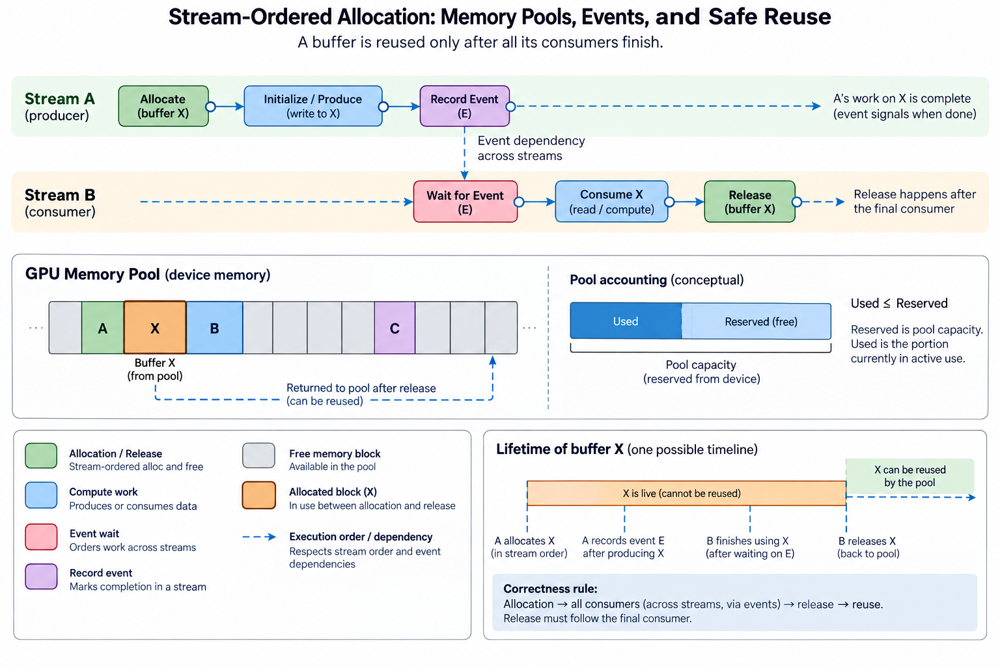
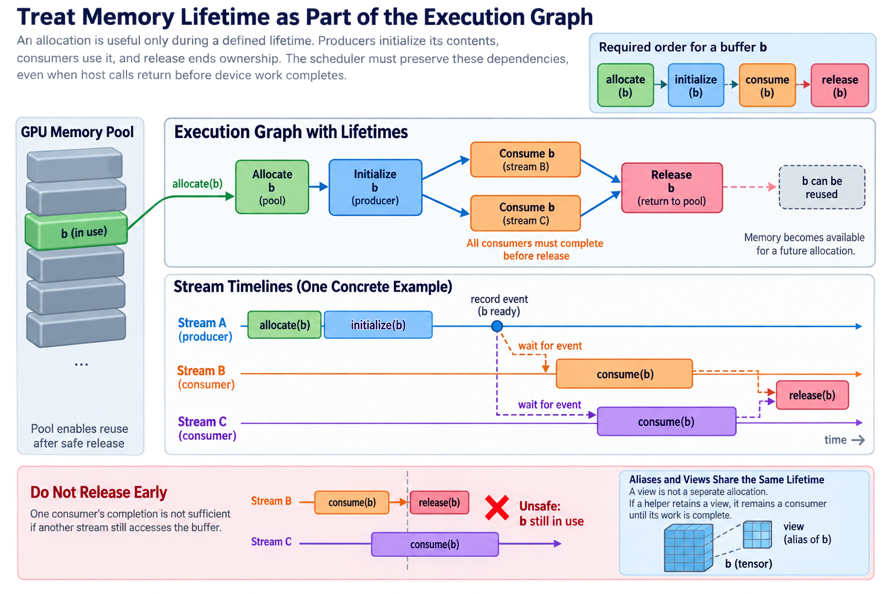
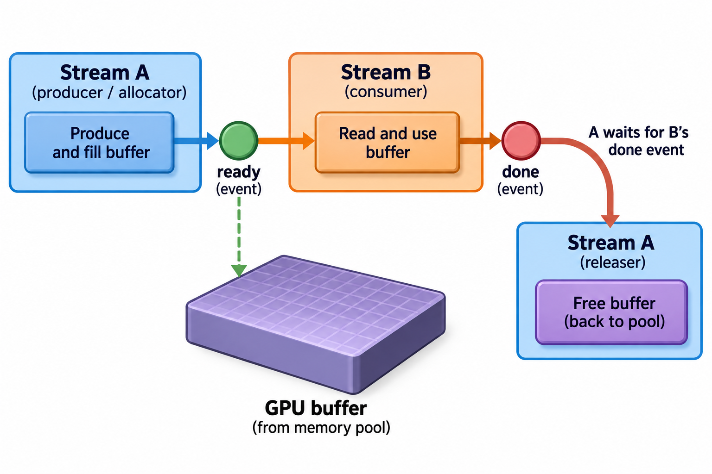
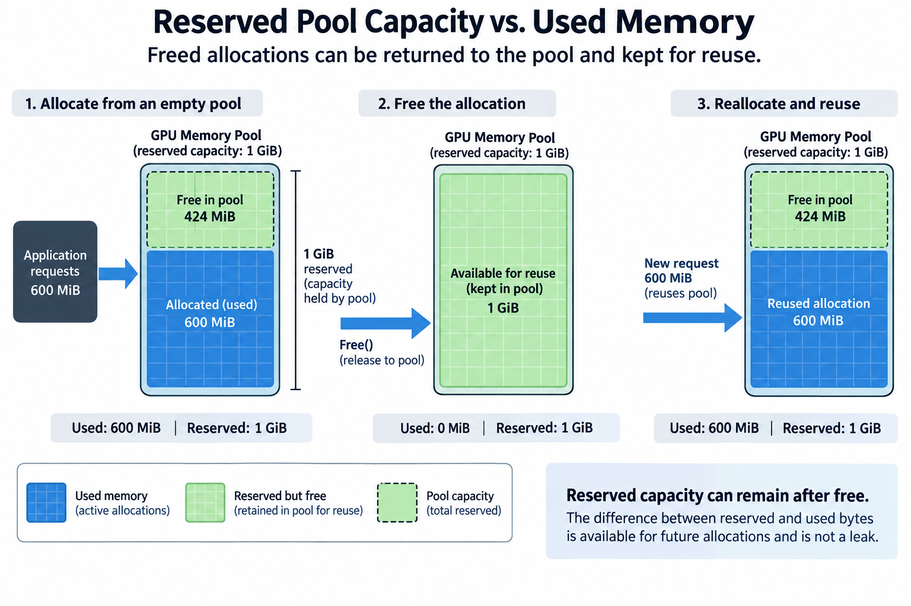
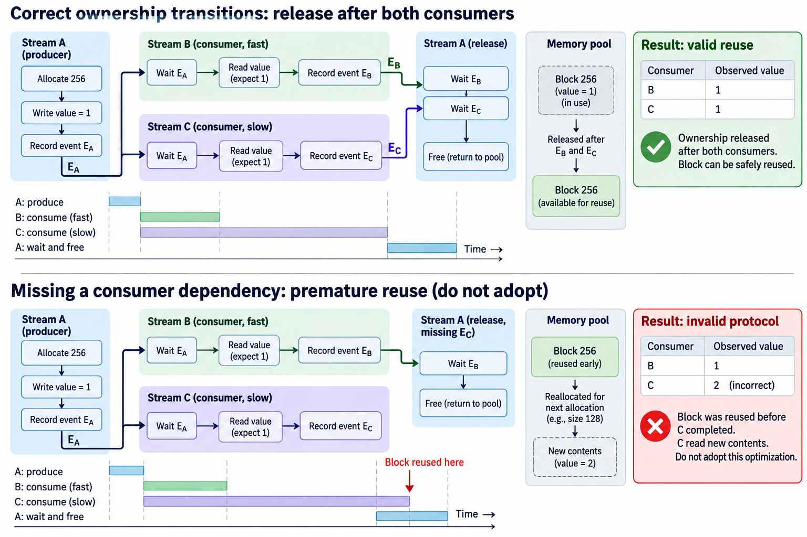

## Overview



Allocating and freeing device memory can wreck the schedule of an otherwise efficient GPU pipeline. The traditional allocation path adds overhead, and sometimes a synchronization. Repeated temporary buffers push peak capacity up. Stream-ordered allocation puts allocate and free into the execution timeline itself, and reuses memory through pools.

The central requirement is still lifetime correctness. Every consumer must run after the allocation is valid and before release permits reuse. Multiple streams force you to write that dependency graph out: a pointer returned to the host does not order unrelated device work on its own.

We will work out these dependencies, look at pool accounting, and build a measurement method. This article describes documented patterns; it does not report hardware tests. Current CUDA documentation defines platform support, graph interactions, and pool policies.

## Deep dive

### 1. Treat memory lifetime as part of the execution graph



An allocation is only useful during its lifetime. Producers initialize its contents, consumers read or change them, and release ends ownership. The scheduler must preserve these dependencies even when host calls return before the device work finishes.

A simple required order is

$$
\operatorname{allocate}(b)\prec\operatorname{initialize}(b)\prec\operatorname{consume}(b)\prec\operatorname{release}(b).
$$

With multiple consumers, release must follow every use. One consumer finishing is not enough if another stream still touches the buffer. Aliases and views share the same underlying lifetime, so a helper that keeps a view counts as a consumer until its own work is done.

Draw the dependency graph before you pick an allocator. An asynchronous API cuts needless host blocking, but it cannot remove the dependencies the computation needs. A faster host return does not mean the memory is ready for every execution domain.

### 2. Understand the stream-local pattern

Enqueue an asynchronous allocation on a stream, then the work on that stream that uses it, then an asynchronous free after that work. The stream's own ordering supplies the basic lifetime relation, and the API contract guarantees it.

The host gets an address it can pass into later launch arguments. Whether a use is valid still follows the execution rules. Having the address is not permission to reach the allocation from unrelated work without the required ordering.

Keep setup, error checking, and the device capability check in the interface. The allocator path is not available in every environment. Current runtime documentation shows how to query support and choose the pool.

Keep a single-stream example around as a reference, because ownership is easy to inspect there. Hold on to it while you build the multi-stream pipeline. If the simple path is correct and the concurrent path corrupts data, cross-stream lifetime is the first thing to suspect.

### 3. Derive allocation-to-consumer ordering across streams

Suppose stream A allocates a buffer and stream B consumes it. Record an event in A after the allocation and initialization work, then make B wait on that event before it consumes.

The conceptual pattern is

```text
stream A: allocate → initialize → record ready
stream B: wait ready → consume → record consumed
```

The event covers only the producer work that sits before it in the stream. If initialization happens somewhere else, the dependency has to include that work too. An event recorded right after allocation does not prove that any value has been written.

Follow the documented event and stream semantics for your runtime. Host posting order across streams does not replace an explicit device dependency. A test that happens to serialize will hide the missing edge.

Run the pattern many times with deterministic sequence values. A buffer can look correct in one iteration just because the old contents resemble the expected result. Sequence identifiers make a stale or early read easy to spot.

### 4. Release must follow the final consumer



If A frees the buffer, it must wait on B's consumed event before it enqueues the release. With more consumers, A must wait on every completion edge.

The complete relation is

$$
\operatorname{ready}_A\prec\operatorname{use}_B\prec\operatorname{done}_B\prec\operatorname{free}_A.
$$

Releasing in A immediately after recording ready would order free after A's producer work but not necessarily after B's use. The pool could reuse the memory while B still reads it, producing a lifetime race.

A free operation returning on the host should not be treated as a global completion barrier. Conversely, adding a host-wide synchronization can make the race disappear while destroying intended overlap. Use it diagnostically, then restore the correct event graph.

Keep aliases and helper-library uses in the consumer inventory. A temporary passed into another asynchronous operation remains live through that operation's supported completion boundary even if the original function has returned.

A concrete timeline makes the final-consumer rule visible. Suppose allocation and initialization complete at 3 milliseconds, consumer B finishes at 5 milliseconds, and consumer C finishes at 12 milliseconds. Release must follow the supported completion of C as well as B; ordering it after the producer at 3 milliseconds is insufficient. The host may have posted all operations earlier, so wall-clock call order cannot substitute for these device dependencies. Record both consumed events and make the freeing stream wait for them. If C becomes slower in a later iteration, the event graph remains correct without assuming a fixed duration.

### 5. Derive a logical peak-memory budget

Let L(t) be the set of logically live allocations under the chosen dependency schedule, and b_i their sizes. A first-order live-memory peak is

$$
M_{\mathrm{live,peak}}=\max_t\sum_{i\in L(t)}b_i.
$$

The model describes lifetime overlap, not exact physical reservation. Alignment, allocator granularity, retained capacity, and supported scheduling policies can increase the actual pool footprint. Measure both levels.

For illustrative buffers A=400 MiB, B=300 MiB, and C=200 MiB, overlapping all three needs 900 MiB of logical live storage. Releasing A safely before C begins can reduce the peak to 700 MiB if B remains live. Releasing A too early would lower the apparent budget by violating correctness.

Buffer scheduling can therefore change capacity without changing tensor shapes. The useful optimization is to shorten valid lifetimes or reuse storage after the last consumer, not simply call free earlier in host code.

### 6. Distinguish used memory from reserved pool capacity



A pool can retain physical capacity after allocations are released so later requests can reuse it. Used bytes describe active allocation demand under the API's definitions; reserved bytes describe capacity held by the pool. Their difference is not automatically a leak.

Inspect current and peak attributes using the supported runtime interfaces. Keep the exact attribute definitions and sampling points in the report. A framework allocator and a CUDA pool can also report different layers of ownership, so do not compare them as identical counters.

For an illustrative pool reserving 1 GiB while 600 MiB is used, 424 MiB of retained capacity remains under those units. That capacity may support reuse, but it can also reduce what other workloads can obtain. The operating tradeoff depends on sharing and memory pressure.

A true lifetime leak would involve allocations or references remaining active unexpectedly. Diagnose live allocation progression and ownership rather than labeling every high reserved-memory value a leak.

Reserved capacity can also reflect allocation granularity and a changing size population. A pool that serves many different temporary sizes may retain capacity beyond the current live sum, while a stable repeated shape may reuse a smaller set efficiently. Compare size histograms and sustained peaks when investigating growth. A single snapshot after one free cannot establish either a leak or an optimal retention policy. Include other workloads' memory needs when deciding whether retained capacity is acceptable for the deployment.

### 7. Pool policy changes reuse and retention

Supported pool policies influence retention, release, and reuse behavior. A release threshold or trimming action can change when capacity returns to the system, while reuse settings can affect dependencies and allocation behavior under their documented semantics.

Do not treat one pool setting as universally optimal. Retaining memory can reduce repeated allocation work but increase the deployment footprint. Returning it aggressively can improve sharing while adding future setup or limiting reuse.

Measure cold allocation, repeated allocation, peak live memory, retained capacity, and useful pipeline timing separately. A setting that improves one may worsen another. The correct choice follows the workload lifetime and the cluster's sharing requirements.

Avoid interpreting a pool policy as permission for unsafe application reuse. The runtime's internal reuse machinery does not establish missing producer-consumer edges in arbitrary user code. Keep the application lifetime graph valid under the supported contract.

### 8. Graph capture and library integration need their own contract

Allocation and release can interact with graph capture and replay under documented CUDA rules. Graph memory nodes and ordinary pool behavior should not be assumed identical in every context. Check the current supported semantics before transferring a stream example into a captured graph.

A library can own allocations or enqueue hidden asynchronous consumers. Its interface defines when caller buffers may be reused. Record that contract rather than assuming function return means all device work is complete.

Framework caching allocators can also manage memory independently of a custom pool. Mixing allocation strategies requires a clear ownership boundary. A pointer should be released through the mechanism that owns it, and aliases must not outlive that ownership.

Test the actual integration path, including repeated replay or library calls where applicable. A standalone allocator example does not establish graph or framework correctness automatically.

### 9. Measure the pipeline instead of host-call latency alone

Separate allocation API duration, device execution, synchronization, and total useful workload time. A smaller host-call duration can improve posting without shortening the device critical path. A removed synchronization can matter more than a local allocation speedup.

A simple end-to-end model is

$$
T_{\mathrm{pipeline}}=T_{\mathrm{useful\ execution}}+T_{\mathrm{exposed\ allocation}}+T_{\mathrm{exposed\ waiting}},
$$

with overlap reflected by the exposed terms. The model omits contention details but prevents summing hidden work as though it all delays completion.

Trace allocation, producer, consumer, and release boundaries. Compare peak memory and retained capacity alongside timing. If a faster configuration increases capacity beyond the deployment budget, it may be infeasible despite a favorable benchmark.

Repeat under representative concurrency and shapes. Variable temporary sizes can change reuse behavior, and several streams can raise lifetime overlap. Preserve the actual allocation population and event graph in the comparison.

### 10. Test ownership transitions before adopting reuse



Use deterministic contents, repeated allocations, varying sizes, multiple consumers, and the intended stream pattern. Include cases where one consumer is deliberately slower so release ordering is exercised rather than accidentally serialized.

Run supported memory diagnostics where relevant and preserve the first failing sequence. A clean instrumented run provides evidence within its scope, while the dependency proof establishes why reuse is valid across the supported schedule.

A useful test can allocate in A, initialize a sequence value, consume in B and C, and release only after both consumed events. Delaying C should not change the value observed by either consumer. Removing C's completion edge in a dedicated diagnostic reproducer tests a different invalid protocol and should not be adopted as an optimization. This distinction keeps the test tied to lifetime rather than one lucky execution order.

## Conclusion

Stream-ordered allocation makes memory management part of the execution program. Its value comes from supported reuse and reduced unnecessary waiting while preserving allocation-to-use and use-to-release dependencies. Measure logical lifetime, pool reservation, and useful timing together, then choose the policy that fits the valid pipeline and its capacity budget.

### Sources

- [CUDA stream-ordered memory allocation](https://docs.nvidia.com/cuda/cuda-programming-guide/04-special-topics/stream-ordered-memory-allocation.html).
- [CUDA memory-pool runtime API](https://docs.nvidia.com/cuda/cuda-runtime-api/group__CUDART__MEMORY__POOLS.html).
- [CUDA asynchronous execution](https://docs.nvidia.com/cuda/cuda-programming-guide/02-basics/asynchronous-execution.html).
