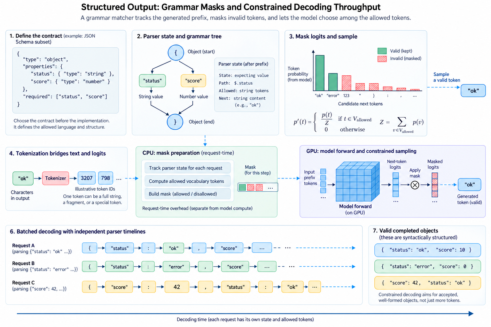
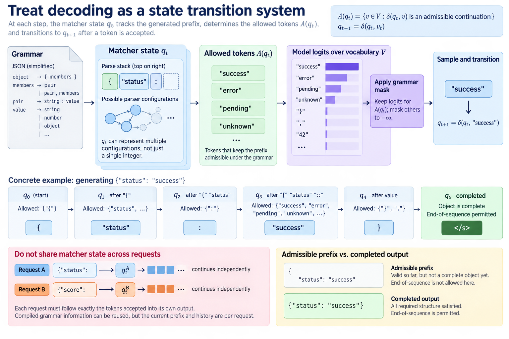
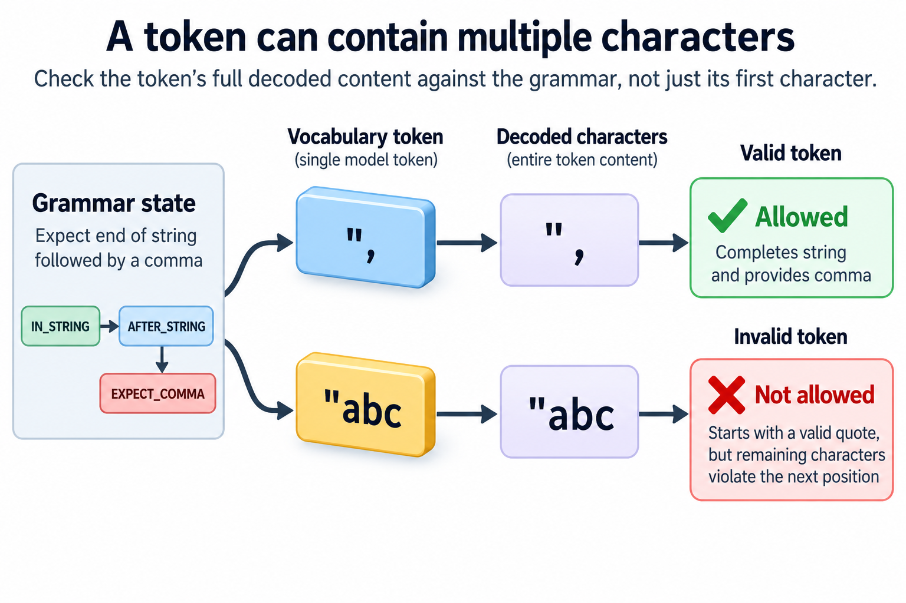

A service that returns almost-valid JSON can waste more time than a service with slightly slower token generation. The client retries, repairs malformed text, or rejects a response after waiting for the entire generation. Structured output attempts to prevent part of this waste by restricting which tokens the model may produce at each step.

The useful mechanism is more precise than asking the model to follow a format. A grammar matcher tracks the generated prefix, determines which vocabulary tokens can continue it, and masks the other logits before sampling. The model supplies preferences among permitted choices. The matcher supplies a formal constraint on the emitted sequence.

This separation introduces new computation, state, and scheduling concerns. We will derive the masked distribution, explain why tokenization makes grammar matching difficult, and evaluate the benefit using accepted completed objects. The examples use simplified grammars and illustrative timings rather than benchmark claims for any named engine.

## 1. Define the contract before selecting the implementation

*Overview of the article’s core mechanism. The following sections explain the objects, relationships, equations, assumptions, and worked examples shown here.*

A structural contract can describe JSON syntax, a JSON Schema subset, a regular language, or a more general grammar. These choices express different requirements. Valid JSON allows many objects that a particular application cannot use. A schema may constrain keys, types, and some value properties, but support for individual schema features depends on the implementation.

Separate syntax, schema validity, and application meaning. An object can parse successfully and contain the required fields while still citing a nonexistent identifier or making an incorrect factual claim. A grammar cannot usually verify relationships to an external database unless the application explicitly incorporates those relationships into the allowed language.

For example, a response containing a status field and a numeric score can be syntactically and structurally valid while its score is unsupported by evidence. The service should validate the structure and then apply its ordinary semantic checks. Constrained generation reduces a class of errors; it does not establish truth.

Define how the service represents refusal, cancellation, timeout, and incomplete generation. These outcomes must not be silently converted into successful structured answers. A strict object contract needs a surrounding protocol that tells the client whether a complete accepted object was actually delivered.

## 2. Treat decoding as a state transition system

Let q_t denote the matcher state after the emitted prefix of t tokens. Let V be the vocabulary and delta the transition operation. The allowed set contains tokens whose decoded contents can extend the prefix without making completion impossible under the supported grammar:

$$
A(q_t)=\{v\in V:\delta(q_t,v)\text{ is an admissible continuation}\},\qquad q_{t+1}=\delta(q_t,v_t).
$$

The state can include multiple possible parser configurations, not merely a single integer. Ambiguous grammars and nested structures may require more machinery than a deterministic finite-state machine. A useful conceptual model should not force every supported grammar into a representation that cannot express it.

An admissible prefix is also different from a completed output. After emitting an opening brace, the prefix can still be valid, but there is no object to deliver yet. End-of-sequence should become permitted only when the implementation's completion rules allow termination. Stopping at a token limit can leave a perfectly admissible prefix incomplete.

The per-request matcher must follow exactly the tokens accepted into that request's output. Sharing mutable matcher state across requests would connect their grammars accidentally. Compiled grammar information may be reusable; the current prefix and transition history belong to the individual generation.

## 3. Derive the masked sampling distribution

Let z_v be the model logit for vocabulary token v and T a positive sampling temperature. Constrained sampling assigns probability only to the allowed set:

$$
p(v\mid q_t,z)=\frac{\mathbf{1}[v\in A(q_t)]\exp(z_v/T)}{\sum_{u\in A(q_t)}\exp(z_u/T)}.
$$

A common implementation adds negative infinity to disallowed logits and runs the existing sampler. The normalization then excludes those tokens. If the allowed set is empty, the denominator is zero and the service must handle the failure explicitly rather than proceeding with NaNs or an arbitrary token.

For a small example, suppose the unconstrained model assigns probability 0.7 to an illegal token and probabilities 0.2 and 0.1 to 2 legal tokens. Renormalization changes the legal probabilities to 2/3 and 1/3. It does not preserve the original probability of the overall sequence; the constraint changes the model's conditional choices.

Sampling operations need a documented order. Applying a top-k restriction before the grammar mask can discard all legal choices even when the vocabulary contains valid continuations. Temperature, top-p, repetition penalties, and grammar restrictions interact. Verify the engine's actual sampling pipeline instead of assuming that every ordering implements the same distribution.

## 4. Tokenization is the bridge between characters and logits

Grammars often describe characters or bytes, while models predict vocabulary tokens. A token can contain several characters, including punctuation, whitespace, or part of an escaped string. One token may cross multiple grammar transitions. Allowing it requires checking its complete decoded content, not merely its first character.

Imagine a parser expecting the end of a string followed by a comma. A token containing both symbols can be valid even if neither symbol is emitted separately. Conversely, a token beginning with an allowed quote can become invalid because its remaining characters violate the next grammar position.

Unicode and byte-oriented token representations require careful handling. A tokenizer can encode text through intermediate byte sequences or vocabulary conventions that differ from the final displayed string. The matcher must use tokenizer metadata consistent with the model. Compiling a grammar against one vocabulary and applying its token mask to another can invalidate the entire guarantee.

The tokenizer vocabulary can be organized to share work across common token prefixes. Compiled structures and cached classifications avoid parsing every token from scratch at every decoding step. These optimizations explain why grammar processing can become practical for large vocabularies, but their effectiveness depends on the grammar and generated states.

## 5. Separate compilation cost from request-time cost

A service may compile a schema once and reuse its immutable representation for many requests. It still initializes and advances a matcher for each request. Cold compilation, cache lookup, matcher construction, mask generation, device transfer, and logit masking are different costs and should be measured separately.

A simplified per-token budget is

$$
t_{\mathrm{step}}\approx t_{\mathrm{model}}+t_{\mathrm{matcher,exposed}}+t_{\mathrm{mask,exposed}}+t_{\mathrm{sampler}}.
$$

The exposed terms matter because host grammar work may overlap with other requests' GPU computation. Summing all measured durations can overestimate the critical path when overlap is effective. However, overlap does not remove CPU consumption or memory traffic; overloaded host workers can still create queueing.

For an illustrative vocabulary of 128000 tokens, a bit-packed mask occupies 16000 bytes, while one byte per token occupies 128000 bytes. For a batch of 64 requests, those representations differ by nearly 7 MiB per step. The exact transfer path may avoid a full host copy or use device-resident buffers, so measure physical transfers rather than assuming this calculation describes the implementation.

## 6. Batching introduces independent parser timelines

Every active request has its own grammar state, even when many requests share a compiled schema. Some prefixes permit broad vocabulary choices; others allow only a small fixed punctuation set. Matcher costs and mask contents can therefore vary across requests in the same batch.

A host worker pool must produce the right mask for the right request and generation step. Reused batch slots are especially important: when one request finishes and another occupies its slot, stale state or a stale mask cannot be carried forward. Request identifiers and step counters are useful debugging information at this boundary.

Schema diversity affects compilation-cache behavior. A workload that creates a unique schema for every request can pay much more overhead than a benchmark that repeatedly uses one simple schema. Report cache hit rates and compile-time distributions when evaluating a dynamic-schema service.

Avoid assuming that parser work is negligible because a single-request demonstration looks fast. Test the expected concurrent population, vocabulary size, schema complexity, and output lengths. The service can shift from a GPU bottleneck to a CPU matcher bottleneck as model execution becomes faster or the number of simultaneously decoding requests grows.

## 7. Speculative decoding requires reversible grammar state

A speculative decoder proposes multiple draft tokens before the target model decides how many to accept. Grammar matching must remain consistent with the accepted prefix. If the matcher advances through every proposal and rejection discards part of the sequence, the state must return to the accepted point.

A snapshot, rollback mechanism, or equivalent persistent representation can provide this behavior. The required history length depends on the speculative window and the engine's integration. Sharing compiled data does not remove the need for correct per-request rollback.

The draft path should also respect the constraint when the algorithm requires it. If it proposes illegal tokens freely, acceptance can fall and the target spends work rejecting unusable proposals. Conversely, constraining both paths may add matcher overhead that offsets some speculative benefit. Evaluate acceptance and useful throughput together.

A correctness test should force partial acceptance, complete rejection, and completion within a draft block. It should verify both the final text and subsequent masks. An output that happens to parse correctly is insufficient evidence that rollback works for all future continuations.

## 8. Optimize for accepted objects rather than raw tokens

Let N_ok be the number of outputs that are complete, structurally valid, semantically accepted by the application, and delivered before the relevant deadline. The useful throughput is

$$
G_{\mathrm{objects}}=N_{\mathrm{ok}}/\Delta t.
$$

This metric can improve even when per-token speed decreases. In an illustrative sequential workload, an unconstrained attempt takes 1 second and succeeds with probability 0.8. Independent retries yield an expected 1.25 seconds per success. A constrained attempt taking 1.1 seconds with no structural failures would improve that component of successful completion time, provided semantic acceptance and all other costs remain comparable.

The independence assumption in the retry example is strong. Some malformed outputs recur because the prompt, schema, or model behavior causes the same failure repeatedly. Measure actual retry patterns rather than treating every retry as a fresh draw. Also count longer generated outputs, post-validation time, and cancellation waste.

Track failure categories separately: syntax error, unsupported schema feature, semantic rejection, empty allowed set, token-limit truncation, timeout, and engine error. A single validity percentage can hide the difference between a useful complete response and a valid prefix that never reaches completion.

## 9. Build a verification suite around the boundary conditions

Use small grammars with known valid and invalid sequences to test token acceptance. Include tokens that cross punctuation boundaries, escaped strings, multibyte text, nested containers, optional fields, and termination. Validate the generated output with an independent parser and the application's schema validator.

Exercise concurrent requests with different schemas and repeatedly reused scheduler slots. Add cancellation and speculative rollback cases if those features are enabled. These tests target integration errors that a grammar library's own unit tests cannot establish for the surrounding serving engine.

Benchmark warm and cold schema paths separately and preserve the model, tokenizer, grammar-library, and engine versions. Current feature support and optimized representations can change. A reproducible report should identify the exact configuration that supplied the guarantee and produced the timing result.

Constrained decoding works by connecting a formal language to the model's next-token distribution. Its performance value comes from reducing unusable generations while keeping matcher work off the exposed critical path. The engineering target is a complete accepted response at the required latency, with every token mask tied to the correct request state.

## Sources

- [XGrammar constrained decoding documentation](https://xgrammar.mlc.ai/docs/latest/start/constrained_decoding.html).
- [XGrammar engine integration](https://xgrammar.mlc.ai/docs/latest/using_xgrammar/engine_integration.html).
- [XGrammar official implementation](https://github.com/mlc-ai/xgrammar).
