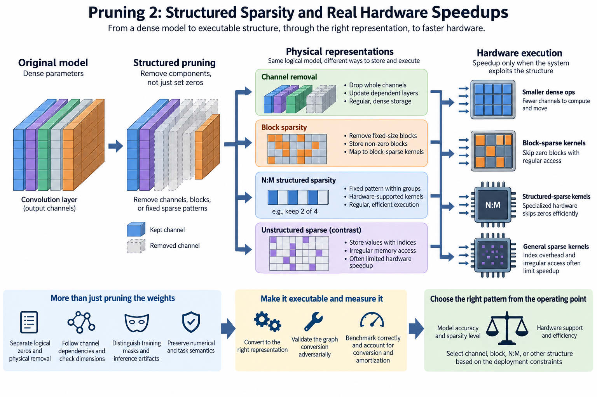
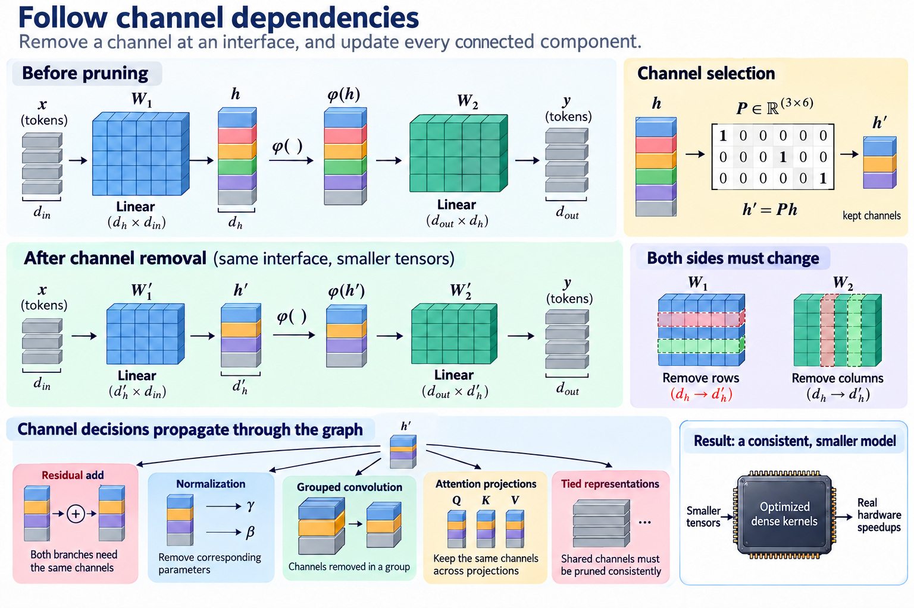
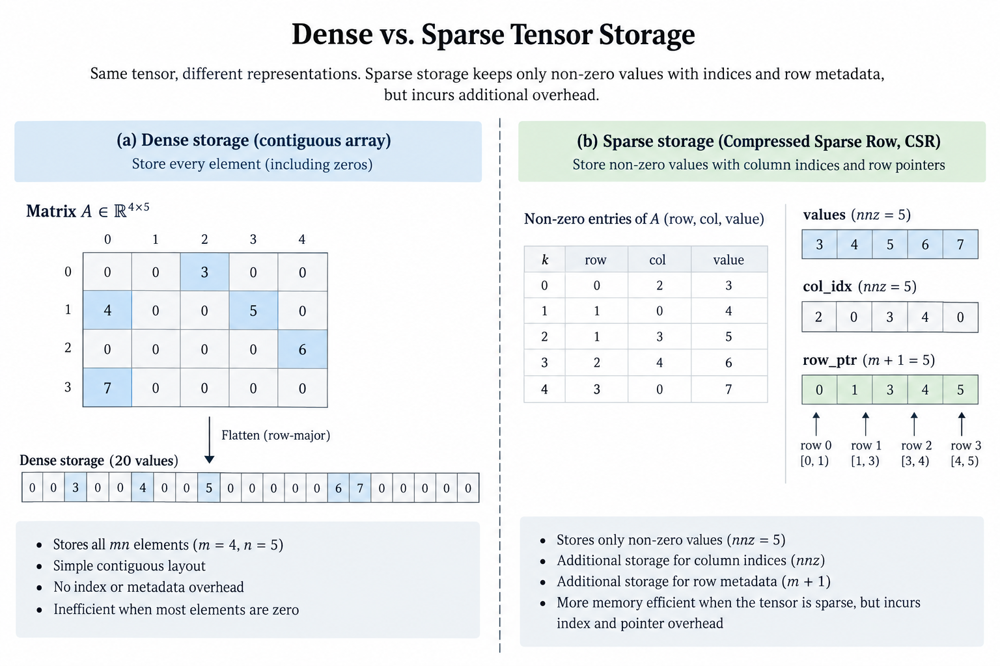
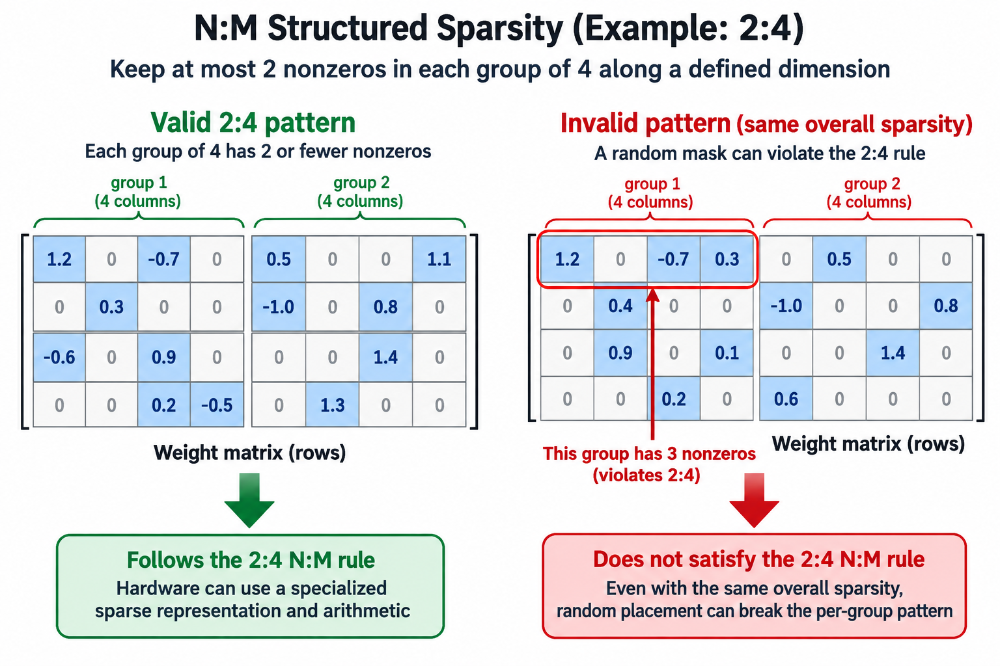
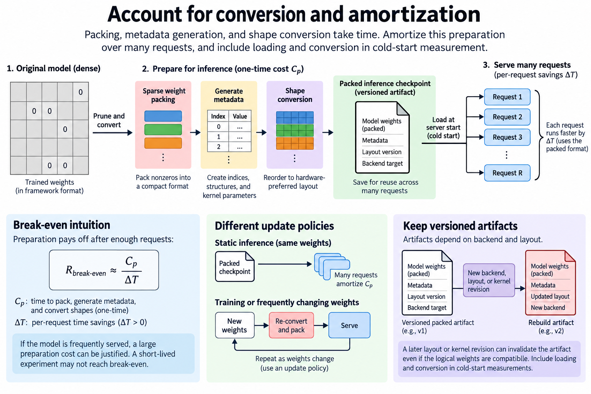
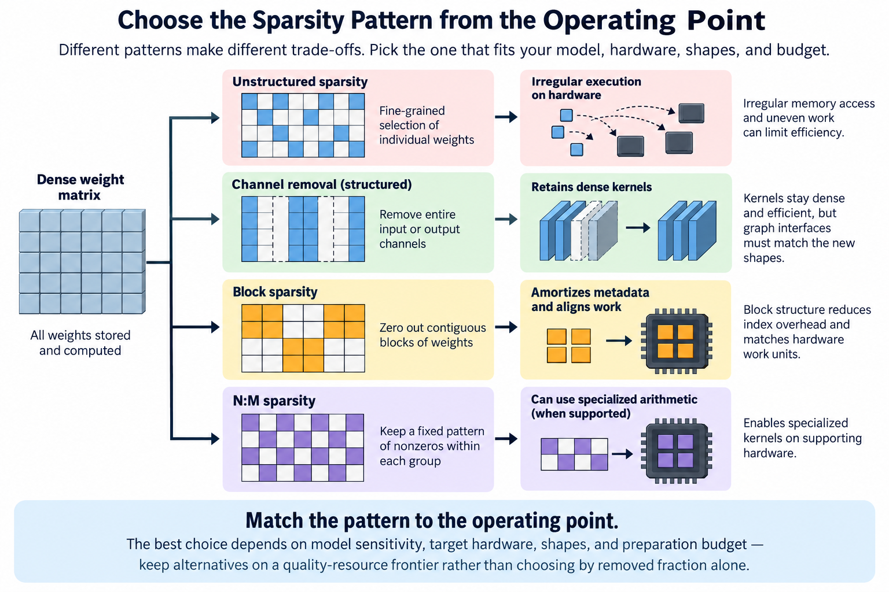

## Overview

Pruning can remove many parameters without producing a faster deployment. The execution system must recognize and exploit the removed structure, because a matrix containing zeros is still a dense matrix if its kernel reads and multiplies every entry, and a sparse representation that skips work introduces 3 new costs: indices, irregular memory access, and less efficient arithmetic.

Structured pruning changes this tradeoff by removing components aligned with executable shapes or supported sparse patterns. This article compares 3 options, channel removal, blocks, and fine-grained structured sparsity, then derives storage and timing models. Its central picture is a matrix transformed into several physical representations, each with a different path to real hardware execution.

*An original conceptual illustration. Numerical plots and examples are illustrative unless explicitly identified as measured evidence.*

## Deep dive

### 1. Separate logical zeros and physical removal

A mask defines which contributions are absent from the function. Physical removal defines how the artifact stores and executes the remaining computation. These are different stages of the procedure.

If an entire output channel is removed from a linear layer, its output dimension can shrink, and the following layer must remove the matching input channel, after which a compatible conversion executes smaller dense matrices rather than requiring arbitrary sparse operations.

Removing isolated weights does not create the same opportunity. The matrix dimensions remain unchanged, and a dense kernel can still perform every multiply. The 2 experiments answer different questions: the quality experiment shows which contributions can disappear, while deployment conversion shows whether the platform benefits from that pattern.

### 2. Follow channel dependencies

Let a hidden vector be produced by 1 layer and consumed by another. A selection matrix P keeps chosen coordinates. Physical channel removal transforms both sides of the interface:

$$
h'=P\phi(W_1x+b_1),\qquad
y=W_2P^\top h'+b_2.
$$

This expression illustrates coordinate selection under compatible element-wise activation. In a converted model, the retained rows and columns form new smaller tensors. More complex architectures require additional dependency handling.

Residual additions need compatible coordinate structure across branches. At least 4 things can constrain which channels may be removed together: normalization parameters, grouped convolutions, attention projections, and tied representations, so a local channel decision propagates through several components and the conversion must preserve the complete graph rather than edit 1 tensor in isolation.

### 3. Compare unstructured sparse storage

Suppose a matrix contains N entries and retains fraction rho. A simple sparse representation stores retained values plus 1 index per retained entry and additional row metadata. If values use s bytes and indices use b bytes, approximate storage is:

$$
M_{\mathrm{sparse}}\approx\rho N(s+b)+M_{\mathrm{rows}},\qquad
M_{\mathrm{dense}}=Ns.
$$

Ignoring row metadata, sparse storage is smaller only when rho is less than s divided by the sum of s and b. With 2-byte values and 4-byte indices, the retained fraction must be below roughly one-third. This is a hypothetical format calculation; actual compressed layouts can use different index encodings.

The example explains why a moderate number of zeros may not reduce bytes under a naive sparse representation, and quantizing values makes index overhead relatively larger because a 4-byte index does not shrink when the value does, so count metadata and alignment before presenting a parameter reduction as a memory reduction.

### 4. Understand block sparsity

Block-sparse formats retain or remove groups of entries. Just 1 index can describe a block, which amortizes metadata across its values. Blocks can also align with tiled arithmetic and regular memory access.

The price is coarser selection. A block holding a few important weights may have to stay even when most of its entries are unnecessary, smaller blocks allow finer selection but can increase metadata and scheduling overhead, and larger blocks improve arithmetic organization while sacrificing representational flexibility.

Block shape and orientation matter. A pattern aligned with 1 matrix operand layout may not suit another kernel or transpose. Read the backend's supported formats and measure the actual shapes rather than assuming any block-sparse matrix has the same efficiency.

### 5. Explain N:M structured sparsity

An N:M pattern retains N entries in each supported group of M along a defined dimension. Its regularity allows specialized representation and arithmetic. NVIDIA's Ampere structured-sparsity explanation describes 2:4 patterns under its supported Tensor Core conditions.

$$
\sum_{i\in g}\mathbf 1\{w_i\ne0\}\le2\qquad\text{for each supported group }|g|=4.
$$

The group axis, operand orientation, type, and kernel requirements are part of the hardware contract. A matrix with half its entries zero globally does not necessarily satisfy 2:4, and a random sparse mask can violate many groups despite having the desired overall density.

The peak sparse arithmetic figure for Ampere describes supported hardware capability. It is not a promise that a complete application becomes twice as fast. Conversion, memory, noneligible operations, and actual utilization still matter.

### 6. Derive application speedup

Let fraction f of baseline duration belong to operations that can use a supported sparse path, and let their measured local speedup be s. If all other costs remain unchanged, a simple estimate is:

$$
S\approx\frac{1}{(1-f)+f/s}.
$$

For an illustrative eligible fraction of 60 percent and local speedup of 1.5, the ideal application gain is 1.25 times. That estimate excludes new conversion and scheduling costs. The numerical example is not a device benchmark.

Measure eligible operations and their actual duration before you translate a peak claim into an application result, include any new cost that sparse execution creates in the critical path, and if it reduces capacity pressure enough to allow a different batch, report that operating-region change separately.

### 7. Account for conversion and amortization

Packing sparse weights, generating metadata, and converting shapes are 3 preparation steps that cost time. A static inference checkpoint can amortize preparation over many requests. A training workload with changing weights may need another update policy.

Let preparation cost be C_p and per-request savings be delta T under a defined workload. A simplified break-even request count is:

$$
R_{\mathrm{break-even}}\approx\frac{C_p}{\Delta T}\quad(\Delta T>0).
$$

The formula compares time in consistent units and ignores storage or energy benefits, which is enough to explain why preparation cost belongs in a complete efficiency decision: a frequently served model can justify expensive conversion that a short-lived experiment cannot amortize.

Keep a versioned packed artifact when the backend supports it. A later layout or kernel revision can invalidate that artifact even if the underlying logical weights remain compatible. Include loading and conversion behavior in cold-start measurement.

### 8. Check dimensions after channel removal

Smaller dense shapes do not always use hardware more efficiently. Removing channels can create dimensions poorly aligned with the matrix tiles a Tensor Core expects, reducing utilization or requiring padding. A slightly larger aligned model can sometimes execute faster than a smaller awkward shape.

This does not invalidate channel pruning. It motivates hardware-aware selection and shape constraints. Evaluate a small set of supported widths instead of assuming latency decreases continuously with every removed channel.

The same principle affects convolution groups and attention projections. A head-removal procedure must preserve compatible interfaces, and its new aggregate width should be measured under the intended backend. Parameter count remains a useful storage statistic but an incomplete latency predictor.

### 9. Distinguish training masks and inference artifacts

Training with a structured mask can keep a dense parameter and optimizer state allocation. Its effective function may be sparse while its training memory remains dense. An inference conversion can then produce another representation.

If the method requires repeated mask updates or regrowth, state that policy and its preparation cost. If the mask is fixed, verify optimizer behavior does not reintroduce effective contributions. The supported sparse artifact must match the recovered checkpoint.

A comparison should identify which of 3 stages the reported resource figure covers: training, masked inference, or converted inference. These stages can have different memory and arithmetic behavior. Combining them into one “sparsity gain” hides the mechanism.

### 10. Preserve numerical and task semantics

Sparse kernels can change floating-point reduction order or use another accumulation path. Compare with the intended masked or physically reduced reference under a defined tolerance. Structural equivalence in real arithmetic does not guarantee bitwise equality.

You also need to evaluate task quality after imposing the pattern and the recovery procedure, since a hardware-friendly pattern can remove different information from an unconstrained saliency selection, so report that tradeoff rather than claiming that execution support makes the pruning decision quality-neutral.

Test important task slices and supported shapes. A quality average can hide 3 kinds of case: sensitive classes, long contexts, and rare inputs. Primary-paper results establish evidence within their training and evaluation setup; the deployment checkpoint needs its own checks.

### 11. Build a correct microbenchmark

Compare the 2 paths, dense and sparse, on the same logical matrix and input population. Verify the sparse pattern, pack weights using the supported operation, and warm up the actual kernel. Use a valid device completion boundary.

Record 6 fields: dimensions, dtype, retained pattern, packed bytes, workspace, and measured duration. Sweep representative batches or token groups because overhead can dominate small matrices. An enormous matrix benchmark may not represent decode-sized expert groups.

Then measure the complete application. Packing, dispatch, other layers, and request scheduling can change the result. A microbenchmark explains local behavior; it does not automatically establish end-to-end efficiency.

### 12. Work through representation choices

Consider a hypothetical 1,000-entry matrix with 2-byte values. Dense payload uses 2,000 bytes. Retaining half its entries with one 4-byte index each uses 3,000 bytes before row metadata, so that naive sparse representation is larger.

A channel-removal conversion can instead reduce dimensions and retain ordinary dense storage, provided surrounding interfaces change consistently. A supported 2:4 representation can use a more compact regular encoding under its actual format. These paths have different quality and execution requirements despite a similar removed fraction.

The example shows why a report should give both the logical retained count and the physical bytes, and why selecting a pruning pattern begins with the target's supported execution rather than ending with an arbitrary zero mask.

### 13. Validate the graph conversion adversarially

Use small tensors with distinct channels and known masks. Check every retained coordinate and downstream column mapping. Exercise 4 structures where applicable: residual branches, normalization, grouped operations, and supported tied representations.

For a 2:4 pattern, verify every logical group along the actual required axis. For block sparsity, test partial boundaries and block indexing. Compare packed execution with an explicit reference on nontrivial values. A global density count cannot prove group correctness.

No device benchmark was performed for this article. Its calculations are representation and timing models. The production sequence has 5 steps: select a supported structure, recover useful behavior, convert the complete graph or packed artifact, validate semantics, and measure both local and application results.

### 14. Choose the pattern from the operating point

Unstructured sparsity offers fine-grained selection but irregular execution, channel removal retains dense kernels but constrains graph interfaces, blocks amortize metadata and align work, and a 2:4 pattern can use specialized arithmetic under supported conditions.

The best choice depends on 4 things: model sensitivity, target hardware, shapes, and preparation budget. Keep alternatives on a quality-resource frontier rather than selecting by removed fraction alone. A method that wins on 1 platform can lose on another whose kernels favor a different representation.

Document failed candidates and their limiting resources, and when a sparse artifact comes out smaller but slower, name the measured cause: index traffic, launch overhead, utilization, or something else. That explanation gives pruning an infrastructure meaning and supports future changes without assuming every zero has equal value.

## Conclusion

For a reproducible report, retain 4 objects separately: the original checkpoint, the logical mask, the converted artifact, and the backend configuration. That separation lets a later reviewer tell whether a discrepancy arose in structure selection, recovery, packing, or execution, and it keeps an old packed file from being mistaken for the latest recovered weights when several experiments share a directory.

### Sources

- [NVIDIA structured sparsity in Ampere and search applications](https://developer.nvidia.com/blog/structured-sparsity-in-the-nvidia-ampere-architecture-and-applications-in-search-engines/).
- [Learning both Weights and Connections for Efficient Neural Networks](https://arxiv.org/abs/1506.02626).
- [CRISP: Hybrid Structured Sparsity for Class-aware Model Pruning](https://arxiv.org/abs/2311.14272).
