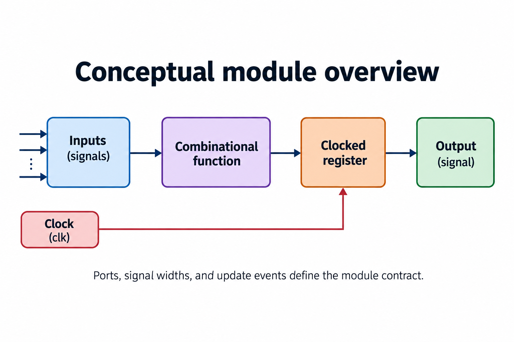
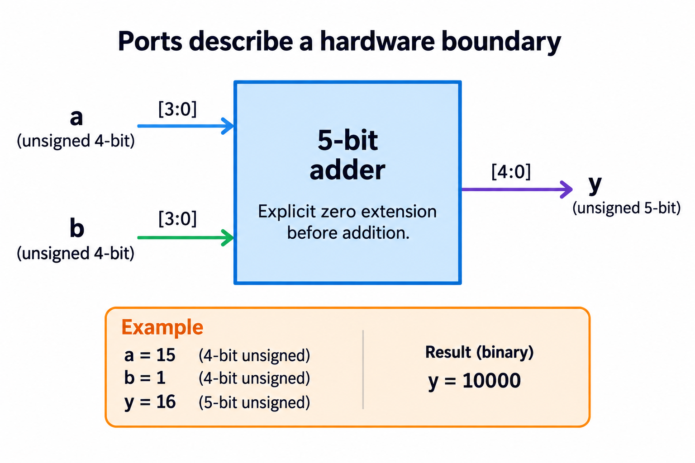
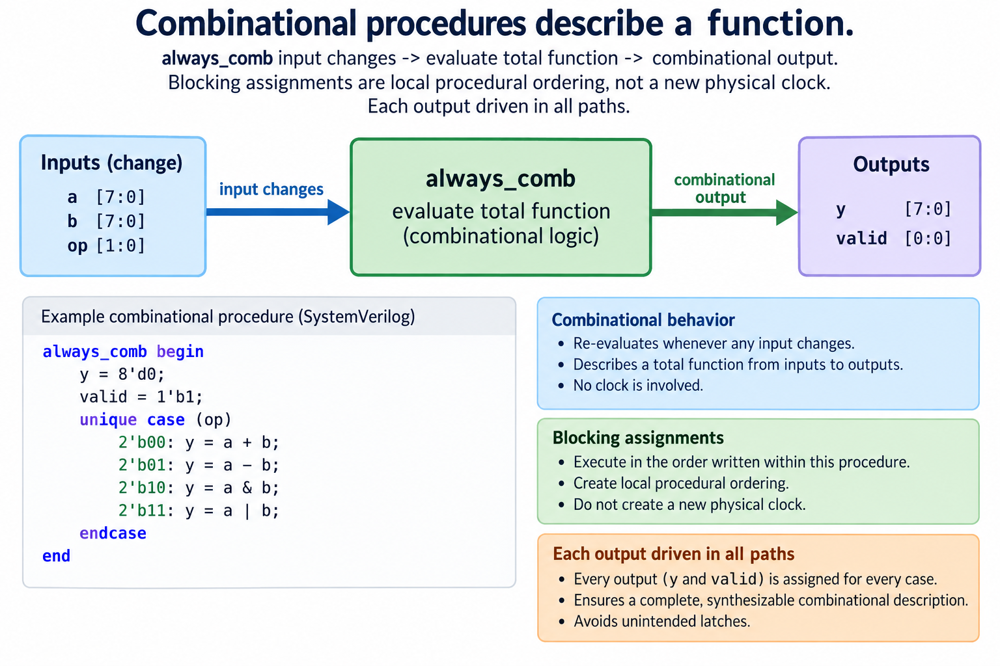
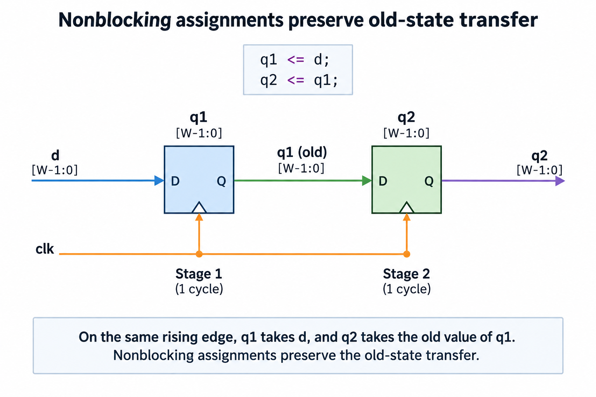
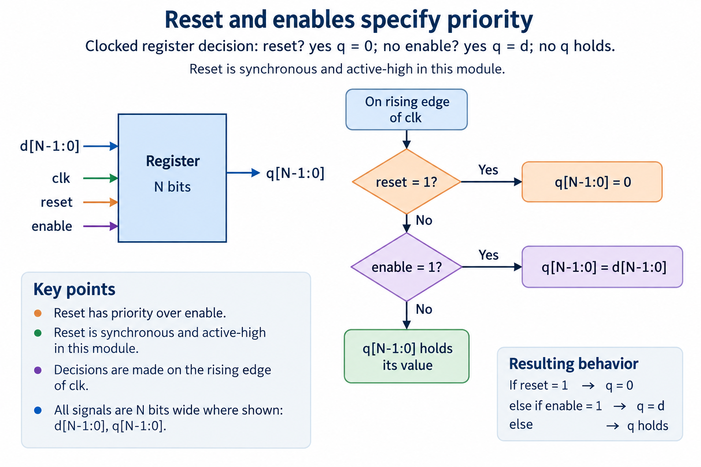
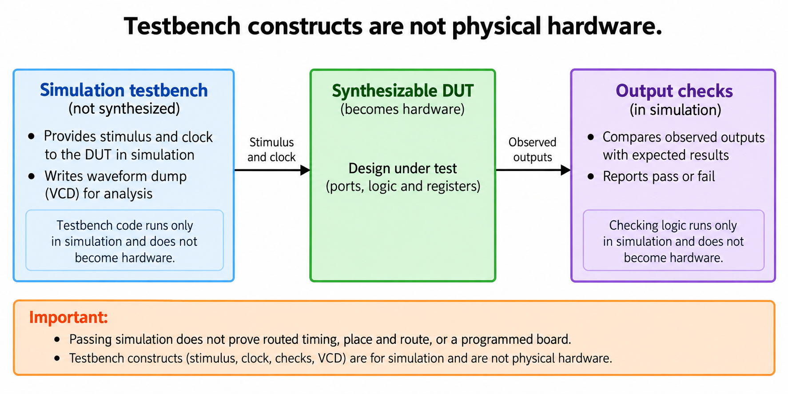

## Overview



SystemVerilog describes hardware interfaces, combinational functions, and clocked state. The overview separates those roles instead of treating a module as a software function that runs once and returns. Ports are connected signals. Combinational logic responds to inputs. Registers retain values according to an edge-triggered transition rule. A testbench supplies events and checks the resulting behavior.

The earlier [combinational lesson](/blog/combinational-logic-truth-tables-multiplexers/) introduced complete assignment, and the [digital-state lesson](/blog/fpga-ai-logic-1-digital-logic-for-ai-hardware/) established registers and state machines. This article turns those models into a small vocabulary of modules, logic vectors, always_comb, and always_ff. It deliberately avoids a large syntax survey: each construct serves an observable contract that the lab can check.

The [foundations lab](/labs/fpga-fundamentals/foundations-lab.zip) contains an unsigned adder, a 2-register pipeline, and an enabled register with synchronous reset. These examples are synthesizable RTL paired with simulation-only test code. Compilation and RTL self-checks are performed for this release. They do not establish placement, routing, a particular device mapping, or a working board interface.

Read a module by identifying its inputs, outputs, widths, drivers, and update events. If a signal is retained, ask which edge changes it and which condition has priority. If it is combinational, ask whether every legal input has a defined result. This approach connects syntax to hardware behavior from the beginning.

## Deep dive

### Ports describe a hardware boundary



The module boundary in the figure receives 2 unsigned 4-bit operands and produces an unsigned 5-bit sum. 4 input bits represent values from 0 through 15. Their largest sum is 30, requiring 5 bits. The chosen width is therefore a consequence of the input range and output contract, rather than a convention copied from the operands.

Explicit extension makes the intended expression width easy to inspect:

```systemverilog
module adder4(input logic [3:0] a, b,
              output logic [4:0] y);
  assign y = {1'b0, a} + {1'b0, b};
endmodule
```

The braces concatenate a leading 0 with each operand. The additions operate on the explicitly widened values. With a equal to 15 and b equal to one, y is 10000, representing 16. If a previous operation had already retained only 4 bits, attaching a 5-bit destination afterward could not reconstruct a discarded carry.

Ports define connectivity, not a call stack. When a parent module instantiates adder4, its signals connect to a, b, and y. The circuit remains present as inputs change. Multiple instances describe multiple module instances subject to synthesis optimization, rather than several calls to one implicit shared software resource. Deliberate sharing requires control and a schedule.

A declaration of logic permits the supported signal modeling used in these examples; it does not by itself create a flip-flop. Whether a value is combinational or clocked follows from its driver and procedural construct. Likewise, a vector width describes retained bits, while signedness determines numeric interpretation. The [binary lesson](/blog/binary-numbers-hardware-signedness-overflow/) explains why the same pattern can represent different integers.

Begin an interface review by calculating minimum and maximum legal values. Then verify that each connected port has the intended width and interpretation. An implicit truncation at a module boundary may be syntactically accepted while violating the design specification. Named port connections and explicit extensions make such decisions visible. Finally, run the adder's exhaustive 2-hundred-50-6-pair check rather than relying on only the 15-plus-one example.

### Combinational procedures describe a function



An always_comb block describes a combinational procedure. Its outputs should be assigned on every legal path. Blocking assignments use the equals sign and make local procedural ordering explicit: a later statement can use a temporary value assigned earlier in the same evaluation. That ordering does not introduce a physical clock edge or necessarily imply a multi-cycle datapath.

For the mux, the default y equal to a followed by a conditional y equal to b describes one selection function. The simulator evaluates the block as specified, while synthesis interprets supported complete logic as a combinational network. The [author's SystemVerilog chapter](https://systemverilog.dev/3.html) develops combinational and sequential procedural constructs; the included examples keep their roles separate.

1 output should have a clear driver. Assigning the same signal in unrelated blocks can create conflicting ownership or tool errors. If a function needs several conditions, put them in one coherent decision structure or drive separate intermediate signals that feed an explicit combination. A beginner gains little from scattering writes across a design merely to make each block short.

Completeness is still required when the code looks mathematically simple. A conditional without an alternative or default can retain a previous value. That introduces storage or triggers a diagnostic, rather than describing a total combinational function. Case alternatives should cover the intended domain, and defaults should express defined behavior instead of silently masking an unknown requirement.

Simulation also has 4-state values, including unknown X. A module's binary input contract should not be confused with a guarantee that all uninitialized simulation values are harmless. Reset and legal-input assertions belong in the surrounding design where appropriate. The lab's exhaustive adder and mux sweeps apply defined binary patterns; the claim is limited to that domain.

To review a combinational block, write its corresponding function in plain language before examining the assignments, determine which input each output depends on, check every branch, confirm the intermediate widths, and then compare the block against a small reference calculation: this practice catches missing coverage and unintended conversions while avoiding the mistaken idea that source statement count is a measure of hardware latency.

### Nonblocking assignments preserve old-state transfer



The pipeline figure shows 2 registers sharing one active clock edge. The assignments q1 less-than-or-equal d and q2 less-than-or-equal q1 are nonblocking assignments. Their right-hand sides are evaluated using values available for that event, and their left-hand updates are scheduled accordingly. The second register therefore receives the old q1, not the newly captured d.

```systemverilog
always_ff @(posedge clk) begin
  if (reset) begin
    q1 <= '0;
    q2 <= '0;
  end else begin
    q1 <= d;
    q2 <= q1;
  end
end
```

After reset establishes both registers as 0, apply d equal to 3 before the next edge. The post-edge state is q1 equal to 3 and q2 equal to 0. Apply d equal to 5 before another edge: q1 becomes 5 and q2 becomes 3. The simulation lesson uses this exact trace to demonstrate why a same-cycle expectation is wrong.

The source order of these 2 nonblocking assignments does not make q2 capture a newly updated q1, and a software-style reading that treats the first line as immediately modifying state would describe a different process, so keep the course convention consistent, using blocking assignment for local combinational calculation and nonblocking assignment for these clocked state updates. More advanced scheduling topics can be introduced after the intended state transition is clear.

Latency needs an interface definition. In this pipeline, input d captured by the first register reaches the second after another active edge. If the interface accepts 1 value each cycle, values can progress through successive stages concurrently. 2 stages do not imply that the design must wait 2 idle cycles between inputs. Validity and backpressure would require additional control in a practical stream interface.

A self-check should save the previous expected first-stage value before updating it. Compare the new second-stage output against that saved value after nonblocking updates settle. A reference that updates its state in the wrong order can repeat the same pipeline mistake as the DUT. This tiny example teaches the old-state rule that later controllers, accumulators, and staged arithmetic rely on.

### Reset and enables specify priority



The reset-and-enable figure is a priority decision for a register updated on a rising edge. Reset is synchronous and active high in this example. At an active edge, reset selects 0. Otherwise enable selects the input d. Otherwise the register holds its previous value. Reset has priority over enable because that order is explicitly written into the transition contract.

```systemverilog
always_ff @(posedge clk) begin
  if (reset) q <= '0;
  else if (enable) q <= d;
end
```

The absent final assignment here is intentional clocked hold behavior. It is different from an incomplete combinational function. The register already defines retained state, and the contract says that state remains unchanged when neither reset nor enable applies. The earlier latch example was problematic because a block intended to be combinational accidentally required retention.

Synchronous reset takes effect only at the specified clock edge. Toggling reset between edges does not itself change q in this module. An asynchronous reset description would use different triggering semantics and introduce additional physical reset-domain concerns. Do not change the sensitivity list while continuing to describe the behavior as synchronous. This course keeps the beginner example and its tests unambiguous.

Test priority, not only isolated conditions. Assert reset and enable together with a nonzero d; q should become 0. Deassert reset while keeping enable active; the next edge should capture d. Then disable enable and change d; q should hold. These cases distinguish a correct priority chain from 2 competing independent assignments.

Initialization also belongs in the contract. Before the reset edge, a simulation register can be unknown unless explicitly initialized by the model. The testbench must establish a defined reset event before expecting a known state. A board requires a corresponding physical reset strategy, which is not proved by the testbench's startup sequence.

When scaling to a state machine, apply the same method to every retained field. Identify which fields reset, which update under enable, and which hold. A controller with clearly stated priorities is easier to verify than one whose behavior depends on incidental code placement. The project series later applies these ideas to ownership of operands, progress counters, and completion status.

### Testbench constructs are not physical hardware



The final figure separates the synthesizable DUT from the testbench. The DUT contains interfaces, combinational logic, and clocked registers. The testbench supplies a clock, changes inputs, waits for simulation phases, checks outputs, and may write a VCD waveform. These are different responsibilities even when their files use the same language.

A delay such as #1 in a testbench can make sampling occur after nonblocking updates. It is a simulation scheduling choice, not a promise that the physical circuit settles in 1 nanosecond. Similarly, a testbench clock generator describes simulation events; it does not configure a board oscillator or constrain placement-and-routing tools. The [Icarus workflow](https://steveicarus.github.io/iverilog/usage/getting_started.html) distinguishes compilation of a design from running its simulation executable.

Keep simulation-only constructs out of the synthesizable examples unless a selected synthesis flow explicitly documents their treatment. A printed message or waveform dump helps the engineer observe behavior but is not an output interface implemented as gates. The foundations lab places these observability functions in the testbench and leaves a small portable DUT.

A useful check has an expected result and a failure action. Merely generating a waveform does not demonstrate correctness. The lab compares outputs against independently maintained expectations and terminates with an error on mismatch. Waveforms are then useful for explaining when the wrong state appeared and which input or edge caused it.

Reproducibility requires naming the top-level testbench and compiling all its required modules. Save the command and execution transcript. A build that accidentally selects a different top or omits the checking process can finish successfully without testing the intended DUT. The supplied runner makes these choices explicit and records the resulting comparison counts.

After functional simulation, synthesis and physical tools can answer additional questions about supported constructs, resource mapping, and constrained timing, and programming a board adds interface and operational evidence, but the foundations release does not claim those later steps have run: the division lets readers use the checked RTL as a starting point while understanding exactly which work remains for a physical implementation.

## Conclusion

A small set of SystemVerilog constructs becomes understandable when tied to hardware contracts. Modules define boundaries, explicit vectors define retained bits, complete combinational procedures compute current-input functions, and clocked nonblocking assignments move old state at defined edges. Reset and enable priority must be written and tested.

Use the lab examples as editable designs: change a width only after recalculating the range, add a condition only after specifying its priority, and update the reference expectation independently. Compile and run the self-checks after each change. A readable module plus a meaningful failing test is a stronger learning tool than a large unchecked syntax example.

Continue with [RTL simulation](/blog/rtl-simulation-testbenches-self-checks-waveforms/) to examine stimulus, sampling phases, coverage, and diagnostic waveforms. The later timing lesson explains why correct edge-level simulation is only one part of a reliable implementation.

### Sources

- [SystemVerilog modules and procedural blocks](https://systemverilog.dev/3.html)
- [Icarus Verilog getting started](https://steveicarus.github.io/iverilog/usage/getting_started.html)
