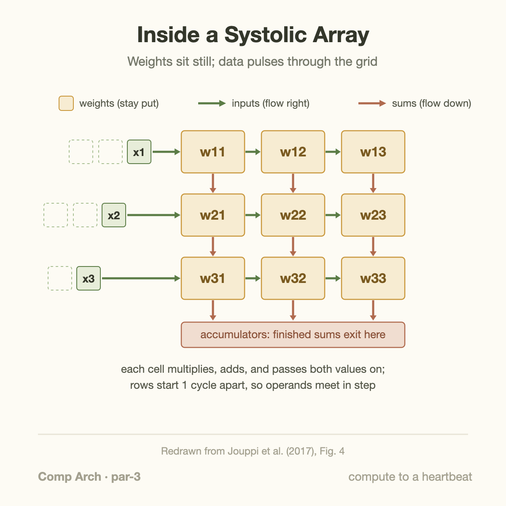
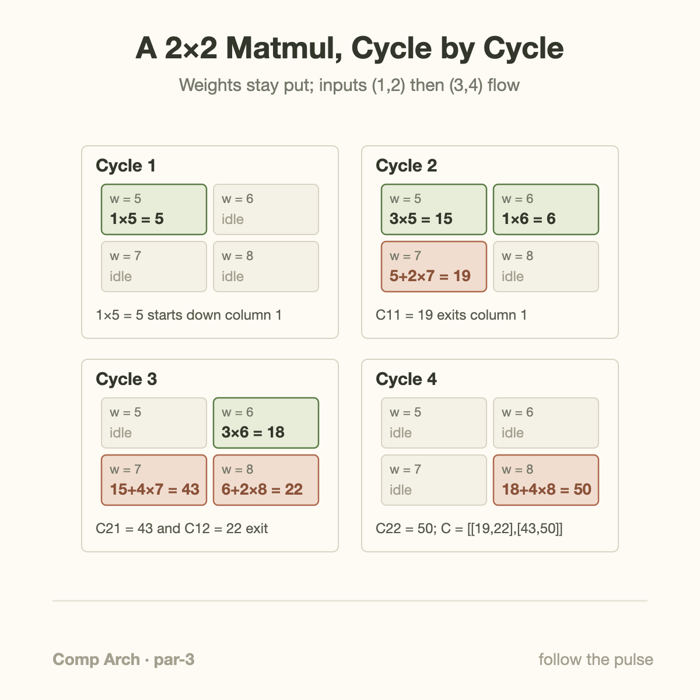
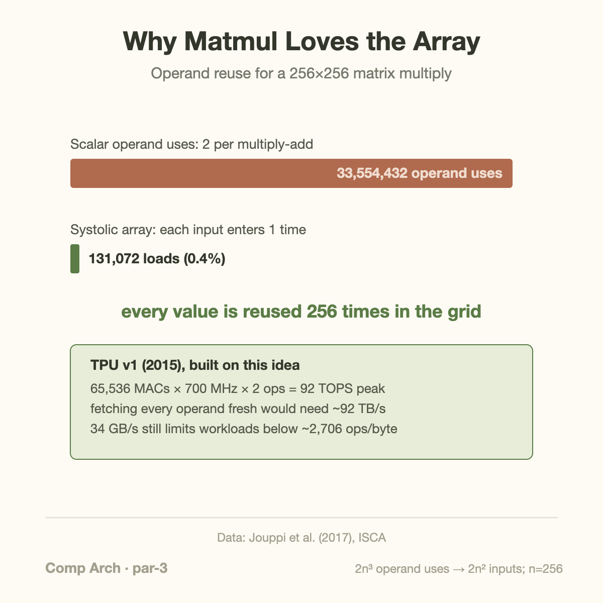

92 trillion operations per second, from a chip clocked at 700 MHz. That was Google's first Tensor Processing Unit, deployed in 2015 and described at ISCA 2017, and the architecture at its heart was published in 1978, the same year Intel's brand-new 8086 shipped with 29,000 transistors. H.T. Kung and Charles Leiserson called the idea a *systolic array*, and for most of the intervening decades it sat in textbooks as a historical curiosity. Then deep learning made matrix multiplication the most economically important computation on Earth, and the curiosity became the blueprint.

## A heartbeat, drawn on paper

In the late 1970s, Kung and Leiserson were at Carnegie Mellon watching VLSI (very-large-scale integration, the then-new ability to put tens of thousands of transistors on 1 chip) change the economics of hardware. Multipliers, once cabinet-sized, were about to become cheap enough to stamp out by the hundreds. Memory bandwidth was not getting cheaper at anything like the same rate. Kung later distilled the problem in his 1982 paper "Why Systolic Architectures?": if a processor fetches 2 operands from memory for every arithmetic operation it performs, the memory system, not the arithmetic, sets the speed limit. The fix is to arrange the hardware so each value fetched from memory gets used many times before anything goes back.

Their proposal: lay out a grid of small, identical processing elements, each doing 1 multiply and 1 add per clock cycle, and connect each element only to its immediate neighbors. Data enters at the edges and steps from neighbor to neighbor on every tick of the clock, like blood pushed through vessels by a contracting heart. "Systolic" comes from *systole*, the contraction phase of a heartbeat, and the metaphor is exact: 1 global clock is the heart, and every beat moves every operand exactly 1 cell forward.

3 properties fall out of this arrangement, and they are the whole story:

1. **No instruction fetch.** The cells do not run programs. Each 1 repeats the same multiply-accumulate forever. All the control logic a CPU spends on decoding, branching, and scheduling (see [what a CPU actually does](/blog/what-a-cpu-actually-does/)) simply does not exist here, so nearly all the silicon does math.
2. **No long wires.** Every connection is to a physical neighbor, millimeters away at most. Short wires switch fast and burn little energy. Reading a value from a neighboring cell costs far less energy than reading it from SRAM, and orders of magnitude less than DRAM.
3. **Massive reuse.** A value entering the grid is used by every cell it passes through. Fetch once, compute many times, which is exactly Kung's prescription.

## The machine in 1 picture

The variant inside the TPU is called *weight-stationary*, and it is the easiest to hold in your head. Picture an N×N grid. Before computation starts, 1 weight of the matrix W is loaded into each cell, where it sits unmoving. Then the input matrix streams in from the left edge, 1 row of cells per vector element, and partial sums flow downward through the columns.

Each cell does the same 3 things every cycle: multiply the input arriving from the left by the weight it holds, add the product to the partial sum arriving from above, then pass the input to its right neighbor and the updated sum to the neighbor below. When a partial sum falls out of the bottom row, it has visited every cell in its column, which means it has accumulated the complete dot product of an input vector with 1 column of W. The bottom edge delivers finished results, 1 per column, cycle after cycle.

Notice what never happens: no cell ever reads a weight from memory during computation, no partial sum is ever written to memory until it is final, and no input is fetched more than once. The memory system only touches the edges of the array.

## A 2×2 multiply by hand

Small enough to trace on paper, and the mechanics scale unchanged to 256×256. Take

- Weights (stationary): W = [[5, 6], [7, 8]], so the top-left cell holds 5, top-right holds 6, bottom-left 7, bottom-right 8.
- Inputs (streaming): 2 vectors, (1, 2) and then (3, 4). Element 1 of each vector enters row 1; element 2 enters row 2 *1 cycle later*. That deliberate skew is what keeps operands aligned.

**Cycle 1.** The value 1 enters the top-left cell: 1×5 = 5. The 5 heads down, the 1 heads right.

**Cycle 2.** 3 things at once. The 2 (delayed 1 cycle) enters the bottom-left cell just as the partial sum 5 arrives from above: 5 + 2×7 = **19**, which exits the bottom of column 1. Meanwhile the 1 has moved right into the top-right cell: 1×6 = 6, heading down. And 3, the first element of the second vector, enters top-left: 3×5 = 15.

**Cycle 3.** The 2 has moved right into the bottom-right cell, meeting the 6 from above: 6 + 2×8 = **22**. The 4 enters bottom-left and meets the 15: 15 + 4×7 = **43**. The 3 moves right: 3×6 = 18, heading down.

**Cycle 4.** The 4 meets the 18 in the bottom-right cell: 18 + 4×8 = **50**.

Collect the outputs: [[19, 22], [43, 50]]. Check it the slow way: (1, 2)·(5, 7) = 19, (1, 2)·(6, 8) = 22, (3, 4)·(5, 7) = 43, (3, 4)·(6, 8) = 50. The grid computed a full matrix product with 8 multiplies, and each of the 8 input and weight values was loaded from memory exactly once.

## The arithmetic of reuse

Now scale the example and count memory traffic, because this is where the systolic array stops being cute and starts being a 92-teraop machine.

Multiplying 2 256×256 matrices takes 256³ = 16,777,216 multiply-accumulates. A scalar loop that fetches both operands for every MAC performs 33,554,432 operand fetches. A 256×256 weight-stationary array loads each weight once and streams each input element in once: 2 × 256² = 131,072 loads, or 0.4% of the naive traffic. Every value that enters the grid is reused 256 times before the hardware is done with it.

The TPU v1 numbers show why this matters in practice. Its Matrix Multiply Unit is a 256×256 systolic array: 65,536 8-bit MAC cells. At 700 MHz, counting the multiply and the add separately, that is 65,536 × 700 MHz × 2 = 92 trillion operations per second of peak throughput. If every operand had to come from DRAM, feeding it would take roughly 92 TB/s of bandwidth. The card actually had 34 GB/s of DDR3, a gap of about 2,700×. Reuse inside the array, plus a 24 MiB on-chip buffer for activations, is the entire bridge. The chip was built on a 28 nm process at a clock slower than contemporaneous CPUs, inside a 75 W power envelope, and Google reported it running production inference 15 to 30 times faster than the server CPUs and K80 GPUs of 2015, at 30 to 80 times better performance per watt. Those comparisons are Google's own measurements against hardware 2 process generations behind by publication time, so treat the ratios as directional, but the architectural point survives any discount: the money is in the reuse, not the transistors.

The operand-fetch comparison is an ideal dataflow count, not a guarantee of external DRAM traffic. Let square dimension be $$n$$, input storage $$b_i$$ bytes per value, and output storage $$b_o$$. If inputs are read once and outputs written once,

$$
F=2n^3,\qquad D=(2b_i+b_o)n^2,\qquad
I=\frac{2n}{2b_i+b_o}.
$$

For $$n=256$$, 1-byte inputs, and 4-byte accumulated outputs, intensity is about 85.3 operations per byte. This includes outputs omitted by the earlier operand-only comparison. A conventional CPU implementation can also cache and tile operands; “naive fetches” are not necessarily separate DRAM transfers.

The architectural innovation is local forwarding and predictable operand alignment. In the teaching weight-stationary array, with weights already loaded, $$B$$ streamed vectors produce their last result after roughly $$B+2n-2$$ cycles. For the 2-by-2 example with 2 vectors, that is 4 cycles, matching the trace. Longer streams amortize fill/drain time; weight reloads and output bandwidth add separate costs. Measure useful MACs per occupied array cycle across representative shapes, then compare equal-precision tiled baselines. This separates locality gains from lower precision and from peak throughput claims.

## Going deeper: skew, fill, and flavors of stationary

A few mechanisms hide inside the clean picture.

**Why the inputs are skewed.** In the worked example, row 2's input entered 1 cycle after row 1's. That is not an implementation quirk. The partial sum needs 1 cycle to travel from a row-1 cell down to a row-2 cell, so row 2's operand must arrive 1 cycle late to meet it. In an N-row array, row *i* is delayed *i* cycles, which is why diagrams of systolic inputs always show that characteristic parallelogram of staggered data.

**Fill and drain.** A result cannot exit until data has crossed the whole array, so the longest path contributes roughly 2 array dimensions of startup/drain latency in this teaching dataflow; it should not be counted twice as a universal hardware rule. For N = 256 at 700 MHz that is under a microsecond, which is nothing if you stream thousands of input rows through, and ruinous if you multiply 1 tiny matrix and stop. Systolic arrays want long, steady streams. The same logic explains why small batch sizes hurt: with a batch of 8, most of the machinery idles between heartbeats, a peak-versus-achieved gap of the kind covered in [goodput vs utilization](/blog/goodput-vs-utilization/).

**Other dataflows.** Weight-stationary is 1 member of a family. *Output-stationary* arrays pin each accumulating result to a cell and stream both inputs past it. *Row-stationary*, used by MIT's Eyeriss chip, splits the difference to minimize total data movement for convolutions. The taxonomy matters because each choice fixes which operand gets maximum reuse; TPU v1 pinned weights because in 2015-era inference the same weights served millions of requests.

**Where the bottleneck moved.** Kung's logic is recursive: kill 1 bottleneck and the next appears. TPU v1's array was so effective that its 34 GB/s DDR3 became the limiting factor for memory-bound layers, and the paper's own roofline analysis shows several production workloads stuck against the bandwidth ceiling, not the compute 1. Successors moved to HBM largely for this reason, the same bandwidth arms race traced in [Blackwell to Rubin memory math](/blog/blackwell-to-rubin-memory-math/).

## Common misconceptions

**"A systolic array is just SIMD with more units."** SIMD (1 instruction applied to many data elements at once) still fetches its operands from a register file every cycle and writes results back every cycle; making the vector wider multiplies that register traffic. In a systolic array, operands come from the neighboring cell's output latch, not from a shared register file, and intermediate results never leave the grid. SIMD parallelizes an instruction across space; a systolic array pipelines data *through* space. The energy profiles are completely different, and that difference is most of the TPU's efficiency story.

**"The TPU was fast because of cutting-edge silicon."** Backwards. TPU v1 used a mature 28 nm process, ran at 700 MHz when GPUs ran above 1 GHz, and drew 75 W. The paper attributes its advantage to the overall design and workload comparison, including architecture and precision: 8-bit integer math packing 25 times more multipliers per mm² than 32-bit floating point, and the systolic organization letting those multipliers actually stay fed. A fast process would have helped, but it was not where the 15 to 30× came from.

**"A 256×256 array can only multiply 256×256 matrices."** Large matrices are tiled: a 1024×1024 multiply becomes a sequence of 256-sized blocks, with the accumulators carrying partial sums between tiles, and utilization stays high. The genuine failure mode is the opposite direction. Multiply matrices with an inner dimension of 100 and only 100 of the 256 rows hold useful weights; peak throughput drops by the ratio, no matter how clever the compiler is. This is why accelerator-era model designers pad dimensions to multiples of the array size, and why odd layer shapes quietly waste silicon.

## The idea that waited

Systolic arrays did not vanish after 1978 so much as lose an economic race. CMU built the Warp machine in the 1980s and Intel productized its successor, iWarp, but general-purpose CPUs were doubling in speed every couple of years for free, and a special-purpose grid could not out-run that treadmill long enough to build an ecosystem. Sara Hooker's "The Hardware Lottery" names the general phenomenon: ideas win or lose on their fit to the hardware, and the tooling of their era, as much as on their merits. Systolic arrays lost the 1980s lottery.

2 things reran the draw. Dennard scaling ended, so clocks stopped rising for free and energy per operation became the binding constraint, which is precisely the metric systolic designs optimize. And deep learning concentrated almost all of its arithmetic into dense matrix multiplication: every layer of the [Transformer](/blog/transformer-architecture-in-one-picture/), attention and MLP alike, is matmuls stacked on matmuls. When 1 operation dominates, hardware specialized to that operation stops being a niche and becomes, as Hennessy and Patterson argue in their Turing Lecture, the main path forward for performance. A domain-specific architecture with a systolic core is no longer exotic; Modern matrix units exploit related regularity and locality, but their exact internal topology is implementation-specific; a product label does not establish an identical systolic organization. The next article in this series looks at that broader domain-specific turn.

Kung and Leiserson designed for a world of 29,000-transistor chips and got the fundamentals so right that the design carried, essentially intact, to chips with billions.

## Takeaway

- A systolic array is a clocked grid of multiply-accumulate cells passing operands neighbor to neighbor: no instruction fetch, no long wires, and every value fetched from memory is reused N times.
- The worked math is the argument: a 256×256 multiply needs 33.5M operand fetches naively but only 131K through the array, which explains its local reuse; reaching the 92 TOPS peak also requires sufficient end-to-end arithmetic intensity.
- The idea sat dormant for decades because general-purpose CPUs kept winning on Moore's law; the end of Dennard scaling plus matmul-dominated workloads made 1978's answer the 2015 blueprint, and it remains the core of AI accelerators today.

## Sources

- H. T. Kung and C. E. Leiserson, "Systolic Arrays (for VLSI)," *Sparse Matrix Proceedings*, 1978.
- H. T. Kung, "Why Systolic Architectures?", *IEEE Computer*, vol. 15, no. 1, 1982.
- N. P. Jouppi et al., "In-Datacenter Performance Analysis of a Tensor Processing Unit," ISCA 2017 — [arxiv.org/abs/1704.04760](https://arxiv.org/abs/1704.04760)
- J. L. Hennessy and D. A. Patterson, "A New Golden Age for Computer Architecture," *CACM*, 2019 — [cacm.acm.org/research/a-new-golden-age-for-computer-architecture/](https://cacm.acm.org/research/a-new-golden-age-for-computer-architecture/)
- S. Hooker, "The Hardware Lottery," 2020 — [arxiv.org/abs/2009.06489](https://arxiv.org/abs/2009.06489)
- Y.-H. Chen, J. Emer, and V. Sze, "Eyeriss: A Spatial Architecture for Energy-Efficient Dataflow for Convolutional Neural Networks," ISCA 2016.

*Part of the **Computer Architecture & ASIC** series. Previous: CPU vs GPU, latency machines vs throughput machines. Next: domain-specific architectures, or what happens when you design silicon for exactly one job.*
